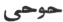

  
[Intangible Textual Heritage](../../index)  [Islam](../index.md) 
[Index](index)  [Previous](siim26)  [Next](siim28.md) 

------------------------------------------------------------------------

[Buy this Book at
Amazon.com](https://www.amazon.com/exec/obidos/ASIN/0548805903/internetsacredte.md)

------------------------------------------------------------------------

  
*Studies in Islamic Mysticism*, by Reynold A. Nicholson, \[1921\], at
Intangible Textual Heritage

------------------------------------------------------------------------

p. 267

### INDEX I

### NAMES AND TITLES

Arabic names to which the definite article al- is prefixed will be found
under their initial letter. Titles of books and poems are printed in
italics.

‘Abdu ’l-Karím, Khwája, [47](siim04.htm#page_47.md),
[67](siim06.htm#page_67.md)

‘Abdu ’l-Qádir al-Jílí (Jílání, Gílání), [81](siim07.htm#page_81.md),
[115](siim11.htm#page_115), [141](siim14.htm#page_141.md)

‘Abdu ’l-Raḥmán, son of Ibnu ’l-Fáriḍ, [165](siim17.htm#page_165.md)

‘Abdu ’l-Raḥmán, Ustád, [65](siim05.htm#page_65.md)

‘Abdu ’l-Ṣamad, [14](siim04.htm#page_14.md)

‘Abdu ’l-Walí, Mawlaví, [48](siim05.htm#page_48.md)

Abíward, [17](siim04.htm#page_17.md)

Abraham, [132](siim14.htm#page_132), [133](siim14.htm#page_133.md),
[137](siim14.htm#page_137), [173](siim17.htm#page_173.md),
[201](siim19.htm#page_201), [214](siim20.htm#page_214.md),
[253](siim24.htm#page_253.md)

Abú ’l-‘Abbás Bashshár, [55](siim05.htm#page_55.md)

Abú ’l-‘Abbás Qaṣṣáb, [11](siim04.htm#page_11.md),
[17](siim04.htm#page_17), [21](siim04.htm#page_21.md),
[22](siim04.htm#page_22), [23](siim04.htm#page_23.md),
[24](siim04.htm#page_24), [66](siim06.htm#page_66.md)

Abú ‘Alí, Sayyid, [27](siim04.htm#page_27.md)

Abú ‘Alí   (?),
[18](siim04.htm#page_18.md)

Abú ‘Alí Daqqáq, [29](siim04.htm#page_29), [24](siim04.htm#page_24.md)

Abú ‘Alí Ẓáhir, [6](siim04.htm#page_6), [7](siim04.htm#page_7.md),
[8](siim04.htm#page_8.md)

Abú Bakr Isḥáq Karrámí,
[29](siim04.htm#page_29)-[32](siim04.htm#page_32.md)

Abú ’l-Faḍl Ḥasan, of Sarakhs, [7](siim04.htm#page_7.md),
[8](siim04.htm#page_8)-[12](siim04.htm#page_12.md),
[14](siim04.htm#page_14), [15](siim04.htm#page_15.md),
[17](siim04.htm#page_17.md),
[23](siim04.htm#page_23)-[25](siim04.htm#page_25.md),
[62](siim05.htm#page_62.md)

Abú ’l-Khayr, father of Abú Sa‘íd, [3](siim03.htm#page_3.md),
[4](siim04.htm#page_4.md)

Abú Naṣr al-Sarráj, of Ṭús, [10](siim04.htm#page_10.md),
[58](siim05.htm#page_58.md). *See* *Kitáb al-Luma‘*

Abú Sa‘íd ibn Abi ’l-Khayr,
[1](siim03.htm#page_1)-[76](siim06.htm#page_76.md). *See* Index of Subjects

Abú Sa‘íd, Shaykhu ’l-Islám, grandson of Abú Sa‘íd ibn Abi ’l-Khayr,
[25](siim04.htm#page_25), [59](siim05.htm#page_59.md)

Abú Ṣáliḥ Dandání, Pír, [47](siim04.htm#page_47.md)

Abú Ṭáhir, eldest son of Abú Sa‘íd ibn Abi ’l-Khayr,
[15](siim04.htm#page_15), [24](siim04.htm#page_24.md),
[35](siim04.htm#page_35), [36](siim04.htm#page_36.md),
[43](siim04.htm#page_43), [44](siim04.htm#page_44.md),
[70](siim06.htm#page_70.md)

Abú Zayd of Sarúj, [198](siim18.htm#page_198.md),
[257](siim25.htm#page_257.md)

Adam, [54](siim05.htm#page_54), [78](siim07.htm#page_78.md),
[79](siim07.htm#page_79), [80](siim07.htm#page_80.md),
[87](siim07.htm#page_87), [97](siim09.htm#page_97.md),
[106](siim11.htm#page_106), [109](siim11.htm#page_109.md),
[111](siim11.htm#page_111), [112](siim11.htm#page_112.md),
[113](siim11.htm#page_113.md),
[119](siim11.htm#page_119)-[122](siim12.htm#page_122.md),
[124](siim12.htm#page_124), [130](siim13.htm#page_130.md),
[136](siim14.htm#page_136), [140](siim14.htm#page_140.md),
[149](siim16.htm#page_149), [155](siim16.htm#page_155.md),
[186](siim17.htm#page_186), [187](siim17.htm#page_187.md),
[198](siim18.htm#page_198), [205](siim19.htm#page_205.md),
[206](siim19.htm#page_206), [223](siim21.htm#page_223.md),
[229](siim22.htm#page_229), [240](siim23.htm#page_240.md),
[242](siim23.htm#page_242), [245](siim23.htm#page_245.md),
[252](siim24.htm#page_252), [255](siim25.htm#page_255.md),
[265](siim26.htm#page_265.md)

Aḥmad, a name of the Prophet, [204](siim19.htm#page_204.md),
[229](siim22.htm#page_229.md). *See* Mohammed

Aḥmad, son of Abú ’l-Ḥasan Kharaqání, [43](siim04.htm#page_43.md)

Aḥmad ‘Alí Nasawí, [19](siim04.htm#page_19.md)

Aḥmad Najjár, [17](siim04.htm#page_17.md)

Aḥmad Naṣr, Shaykh, [19](siim04.htm#page_19.md)

Ahriman, [163](siim17.htm#page_163), [242](siim23.htm#page_242.md)

‘Alí, grandson of Ibnu ’l-Fáriḍ, [264](siim26.htm#page_264.md),
[165](siim17.htm#page_165.md)

‘Alí ibn Abí Ṭálib, the Prophet's son-in-law, [10](siim04.htm#page_10.md),
[226](siim21.htm#page_226.md)

‘Álij, [182](siim17.htm#page_182.md)

Ámul, [11](siim04.htm#page_11), [17](siim04.htm#page_17.md),
[21](siim04.htm#page_21), [23](siim04.htm#page_23.md),
[28](siim04.htm#page_28), [66](siim06.htm#page_66.md)

Andrae, Tor, [111](siim11.htm#page_111.md)

Angelo, Michael, [262](siim26.htm#page_262.md)

‘Anqá, the, [83](siim07.htm#page_83), [93](siim08.htm#page_93.md)

Aṅra Mainyu, [263](siim26.htm#page_263.md)

‘Aqíq, valley of, [170](siim17.htm#page_170.md)

‘Arafát, [222](siim21.htm#page_222.md)

Arnold, Matthew, [9](siim04.htm#page_9.md)

Ash‘arites, the, [254](siim25.htm#page_254.md)

Asia Minor, [72](siim06.htm#page_72.md)

Asmá, [113](siim11.htm#page_113.md)

*Asráru ’l-tawḥíd fí maqámáti ’l-Shaykh Abí Sa‘íd*, by Muḥammad ibnu
’l-Munawwar, [1](siim03.htm#page_1)-[3](siim03.htm#page_3.md)

*Átháru ’l-bilád*, by Qazwíní, [76](siim06.htm#page_76.md)

‘Aṭṭár, Farídu'ddín, [3](siim03.htm#page_3), [42](siim04.htm#page_42.md),
[262](siim26.htm#page_262.md)

Avicenna, [42](siim04.htm#page_42.md)

*‘Ayniyya*, the, by Jílí, [90](siim08.htm#page_90.md),
[143](siim15.htm#page_143.md) foll. *See* *al-Nawádiru ’l-‘ayniyya fi
l-bawádiri ’l-ghaybiyya*

‘Ayyárí, Abú Muḥammad, [4](siim04.htm#page_4.md)

‘Ayyárí, Abú Sa‘íd, [4](siim04.htm#page_4.md)

‘Azázíl, [120](siim11.htm#page_120.md). *See* Iblís

al-Azhar, mosque, [165](siim17.htm#page_165.md)

Azrael, the Angel of Death, [111](siim11.htm#page_111.md),
[116](siim11.htm#page_116), [117](siim11.htm#page_117.md),
[123](siim12.htm#page_123.md)

‘Azza, [113](siim11.htm#page_113), [222](siim21.htm#page_222.md),
[223](siim21.htm#page_223.md)

 

Bábá, Kúhí, of Shíráz, [48](siim05.htm#page_48.md)

Badr, in the Ḥijáz, [174](siim17.htm#page_174.md)

Badru’ddín al-Shahíd, [113](siim11.htm#page_113.md)

Baghdád, [10](siim04.htm#page_10), [66](siim06.htm#page_66.md),
[105](siim11.htm#page_105), [252](siim24.htm#page_252.md),
[162](siim17.htm#page_162.md)

Bákú, [57](siim05.htm#page_57.md)

Balkh, [65](siim05.htm#page_65.md)

Bashkhwán, [74](siim06.htm#page_74), [75](siim06.htm#page_75.md)

p. 268

Bashkhwání, Bú ‘Amr, [74](siim06.htm#page_74), [75](siim06.htm#page_75.md)

Basra, [10](siim04.htm#page_10.md)

Báward, [17](siim04.htm#page_17.md)

Báyazíd-i Bisṭámí, [44](siim04.htm#page_44), [76](siim06.htm#page_76.md).
*See* al-Bisṭámí

Bigg, C., [142](siim14.htm#page_142.md)

Bishr-i Yásín, Abú ’l-Qáṣim, [4](siim04.htm#page_4.md),
[5](siim04.htm#page_5.md)

Bisṭám, [44](siim04.htm#page_44), [76](siim06.htm#page_76.md)

al-Bisṭámí, Abú Yazíd, [77](siim07.htm#page_77.md). *See* Báyazíd-i Bisṭámí

Black, J. S., [163](siim17.htm#page_163.md)

Blake, W., [167](siim17.htm#page_167.md) Blochet, E.,
[195](siim17.htm#page_195.md)

Böhme, Jacob, [94](siim09.htm#page_94), [103](siim10.htm#page_103.md)

Bousset, W., [86](siim07.htm#page_86), [87](siim07.htm#page_87.md)

Brockelmann, C., [99](siim10.htm#page_99.md)

Browne, Prof. E. G., [61](siim05.htm#page_61.md),
[165](siim17.htm#page_165), [170](siim17.htm#page_170.md)

Bú ‘Abdallah Bákú, Shaykh, [57](siim05.htm#page_57.md),
[58](siim05.htm#page_58.md)

Bú ‘Alí Turshízí, [36](siim04.htm#page_36.md)

Bú ‘Amr, [40](siim04.htm#page_40.md)

Bu ’l-Khayr, Bábú. *See* Abú ’l-Khayr

Bu ’l-Qásimak, [31](siim04.htm#page_31.md)

Bú Ṭáhir. *See* Abú Ṭáhir

Bukhárá, [66](siim06.htm#page_66.md)

Bulghár, [124](siim12.htm#page_124.md)

al-Búríní, Ḥasan, [162](siim17.htm#page_162.md),
[168](siim17.htm#page_168), [186](siim17.htm#page_186.md)

Buthayna, [223](siim21.htm#page_223), [224](siim21.htm#page_224.md)

 

Caird, E., [96](siim09.htm#page_96.md)

Cairo, [164](siim17.htm#page_164), [165](siim17.htm#page_165.md)

Caspian, the, [81](siim07.htm#page_81.md)

Catherine of Siena, St, [167](siim17.htm#page_167.md)

Christ, [87](siim07.htm#page_87), [104](siim11.htm#page_104.md),
[135](siim14.htm#page_135), [140](siim14.htm#page_140.md),
[187](siim17.htm#page_187.md). *See* Jesus

 

al-Daḥdáḥ, Rushayyid b. Ghálib, [162](siim17.htm#page_162.md)

Dajjál, [135](siim14.htm#page_135.md)

Dámghán, [44](siim04.htm#page_44.md)

Dandání, Pír Abú Ṣáliḥ, [47](siim04.htm#page_47.md)

Dante, [191](siim17.htm#page_191.md)

Ḍárij, [183](siim17.htm#page_183.md)

Darra-i Gaz, [17](siim04.htm#page_17.md)

David, [123](siim12.htm#page_123), [137](siim14.htm#page_137.md),
[161](siim16.htm#page_161.md)

Dáwud Ṭá’í, [10](siim04.htm#page_10), [11](siim04.htm#page_11.md)

De Lagrange, Grangeret, [165](siim17.htm#page_165.md),
[166](siim17.htm#page_166.md)

*De return natura*, [191](siim17.htm#page_191.md)

De Sacy, Silvestre, [165](siim17.htm#page_165.md)

De Slane, Baron, [164](siim17.htm#page_164), [168](siim17.htm#page_168.md)

Deussen, Paul, [103](siim10.htm#page_103.md)

Di Matteo, Sac. Ignazio, [162](siim17.htm#page_162.md)

Diḥya al-Kalbí, [219](siim21.htm#page_219), [225](siim21.htm#page_225.md)

*Díván-i Shams-i Tabríz*, by Jalálu’ddín Rúmí, [80](siim07.htm#page_80.md),
[168](siim17.htm#page_168), [233](siim23.htm#page_233.md),
[259](siim25.htm#page_259.md)

Dozy, R., [29](siim04.htm#page_29.md)

 

Eckhart, [51](siim05.htm#page_51), [212](siim20.htm#page_212.md)

Egypt, [165](siim17.htm#page_165), [181](siim17.htm#page_181.md)

Elijah, [73](siim06.htm#page_73.md)

Ethé, H., [4](siim04.htm#page_4), [48](siim05.htm#page_48.md)

Eve, [223](siim21.htm#page_223.md)

 

Farídu’ddín ‘Aṭṭár. *See* ‘Aṭṭár

Fawcett, E. D., [94](siim09.htm#page_94.md)

Flügel, G., [93](siim08.htm#page_93), [195](siim17.htm#page_195.md)

Furátí, Abú ’l-Faḍl, [41](siim04.htm#page_41.md)

*Fuṣúṣu ’l-ḥikam*, by Ibnu ’l-‘Arabí, [77](siim07.htm#page_77.md),
[83](siim07.htm#page_83), [88](siim07.htm#page_88.md),
[91](siim08.htm#page_91), [96](siim09.htm#page_96.md),
[100](siim10.htm#page_100), [115](siim11.htm#page_115.md),
[130](siim13.htm#page_130), [134](siim14.htm#page_134.md),
[136](siim14.htm#page_136), [141](siim14.htm#page_141.md),
[149](siim16.htm#page_149)-[161](siim16.htm#page_161.md)

*al-Futúḥátu ’l-Makkiyya*, by Ibnu ’l-‘Arabí, [77](siim07.htm#page_77.md),
[82](siim07.htm#page_82), [88](siim07.htm#page_88.md)

 

Gabriel, [111](siim11.htm#page_111), [116](siim11.htm#page_116.md),
[219](siim21.htm#page_219), [225](siim21.htm#page_225.md)

Gairdner, W. H. T., [111](siim11.htm#page_111.md)

Gaz, valley, [17](siim04.htm#page_17.md)

Gerson, [51](siim05.htm#page_51.md)

Ghazálí, [80](siim07.htm#page_80), [111](siim11.htm#page_111.md),
[150](siim16.htm#page_150.md)

Ghazna, [29](siim04.htm#page_29), [33](siim04.htm#page_33.md)

Ghiyáthu’ddín Muḥammad ibn Sám, Ghúrid prince, [1](siim03.htm#page_1.md)

al-Ghuwayr, [183](siim17.htm#page_183.md)

Ghuzz, the, a Turcoman tribe, [2](siim03.htm#page_2.md),
[20](siim04.htm#page_20), [27](siim04.htm#page_27.md),
[45](siim04.htm#page_45), [73](siim06.htm#page_73.md)

Gibb, E. J. W., [62](siim05.htm#page_62), [111](siim11.htm#page_111.md)

Gílán, [81](siim07.htm#page_81.md)

Goldziher, Prof. I., [81](siim07.htm#page_81), [82](siim07.htm#page_82.md)

Gospel, the, [137](siim14.htm#page_137)-[140](siim14.htm#page_140.md),
[240](siim23.htm#page_240), [263](siim26.htm#page_263.md)

*Gulshani ráz*, by Maḥmúd Shabistarí, [263](siim26.htm#page_263.md)

 

Ḥabíb-i ‘Ajamí, [10](siim04.htm#page_10), [11](siim04.htm#page_11.md)

Hafiz, [162](siim17.htm#page_162.md)

Ḥájir, [182](siim17.htm#page_182.md)

*Ḥálát ú Sukhunán-i Shaykh Abú Sa‘íd ibn Abi ’l-Khayr*,
[1](siim03.htm#page_1)-[3](siim03.htm#page_3.md)

Ḥalláj, Ḥusayn ibn Manṣúr, [32](siim04.htm#page_32.md),
[54](siim05.htm#page_54), [79](siim07.htm#page_79.md),
[80](siim07.htm#page_80), [88](siim07.htm#page_88.md),
[107](siim11.htm#page_107), [121](siim11.htm#page_121.md),
[158](siim16.htm#page_158), [193](siim17.htm#page_193.md),
[230](siim22.htm#page_230.md). See *Kitáb al-Ṭawásín*

Hammer-Purgstall, Joseph, [162](siim17.htm#page_162.md). *See* Von Hammer

Ḥanafites, the, [29](siim04.htm#page_29.md)

Haneberg, D., [195](siim17.htm#page_195.md)

Ḥarírí, [198](siim18.htm#page_198), [257](siim25.htm#page_257.md),
[258](siim25.htm#page_258.md)

Hartmann, Richard, [34](siim04.htm#page_34), [53](siim05.htm#page_53.md),
[73](siim06.htm#page_73), [220](siim21.htm#page_220.md),
[238](siim23.htm#page_238), [256](siim25.htm#page_256.md)

Ḥasan of Basra, [10](siim04.htm#page_10), [11](siim04.htm#page_11.md)

Ḥasan-i Mu’addib, [27](siim04.htm#page_27), [29](siim04.htm#page_29.md),
[30](siim04.htm#page_30), [32](siim04.htm#page_32.md),
[35](siim04.htm#page_35)-[40](siim04.htm#page_40.md),
[42](siim04.htm#page_42.md)

Hegel, [89](siim07.htm#page_89), [94](siim09.htm#page_94.md),
[118](siim11.htm#page_118.md)

Ḥijáz, the, [36](siim04.htm#page_36), [164](siim17.htm#page_164.md),
[181](siim17.htm#page_181), [182](siim17.htm#page_182.md)

Hind, [113](siim11.htm#page_113.md)

Hippolytus, [77](siim07.htm#page_77.md)

Ḥírí, Abú ‘Uthmán, [19](siim04.htm#page_19.md)

Hirschfeld, H., [110](siim11.htm#page_110.md)

Holofernes, [177](siim17.htm#page_177.md)

Ḥubbí, Pír, [47](siim04.htm#page_47.md)

Hujwírí, [3](siim03.htm#page_3), [22](siim04.htm#page_22.md),
[34](siim04.htm#page_34), [58](siim05.htm#page_58.md),
[79](siim07.htm#page_79.md). See *Kashf al-maḥjúb*

al-Ḥuṣrí, Abú ‘Abdallah, [6](siim04.htm#page_6.md)

p. 269

Iblís, [54](siim05.htm#page_54), [72](siim06.htm#page_72.md),
[112](siim11.htm#page_112), [117](siim11.htm#page_117.md),
[119](siim11.htm#page_119), [120](siim11.htm#page_120.md),
[121](siim11.htm#page_121), [124](siim12.htm#page_124.md). *See* Satan

Ibnu ’l-‘Arabí, [77](siim07.htm#page_77), [82](siim07.htm#page_82.md),
[83](siim07.htm#page_83), [88](siim07.htm#page_88.md),
[93](siim08.htm#page_93), [99](siim10.htm#page_99.md),
[10](siim04.htm#page_10)I, [102](siim10.htm#page_102.md),
[103](siim10.htm#page_103), [107](siim11.htm#page_107.md),
[115](siim11.htm#page_115), [119](siim11.htm#page_119.md),
[134](siim14.htm#page_134), [136](siim14.htm#page_136.md),
[138](siim14.htm#page_138), [141](siim14.htm#page_141.md),
[142](siim14.htm#page_142.md),
[149](siim16.htm#page_149)-[161](siim16.htm#page_161.md),
[164](siim17.htm#page_164), [169](siim17.htm#page_169.md),
[184](siim17.htm#page_184), [193](siim17.htm#page_193.md),
[257](siim25.htm#page_257), [263](siim26.htm#page_263.md)

Ibnu ’l-Fáriḍ, [119](siim11.htm#page_119.md),
[162](siim17.htm#page_162)-[266](siim26.htm#page_266.md)

Ibn Khallikán, [164](siim17.htm#page_164), [168](siim17.htm#page_168.md)

Ibn Síná, [42](siim04.htm#page_42.md)

Ibn Surayj, [6](siim04.htm#page_6.md)

Idrís, the prophet, [123](siim12.htm#page_123.md)

*Iḥyá*, the, of Ghazálí, [80](siim07.htm#page_80.md)

Ikhwánu ’l-Ṣafá, [139](siim14.htm#page_139.md)

India, [81](siim07.htm#page_81.md)

Inge, W. R., [128](siim13.htm#page_128.md)

al-*Insánu ’l-kámil*, by Jílí, [77](siim07.htm#page_77.md) foll.,
[149](siim16.htm#page_149), [194](siim17.htm#page_194.md)

Iqbál, Dr Muḥammad, [77](siim07.htm#page_77), [94](siim09.htm#page_94.md)

Íshí Nílí, [69](siim06.htm#page_69), [70](siim06.htm#page_70.md)

Ismá‘ílak-i Daqqáq, [35](siim04.htm#page_35.md)

Ismá‘ílís, the, [61](siim05.htm#page_61.md)

Israelites, the, [179](siim17.htm#page_179.md)

Isráfíl, [115](siim11.htm#page_115), [123](siim12.htm#page_123.md). *See*
Seraphiel

*Iṣṭiláḥátu ’l-Ṣúfiyya*, by ‘Abdu ’l-Razzáq al-Káshání,
[94](siim09.htm#page_94.md)

 

al-Jabartí, Sharafu’ddín, Ismá‘íl ibn Ibráhím, [81](siim07.htm#page_81.md),
[87](siim07.htm#page_87), [105](siim11.htm#page_105.md),
[118](siim11.htm#page_118.md)

Jacob, the prophet, [201](siim19.htm#page_201.md),
[253](siim24.htm#page_253.md)

Jalálu’ddín Rúmí, [80](siim07.htm#page_80), [159](siim16.htm#page_159.md),
[162](siim17.htm#page_162), [167](siim17.htm#page_167.md),
[168](siim17.htm#page_168), [180](siim17.htm#page_180.md). See *Díván-i
Shams-i Tabríz* and *Masnaví-i ma‘naví*

Jámí, [3](siim03.htm#page_3), [162](siim17.htm#page_162.md)

Jamíl, [224](siim21.htm#page_224.md)

Jerusalem, [66](siim06.htm#page_66.md)

Jesus, [25](siim04.htm#page_25), [110](siim11.htm#page_110.md),
[123](siim12.htm#page_123), [137](siim14.htm#page_137.md),
[139](siim14.htm#page_139), [140](siim14.htm#page_140.md),
[141](siim14.htm#page_141), [253](siim24.htm#page_253.md),
[255](siim25.htm#page_255.md). *See* Christ

Jílán, [81](siim07.htm#page_81.md)

Jílí, ‘Abdu ’l-Karím, author of the *Insánu ’l-kámil*,
[77](siim07.htm#page_77)-[148](siim15.htm#page_148.md),
[149](siim16.htm#page_149), [153](siim16.htm#page_153.md),
[157](siim16.htm#page_157), [160](siim16.htm#page_160.md),
[193](siim17.htm#page_193), [263](siim26.htm#page_263.md)

Jílí (Jílání, Gílání), ‘Abdu ’l-Qádir, [81](siim07.htm#page_81.md),
[115](siim11.htm#page_115), [141](siim14.htm#page_141.md)

Job, [158](siim16.htm#page_158), [201](siim19.htm#page_201.md)

John, the Baptist, [25](siim04.htm#page_25.md)

John, St, [88](siim07.htm#page_88.md)

Jonah, [245](siim23.htm#page_245.md)

Jones, Sir William, [49](siim05.htm#page_49), [165](siim17.htm#page_165.md)

Joseph, the prophet, [123](siim12.htm#page_123.md)

Junayd, of Baghdád, [10](siim04.htm#page_10), [11](siim04.htm#page_11.md),
[159](siim16.htm#page_159.md)

Jurjání, [93](siim08.htm#page_93), [118](siim11.htm#page_118.md)

Juwayní, Abú Muḥammad, [73](siim06.htm#page_73.md)

 

Ka‘ba, the, [15](siim04.htm#page_15), [25](siim04.htm#page_25.md),
[36](siim04.htm#page_36), [44](siim04.htm#page_44.md),
[62](siim05.htm#page_62), [213](siim20.htm#page_213.md),
[214](siim20.htm#page_214), [222](siim21.htm#page_222.md),
[238](siim23.htm#page_238.md)

Kalím (Kalímu’llah), [229](siim22.htm#page_229.md). *See* Moses

Kamálu’ddín Muḥammad, son of Ibnu ’l-Fáriḍ, [165](siim17.htm#page_165.md)

Karrámís, the, [28](siim04.htm#page_28.md)

Káshání, ‘Abdu ’l-Razzáq, [94](siim09.htm#page_94.md),
[149](siim16.htm#page_149), [162](siim17.htm#page_162.md),
[193](siim17.htm#page_193), [194](siim17.htm#page_194.md),
[199](siim18.htm#page_199.md) foll.

*Kashf al-maḥjúb*, by Hujwírí, [3](siim03.htm#page_3.md),
[22](siim04.htm#page_22), [24](siim04.htm#page_24.md),
[34](siim04.htm#page_34), [61](siim05.htm#page_61.md),
[79](siim07.htm#page_79), [152](siim16.htm#page_152.md),
[208](siim19.htm#page_208), [221](siim21.htm#page_221.md),
[226](siim21.htm#page_226), [244](siim23.htm#page_244.md),
[254](siim25.htm#page_254), [262](siim26.htm#page_262.md)

*Kashfu ’l-sirri ’l-ghámiḍ fí sharḥi Díwán Ibni ’l-Fáriḍ*, by ‘Abdu
’l-Ghaní al-Nábulusí, [162](siim17.htm#page_162.md)

*Kashfu ’l-wujúhi ’l-ghurr li-ma‘ání naẓmi ’l-durr*, by ‘Abdu ’l-Razzáq
al-Káshání, [162](siim17.htm#page_162.md)

Káẓima, [182](siim17.htm#page_182.md)

Khaḍir, the prophet, [13](siim04.htm#page_13), [66](siim06.htm#page_66.md),
[82](siim07.htm#page_82), [124](siim12.htm#page_124.md),
[141](siim14.htm#page_141.md)

*Khamriyya*, the, of Ibnu ’l-Fáriḍ, [165](siim17.htm#page_165.md),
[183](siim17.htm#page_183)-[188](siim17.htm#page_188.md)

Khánaqáh-i Saráwí, at Nasá, [19](siim04.htm#page_19.md)

Kharaqán, [26](siim04.htm#page_26.md),
[42](siim04.htm#page_42)-[44](siim04.htm#page_44.md)

Kharaqání, Abú ’l-Ḥasan, [26](siim04.htm#page_26.md),
[42](siim04.htm#page_42)-[44](siim04.htm#page_44.md),
[76](siim06.htm#page_76.md)

al-Kharráz, Abú Sa‘íd, [152](siim16.htm#page_152.md)

Kháwarán, [3](siim03.htm#page_3.md)

al-Khayf, [181](siim17.htm#page_181.md)

Khoten, [66](siim06.htm#page_66.md)

Khurásán, [2](siim03.htm#page_2), [3](siim03.htm#page_3.md),
[19](siim04.htm#page_19), [20](siim04.htm#page_20.md),
[38](siim04.htm#page_38), [76](siim06.htm#page_76.md)

Khurqán. *See* Kharaqán

Khurqání, Abú ’l-Ḥasan. *See* Kharaqání

*Kitáb al-Luma‘*, by Abú Naṣr al-Sarráj, [34](siim04.htm#page_34.md),
[61](siim05.htm#page_61), [96](siim09.htm#page_96.md),
[200](siim19.htm#page_200), [220](siim21.htm#page_220.md),
[230](siim22.htm#page_230), [238](siim23.htm#page_238.md),
[244](siim23.htm#page_244), [254](siim25.htm#page_254.md)

*Kitáb al-Ṭawásín*, by Ḥalláj, [54](siim05.htm#page_54.md),
[79](siim07.htm#page_79), [80](siim07.htm#page_80.md),
[107](siim11.htm#page_107), [121](siim11.htm#page_121.md),
[136](siim14.htm#page_136), [139](siim14.htm#page_139.md),
[142](siim14.htm#page_142), [193](siim17.htm#page_193.md)

*Koran*, the, [4](siim04.htm#page_4), [8](siim04.htm#page_8.md),
[13](siim04.htm#page_13), [15](siim04.htm#page_15.md),
[16](siim04.htm#page_16), [17](siim04.htm#page_17.md),
[25](siim04.htm#page_25), [28](siim04.htm#page_28.md),
[32](siim04.htm#page_32), [37](siim04.htm#page_37.md),
[43](siim04.htm#page_43), [46](siim04.htm#page_46.md),
[51](siim05.htm#page_51), [56](siim05.htm#page_56.md),
[59](siim05.htm#page_59), [60](siim05.htm#page_60.md),
[62](siim05.htm#page_62), [64](siim05.htm#page_64.md),
[75](siim06.htm#page_75), [78](siim07.htm#page_78.md),
[79](siim07.htm#page_79), [82](siim07.htm#page_82.md),
[87](siim07.htm#page_87), [92](siim08.htm#page_92.md),
[104](siim11.htm#page_104), [107](siim11.htm#page_107.md),
[109](siim11.htm#page_109), [110](siim11.htm#page_110.md),
[111](siim11.htm#page_111), [113](siim11.htm#page_113.md),
[120](siim11.htm#page_120), [123](siim12.htm#page_123.md),
[126](siim13.htm#page_126), [130](siim13.htm#page_130.md),
[131](siim14.htm#page_131), [132](siim14.htm#page_132.md),
[135](siim14.htm#page_135), [136](siim14.htm#page_136.md),
[138](siim14.htm#page_138), [139](siim14.htm#page_139.md),
[140](siim14.htm#page_140), [149](siim16.htm#page_149.md),
[151](siim16.htm#page_151), [157](siim16.htm#page_157.md),
[159](siim16.htm#page_159), [173](siim17.htm#page_173.md),
[179](siim17.htm#page_179), [197](siim18.htm#page_197.md),
[200](siim19.htm#page_200), [201](siim19.htm#page_201.md),
[205](siim19.htm#page_205), [206](siim19.htm#page_206.md),
[209](siim19.htm#page_209), [223](siim21.htm#page_223.md),
[225](siim21.htm#page_225), [226](siim21.htm#page_226.md),
[228](siim22.htm#page_228), [230](siim22.htm#page_230.md),
[231](siim22.htm#page_231), [235](siim23.htm#page_235.md),
[237](siim23.htm#page_237), [239](siim23.htm#page_239.md),
[240](siim23.htm#page_240), [241](siim23.htm#page_241.md),
[242](siim23.htm#page_242), [245](siim23.htm#page_245.md),
[253](siim24.htm#page_253), [256](siim25.htm#page_256.md),
[259](siim25.htm#page_259), [261](siim26.htm#page_261.md),
[263](siim26.htm#page_263), [264](siim26.htm#page_264.md),
[265](siim26.htm#page_265.md)

Kúshí, [81](siim07.htm#page_81.md)

Kuthayyir, [222](siim21.htm#page_222)-[224](siim21.htm#page_224.md)

 

La‘la‘, [182](siim17.htm#page_182.md)

Lane, E., [94](siim09.htm#page_94.md)

Law, H. D. Graves, [48](siim05.htm#page_48.md)

Laylá, [127](siim13.htm#page_127), [222](siim21.htm#page_222.md)

Le Strange, G., [26](siim04.htm#page_26.md)

Lees, Nassau, [3](siim03.htm#page_3), [19](siim04.htm#page_19.md)

Loosen, Paul, [6](siim04.htm#page_6.md)

Loth, O., [77](siim07.htm#page_77), [81](siim07.htm#page_81.md)

Lubná, [222](siim21.htm#page_222), [223](siim21.htm#page_223.md)

Lucretius, [191](siim17.htm#page_191.md)

*al-Luma‘*, by Abú Naṣr al-Sarráj. *See* *Kitáb al-Luma‘*

Luqmán, of Sarakhs, [6](siim04.htm#page_6), [7](siim04.htm#page_7.md)

Lyall, Sir C., [163](siim17.htm#page_163.md)

p. 270

Ma‘arrí, Abú ’l-‘Alá, [160](siim16.htm#page_160.md),
[162](siim17.htm#page_162.md)

Macdonald, Prof. D. B., [28](siim04.htm#page_28.md),
[57](siim05.htm#page_57), [73](siim06.htm#page_73.md),
[79](siim07.htm#page_79), [119](siim11.htm#page_119.md),
[129](siim13.htm#page_129), [154](siim16.htm#page_154.md),
[188](siim17.htm#page_188), [233](siim23.htm#page_233.md),
[236](siim23.htm#page_236.md)

Mackail, J. W., [167](siim17.htm#page_167.md)

al-Madaní, Aḥmad ibn Muḥammad, [77](siim07.htm#page_77.md)

Maḥmúd-i Muríd, Khwája, [27](siim04.htm#page_27.md)

Maḥmúd Shabistarí, [263](siim26.htm#page_263.md)

Majnún, [222](siim21.htm#page_222.md)

Malámatís, the, [208](siim19.htm#page_208.md)

Maqám Ibráhím, [214](siim20.htm#page_214.md)

*Maqámát*, of Ḥarírí, the, [257](siim25.htm#page_257.md)

Ma‘rúf Karkhí, [10](siim04.htm#page_10.md)

Marwa, [239](siim23.htm#page_239.md)

Mary, the mother of Jesus, [140](siim14.htm#page_140.md)

*Masnaví-i ma‘naví*, by Jalálu’ddín Rúmí, [159](siim16.htm#page_159.md),
[168](siim17.htm#page_168), [259](siim25.htm#page_259.md)

Massignon, L., [54](siim05.htm#page_54), [79](siim07.htm#page_79.md),
[80](siim07.htm#page_80), [81](siim07.htm#page_81.md),
[107](siim11.htm#page_107), [121](siim11.htm#page_121.md),
[136](siim14.htm#page_136), [139](siim14.htm#page_139.md),
[142](siim14.htm#page_142), [193](siim17.htm#page_193.md)

Mas‘úd, Amír, [41](siim04.htm#page_41), [42](siim04.htm#page_42.md)

Mayhana, [2](siim03.htm#page_2), [3](siim03.htm#page_3.md),
[4](siim04.htm#page_4), [5](siim04.htm#page_5), [8](siim04.htm#page_8.md),
[11](siim04.htm#page_11), [12](siim04.htm#page_12.md),
[14](siim04.htm#page_14), [15](siim04.htm#page_15.md),
[17](siim04.htm#page_17), [18](siim04.htm#page_18.md),
[20](siim04.htm#page_20), [24](siim04.htm#page_24.md),
[26](siim04.htm#page_26)-[29](siim04.htm#page_29.md),
[43](siim04.htm#page_43), [45](siim04.htm#page_45.md),
[65](siim05.htm#page_65), [69](siim06.htm#page_69.md),
[72](siim06.htm#page_72), [73](siim06.htm#page_73.md),
[74](siim06.htm#page_74.md). *See* Mihna

Mecca, [25](siim04.htm#page_25), [43](siim04.htm#page_43.md),
[44](siim04.htm#page_44), [61](siim05.htm#page_61.md),
[62](siim05.htm#page_62), [66](siim06.htm#page_66.md),
[74](siim06.htm#page_74), [164](siim17.htm#page_164.md),
[165](siim17.htm#page_165), [174](siim17.htm#page_174.md),
[179](siim17.htm#page_179), [181](siim17.htm#page_181.md),
[183](siim17.htm#page_183), [222](siim21.htm#page_222.md),
[239](siim23.htm#page_239.md)

Medina, [66](siim06.htm#page_66), [170](siim17.htm#page_170.md),
[174](siim17.htm#page_174.md)

Meleager, [167](siim17.htm#page_167.md)

Merv, [6](siim04.htm#page_6), [12](siim04.htm#page_12.md),
[17](siim04.htm#page_17), [65](siim05.htm#page_65.md)

Mesopotamia, [257](siim25.htm#page_257.md)

Michael, [111](siim11.htm#page_111), [118](siim11.htm#page_118.md),
[123](siim12.htm#page_123.md)

Mihna, [2](siim03.htm#page_2), [18](siim04.htm#page_18.md). *See* Mayhana

al-Miná, [181](siim17.htm#page_181.md)

*Mishkátu ’l-anwár*, by Ghazálí, [111](siim11.htm#page_111.md)

Mohammed, the Prophet, [5](siim04.htm#page_5), [6](siim04.htm#page_6.md),
[9](siim04.htm#page_9), [11](siim04.htm#page_11.md),
[15](siim04.htm#page_15), [19](siim04.htm#page_19.md),
[25](siim04.htm#page_25), [29](siim04.htm#page_29.md),
[47](siim04.htm#page_47), [50](siim05.htm#page_50.md),
[59](siim05.htm#page_59), [67](siim06.htm#page_67.md),
[78](siim07.htm#page_78), [79](siim07.htm#page_79.md),
[86](siim07.htm#page_86), [87](siim07.htm#page_87.md),
[88](siim07.htm#page_88), [91](siim08.htm#page_91.md),
[92](siim08.htm#page_92), [94](siim09.htm#page_94.md),
[104](siim11.htm#page_104), [105](siim11.htm#page_105.md),
[106](siim11.htm#page_106), [109](siim11.htm#page_109.md),
[110](siim11.htm#page_110.md),
[112](siim11.htm#page_112)-[120](siim11.htm#page_120.md),
[123](siim12.htm#page_123), [129](siim13.htm#page_129.md),
[130](siim13.htm#page_130), [132](siim14.htm#page_132.md),
[135](siim14.htm#page_135)-[139](siim14.htm#page_139.md),
[141](siim14.htm#page_141), [157](siim16.htm#page_157.md),
[168](siim17.htm#page_168), [172](siim17.htm#page_172.md),
[174](siim17.htm#page_174), [187](siim17.htm#page_187.md),
[188](siim17.htm#page_188), [194](siim17.htm#page_194.md),
[195](siim17.htm#page_195), [198](siim18.htm#page_198.md),
[206](siim19.htm#page_206), [219](siim21.htm#page_219.md),
[223](siim21.htm#page_223), [225](siim21.htm#page_225.md),
[226](siim21.htm#page_226), [227](siim21.htm#page_227.md),
[229](siim22.htm#page_229), [239](siim23.htm#page_239.md),
[240](siim23.htm#page_240), [241](siim23.htm#page_241.md),
[245](siim23.htm#page_245), [248](siim24.htm#page_248.md),
[252](siim24.htm#page_252)-[255](siim25.htm#page_255.md),
[264](siim26.htm#page_264.md). *See* Index of Subjects

Moses, [123](siim12.htm#page_123), [137](siim14.htm#page_137.md),
[139](siim14.htm#page_139), [141](siim14.htm#page_141.md),
[200](siim19.htm#page_200), [226](siim21.htm#page_226.md),
[229](siim22.htm#page_229), [243](siim23.htm#page_243.md),
[253](siim24.htm#page_253), [263](siim26.htm#page_263.md)

al-Mudabbir, angel, [111](siim11.htm#page_111.md)

al-Mufaṣṣil, angel, [111](siim11.htm#page_111.md)

Muḥammad, the Prophet. *See* Mohammed

Muḥammad, Ḥájib, [38](siim04.htm#page_38), [39](siim04.htm#page_39.md)

Muḥammad (ibn) ‘Alí (Ulayyán) al-Nasawí, [19](siim04.htm#page_19.md)

Muḥammad Faḍl, [17](siim04.htm#page_17.md)

Muḥammad ibnu ’l-Munawwar, I, [25](siim04.htm#page_25.md)

Muḥyi’ddín Ibnu ’l-‘Arabí. *See* Ibnu ’l-‘Arabí

*Mu‘jamu ’l-buldán*, by Yáqút, [6](siim04.htm#page_6.md)

Munro, H. A. J., [192](siim17.htm#page_192.md)

Muqaṭṭam, Mt, [164](siim17.htm#page_164.md)

Murta‘ish, of Baghdád, [10](siim04.htm#page_10.md)

Musil, A., [139](siim14.htm#page_139.md)

Mutanabbí, [162](siim17.htm#page_162), [166](siim17.htm#page_166.md)

Muẓaffar, Khwája, son of Abú Sa‘íd ibn Abi ’l-Khayr,
[44](siim04.htm#page_44.md)

 

al-Nábulusí, ‘Abdu ’l-Ghaní, [162](siim17.htm#page_162.md),
[164](siim17.htm#page_164), [168](siim17.htm#page_168.md),
[172](siim17.htm#page_172), [184](siim17.htm#page_184.md),
[187](siim17.htm#page_187), [199](siim18.htm#page_199.md) foll.

*Nafaḥátu ’l-Uns*, by Jámí, [3](siim03.htm#page_3.md),
[19](siim04.htm#page_19.md)

Najd, [182](siim17.htm#page_182.md)

Najjár, Khwája, [47](siim04.htm#page_47.md)

Nallino, Prof. C. A., [162](siim17.htm#page_162.md),
[164](siim17.htm#page_164), [168](siim17.htm#page_168.md),
[177](siim17.htm#page_177), [186](siim17.htm#page_186.md),
[200](siim19.htm#page_200), [207](siim19.htm#page_207.md),
[214](siim20.htm#page_214), [221](siim21.htm#page_221.md),
[238](siim23.htm#page_238), [260](siim25.htm#page_260.md)

al-Naqá, [182](siim17.htm#page_182.md)

Nasá, [4](siim04.htm#page_4.md),
[17](siim04.htm#page_17)-[19](siim04.htm#page_19.md)

al-Nasawí, Aḥmad ‘Alí, [19](siim04.htm#page_19.md)

al-Nasawí, Muḥammad (ibn) ’Ulayyán, [19](siim04.htm#page_19.md)

al-Naṣrábádí, Abú ’l-Qásim, [14](siim04.htm#page_14.md)

*al-Nawádiru ’l-‘ ayniyya fi ’l-bawádiri ’l-ghaybiyya*, by Jílí,
[99](siim10.htm#page_99), [143](siim15.htm#page_143.md). *See* *‘Ayniyya*

*Naẓmu ’l-sulúk*, by Ibnu ’l-Fáriḍ, [165](siim17.htm#page_165.md),
[169](siim17.htm#page_169), [188](siim17.htm#page_188.md). *See*
*al-Tá’iyyatu ’l-kubrá*

Newman, Cardinal, [163](siim17.htm#page_163.md)

Níshápúr, [14](siim04.htm#page_14), [22](siim04.htm#page_22.md),
[26](siim04.htm#page_26), [27](siim04.htm#page_27.md),
[28](siim04.htm#page_28), [33](siim04.htm#page_33.md),
[34](siim04.htm#page_34), [36](siim04.htm#page_36.md),
[37](siim04.htm#page_37), [38](siim04.htm#page_38.md),
[41](siim04.htm#page_41)-[45](siim04.htm#page_45.md),
[57](siim05.htm#page_57), [59](siim05.htm#page_59.md),
[65](siim05.htm#page_65), [66](siim06.htm#page_66.md),
[69](siim06.htm#page_69), [70](siim06.htm#page_70.md),
[71](siim06.htm#page_71), [73](siim06.htm#page_73.md)

Niẓámu ’l-Mulk, [27](siim04.htm#page_27.md)

Noah, [201](siim19.htm#page_201), [253](siim24.htm#page_253.md)

Nöldeke, Prof. Th., [163](siim17.htm#page_163.md)

Nu‘m, [183](siim17.htm#page_183), [187](siim17.htm#page_187.md)

al-Nún, angel, [111](siim11.htm#page_111.md)

Nyberg, H. S., [94](siim09.htm#page_94), [104](siim11.htm#page_104.md),
[110](siim11.htm#page_110), [111](siim11.htm#page_111.md),
[121](siim11.htm#page_121), [122](siim12.htm#page_122.md),
[123](siim12.htm#page_123.md)

 

Omar Khayyam, I, [77](siim07.htm#page_77.md)

Origen, [149](siim16.htm#page_149.md)

Ormuzd, [163](siim17.htm#page_163), [242](siim23.htm#page_242.md)

 

Pascal, [9](siim04.htm#page_9.md)

*Pentateuch*, the,
[137](siim14.htm#page_137)-[139](siim14.htm#page_139.md). *See* Torah

Petrarch, [167](siim17.htm#page_167.md)

Philo, [77](siim07.htm#page_77), [82](siim07.htm#page_82.md),
[138](siim14.htm#page_138), [142](siim14.htm#page_142.md),
[149](siim16.htm#page_149.md)

Plato, [22](siim04.htm#page_22), [137](siim14.htm#page_137.md),
[174](siim17.htm#page_174), [223](siim21.htm#page_223.md),
[259](siim25.htm#page_259), [265](siim26.htm#page_265.md)

Plotinus, [153](siim16.htm#page_153.md)

Prophet, the. *See* Mohammed

Psalms, the, [137](siim14.htm#page_137.md)

Púshangán, [41](siim04.htm#page_41.md)

 

al-Qaffál, Abú Bakr, [6](siim04.htm#page_6.md)

Qá’in, [60](siim05.htm#page_60.md)

Qá’iní, Muḥammad, Khwája, [60](siim05.htm#page_60.md),
[61](siim05.htm#page_61.md)

Qays, [222](siim21.htm#page_222), [224](siim21.htm#page_224.md)

Qazwíní, [76](siim06.htm#page_76.md)

Qushayrí, Abú ’l-Qásim, [26](siim04.htm#page_26.md),
[33](siim04.htm#page_33)-[36](siim04.htm#page_36.md),
[58](siim05.htm#page_58), [73](siim06.htm#page_73.md),
[77](siim07.htm#page_77.md). *See* Hartmann

 

Rayy, [44](siim04.htm#page_44.md)

*Republic*, of Plato, the, [223](siim21.htm#page_223.md)

p. 271

*al-Risálatu ’l-Qushayríyya fí ‘ilmi ’l-taṣawwuf*,
[33](siim04.htm#page_33), [77](siim07.htm#page_77.md)

Ribáṭ-i Kuhan, [12](siim04.htm#page_12), [13](siim04.htm#page_13.md)

Rúm, [72](siim06.htm#page_72.md)

Russell, Bertrand, [82](siim07.htm#page_82.md)

Ruysbroeck, [55](siim05.htm#page_55.md)

 

Ṣábúní, Ismá‘íl, [73](siim06.htm#page_73.md)

Ṣaddá, [226](siim21.htm#page_226.md)

Sa‘dí, [162](siim17.htm#page_162.md)

Ṣafá, [239](siim23.htm#page_239.md)

Ṣá‘id, Qáḍí, [29](siim04.htm#page_29)-[32](siim04.htm#page_32.md)

Sal‘, [182](siim17.htm#page_182.md)

Sale, G., [174](siim17.htm#page_174.md)

Salmá, [113](siim11.htm#page_113.md)

Sam‘ání, [18](siim04.htm#page_18.md)

Saná’í, [162](siim17.htm#page_162.md)

Sarakhs, [6](siim04.htm#page_6), [7](siim04.htm#page_7.md),
[10](siim04.htm#page_10), [11](siim04.htm#page_11.md),
[12](siim04.htm#page_12), [14](siim04.htm#page_14.md),
[17](siim04.htm#page_17), [23](siim04.htm#page_23.md),
[24](siim04.htm#page_24), [62](siim05.htm#page_62.md)

Sarí Saqaṭí, [10](siim04.htm#page_10.md)

al-Sarráj, Abú Naṣr, of Ṭús, [10](siim04.htm#page_10.md),
[58](siim05.htm#page_58.md). *See* *Kitáb al-Luma‘*

Sarúj, [257](siim25.htm#page_257.md)

Satan, [131](siim14.htm#page_131), [223](siim21.htm#page_223.md). *See*
Iblís

Schopenhauer, [94](siim09.htm#page_94.md)

Sellar, W. Y., [192](siim17.htm#page_192.md)

Seraphiel, [111](siim11.htm#page_111), [115](siim11.htm#page_115.md). *See*
Isráfíl

Seth, [156](siim16.htm#page_156.md)

*Shadharátu ’l-dhahab*, [164](siim17.htm#page_164.md)

al-Shádhilí, Abú ’l-Ḥasan, [210](siim19.htm#page_210.md). *See* Haneberg

Sháfi‘ites, the, [29](siim04.htm#page_29.md)

Shah Mayhana, [17](siim04.htm#page_17), [18](siim04.htm#page_18.md)

Sháhína, [18](siim04.htm#page_18.md)

Shám-i kúchak, a name given to Nasá, [18](siim04.htm#page_18.md)

Shámína, [18](siim04.htm#page_18.md)

Shelley, [176](siim17.htm#page_176.md)

Shi‘b ‘Ámir, [183](siim17.htm#page_183.md)

Shiblí, Shaykh, [66](siim06.htm#page_66), [105](siim11.htm#page_105.md)

Shí‘ites, the, [29](siim04.htm#page_29.md)

Shíráz, [48](siim05.htm#page_48.md)

Shirwán, [57](siim05.htm#page_57), [74](siim06.htm#page_74.md)

Shirwání, Bú Naṣr, [73](siim06.htm#page_73), [74](siim06.htm#page_74.md)

Sidney, Sir Philip, [175](siim17.htm#page_175.md)

Siegfried, C., [138](siim14.htm#page_138.md)

Sinai, Mt, [200](siim19.htm#page_200), [226](siim21.htm#page_226.md),
[228](siim22.htm#page_228), [245](siim23.htm#page_245.md)

Solomon, [123](siim12.htm#page_123), [253](siim24.htm#page_253.md)

*Song of Solomon*, the, [168](siim17.htm#page_168.md)

Sparrow, John, [103](siim10.htm#page_103.md)

Spenta Mainyu, [163](siim17.htm#page_163.md)

Sprenger, A., [94](siim09.htm#page_94) Subkí, [6](siim04.htm#page_6.md)

al-Suhrawardí, Shihábu’ddín Abú Ḥafṣ ‘Umar, [165](siim17.htm#page_165.md)

al-Sulamí, Abú ‘Abú *al-Raḥmán*, of Níshápúr, [14](siim04.htm#page_14.md),
[19](siim04.htm#page_19), [22](siim04.htm#page_22.md),
[57](siim05.htm#page_57.md)

Sulaymá, [182](siim17.htm#page_182), [183](siim17.htm#page_183.md)

Syria, [18](siim04.htm#page_18), [139](siim14.htm#page_139.md)

 

*Ṭabaqátu ’l-Sháfi‘iyya al-kubrá*, by Subkí, [6](siim04.htm#page_6.md)

*Ṭabaqátu ’l-Súfiyya*, by Abú ‘Abd al-Raḥmán al-Sulamí,
[14](siim04.htm#page_14), [19](siim04.htm#page_19.md)

Ṭabaristán, [17](siim04.htm#page_17.md)

*Tadhkiratu ’l-Awliyá*, by Farídu’ddín ‘Aṭṭár, [3](siim03.htm#page_3.md),
[42](siim04.htm#page_42.md)

*al-Tá’iyyatu ’l-kubrá*, by Ibnu ’l-Fáriḍ, [119](siim11.htm#page_119.md),
[162](siim17.htm#page_162), [165](siim17.htm#page_165.md),
[168](siim17.htm#page_168), [180](siim17.htm#page_180.md),
[187](siim17.htm#page_187.md),
[188](siim17.htm#page_188)-[266](siim26.htm#page_266.md)

*al-Tá’iyyatu ’l-ṣughrá*, by Ibnu ’l-Fáriḍ, [165](siim17.htm#page_165.md)

Tarasúsí, Abú ‘Alí, [27](siim04.htm#page_27.md)

*Ta‘rífát*, the, by Jurjání, [93](siim08.htm#page_93.md),
[118](siim11.htm#page_118.md)

*Tarjumán al-ashwáq*, by Ibnu ’l-‘Arabí, [99](siim10.htm#page_99.md),
[138](siim14.htm#page_138), [164](siim17.htm#page_164.md),
[257](siim25.htm#page_257), [260](siim25.htm#page_260.md)

Ṭayyi’, tribe, [164](siim17.htm#page_164.md)

Teignmouth, Lord, [165](siim17.htm#page_165.md)

*Torah*, the, [240](siim23.htm#page_240), [263](siim26.htm#page_263.md).
*See* *Pentateuch*

Turshízí, Bú ‘Alí, [36](siim04.htm#page_36.md)

Ṭús, [27](siim04.htm#page_27), [70](siim06.htm#page_70.md)

 

al-‘Udhayb, [171](siim17.htm#page_171), [182](siim17.htm#page_182.md)

Uḥud, [15](siim04.htm#page_15.md)

‘Umar ibnu ’l-Fáriḍ, Sharafu’ddín, [164](siim17.htm#page_164.md). *See*
Ibnu ’l-Fáriḍ

Underhill, Evelyn, [167](siim17.htm#page_167.md)

 

Valerga, P., [165](siim17.htm#page_165.md)

Von Hammer, Joseph,
[188](siim17.htm#page_188)-[190](siim17.htm#page_190.md),
[259](siim25.htm#page_259.md). *See* Hammer-Purgstall

Von Hartmann, [94](siim09.htm#page_94.md)

Vullers, J. A., [113](siim11.htm#page_113.md)

 

al-Wa’sá, [182](siim17.htm#page_182.md)

Wensinck, A. J., [225](siim21.htm#page_225.md)

Whinfield, E. H., [159](siim16.htm#page_159), [263](siim26.htm#page_263.md)

Wordsworth, [161](siim16.htm#page_161.md)

Wüstenfeld, F., [76](siim06.htm#page_76.md)

 

Yaḥyá ibn Zakariyyá, [25](siim04.htm#page_25.md)

Yáqút, [6](siim04.htm#page_6), [18](siim04.htm#page_18.md)

Yaysama, [19](siim04.htm#page_19.md)

Yemen, [67](siim06.htm#page_67), [81](siim07.htm#page_81.md)

Yúḥ, [82](siim07.htm#page_82.md)

Yúnus ibn Mattá, [245](siim23.htm#page_245.md)

 

Zabíd, [81](siim07.htm#page_81), [105](siim11.htm#page_105.md)

Zhukovski, V., [1](siim03.htm#page_1), [2](siim03.htm#page_2.md),
[4](siim04.htm#page_4.md)

------------------------------------------------------------------------

[Next: II. Subjects](siim28.md)
