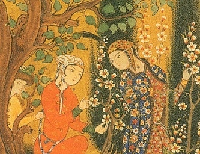

  
[Intangible Textual Heritage](../../index)  [Islam](../index) 

------------------------------------------------------------------------

[Buy this Book on
Kindle](https://www.amazon.com/exec/obidos/ASIN/B002JTWQM0/internetsacredte)

------------------------------------------------------------------------

<table width="75%">
<colgroup>
<col style="width: 50%" />
<col style="width: 50%" />
</colgroup>
<tbody>
<tr class="odd">
<td width="50%" data-valign="TOP"> 
Medieval Islamic Manuscript Illustration (Public Domain Image)</td>
<td width="50%" data-valign="CENTER"><h1 id="selections-from-the-poetry-of-the-afghans" data-align="CENTER">Selections from the Poetry of the Afghans</h1>
<h2 id="by-henry-george-raverty" data-align="CENTER">by Henry George Raverty</h2>
<h4 id="section" data-align="CENTER">[1869]</h4></td>
</tr>
</tbody>
</table>

------------------------------------------------------------------------

[Contents](#contents)    [Start Reading](spa00)    [Page
Index](pageidx)    [Text \[Zipped\]](spa.txt.gz)

------------------------------------------------------------------------

|                                                                                                                           |
|---------------------------------------------------------------------------------------------------------------------------|
|  |

This is an anthology of English translations of Pushto poets from the
16th century on. Most, if not all, of these poets are Sufi. They utilize
the poetic vocabulary of Sufiism: the tavern, the wine, the flowers,
etc., all actually technical terms describing the soul's progression on
the mystical path towards God. Raverty's introductory essay, "Remarks on
the Mystic Doctrine and Poetry of the Sufis" provides a skeleton key to
the symbology.

Most of the writers included here were, in addition to being Sufi poets,
tribal leaders, men of action, in many cases related in some fashion.
For instance, the prolific Khushhal Khan fathered Ashraf Khan and
Abd-ul-Kadir Khan, all very formidable poets *and* warriors. Their
poetry reflects a tribal, patriarchal society (women don't normally
appear in these texts except as the 'beloved,' or a target of scorn).
However, this is not the bleak, bigoted, art and music starved world of
the Taliban. It is clear that not *all* of that Sufi *joie de vivre* is
metaphorical, and many of the verses display a wicked sense of humor.
The descriptions of nature are realistic, and their love of country is
fierce.

Raverty (b. 1825, d. 1906), a Major in the British Army, fought in the
Punjab from 1849-50. From 1852-9 he was Assistant Commissioner of the
Punjab. His duties involved extensive travel in what is today Pakistan,
Afghanistan, and India. He wrote one of the first Pushto grammars in
1855. He also wrote a Pushto-English dictionary, and a volume of Pushto
texts in the original language, which served as the basis for these
translations. The system of transcription in this book, which is
reproduced exactly as in the original with the help of
[Unicode](../../unicode), is not pretty, but at least is applied
consistently. Included here are translations of poems only available in
manuscripts which Raverty was able to access, obviously very rare. This
book, itself, is fairly rare, and appears for the first time on the
Internet at this site.

------------------------------------------------------------------------

 [Title Page](spa00)  
[To the Reader](spa01)  
[Contents](spa02)  
[Remarks on the Mystic Doctrine and Poetry of the Ṣūfīs](spa03)  

### Æabd-ur-Raḥmān

[Introduction](spa04)  
[The Poems of Æabd-ur-Raḥmān](spa05)  

### Mīrzā <u>Kh</u>ān, Anṣārī

[Introduction](spa06)  
[The Poems of Mīrzā <u>Kh</u>ān, Anṣārī](spa07)  

### Æabd-ul-Ḥamīd

[Introduction](spa08)  
[The Poems of Æabd-ul-Ḥamīd](spa09)  

### <u>Kh</u>u<u>sh</u>ḥāl <u>Kh</u>ān, <u>Kh</u>a<u>tt</u>ak

[Introduction](spa10)  
[The Poems of <u>Kh</u>u<u>sh</u>ḥāl <u>Kh</u>ān,
<u>Kh</u>a<u>tt</u>ak](spa11)  

### A<u>sh</u>raf <u>Kh</u>ān, <u>Kh</u>a<u>tt</u>ak

[Introduction](spa12)  
[The Poems of A<u>sh</u>raf <u>Kh</u>ān, <u>Kh</u>a<u>tt</u>ak](spa13)  

### Æabd-ul-Ḳādir <u>Kh</u>ān, <u>Kh</u>a<u>tt</u>ak

[Introduction](spa14)  
[The Poems of Æabd-ul-Ḳādir <u>Kh</u>ān, <u>Kh</u>a<u>tt</u>ak](spa15)  

### Aḥmad Shāh, Abdālī, Shāh Durr-i-Durrān

[Introduction](spa16)  
[The Poems of Aḥmad <u>Sh</u>āh, Abdālī](spa17)  

### Kāzim <u>Kh</u>ān, <u>Kh</u>a<u>tt</u>ak, Surnamed <u>Sh</u>aidā

[Introduction](spa18)  
[The Poems of Kāzim <u>Kh</u>ān, <u>Kh</u>a<u>tt</u>ak](spa19)  

### <u>Kh</u>wājah Muḥammad, Banga<u>sh</u>

[Introduction](spa20)  
[The Poems of <u>Kh</u>wājah Muḥammad, Banga<u>sh</u>](spa21)  
