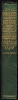

  
[Intangible Textual Heritage](../../index)  [Islam](../index.md) 
[Index](index)  [Next](spa01.md) 

------------------------------------------------------------------------

[Buy this Book on
Kindle](https://www.amazon.com/exec/obidos/ASIN/B002JTWQM0/internetsacredte.md)

------------------------------------------------------------------------

*Selections from the Poetry of the Afghans*, by H.G. Raverty,
\[1868\], at Intangible Textual Heritage

------------------------------------------------------------------------

## SELECTIONS

###### FROM

# THE POETRY OF THE AF<u>GH</u>ĀNS,

#### FROM THE SIXTEENTH TO THE NINETEENTH CENTURY,

### LITERALLY TRANSLATED FROM THE ORIGINAL PU<u>S´H</u>TO;

#### WITH NOTICES OF THE DIFFERENT AUTHORS,

##### AND REMARKS

#### ON THE MYSTIC DOCTRINE AND POETRY OF THE ṢŪFĪS:

###### BY

## MAJOR H. G. RAVERTY,

###### BOMBAY ARMY, RETIRED LIST;

###### AUTHOR OF A GRAMMAR, AND DICTIONARY OF THE PU<u>S´H</u>TO OR AF<u>GH</u>AN LANGUAGE; THE GUL<u>SH</u>AN-I-ROH, OR SELECTIONS, PROSE AND POETICAL, IN THE PU<u>S´H</u>TO OR AF<u>GH</u>ĀN LANGUAGE; THE GOSPEL FOR THE AF<u>GH</u>ĀNS; A THESAURUS OF ENGLISH AND HINDŪSTĀNĪ TECHNICAL TERMS, ETC. ETC.

<table data-border="0">
<colgroup>
<col style="width: 100%" />
</colgroup>
<tbody>
<tr class="odd">
<td data-valign="top">
"Full many a gem of purest ray serene 
   The dark unfathom’d caves of ocean bear; 
 Full many a flower is born to blush unseen, 
   And waste its sweetness on the desert air."
</td>
</tr>
</tbody>
</table>

(*New and Cheaper Edition*.)

#### LONDON: WILLIAMS AND NORGATE, HENRIETTA STREET, COVENT GARDEN, & SOUTH FREDERICK STREET, EDINBURGH. CALCUTTA: W. NEWMAN & CO.

#### MDCCCLXVII.

#### \[1867\]

Scanned, proofed and formatted at Intangible Textual Heritage by John
Bruno Hare, November 2007. This text is in the US public domain because
it was published prior to 1923.

 
[  
Click to enlarge](img/spine.jpg.md)  
Spine  

  [  
Click to enlarge](img/title.jpg.md)  
Title Page  

------------------------------------------------------------------------

[Next: To the Reader](spa01.md)
