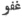

  
[Intangible Textual Heritage](../../index)  [Islam](../index) 
[Index](index)  [Previous](spa10)  [Next](spa12) 

------------------------------------------------------------------------

[Buy this Book on
Kindle](https://www.amazon.com/exec/obidos/ASIN/B002JTWQM0/internetsacredte)

------------------------------------------------------------------------

*Selections from the Poetry of the Afghans*, by H.G. Raverty,
\[1868\], at Intangible Textual Heritage

------------------------------------------------------------------------

p. 149

### THE POEMS

###### OF

## <u>KH</u>U<u>SH</u>ḤĀL <u>KH</u>ĀN, <u>KH</u>A<u>TT</u>AK.

#### I.

AN ODE TO SPRING.

From whence hath the spring again
returned unto us,  
Which hath made the country round a garden of flowers?

There are the anemone and sweet basil, the lily and thyme;  
The jasmine and white rose, the narcissus and pomegranate blossom.

The wild flowers of spring are manifold, and of every hue;  
But the dark-red tulip, above them all, predominateth.

The maidens place nosegays of flowers in their bosoms;  
The youths, too, fasten bouquets of them in their turbans.

Come now, musician! apply the bow to thy violin:  
Bring out the tone and the melody of every string!

And thou, cupbearer! bring us full and overflowing cups,  
That I may become fraught with wine's inebriety!

The Af<u>gh</u>ān youths have again dyed red their hands,  
Like as the falcon dyeth his talons in the blood of the quarry.

They have made rosy their bright swords with gore:  
The tulip-bed hath blossomed, even in the heat of summer.

p. 150

Ae-mal <u>Kh</u>ān and Dar-yā <u>Kh</u>ān—from death preserve
them! [\*](#fn_171)  
Were neither of them, at fault, when opportunity occurred.

They dyed red the valley of <u>Kh</u>aibar, with the blood of the foe:  
On Karrapah, [†](#fn_172) too, they poured
forth war's din and tumult.

From Karrapah, even unto Bājawrr, [‡](#fn_173)
both plain and mountain,  
Time after time, as from an earthquake, quaked and shook.

It is now the fifth year, since in this neighbourhood,  
Every day heareth the clashing of glittering swords.

Since I arrived in this part, [§](#fn_174) I
have become a nonentity—  
Either I am despicable, or this people are infamous grown.

I cry out unto them, "Troops, troops," until I am weary;  
But deaf to all, they neither say "Die," nor "Thy sacrifice." [§§](#fn_175)

When the state of the Yūsufzīs became known unto me,  
Lowā<u>gh</u>ar was then my better place, not Dam<u>gh</u>ār.

The dogs of the <u>Kh</u>a<u>tt</u>aks are far better than the
Yūsufzīs,  
Though, in disposition, the <u>Kh</u>a<u>tt</u>aks are more worthless
than dogs.

The whole of the other Af<u>gh</u>āns, from Ḳandahār unto
A<u>tt</u>ak,  
In honour's cause, both secretly and openly, are one.

See how many battles have been fought on all sides;  
Yet still, amongst the Yūsufzīs, there is no sense of shame.

p. 151

The first fight was at the higher back of Mount Tatārah, [\*](#fn_176)  
Where forty thousand Mu<u>gh</u>als were scattered like chaff.

When their sisters and daughters fell into the bonds of the
Af<u>gh</u>āns,  
With horses and camels, elephants and baggage, string after string.

The second battle was with Mir Husain in the Doābah, [†](#fn_177)  
When his head was crushed, like that of a venemous snake.

After that again, was the affair at the fort of
Noh<u>s’h</u>airah, [‡](#fn_178)  
When from the Mu<u>gh</u>als I extracted my own inebriation.

And then came Jaswant Singh and <u>Sh</u>ujaæat <u>Kh</u>ān,  
Of whom, Ae-mal <u>Kh</u>ān plucked up the roots at Gandāb.

The sixth was over Mukarram <u>Kh</u>ān and <u>Sh</u>am<u>sh</u>er
<u>Kh</u>ān,  
Both of whom, at <u>Kh</u>āpa<u>sh</u>, Ae-mal scattered to the winds.

These are the greatest triumphs that I hold in recollection;  
But the lesser ones, in all directions, who shall compute?

Up to the present time, victory hath been always with us;  
And for the future, upon God, is our dependence placed.

A year hath passed since Aurangzeb is encamped against us,  
Disordered and perplexed in appearance, and wounded in heart.

It is now year after year, that his nobles fall in battle;  
But his armies swept away, who shall number them!

The treasures of India have been spread out before us:  
The red gold *muhurs* have been engulphed in the hills.

p. 152

It would not have entered one's head in eighteen guesses,  
That such events would e’er have happened in these parts.

Still Aurangzeb's malevolence hath not a whit diminished,  
Though the curses of his father it before drew down. [\*](#fn_179)

For this reason, also, no one can place dependence on him:  
He is malignant and perfidious; a breaker of his word.

For this state of things, no other termination can be seen,  
Than that the Mu<u>gh</u>als be annihilated, or the Af<u>gh</u>āns
undone.

If this, which is beheld, be the revolutions of destiny—  
If in this be the will of the Almighty, the time is come.

Fate revolveth not in the same fashion at all times  
Now ’tis propitious to the rose; now favourable to the thorn.

At a period so pregnant with honour and glory, as the present,  
In what manner do these base and recreant Af<u>gh</u>āns act? [†](#fn_180)

There is no deliverance in any thing, save the sword:  
Af<u>gh</u>āns, who nourish any other idea than this, are lost, indeed.

The Af<u>gh</u>āns are far superior to the Mu<u>gh</u>als at the
sword,  
Were but the Af<u>gh</u>āns, in intellect, a little discreet.

If the different tribes would but support each other,  
Kings would have to bow down in prostration before them.

But whether it be concord or strife, or folly or wisdom,  
The affairs of every one are in the hands of the Almighty.

p. 153

Let us see what the Afrīdīs, Mohmands, and <u>Sh</u>īnwāris will do;  
For the Mu<u>gh</u>als are now lying encamped at Nangrahār. [\*](#fn_181)

I alone, amongst the Af<u>gh</u>āns, grieve for our honour and renown;  
Whilst the Yūsufzīs, at their ease, are tilling their fields.

They who now act so dishonourably, and so shamelessly,  
Will, hereafter, the upshot of their own acts perceive.

In my poor judgment, death is more preferable than life,  
When existence can no longer, with honour, be enjoyed.

In this world, he will not always remain with life;  
But the memory of <u>Kh</u>u<u>sh</u>ḥāl
will long, long endure!

It was the first of the Third Sister, [†](#fn_182) in the year of <u>Gh</u>afū [‡](#fn_183)  
That I, whilst at Barmawul, indited these lines.

#### II.

What wonderfully delicious wine is this,  
Which the cupbearer, with welcome, presents!

The laughing of the bud in the parterre were impossible,  
Did not the zephyr, every morning, over it pass.

Its counsel regarding the nightingale was this,  
That the morn should the rosebud's garment rend. [§](#fn_184)

p. 154

Appreciate thou the value of Philomel, O rose,  
Although thou bloomest in this thy beauty now!

Since his cure dependeth upon the object of his heart,  
Of the lover's disease, what do physicians know?

Save the beloved-one's beaming countenance, imagine not  
That <u>Kh</u>u<u>sh</u>ḥāl will be, with
any other face, content.

#### III.

Spring hath returned: the narcissus in the garden wantoneth,  
And the breeze of the morning, the spikenard disordereth.

For five short days, the rose of the parterre will bloom;  
But on the sixth, it scattereth its existence to the winds.

The enamoured nightingale layeth its head at the rose's feet,  
As the Brahman bendeth, in adoration, his idol before.

Acquire thou humility from the example of the cypress,  
That with such loftiness, showeth this much lowliness.

The Karlārrnaey [\*](#fn_185) hath quaffed no other wine whatever—  
The whole of this inebriety proceedeth from creation's cup. [†](#fn_186)

#### IV.

My beloved is offended: would there were any one who would conciliate
her!  
Arise quickly, O mediator! for my heart is grieved on her account.

p. 155

He will be constantly plunging into the deep seas of injustice,  
Who rendereth up his heart unto the heart-ravishers of these days.

What a vile world it is! what are its customs! what its ways!  
It abandoneth, altogether, the starving, and giveth invitation to the
cloyed!

Punished they cannot be; but would I could lay hands, as I wish, on
them;  
For ’tis those sable locks of thine, that are ever of hearts making
theft.

The tyranny of thy dark tresses is by no means hidden from view—  
The impassioned-one, who may be powerful, soon her tyranny displayeth.

Thou that givest thyself unto the tender passion, accept in love  
The taunts and reproaches, that the world, upon lovers, ever cast.

Thy blood-thirsty locks have not made me, only, desolate;  
And many more, like unto me, forlorn, will they, even yet, destroy.

Wouldst thou, this one so arrogant of her beauty see, draw near!  
Alas! towards <u>Kh</u>u<u>sh</u>ḥāl, her
coquetry she openly displayeth.

#### V.

Wherefore doth Aurangzeb his throne and crown adorn?  
For death will assail, and lay waste the both of them.

His evil name only will remain behind in the world;  
Knowing, as he doth, whether he as Kasrā, or as Hujāj acteth. [\*](#fn_187)

p. 156

O’erwhelmed in grief, I know not of festival or feast,  
Though the whole people of Dilhī make gladness and joy.

All the water went to the eyes, and the heart's fire blazed out—  
Alas, how can any one, in such a state of mind as this exist!

They turn pale when they lay finger upon my pulse;  
Then, by what means, can the physicians, my disorder cure?

Separation lacerateth my heart in the same manner,  
As the falcon rendeth the partridge and the quail.

When two friends may be separated by a distant land,  
How desirous God maketh them of a mere salutation!

My tears are produced through the emotions of the heart,  
Like as fire expelleth the moisture from the roasting meat.

Alas, every arrow that is discharged from fatality's bow,  
Destiny maketh poor <u>Kh</u>u<u>sh</u>ḥāl's heart the butt of!

#### VI.

Thou wast saying, "Grieve not any more; for I am thine, and thou art
mine:"  
Whether thou hast falsely or truly spoken, thou hast, indeed, given me
life again.

What a lovely calamity thou art! a charmer, incomparable, art thou!  
Would that there were not this defect, that thou hadst not such a cruel
heart!

Should the whole universe, in every direction, be with the lovely
filled;  
Even then, it would be astonishing, if one were found beautiful like
thee.

p. 157

With so many victims slain, even yet thou showiest no pity or regret:  
But what matter, though the executioner shed blood a hundred times over?

Since out of thy garden, or thy parterre, I beg for a rose from thee,  
Shouldst thou but a straw on me bestow, yet I, as a rose, receive it.

As long as I may exist, I am, indeed, the captive of those ringlets,  
In every hair of which, hundreds of hearts will ever be enthralled.

Whether old, or whether young, all are distracted about thee:  
There is not a person in the town, that is not enamoured of thee.

The cypress-tree behold! it very soon ceaseth to be looked upon,  
When thou, with this stature and figure, through the garden trippest.

The prospect of Heaven to come, is bliss to both monk and priest;  
But <u>Kh</u>u<u>sh</u>ḥāl hath gained
Paradise, at once, in meeting thee.

#### VII.

Again the minstrel's rebeck toucheth the heart profoundly;  
For it discovereth new and fresh strains of melodious harmony.

Leave the monk in the monastery's nook! I will to the garden;  
For the flowers of spring instruct me in righteousness’ ways.

Beggars have much anxiety about filling their bellies;  
And kings should be solicitous regarding dominion and realm.

If this be not the effect of my good fortune, what is it then,  
That against the guardian she crieth out to this degree?

How much more will be the extent of the love of her constancy,  
When, in injustice and inconstancy, such favour she bestoweth?

p. 158

Within this city, the juice of the grape is thus so openly sold;  
Because the censor, himself, favoureth the bibbers of wine.

From thy coldness to me, I grow both joyful and melancholy,  
Like unto one that giveth thanks to, and yet complaineth of another.

If to love to look upon the pretty creatures be aught of sinfulness,  
Then <u>Kh</u>u<u>sh</u>ḥāl committeth
iniquity, all his life long.

#### VIII.

When towards his father a son acteth perfidiously,  
After what manner, to others, will he sincerity show?

See, what further perfidy must be within his heart,  
When the hypocrite maketh avowal of his own misdeeds.

Neither will I pardon the enormities of the degenerate,  
Nor will the Almighty forgive the fallen angel his sins.

All these minor hills are as nothing: desirous am I,  
That my God, betwixt us, would place even Ḳāf [\*](#fn_188) itself.

The conduct of his own son is best known to his father;  
Then why will people commend the degenerate unto me?

Neither can any liar utter falsehoods like him,  
Nor can any one equal him in cunning and deceit.

There are both a thousand varieties of vain lies in his heart,  
And a thousand vaunts of morality upon his tongue.

That I cherished, and brought up such an undutiful son,  
It was, alas! for this, that he should, against me, rise up!

p. 159

Let me not, indeed, cast eyes upon him whilst I live;  
And after death, let him not dare my grave to approach.

Sorrow and grief shall, whilst living, leave his heart,  
If fate, unto <u>Kh</u>u<u>sh</u>ḥāl,
shall due justice grant.

#### IX.

Every sick person that is impatient with his physician,  
Bringeth, if thou but consider, affliction upon himself.

The fish existeth in the river; but should it come out thereof,  
Can it be comfortable, or at ease, upon the dry land?

Though the bat hideth himself from the light of the sun,  
In what manner doth the sun sustain injury therefrom?

’Tis the nature of dogs to howl at the sight of the moon;  
And thus, by their yelping, bring disgrace on themselves.

The dung-beetle is distressed by the flower's perfume;  
Because its existence is sustained by offensiveness.

That the prophets are evil in the sight of the infidel,  
Is, because whatever they do, is with the Devil's advice.

Unfortunate, indeed, is he, who acteth on his enemy's counsel:  
Can an opponent and an enemy ever give good advice?

The heron, on the river's bank, is with thirst parched;  
For every penurious creature followeth his own avaricious ways.

With the precepts of the Ḳur’ān, Fārūḳ is acquainted:  
It pointeth not out the right path to Bū-Lḥab, or to Bū-Jhal. [\*](#fn_189)

p. 160

The purity of the Musalmān, O <u>Kh</u>u<u>sh</u>ḥāl! is possible;  
But no ablutions, no purifications, can make the Gabr [\*](#fn_190) clean.

#### X.

Through sorrow at the poor-spiritedness of the Af<u>gh</u>āns,  
I have abandoned greatness, and taken meanness in hand.

Had this much even been gained in the matter, it were good—  
Had I wreaked upon the recreant my full meed of revenge.

From the time when the jewel of my honour became broken,  
I have not left, for a moment, my eyes free from tears.

That pearl came not into my hands, after all my trouble,  
And, therefore, my boat I have drawn up on the sea-shore.

This waist of mine, that in resistance was a mountain,  
Through chagrin and disappointment, unto the Mu<u>gh</u>al I bent.

But let good fortune once commence again to aid me,  
That it may relieve me from the weight of affliction's load

This misery of mine is not to be compared to any other grief,  
Although I may have experienced a thousand woes and sorrows.

The back of fortune, and. the world's, both are turned upon me;  
Hence, through sorrow, I turned my face from all, the Mu<u>gh</u>al
unto.

Were it in my power, or were it mine own free-will,  
I would not, even two paces, towards them advance.

I am obliged to hearken to crooked words from the mouths of those,  
Unto whom, in my lifetime, I never before a straight one gave.

p. 161

The outcries of my own people, and of strangers, affect me,  
Notwithstanding I used, even from a whisper, to screen myself.

I am now ashamed of those proud and boastful words,  
That, before every one, were wont to issue from my lips.

A hundred reproaches and indignities are heaped upon me,  
Who ever guarded myself from detraction and reproach.

’Tis for this reason the elephant streweth dust upon his head, [\*](#fn_191)  
That I made him acquainted with <u>Kh</u>u<u>sh</u>ḥāl's sorrows.

#### XI.

If, for once only, she will show her face from the veil,  
She will take the diploma of beauty from the sun.

The tulip shall borrow bloom from her countenance;  
The hyacinth will grow furious at the sight of her curls.

Wherefore Both the world accuse fortune thus falsely?  
’Tis she, that with her eyes, hath desolated the world.

Either those orbs of hers are red from wine's effects,  
Or some one hath roused her from sleep, unseasonably.

She quaffeth the blood of hearts in the place of wine;  
Then again, taketh roasted hearts, as au incitement to more.

The special death of the slaughtered by the hand of the beloved,  
Is that they may enter Paradise, without rendering account.

Let my heart be a compass, and let it never vary or turn  
In any other direction, save the altar of thine eyebrows unto.

p. 162

Do not be so overjoyed, O <u>Kh</u>u<u>sh</u>ḥāl! at all her vows;  
For, from the bubble, no one hopeth for any constancy.

#### XII.

O zephyr of the morn! draw near unto the parterre;  
For the flowers are overjoyed, in expectation of blooming.

What doth the hermit know, as to what thing love is?  
Wherefore speakest thou to the owl, the garden concerning?

Though the monks perform their devotions five times a day,  
I am ever prostrate, in devotion, unto the Giver of good.

As much as I behold thee, I do not become satiated,  
Notwithstanding I gaze so intently upon thy face.

Again, indeed, place thou a scar on the anemone's heart,  
When thou roamest in the garden, so joyous and gay.

Anger and kindness I perceive between thine eyebrows:  
The tablet of thy forehead thou hast placed to be perused.

Sometimes, thou raisest strife; at others, showest kindness—  
Simple hearted that I am, at such skill, I grow amazed.

If thou hast set thine heart upon my death, I too, say,  
That thy tyranny hath brought me to death's door nigh.

#### XIII.

Draw near, and behold him now, with a clod beneath his head,  
Who could not sleep upon a bed, without a pillow of feathers!

This, which they call the transient world, hath no existence, and is
naught;  
For this reason, O foolish man! ’tis hideous in the sight of the wise.

p. 163

This world is a scabby sheep—then what good is there in keeping it?  
The shepherd, when he findeth out its scabbiness, expelleth it from the
flock.

Is this a tempest or hail-storm, that both standing corn and stacks also
go?  
Out upon such a corn-field as this, since an ear of corn can not be
found!

With these eyes of mine, I have beheld the noble and massive structures
of kings,  
Who coveted the world's dominion, but left them, all at once, behind!

A hundred thousand squadrons assemble, and collect the treasures of the
world;  
Be as Sanjar [\*](#fn_192) for a few
generations, and then neither thou nor thy race remain.

Thy house is on the face of a flood, and this thy contemptible idea is
still worse;  
For no one would there his dwelling make, that it should be swept by the
flood away.

p. 164

Shouldst thou become a <u>Sh</u>ahdād [\*](#fn_193) in the world, still calamity will
remember thee;  
And if here thou a Paradise preparest, of what profit is such an
Aden [†](#fn_194) to thee?

He carried away along with him, this wealth ephemeral, O young man!  
Who diffused it broadcast; but not they, that heaped it up for
themselves.

I have beheld fortune's practices—its different usages and ways—  
It clambereth unto thee with difficulty; but like a stone from a
mountain, rolleth away!

If thou art foolish and imprudent, like unto Mir-bāz [‡](#fn_195) pursue it;  
But if wise and prudent, like unto <u>Kh</u>u<u>sh</u>ḥāl, from it flee away!

#### XIV.

These dark waving curls, they are thine, thou dear one, so beautiful, so
gay!  
Black narcissuses are those eyes of thine, thou dear one, so beautiful,
so gay!

When thou gayest me a kiss, I became intoxicated, beyond computation;  
For like unto red wine are thy lips, thou dear one, so beautiful, so
gay!

Now that I have with mine eyes gazed on this, thy lovely cheek,  
I know that it is the tulip, thou dear one, so beautiful, so gay!

p. 165

They, who murmur and complain unto others, of thy tyranny,  
Are faithless and inconstant too, thou dear one, so beautiful, so gay!

Free of grief, how can he sleep—in tranquillity how shall he be,  
Who is separated from thee? thou dear one, so beautiful, so gay!

He only will receive thy kisses, on whom thy affections may be,  
Tho’ many are enraptured with thee, thou dear one, so beautiful, so gay!

Thou wreakest injustice on me, then sayest, "This is not done by me"—  
Then whose act is it, if not thine? thou dear one, so beautiful, so gay!

Thou sayest unto <u>Kh</u>u<u>sh</u>ḥāl,
"There are others far prettier than I:"  
Can there be one, than thee more lovely? thou dear one, so beautiful, so
gay!

#### XV.

Wine's intoxication soon cometh, and as quickly disappeareth;  
But the eternal inebriation leaveth not the inebriated one.

Tho’, in the world, my name is become notorious for debauchery,  
Still I will not abandon the ways of the bibbers of wine.

Though the king may cast him into prison, he will not grieve;  
For the liberty of the free is from the beginning of time.

There is neither friendship nor relationship: all is deceit, I find,  
Since I became acquainted with the ways and usages of mankind.

I am happy in hope of future joy, tho’ now in sorrow plunged;  
For the day ever followeth, in rotation, after the darkness of night.

The pearl of our yearnings lieth immersed in ocean's depths;  
And after it, the divers plunge continually, into its dark abyss.

p. 166

That fish, who may perceive danger from the sharp hook,  
From the bottom to the shore, from prudence, will never look.

The thoughts of the lover's heart are like unto the deep, deep sea,  
The billows of which, at times, rage in fury; at others, calmly sleep.

Affection for the beloved, from <u>Kh</u>u<u>sh</u>ḥāl's heart, will never
depart:  
It is like unto the love of the idolater, for the idol of his worship.

#### XVI.

From out of the clear, azure flask,  
O cupbearer! bring thou unto me  
A full goblet of that potent wine,  
The remedy for grief, the consoler in woe.

Speak not of the tributes of the world!  
They cannot compare with one cup of wine:  
Then, O censor, leave me and the wine, withal!  
Tho’ thereby my house should devastated be.

Become thou the beggar at the tavern's door,  
If along with the crown, thou dominion seek:  
The mart of the wine-bibbers is crowded,  
From this extensive sale of wine.

Turning from the idol-temple to the monastery,  
Is both an absurd and a useless act:  
From the cupbearer, then take thou the glass;  
For therein is much gladness and joy.

O cupbearer! let me ever behold thee—  
Thou of the moon-like brow and sunny face!  
Bring the crystal cup, to overflowing full,  
And satisfy the yearnings of <u>Kh</u>u<u>sh</u>ḥāl!

p. 167

#### XVII.

Tho’ the miser's house may contain the water of immortality;  
Still, like unto the deadliest poison, is its effect on me.

Moses possessed nothing whatsoever, but one rod alone:  
Ḳārūn had boundless wealth, and verily, calamity befell him. [\*](#fn_196)

He who hath riches, with it hath vexation and misfortune mix’d up;  
Hence the wise so act, that they may not their troubles increase.

The duration of the rose; the world's wealth; the mean man's
friendship;  
These three or four things are all inconstant and transitory.

He, who may neither possess modesty nor virtue, genius nor
understanding,  
Regard not his wealth, nor his beauty, nor his ancestral descent.

The wise man is in utter misery, whilst the fool reveleth in pleasure—  
And well, indeed, may the world be amazed at such occurrences as these.

That he should continue happy all his life, and grief never assail
him,  
No one, into the world hath brought, a safe-conduct, such as this.

This is the way with fortune—some it maketh happy—some miserable;  
And however clear now, the mirror will become clouded
[hereafter](errata.htm#5).

Wherefore, then, trouble thyself! Be rejoiced at this, O <u>Kh</u>u<u>sh</u>ḥāl!  
That he, who hath neither riches nor wealth, hath neither pilgrimage to
perform, nor taxes to pay.

p. 168

#### XVIII.

Very many persons within my recollection,  
Have come, and passed, like the wind away.

They, indeed, arrive and depart, in such a way,  
That they appear to have no tarrying place at all.

It is an astonishing, and a vast workshop this,  
That the Great Master hath organized, and set up.

Cast thine eyes upon the bubble in the stream!  
What is it? and what its origin and its base?

Such art thou too, if thou canst understand:  
An excellent example is demonstrated to thee.

Concerning thyself, thou knowest nothing:  
Alas! alas! verily, thou knowest naught.

What are all thy grief and misery about?  
And why becomest thou again overjoyed?

Since it is so very hard, O <u>Kh</u>u<u>sh</u>ḥāl!  
Is this thine heart, or is it but a lump of steel?

#### XIX.

Like unto the wind, every moment, life passeth away!  
Let then every man have the remembrance of death ever before him!

Since the foundation of this life of his, is based upon the air,  
Upon existence such as this, what reliance can be placed?

The dust of man is leavened with the water of mortality,  
By the hand of Omnipotence kneaded, in the space of forty days. [\*](#fn_197)

p. 169

Both saints and prophets have, alike, gone down into the tomb—  
Thou wouldst say, forsooth, that they had never existed at all.

If thou considerest it well, the term of life here is nothing:  
No one hath attained in it the object of his desires and hopes.

If thou, indeed, seek life eternal, then I say unto thee,  
War, for ever, with the infidels of the lusts of the flesh.

The prudent traveller, whose journey lieth before him,  
Taketh provision with him, according to the length of the road.

Come, sever thine heart, O <u>Kh</u>u<u>sh</u>ḥāl! from all extraneous
things;  
And in the hope of meeting Him, let it rejoice always!

#### XX.

The Almighty gave into my arms—and I am under obligation to the
mediator [\*](#fn_198)—  
The fair-faced one, with the ruby lips, and the flowing sable tresses.

The beloved is kind and affectionate, and the consoler in every
sorrow:  
Should the guardian come, what will he do? neither grief nor concern
have I.

Let them consume upon it, as a charm, to ward off evil from thy face;  
For thy love is like unto fire, and thy lovers like unto wild rue [†](#fn_199) are.

p. 170

These are not thy cheeks, nor are these thy dark flowing ringlets:  
They're the fresh fibrils of the spikenard, that have fallen two roses
upon.

I follow in her pursuit, in the hope that I may obtain, even one look;  
But she casteth not her eyes behind; and, thus, along before me goeth.

If this much of thy affection is not good fortune, what is it then?  
That when thou, upon <u>Kh</u>u<u>sh</u>ḥāl,
<u>Kh</u>a<u>tt</u>ak, smilest, the jealous weep.

#### XXI.

Unto the old man, who sigheth after youthfulness, say—  
What is this? laughest thou at thy beard, old man?

Since in a year, it will have both youth and age,  
Than the fate of man, that of the wild rue is better.

At times, he becometh so sated at table, that he cannot eat;  
At others, he rolleth his eyes upon it, with greediness and voracity.

In their wishes, and in their words, and also in their proceedings,  
The people of the world are doubtful and timid of each other.

With beard now grown white, why should I have fear of death;  
When friends, in their prime, with beards black, have gone before me?

Him, under whose sway the whole of the earth's surface was,  
Draw near, and behold now, in the surface of the earth!

p. 171

This world's folks are like unto the moving sands, [\*](#fn_200) if thou but consider;  
For, in truth, they roll over, and upset each other, in the very same
way.

With these eyes of mine, I have beheld the dread furnace of fate—  
I <u>Kh</u>u<u>sh</u>ḥāl, myself, whom,
like unto dried up verdure, it consumeth.

#### XXII.

Her sweet face took from me all thoughts of the wild white rose:  
Her ringlets eradicated all consideration of the musk of China.

The curls of the pagan beauty became a cord about my neck: [†](#fn_201)  
A thousand thanks, that she of my religion and faith divested me.

Although the folks offer up prayers for my patience and resignation,  
Affection hath despoiled me of the "Amen," unto these supplications.

Save the lips of the beloved, I take no other name upon my tongue;  
For love hath abstracted from me all other memory and recollection.

My heart, on that day became disgusted with my own life,  
When the hard-hearted one took it, entirely, from me.

By what law, indeed, hath she deprived me of sleep and repose,  
That I weep and lament, and sigh and bewail, all the night long?

Her two eyes are a falcon, and her waving locks are the king-feathers:  
The falcon pounced on, and carried from me the pigeon of my heart.

p. 172

At her coming, she used to bring with her comfort and consolation;  
And by her departure, she would rob me of all tranquillity soever.

The flowers of the parterre hang down their heads, and this they say—  
"The heart-ravisher hath appropriated to herself all admiration."

I was saying, I will consider, even yet, of some remedy for it;  
When poor <u>Kh</u>u<u>sh</u>ḥāl, wholly
withdrew his lacerated heart from me.

#### XXIII.

The skirt of fortune and prosperity cannot be seized by force!  
Is the blind man without reproach, if he apply antimony to his eyes?

What is wealth, indeed? It is like unto a beautiful bride,  
In an impotent-fellow's house, where her life is in torment.

Let it not be, that every bad rider should mount fortune's steed:  
If it be ridden by any one, at least a good horseman let him be.

From a sorry, low-bred pony, another wretched one is produced;  
’Tis from the high-bred horses of the course alone, that noble steeds
come. [\*](#fn_202)

That into my dwelling, in the first place, such animals came,  
My luck must have been bad, from the beginning of time.

These ponies are mere puppets—may confusion seize them!  
They create disturbance and tumult in the stable continually.

Like unto a good and worthy son in his father's dwelling,  
A treasure of silver and gold in his house is not to be compared.

p. 173

O God! thou hast given me a numerous progeny, and I am thankful;  
But let the fame of their goodness resound in every city and town!

They, who stir up enmity between brothers, are recreant and unworthy:  
Would to heaven they had learnt good, or had learnt naught besides!

Give both thine ears and eyes unto the appeals of <u>Kh</u>u<u>sh</u>ḥāl;  
Since Bahrām and Æābid [\*](#fn_203) are, both
of them, deaf and dumb!

#### XXIV.

It is the sweet spring time, and I am separated from my beloved!  
Alas! alas! that thou passest away, O spring, without her!

Both the hills and the dales weep at the lover's state forlorn—  
They are not from melted snow, those floods, that from the mountains
flow.

It is the fire of wounded hearts, that hath enveloped the trees on the
hills;  
Hence, dense black smoke and flame arise, from the fir-tree and the
plane.

Dost thou desire to become acquainted with the condition of the
bereaved?  
Behold then, that crane, which hath become separated from the flock!

It thus appeareth, that the world is a place of mourning and sorrow;  
For the parrots have, with loud cries, green vestments donned. [†](#fn_204)

p. 174

There are no other wailings besides—all are the wails of separation:  
Draw near, if thou wouldst hear them from the rebeck's every string!

My disease lesseneth not—indeed, it increaseth every hour:  
For God's sake, come speedily, O physician, that I may not die!

One, is death unto opponents—the other, is life unto beloved friends:  
I swear, by heaven, that when lovers meet, both are brought about!

What though one still breathe, and is accounted among the living?  
When the malady is yet without antidote, give up hopes of the sick.

Of mankind none remain—those that roam about are demons and devils;  
Hence, they have no compassion for the agonies of the distressed.

Through love, alas! to this degree, wretched and miserable am I
become,  
That whether relations or strangers, they look not on <u>Kh</u>u<u>sh</u>ḥāl through shame.

#### XXV.

Although she quarreleth with me, by word of mouth—that dear one;  
Yet in her heart, that dear one entertaineth much kindness for me.

When, with arms each other's necks around, she accompanieth me,  
Verily, from my heart she removeth the rust-spot—that dear one.

There is no necessity for the sword—her coldness is sufficient,  
If to compass my death should be the intent of that dear one.

Since she hath shown unto me the torch of her loveliness,  
Upon it, another time, she will make me the moth—that dear one.

p. 175

I am a poor beggar—she is a sovereign; hence it is becoming in her,  
Even though she of my affection should feel ashamed—that dear one.

He, who may have turned Malang, [\*](#fn_205)
requireth but a carpet for prayer;  
And in the end, too, a Malang will she make of me—that dear one.

With cheerful heart, she laugheth and smileth with every one besides;  
But with me, indeed, she is mournful and sad—that dear one.

No gem-studded ornament hath she inserted in her nostril;  
But with a single black clove she resteth satisfied—that dear one. [†](#fn_206)

Towards my opponents, her heart is gentle and soft as wax itself;  
But towards <u>Kh</u>u<u>sh</u>ḥāl, she
hardeneth it like stone—that dear one.

#### XXVI.

Upon those lips of her’s is there not a black hand-maid? [‡](#fn_207)  
Draw near! <u>Kh</u>izr, [§](#fn_208) at the
fountain of immortality behold!

The face of the beloved is rich, both in moles and in ringlets;  
For in the house of the wealthy, every requirement will be found.

When their shade over-shadoweth me, I a king become;  
For the shadow of thy dark curls is that of the Ḥumā itself. [§§](#fn_209)

Thy cheek is an enkindled flame—what then is thy braided hair?  
It is like unto the dense black smoke, that from fire ascendeth.

p. 176

The dust of those feet of thine, at the rate of amber thou vendest:  
Who told thee that thou shouldst sell it at a price like this?

For how long wilt thou look another way, and appear unconscious,  
When about me in every direction clamour and uproar arise?

It is through this loveliness that thou art beautiful like the rose,  
If thou art, indeed, one of a father and a mother born.

He hath not the courage to take her name upon his tongue—.  
The poor lover who feareth the censures and reproaches of the world.

I had given up wine, and had grown quite a penitent, indeed;  
But the goblet of the cupbearer again put my contrition to flight.

He that placeth foot within her alley, bringeth destruction on
himself;  
Therefore, O unfortunate, into that vicinity do thou enter not!

Whether it were her coquetry, or her conceits, I could have borne
them;  
But towards me she manifesteth exceeding arrogance at all times.

The whole power of her mind hath she put forth against him;  
And thereby hath deprived the poor lover of all energy and control.

When it may convey no significance, speaking is unprofitable;  
But the Almighty willeth not that <u>Kh</u>u<u>sh</u>ḥāl's words be
vain.

Since, on thy account, the black pupils of his eyes turned white,  
Welcome unto me, O thou, of <u>Kh</u>u<u>sh</u>ḥāl's eyes, the light!

#### XXVII.

I am, indeed, a wine-bibber; then, wherefore, O monk! wranglest thou
with me?  
Men's destinies are from all eternity—would thou couldst like thyself
make me!

p. 177

Wisely thou counselest—a blessing, O monitor, be upon thy tongue!  
But it were well, if by means of words, thou couldst the river's water
disguise.

They, who possessed naught of sense or understanding, have gone to
Heaven;  
Whilst those, who prided themselves upon their wisdom, have gone to
Hell.

Unto Abū-Jahl, [\*](#fn_210) the precepts of
Muḥammad were of no advantage soever;  
For who can polish the mirror of him, whom God hath with rust corroded?

In loneliness and solitude seated, tell me, O monk! what thou gainest
thereby?  
Wherefore makest thou this wide and ample world, for thyself, so
confined?

In every sect and religion, I, indeed, seek after the cause of the
heart's sorrows;  
But thou knowest, and thine own words know, the various tales thou
tellest.

Draw near, thou minstrel! commence the song of the new year's day!  
On rebeck, flute, and harp, strike up those thrilling strains of melody!

The flowers teem on all sides—there are tulips, narcissuses, and
hyacinths too:  
Thou attest unwisely, if thou purposest going in any other direction
than to the parterre.

p. 178

Some, taking with them much provision for the journey, set out to seek
for her;  
And others again, for her sake, bind the Santon's prayer-carpet round
their loins.

O, that the scale of thy good deeds may be heavy at the judgment day!  
For like wax shalt thou soften, towards the lover, his opponents’ flinty
hearts.

Though the whole of the armies of Dilhī have come to compass the death
of <u>Kh</u>u<u>sh</u>ḥāl;  
Still, thou dost not consider thyself strong enough, and hangest back
from shame.

#### XXVIII.

The world's affairs have all become turned upside down:  
All those ways are not now, as they used to be seen by me.

Towards the father, the son showeth the actions of an enemy:  
Towards the mother, the daughters are ready to act like rival wives.

In thine own house, there will not be two brothers together dwelling,  
Who have not a thousand iniquities ready in their hearts.

The scavenger now feasteth on pulāo, [\*](#fn_211) and rice, and sweetmeats;  
And unclean things are become lawful, for Muḥammad's descendants.

The honoured and trusted of kings are now mere thieves become;  
And in their royal courts, highway-robbers are grown trustworthy men.

p. 179

The nightingales and the parrots fly about the wilds, astounded;  
And crows and ravens caw and croak above the beds of flowers.

Babylonian steeds eke out an existence upon dry grass alone;  
Whilst the tanner's asses receive a stipendiary allowance of provisions.

Fools, exempt from all care and anxiety, in tranquillity repose;  
Whilst a hundred troubles and misfortunes, the prudent and the wise
beset.

The meanest slave assumeth authority over his own proprietor;  
And the slave-girls are more honourable than the mistress of the house.

Alas, O <u>Kh</u>u<u>sh</u>ḥāl! in the
days of the Emperor Æālam-gīr, [\*](#fn_212)  
The house-born servants [†](#fn_213) have all a
wretched and contemptible lot!

#### XXIX.

What numbers of boats in this river's depths have sunk and
disappeared,  
A single plank of which, even shouldst thou search, cannot be
discovered!

Everywhere separation and absence have enkindled the flame of grief:  
Like unto green wood thrown upon the fire, how long wilt thou weep?

p. 180

Sorrow and joy—pain and pleasure—are, from the beginning, linked
together;  
And as much as one may have wept, so much even shall he rejoice again!

Many lofty minarets have I beheld, in their graceful symmetry
standing;  
But not a soul mentioned their names unto me, nor said unto whom they
belonged.

The cares and troubles of the world are of a thousand varieties and
forms;  
And the summer skylarks trill and warble in a thousand different ways.

They are different, by far, from the cherished sentiments of my heart  
The manifold rumours, that the folks bandy from one to the other.

This scroll is not the kind of thing, that it shall ever be brought to
an end:  
It is spread open, and examined into—it is read, and then rolled up
again.

Thine own actions are of use to thee, both in this world and the next  
Verily, the throat of every one is kept moist, by its own saliva.

The humblest fare, though barley-bread, unattended by care and
trouble,  
I will account more dainty than the viands, on the king's table
outspread.

The ears of the reckless and imprudent are deaf—they cannot hear  
The blunt, plain-spoken words from <u>Kh</u>u<u>sh</u>ḥāl <u>Kh</u>a<u>tt</u>ak's
mouth.

p. 181

#### XXX.

Every moment that a person may be thus in want of employment,  
Than such, I hold him far better off, who is forced to labour for
nothing. [\*](#fn_214)

The sick and infirm, if they do not work, are to be excused;  
But wherefore should not the hale man his living earn?

Even if thou mayest not have any employment of thine own;  
Still, I say unto thee, sit not thus useless and unemployed.

Every amusement, by which care may be beguiled, is delight;  
Whether it be chess, or backgammon, or the pleasures of the chase.

Every hour, and every moment, a man's state is different:  
In one state unchangeable, is the Creator of the world alone.

Thy name, O <u>Kh</u>u<u>sh</u>ḥāl, shall
be remembered in the world;  
For, in truth, thy employment is one great and mighty work!

#### XXXI.

Neither doth any one here seek to avail himself of my abilities and
experience,  
Nor are the capabilities of this country's people of any advantage unto
me. [†](#fn_215)

We converse together in one tongue—we speak the Pu<u>s’h</u>to
language;  
But we do not, in the least, understand what we to one another say.

p. 182

The Suwātīs account themselves exceeding wise, whilst they are but
fools;  
And ’tis amongst such a set as these, that the Almighty my lot hath
cast.

Now that I have beheld the Suwāt valley, I have this much discovered,  
That there is no tribe more abject and contemptible than the Yūsufzīs.

Tyranny and self-conceit seem to be the innate nature of all;  
And every man amongst them is covetous and ready to beg.

Although, in their dwellings, they have wealth and goods, they are
hungry-eyed;  
And their head-men, than the rest, are more villainous and infamous
still.

’Tis said, that the water-melon deriveth its colour from the
water-melon;  
But their wise men and elders are more worthless than the people
themselves.

The rights of the poor and helpless, they make out wrong and unjust,  
If they can a single penny obtain by way of a present, or a bribe.

As to those I have seen myself—about others I am unable to speak  
They are all either bullocks or skinners, without any exception
soever. [\*](#fn_216)

p. 183

Peregrinations such as these, in all countries, are by no means
useless;  
Since all the secrets regarding them became known unto me.

Now that <u>Kh</u>u<u>sh</u>ḥāl hath
smelt the earth of Suwāt, and the Sama’h, [\*](#fn_217)  
He knoweth, that a single faithful man will not, in them, be found.

#### XXXII.

There is lamentation everywhere, from the hand of death!  
In every place, in every habitation, from the hand of death!

'The form of man He created for the sake
of death itself;  
And evil and misery, in this world, came from the hand of death!

The whole of the prophets and saints, that have ever existed,  
Have all been hidden in the earth, by the hand of death!

Surely, and without doubt, in the end shall be brought  
Ruin and desolation on these fair abodes, by the hand of death!

Come! do thou, too, occupy thyself in laying by viaticum for thy
journey;  
For whole caravans have been dispatched, by the hand of death!

O <u>Kh</u>u<u>sh</u>ḥāl! though in body
thou shouldst a <u>Sh</u>āh Julian be, [†](#fn_218)  
Even then, thou wouldst depart in sorrow, from the hand of death!

p. 184

#### XXXIII.

Whilom, indeed, I was always wise; and wise, even yet, am I!  
I was ever mad and beside myself—mad, even yet, am I!

There is association, not separation: from Him, disjunction is unreal:  
With Him, with whom I was a dweller, a dweller, even yet, am I!

Since I have entered into the world, I have come to know myself:  
I was a treasury of mysteries; and of such, a treasury, even yet, am I!

In the world, the mention of my goodness is made, far and near:  
Amongst the folks I was a fiction; and a fiction, even yet, am I!

When the veil of His face was drawn aside, unto me a torch appeared;  
At that moment I was a moth thereon—a moth, even yet, am I!

The arrows of His eyelashes, they are the misfortune of my life:  
I was a target for them an age; and their target, even yet, am I!

When He made me a friend of Himself, He turned me from all others
away:  
I then was a stranger unto the world; and a stranger, even yet, am I!

That ocean which is circumambient, boundless, unfathomable,  
Of that ocean I was the pearl; and its pearl, even yet, am I!

In the same manner, with mine own beloved, without agent or delegate,  
As I, <u>Kh</u>u<u>sh</u>ḥāl, used in
amity to be, in amity, even yet, am I!

p. 185

#### XXXIV.

Amongst the whole village, my beloved is that person,  
Who, throughout the whole tribe, is celebrated—that person.

Though, in resemblance and in qualities, she may human seem;  
But, in truth, from head to foot, she is like a fairy—that person.

’Tis for this reason that I am as a nightingale towards her,  
That, in loveliness, she is like unto a bower of roses—that person.

Notwithstanding she may reproach me, or become angry with me;  
Yet still, from her mouth, she is a scatterer of sweets—that person.

Whether her curly ringlets, her top-knot, or her side locks;  
She is the fragrant musk of Tātāry entirely—that person.

Let it not happen that I miss her in a crowd, but in case I should,  
Know, that she is fawn-eyed and rosy-cheeked—that person.

In place of a veil, I will present her my head as an offering,  
Should she nourish the desire to possess it—that person.

When I seek to kiss her, she censureth and rebuketh me—  
She is severe and tyrannical beyond measure—that person.

When arrayed, from head to foot, in gold-embroidered garments,  
From head to foot she is a golden picture—that person.

Wherefore, O partridge! art thou so proud of thy gait;  
For her step is far more graceful than thine—that person!

Since her form and disposition perfectly harmonize together,  
Unto the heart of <u>Kh</u>u<u>sh</u>ḥāl
she is precious—that person.

p. 186

#### XXXV.

There will be none of the world's vanities and ambitions within the
tomb:  
Thine own good deeds will go with thee, and naught else besides!

Without the parrot, the cage is useless—be convinced of this!  
And the soul is like unto the parrot—the body like unto its cage.

Be careful, that it may not be, altogether, lost unto thee;  
For, like unto a pearl of great price, is this breath of thine.

Whoso casteth this pearl, so precious, unprofitably away,  
He is not a whit better than the beasts of the field.

Pass near the graves of the chiefs, and the nobles of the land!  
Behold, out of their dust, thorns and brambles have sprung up!

Whatever hath happened, cannot be changed; wherefore, then  
Dost thou manifest such apprehension, and such dread?

’Tis thy lot, from the world to bear, at most, but a shroud away;  
And that, too, will be but eight or nine yards, or may be ten.

All these things, my dear! will remain behind thee;  
Whether pretty maidens, noble steeds, or robes of finest satin.

Be ready, O <u>Kh</u>u<u>sh</u>ḥāl! for
the time of departure is come  
In every direction may be heard the sound of the warning bell! [\*](#fn_219)

#### XXXVI.

The Turānīs are all turbulent, quarrelsome, and oppressive;  
Liars, perjurers, and concoctors of calumny and slander.

p. 187

The Iranīs [\*](#fn_220) are of a friendly
disposition—they are true and faithful:  
They have urbanity, and breeding—are respectable and deserving.

The Af<u>gh</u>āns are malevolent, and ruthless, and contentious;  
But give them for their modesty and valour due praise.

Whether Balū<u>ch</u> or Hazārah, both are dirty, and abominable:  
They have neither religion nor faith—may shame attend them!

Whether Hindūstānī or Sindhī, may their faces be blackened;  
For they have neither modesty nor shame; neither bread nor meat!

The Ka<u>sh</u>mīrīs, whether male or female—may they all be undone!  
They have none of the chattels of humanity amongst them.

Behold! they are not of the human race—what are they?  
May perdition swallow them—both Uzbak and Kazalbā<u>sh</u>!

The La<u>gh</u>mānīs, Banga<u>s’h</u>īs, Suwātīs, Tirāhīs—all of them,  
Are dancers and fiddlers—and who will be friends with such?

Unto him, all matters are manifest, regarding other folks’ ways;  
Then render unto <u>Kh</u>u<u>sh</u>ḥāl's
shrewdness, its due meed of praise. [†](#fn_221)

p. 188

#### XXXVII.

I am well acquainted with Aurangzeb's justice, and equity—  
His orthodoxy in matters of faith—his self-denial and fasts;

His own brothers, time after time, cruelly put to the sword—  
His father overcome in battle, and into prison thrown!

Tho’ a person dash his head against the ground a thousand times,  
Or by his fastings, should bring his navel and spine together;

Until coupled with the desire of acting with virtue and goodness,  
His adorations, and devotions, are all impositions and lies.

The way of whose tongue is one, and the path of his heart another,  
Let his very vitals be mangled, and lacerated by the knife!

Externally, the serpent is handsome, and symmetrically formed;  
But internally, is with uncleanness and with venom filled.

The deeds of men will be many, and their words will be few;  
But the acts of recreants are few, and their boastings many.

Since the arm of <u>Kh</u>u<u>sh</u>ḥāl
cannot reach the tyrant here,  
In the day of doom, may the Almighty have no mercy on him!

#### XXXVIII.

I am intoxicated with that countenance, which hath sleepy, languid
eyes:  
By them, I become so cut and gashed, thou wouldst say, those eyes sharp
swords contain.

My beloved, in loveliness and grace, is incomparable, and without
equal:  
But, than her whole person, more splendid, and more radiant are her
eyes.

p. 189

I have seen the fine eyes of very many fair ones, in my lifetime;  
But only one, here and there, hath lashes full and long like thine.

Tho’ the prelate and the priest may admire them a hundred times,  
Can the Ḥourī [\*](#fn_222) have brighter eyes,
than those dark ones of thine?

Those marplots are sitting together, talking about the poor lover;  
Consequently, he keepeth his eyes, to this degree, averted from thy
face.

Wheresoever thou art, there, and there only, will my sight be directed  
Wherever the heron may be, there the falcon directeth his eyes.

There is not, in the wide world—tho’ I am constantly in search—  
One such fair charmer, that may, to day, possess bewitching eyes.

She looketh upon no one—to what degree will the pride of her beauty
go?  
See how long this wayward creature will look so proudly from her eyes.

’Tis well for them, who are happy in the society of the beloved of their
hearts;  
For every hour, on the face of their dear ones, they charm their eyes.

Draw near, if thou wouldst behold <u>Kh</u>u<u>sh</u>ḥāl in sorrow and grief—  
Day and night, from thee severed, his eyes with tears o’erflow!

#### XXXIX.

A man is he, who is courageous, and whom success attendeth—  
Who is gentle and affable, unto all people, as long as life lasteth.

p. 190

His face, his real face—his word, his word—his promise, his promise:  
With no falsehood in him, no deception, not witless and lewd.

His words few, but his deeds many, and in silence performed—  
With mouth closed, but bosom laid open like the bud of the rose.

When humility may be necessary, or when stateliness be required,  
To be in loftiness, like the heavens—in humbleness, like the dust.

In dignity, like the cypress—in generosity and bounty, like the vine—  
Its branches, on all sides, under the weight of its clusters bending.

Like unto a fresh and fragrant full-blown rose in the parterre,  
Around which the sweet nightingales raise their plaintive songs.

I am quite amazed, since he speaketh in this manner,  
As from whence did <u>Kh</u>u<u>sh</u>ḥāl
all this mental genius bring.

#### XL.

In this parterre, a single leaf of thine there will not be, O rose!  
Shouldst thou become acquainted with autumn's dire inclemency.

Account as great good fortune, these thy few days in the garden,  
That the nightingales, for thy sake, beat their breasts and bewail.

Nothing whatever of the glory and dignity of that garden will remain,  
When the plaintive melody of the nightingale is hushed within it.

Upon that wine-flask, which the cupbearer hath with him,  
The eyes turn not towards, since it is devoid of any wine.

Behold the passage of this bridge, by the people of the world!  
See! some fall, whilst some outstrip others, and cross before them.

p. 191

It will never be effaced from its memory, as long as it liveth,  
If the partridge may ever have felt the talons of the hawk.

The decrees by fate ordained, cannot be changed by any means,  
Tho’, over thyself, thou shouldst read the four *kuls*, [\*](#fn_223) unceasingly.

Lovers, who unto love devote themselves, will never grieve;  
Nor for the backbitings of marplots, and tale-bearers, will they care.

What shall I, a poor darwesh [†](#fn_224) do?
neither hand nor might have I,  
Otherwise, indeed, I would have exhausted the whole upon the world.

Such a dear one I possess—from this, thou mayest of her loveliness
judge,  
When the fragrance of musk is nothing to that of her ringlets.

How can he possibly lie on his bed, free from sorrow and care,  
Who may be aware of the dread earthquakes and tornados of fate?

In the assumed coldness of the beloved, there is a pleasure withal;  
But miserable <u>Kh</u>u<u>sh</u>ḥāl,
alas! from her real indifference, dieth.

#### XLI.

Should any one speak about intellect and ability, certainly, I possess
them;  
But since good fortune assisteth me not, unto whom shall I mention such
things?

In this world, the gift of fidelity and sincerity is alchemy
itself; [‡](#fn_225)  
Wherefore, then, should I be covetous to obtain it from any one?

p. 192

The fruit of constancy and faith, is not to be found in the world's
garden  
I search for it, bootlessly, and unavailingly, upon every tree.

That rain which falleth upon the waters, and mixeth with them,  
How shall I such rain account, amongst other genial showers?

My foolishness hath become predominant over my sense and prudence—  
Unprofitably, I cast back my pearls into the depths of ocean again.

By means of fate, it will neither decrease, nor will it increase—  
I do not consume that daily-bread which belongeth not to me.

Whatever may remain redundant, out of my daily sustenance,  
Like unto a thing given in trust, I preserve for the use of others.

What place, in the present time, is free from deceit, and from
imposture?  
O tell me where! that there I may flee, and escape from them.

If there had been any safety in flight, from destiny I had been free;  
But, alas! where shall I direct my steps, to be safe from its decrees?

Cruel fortune stoneth me with the stone of calamity and perfidy;  
Whilst I, silly that I am, carry a shield of glass before my face.

When, from its advent, I obtained neither happiness nor joy,  
Wherefore should I make my heart sad, by severance therefrom?

They were wont to say that patience is the sign of success;  
Therefore, I <u>Kh</u>u<u>sh</u>ḥāl, with
resignation gird up my heart.

#### XLII.

Notwithstanding thou art unto me a sovereign, and I a beggar;  
Still turn not from me thy face, for I am distracted and distressed.

p. 193

I, who bear the brand of thy thraldom and enslavement,  
Do not consider any one equal with myself; for I am a king.

The door of my heart I have closed unto all extraneous things—  
Associating with the world, I am filled with anxiety for thee.

If any one is wretched about thee, I am that wretched being:  
If any one is the dust of the sole of thy foot, that dust am I.

Sometimes, I write upon paper the words of thy mystery—  
At others, through grief for thee, I tell, unto my pen, my state.

The admirers of thy pretty face, are beyond computation;  
But amongst the whole of them, I am without compare.

Exclude me not from being accounted among the dogs at thy door,  
Although I may be debarred from all benefits, and favours beside.

Shouldst thou love and kindness bestow, of them I am unworthy—  
If thou treat me with harshness and severity, I merit them.

Unto <u>Kh</u>u<u>sh</u>ḥāl, thou wast
saying, "Of what use art thou?"  
If I am of use, or if I am of no use; still, still I am thine!

#### XLIII.

Gentle breeze of the morn! shouldst thou pass over
<u>Kh</u>airābād, [\*](#fn_226)  
Or should thy course lead thee by Sarā’e, on the banks of the
Sind; [†](#fn_227)

Hail them, again and again, with my greetings and salutations;  
And with them, many, many expressions of my regard and love!

p. 194

Cry out unto the swift Abā-Sind with sonorous voice;  
But unto the Lan<u>dd</u>aey, mildly and whisperingly say [\*](#fn_228)—

"Perhaps, I may drink, once more, a cup of thy waters;  
For, whilom, I was not on Ganges’ nor on Jamna's banks."

Of the climate of Hind [†](#fn_229) should I
complain, how long shall I cry out?  
Whilst the vileness of its water is far more horrid still.

Shouldst thou drink water from a rivulet, it racketh the vitals;  
And that of the wells, too, is not free from danger and peril.

Since therein, from hill streams, the cool element is not to be had,  
Defend us from Hind, tho’ it should teem with all the world's luxuries
besides.

Surely, no one will continue in utter helplessness in this world—  
The mercy of the Merciful will be shown unto the forlorn, at last!

Of the restoration of the wounded, hope may be entertained,  
When the sore, of its purulence, shall become somewhat free.

Once more, O God! delight, by uniting me unto her again,  
That heart, which now, from her separated, is rent in twain.

The wise murmur not, neither do they ever demur,  
At any stroke of misfortune, that emanateth from the All-wise.

In Hind, O <u>Kh</u>u<u>sh</u>ḥāl! thou
wilt not remain for aye;  
For the sinner, even, at last, will escape from the fire of Hell!

p. 195

#### XLIV.

I never will carry my face unto the mirror again, [\*](#fn_230)  
Nor will I again anoint mine eyes with antimony!

Never more will I dye red my white hands with ḥinnā, [†](#fn_231)  
Nor smoothe out, with the comb, my long hair any more!

I will not arrange the little ringlets, in clusters round my face,  
Nor will I redden my lips with the betel-leaf [‡](#fn_232) again!

For whom shall I deck out and ornament my person,  
When my beloved friend is not present the same to behold?

My whole frame turneth into red flames and dense smoke,  
When, in my heart, I think of the secrets of our love.

Though life is sweeter than aught else in the world besides,  
What shall I do with it? ’tis bitter now, from my love severed.

May he be Happy, that dear friend,
wherever he may be!  
Let him for his own happiness care—I alone will mourn! [§](#fn_233)

p. 196

#### XLV.

I am intoxicated! I am a worshipper of wine! I indulge! I indulge!  
Give ear, O censor! dost hear me? I drink wine! I drink wine!

All other wine soever, I have given up to the world to drink of;  
But her lip is a wine that I will not resign—for it I die! I die!

I shall not become satiated therefrom; for my thirst is unquenchable,  
Although, such overflowing cups I should quaff for ever! for ever!

I, indeed, who on such a path as this, still journey on my way,  
Used not always to be in safety; for it is the path of love! love!

What askest thou me?—"What was thy state in separation?"  
Well—I knew nothing else, save that my heart was burning! burning!

People say unto me, "Verily thy colour is become sallow—thou art in
love!"  
I do not deny it: truly, my friends, I am in love! indeed, I am!

With the lover it is customary, that in love he should brook censure;  
For this reason, I, <u>Kh</u>u<u>sh</u>ḥāl, undergo it—I suffer it,
and endure!

#### XLVI.

I become quite astonished with the people of the world,  
To see what these dogs do, for the sake of the flesh's lusts.

Such acts and proceedings are developed, and perpetrated by them,  
As the Devil would never have thought of, and never have uttered.

The Ḳur’ān they always place before them, and from it they read;  
But none of their doings will be in conformity with the tenets thereof.

p. 197

What road shall I follow in pursuit of them? where shall I seek?  
For, like unto Alchemy itself, the wise have become scarce indeed.

Good men are like rubies and garnets—they can rarely be found;  
But like unto any common stones, the worthless are not a few.

Do they belong to the afrīt, [\*](#fn_234) the
demon, or the goblin race?  
For, among the lineage of Adam, the Af<u>gh</u>āns I cannot account.

Notwithstanding thou mayest give one the best of counsel and advice;  
Still, even the counsel of his father is not acceptable to his heart.

The whole of the deeds of the Pa<u>tt</u>āns [†](#fn_235) are better than those of the
Mu<u>gh</u>als;  
But they have no unity amongst them, and a great pity it is.

The fame of Bahlol, and of <u>Sh</u>er <u>Sh</u>āh too, resoundeth in my
ears—  
Af<u>gh</u>ān Emperors of India, who swayed its sceptre effectively and
well. [‡](#fn_236)

For six or seven generations, did they govern so wisely,  
That all their people were filled with admiration of them.

Either those Af<u>gh</u>āns were different, or these have greatly
changed;  
Or otherwise, at present, such is the Almighty's decree.

p. 198

If the Af<u>gh</u>āns shall acquire the gift of concord and unity,  
Old <u>Kh</u>u<u>sh</u>ḥāl shall, a
second time, grow young therefrom.

#### XLVII.

Separation turneth sweet existence bitter unto man—  
It layeth the very vitals upon fierce, devouring flames!

Whatever strength and energy the heart in the breast may possess,  
Separation, out of these eyes, expelleth them, every now and again.

Than such existence as this, annihilation is preferable by far,  
When one's days and nights all pass away, in misery and woe.

He faileth not to hit—he woundeth me to the very heart's core;  
For the archer of grief hath bent the knee, to take aim at me.

The book of my heart is on the subject of constancy and love—  
It was torn up; but no one acquired the meaning thereof.

If the gauze, which the moon rendeth, [\*](#fn_237) can be again repaired,  
Then the restoration of my poor heart, may also be effected.

Would to heaven such a person would appear—I am quite willing—  
As would bring back my truant heart from the path of the beloved!

In separation, if there were no hope of meeting once more,  
For the bewildered lover, there would be no possibility of existence.

When thou placest thy foot on that path, thy head payeth the forfeit;  
Yet on such a dangerous road as this, I continually wend my way.

p. 199

One succeedeth unto another's place; for such is the way of the world—  
And I, <u>Kh</u>u<u>sh</u>ḥāl, also, am
the successor of poor Majnūn. [\*](#fn_238)

#### XLVIII.

The carnality of my heart is an Afrīdī, [†](#fn_239) who, for religion, careth not—  
Its good thoughts are but few; but unto wickedness it is exceedingly
prone.

Like unto A<u>kh</u>ūnd Darwezah, [‡](#fn_240)
I point out godliness and piety to it;  
But the flesh teacheth it impiety and infidelity, like unto Pīr
Ro<u>s’h</u>ān. [§](#fn_241)

Two-and-sixty years, by computation, my own age hath now reached;  
And my black hair hath turned silvery, but my heart not the least white.

There are not, in the red carnelian caskets, those white pearls
now; [§§](#fn_242)  
Neither do those narcissuses remain, nor those white roses of the
parterre. [\*\*](#fn_243)

p. 200

With my head on the soft pillow laid, I sleep without sorrow or care;  
Whilst those who shared it with me, are now in the cold grave laid!

Very many boats have sunk in the Indus of mortality and death;  
And with them engulphed therein, were many companions and friends!

What! is it the veil of wretchedness that hath fallen my sight before,  
That with mine eyes I cannot perceive the truth, though ’tis manifest to
me?

With body in such agony, and so many physicians in the world, I die  
Malediction on such conduct as this, that I seek not my own cure!

’Tis past—’tis gone! his place is Hell, unless God have mercy on him;  
For along with <u>Kh</u>u<u>sh</u>ḥāl
associated, are both the Devil and the flesh!

#### XLIX.

How handsome soever thou art, thou art not Canaan's Joseph!  
However wise thou art, with Lokmān [\*](#fn_244) thou canst never compare!

Notwithstanding thy pomp and state, and that thou art the ruler of the
land,  
Remember well, in thy heart, what a magnificent king was Sulīmān. [†](#fn_245)

p. 201

How many lovely-faced ones—how many sages and princes have there been?  
As they came, so they departed—in the world, do even their names remain?

A good name will remain behind—naught else soever will survive:  
The wicked for evil are remembered—the good, for their virtues, in the
memory live.

Shouldst thou hear of Hujāj, [\*](#fn_246) thou
wilt also hear the name of No<u>sh</u>īrwān [†](#fn_247)—  
For justice, the unbeliever is venerated—for tyranny, the believer is
cursed.

If thou desire to practise goodness, now is the time, whilst of the
living accounted—  
There will be neither advantage nor profit, shouldst thou regret its
neglect, in the grave.

The infidel is that man, who constantly followeth after the flesh's
lusts—  
The true-believer is he, who is ever anxious about his religion and his
faith.

There is not the least doubt in this, that all will fall victims unto
death;  
But in this there is uncertainty, as to who will obtain a graveyard to
lie in.

Happy, truly happy shall he be, who may die with piety's blessings
attending—  
A grave in honour he obtaineth, and over him the blessed book is read.

p. 202

The season of youth hath passed—now, O <u>Kh</u>u<u>sh</u>ḥāl, old age hath come!  
Then leave thou all other things, and the equipments of the grave
prepare!

#### L.

Were thine heart a little compassionate, how good it would be!  
Were a little of thy love bestowed upon me„ how kind it would be!

I, who through grief for thee, weep and lament at thy threshold—  
Were thine ear inclined to my complainings, how meet it would be!

Whoso blame, and cry out against me for my love for thee—  
Were they aware of thy beauty's perfection, how proper it would be!

They who now boast, before the world, of their austerity and
self-control—  
Were they to refrain from looking at thee, how seemly it would be!

After death, should my grave, in some such place be situated,  
Where the path of the beautiful may ever lie, how delightful it would
be!

In thy alley, many greyhounds and other dogs are lying about—  
Were I, too, accounted amongst them, how fortunate it would be!

My grief for thee, cannot he quenched in this short existence—  
Were the life of <u>Kh</u>u<u>sh</u>ḥāl
to be very, very long, how fitting it would be!

#### LI.

Both fair and rosy, too, are the Adam <u>Kh</u>el Afrīdī maids;  
Indeed, amongst them, all sorts of pretty lasses there are—

p. 203

With large eyes, long drooping lashes, and arched eyebrows—  
Honey lips, rosy cheeks, and moon-like faces, too, have they.

Small mouths, like unto rose-buds, teeth regular and white—  
Their heads round, and covered with dark curls, of amber redolent.

Their bodies soft and sleek, and like an egg, so smooth and glossy—  
Their feet diminutive, their heels round, their hips prominent.

Thin stomached, broad chested, and small waisted  
In stature, straight, like the letter *alif;* [\*](#fn_248) and of complexion fair.

Although my peregrinations may, like the falcon's, be among the hills;  
Still, many pretty plump partridges my quarry I have made.

Young and untaught, or old and trained, the falcon seeketh his prey;  
But more scientific, and more unerring, is the old bird's swoop.

It is either the water of the Lan<u>dd</u>aey river, or of the Bārah
stream, [†](#fn_249)  
That tasteth sweeter, and more delicious, than sherbet in my mouth.

The hills in the Mātarī Pass [‡](#fn_250) shoot
straight up into the sky;  
And one's corpulence soon diminisheth, climbing and ascending them.

Along with the Adam <u>Kh</u>els into the Ti-rāh country I came;  
And having dismissed them to <u>Kh</u>wa<u>rr</u>ah, with regret I
returned.

Love's affairs, O <u>Kh</u>u<u>sh</u>ḥāl!
are fraught with fire to excess;  
For shouldst thou conceal the flame, the smoke thou still wilt see.

p. 204

#### LII.

Say not unto me—"Why swearest thou by me?"  
If I swear not by thee, by whom shall I swear?

Thou, indeed, art the very light of mine eyes;  
This, by those black eyes of thine, I swear!

Thy countenance is the day—thy curls the night;—  
By the morn I swear! and by the eve I swear!

In this world, thou art my life and my soul,  
And naught else besides; unto thee, my life, I swear!

Thou art, in truth, the all-engrossing idea of my mind,  
Every hour—every moment—by my God, I swear!

The dust of thy feet is an ointment for the eyes—  
By this very dust beneath thy feet, I swear!

My heart ever yearneth towards thee, exceedingly—  
By this very yearning of mine, unto thee I swear!

When thou laughest, they are nothing in comparison—  
Both rubies and pearls, [\*](#fn_251) by thy
laugh I swear!

Truly, I am thy lover, and thine, thine only:  
And this, I, <u>Kh</u>u<u>sh</u>ḥāl, by
thy sweet face, swear!

#### LIII.

By the laughter of the happy and the gay, I vow!  
And by the lamentations of the woe-begone, I vow!

p. 205

By the inebriation of the intoxicated with wine;  
And by the piety and abstinence of the monk, I vow!

By the hundred transports of meeting and association,  
And by the thousand miseries of separation, I vow!

By the beautiful and fragrant roses of the spring,  
And by the sweet melodies of the nightingales, I vow!

Compared to which the graceful cypress is as nothing,  
By that tall stature, and form symmetrical, I vow!

That are tinged with the antimony of expression,  
By those dark narcissus-like eyes, I vow!

That which is more slender, even, than a hair,  
By that delicately slight waist of thine, I vow!

On account of which, lovers pine away and die,  
By that beauty, and by that elegance, I vow!

By that which cometh from the direction of the beloved—  
By the balmy breath of the morning breeze, I vow!

Who is the bearer of the message for an interview,  
By the footsteps of that bearer of glad tidings, I vow!

In the which there is not the least insincerity,  
By the truthfulness of the true and sincere, I vow!

With the whole of these many oaths and protestations,  
A hundred thousand times again and again, I vow

That I love thee far more dearly than life itself;  
And this, by thyself, I, <u>Kh</u>u<u>sh</u>ḥāl,
<u>Kh</u>a<u>tt</u>ak, vow!

p. 206

#### LIV.

The Af<u>gh</u>āns have gone mad about posts and dignities;  
But God preserve me, from such plagues and troubles!

Unto whom belongeth the gift of discretion: to the swordsman?  
Just the same as one learneth the Ḳur’ān, in the schools?

Not one amongst them is gifted with the art of prudence;  
For, with the dispositions of all of them, I am well acquainted.

The Af<u>gh</u>āns have one very great failing, if thou but notice—  
That they, with the titles and dignities of the Mu<u>gh</u>als, coquet.

Shame and reputation, fame and honour, are of no account;  
But, certainly, they talk enough about offices, rank, and gold.

Look not towards the Mu<u>gh</u>als with the eyes of cupidity;  
Even, if in the habit of doing so, from any other cause!

The trusty <u>Kh</u>a<u>tt</u>akī sword is buckled round my waist;  
But not the custom of servitude, in village and in town.

The dark night of Aurangzeb's prison, I hold in remembrance, [\*](#fn_252)  
When all the night long, "O God! O God!" continually, I cried.

If the Af<u>gh</u>āns would but oppose the Mu<u>gh</u>als with the
sword,  
Every <u>Kh</u>a<u>tt</u>ak, by the bridle-rein, should lead a
Mu<u>gh</u>al away.

Amongst the <u>Kh</u>a<u>tt</u>aks, O <u>Kh</u>u<u>sh</u>ḥāl! no council of honour
existeth;  
Hence, I cannot conceive from what lineage they have sprung.

#### LV.

A white beard is a mark of respectability among men;  
But the falling out of the teeth is a discredit and reproach.

p. 207

When a man's teeth are in their place, though the beard be white,  
There is no old age in that; far from it, there is youthfulness.

Let not the old man trouble himself concerning old age,  
If his eyesight be good, and free from all signs of failing.

What is the sight of a sweetheart, unto an old man?  
Really and truly, it is mummy [\*](#fn_253) for
the wounds of the heart.

Would the monk ever relinquish love entirely? No, no!  
Unto it, he cannot attain; hence his devotion and piety.

Although the age of <u>Kh</u>u<u>sh</u>ḥāl hath gone beyond seventy
years;  
Yet, in his heart, are still, love and affection for the fair.

#### LVI.

When thou severest thyself from cupidity with regard to every one, it is
sovereignty:  
If thou understandest silence, it is equal to the eloquence of
Saḥbān. [†](#fn_254)

Mention not a word, regarding Ḥātim's liberality and munificence; [‡](#fn_255)  
For, even in so Going, there are, indeed, indications of venality.

How many different kinds do the attributes of friendship embrace?  
Lip-friendship—loaf-friendship—and friendship from the soul.

Upon the altar of sincere friends, make all things an oblation;  
Indeed, for this alone, is the transitory world of any use.

In the troubles and trials of the world, there is much gain;  
But in the gain of the world's wealth, there are misery and woe.

p. 208

They, who treat both friend and foe, with gentleness and humanity,  
The lives of those men are, indeed, admirably and worthily passed.

Whatsoever my dwelling contained, I entirely relinquished—  
Such is the extent of my hospitality, my own friends toward.

The priest readeth, again and again, out of thousands of books;  
But if the true faith be his study, the letter *alif* [\*](#fn_256) is enough.

Even for the ignorant, O <u>Kh</u>u<u>sh</u>ḥāl! there is mercy  
Their ignorance and stupidity, are a sufficient excuse for them!

#### LVII.

Altho’ happiness was a delicious food; lo, ’tis all passed away!  
Though lordly power was an elegant garment; lo, ’tis all passed away!

Altho’ there were the ties of wife and child, this is their state now:  
Altho’ there were life and abiding amongst mankind; lo, ’tis all passed
away!

Altho’ I possessed both rank and dignity, chieftainship, and command  
Altho’ lands and possessions were mine; lo, they all have passed away!

Altho’ in my houses were carpets and divans, embellishments and
ornaments—  
Altho’ my couch, too, was perfumed with *æat̤r;* [†](#fn_257) lo, all have passed away!

p. 209

When I used to return home from the chase, in pride and gaiety,  
My saddle-straps were ever red with the blood of the game; but, lo, ’tis
passed away!

Kinsmen and strangers—the good and the bad, from all directions, came:  
In my audience-hall were bustle and clamour; but, lo, all is passed
away!

Scattered and dispersed, the family of A<u>kh</u>orr <u>Kh</u>el [\*](#fn_258) struck camp, and departed:  
At this noise, my heart-strings broke; but, lo, ’tis all passed away!

Unto him, ’tis now the day of mourning—of sackcloth and of ashes;  
For Sarā’e, [†](#fn_259) that was the home of
<u>Kh</u>u<u>sh</u>ḥāl, is now all passed
away!

#### LVIII.

The sword that is sharpened, without doubt, is for smiting; is it not?  
The locks that are curled, certes, are for one's own lover; are they
not?

Wherefore sayest thou unto me, "Cast not thine eyes upon the fair!"  
The eyes that have been given one, doubtless are for seeing; are they
not?

Let the monk fast and pray; but I will the flowing goblet seize:  
Every man is created to fulfil, each his own part; is he not?

p. 210

Thou wast saying, that the kissing of thy lips is like unto an elixir—  
I stand in need of such: ’tis for the wounds of the heart; is it not?

Thou drinkest my very heart's blood; but it is for none else besides—  
My heart was formed for thee, thou barbarous one! was it not?

Why weepest and complainest thou about the dark curls of the beloved?  
Thy going before those black snakes, [\*](#fn_260) is of thine own accord; is it not?

They will themselves appear like unto mere weeds in comparison to it—  
Then, the tulip and the rose thou wilt bring before thy face; wilt thou
not?

There is wine, O <u>Kh</u>u<u>sh</u>ḥāl!
there are harp and flute; therefore, with thy beloved,  
With thy tablets in thy hand, unto the garden thou wilt go; wilt thou
not?

#### LIX.

Every misfortune that befell me, throughout the whole period of my
life,  
When examined carefully, I found it was all the work of my tongue.

That, which in a single hour, turneth prosperity unto desolation,  
When well looked into, I found it was precipitancy in affairs.

p. 211

With these eyes of mine, I have beheld the friendship of every one;  
And, truly, he who was my friend proved a source of misfortune unto me.

He would never experience any perfidy or duplicity, at any time,  
If a man's own intentions were conformable unto honesty and truth.

Fortune showeth not severity towards the submissive and resigned—  
Those, who are impatient and unsteady, the persecutions of destiny
pursue.

Within this garden, very many roses have passed before mine eyes;  
But at the side of every rose, I perceived there was a thorn also.

The heart, that nourished the hope of constancy from the unfaithful,  
Was unto itself, indeed, its own tyrant, and its own oppressor too.

Since it healeth not at all, although ointment is applied unto it,  
What sort of grief-wound was there the heart of <u>Kh</u>u<u>sh</u>ḥāl, upon?

#### LX.

Whoso acquireth wealth, spendeth it, and bestoweth it, a man is he:  
Whoso hath a sword in his possession, the lord of the sword is he.

A mine of rubies, of garnets, and of other gems, what is it after all?  
That, from which bounty and beneficence are obtained, *is* a mine.

Whatsoever thou eatest for the belly's sake alone, is thrown away;  
But what is eaten, in sociability and companionship, *is* the fare.

Whether it is the power of wealth, of lands, or of authority, what
then?  
If unto any one their power becometh useful, that is power indeed.

p. 212

Throughout the whole night and day—throughout both month and year,  
The time that passeth in the remembrance of the Almighty, is time truly.

Though people run before thee, and others follow after, what is that?  
When in the individual person there is dignity, that dignity is real.

Call none else besides degenerate and undone, O <u>Kh</u>u<u>sh</u>ḥāl!  
Whose word and promise are broken, undone and degenerate is he!

#### LXI.

The call of the mu’azzin [\*](#fn_261) is not
to be heard throughout Tī-rāh, [†](#fn_262)  
Unless thou listen unto the crowing of the cock, at the dawn of day.

As to the Wurakzīs, they are, altogether, from orthodoxy astray;  
And the Afrīdīs, [‡](#fn_263) than those erring
ones, are more heretical still.

They neither say prayers over the dead, nor ministers have they;  
Nor alms, nor offerings, nor the fear of God within their hearts.

Excellent is he, who is steadfast in the laws and precepts of the
Prophet;  
But wicked is he, who is unsteady and wavering in their observance.

p. 213

The affairs of the world are all of them transitory and fleeting:  
O If there is anything eternal, verily, ’tis the name of the Most High.

Whoso is wholly sunk in the cares and concerns of the world,  
As for that son, remiss and reckless, alas! alas! we can only say.

By means of water, impurity is from the person cleansed;  
But by contrition and repentance alone, is sin washed away.

The believers in Ṣūfi mystics, [\*](#fn_264)
and the unbelievers are all one;  
For they both account, as iniquity, the laws and precepts of Muḥammad.

Now and then, upon an occasion, this much they ejaculate  
Some few among them—that, "There is, than God, none other God."

Whoso at all times commit sin, and no repentance show,  
Refuge and protection, from such a people, is what <u>Kh</u>u<u>sh</u>ḥāl asketh.

#### LXII.

Everywhere, throughout the world, I am become dishonoured and
humiliated  
House by house, my dissoluteness, and my profligacy, are manifest grown.

That which I kept closely covered up, concealed within my sleeve, [†](#fn_265)  
The people of the world have come, the spectacle of that goblet to
behold.

This is no heart at all, that now entertaineth kindness towards me;  
But that adamantine stone, towards me, path somewhat softer grown.

p. 214

That which was the capital stock of life, I renounced entirely;  
And the country of happiness and felicity, became farmed to me.

Wherefore, now, should I regret or complain? for I triumphed,  
When the marplot became a fugitive, from the door of the beloved.

I appreciate his worth, and I will make myself a sacrifice unto him,  
Who, in grief and sorrow, became the sustainer of the helpless, and
forlorn.

Unto sleeping fortune many times I cried out with a loud voice;  
But it awakened from its slumber, only, upon the last soft, gentle call.

Separation from them is death itself—and man soon breatheth his last;  
But the society of the heart's idols, hath a second existence become.

Though he putteth his heart upon its guard, yet it will not be
prudent;  
Hence, <u>Kh</u>u<u>sh</u>ḥālis accounted
now, among the crazy, and the mad.

#### LXIII.

Be content with thine own lot, and do not always envy the fortune of
others!  
Shouldst thou secure both these things, may happiness and affluence be
thine!

The links of existence are bound together by a single flimsy thread
alone:  
Leave the world's sorrows: why mourn for others? Weep for thy thyself!

Whether thine own kith and kin, or strangers, draw thy pen thro’ all:  
It is the age of iniquity and depravity; so be not vain of brother, or
of son.

p. 215

In whatever direction I wend my way, I perceive such acts from them—  
The attainment of their wishes is on to-day, and gone is all concern for
to-morrow.

Behold! what blasting wind is it, that hath blown over all the world?  
The heart waxeth not kind to any one; and the whole world is deceitful
grown!

I was saying that the hamlet is peopled, but, lo! when I came near unto
it,  
Mere rubbish is lying about—it was an utterly desolate and deserted
abode.

In whatever direction thou goest, pass them by with "God preserve us!"  
They have a hundred evils in their hearts, a hundred-bead rosary round
their necks.

Much traffic hath been effected, and a hundred demands with avidity
made;  
But the time of evening prayer is come, therefore now let this mart be
closed.

Thou art always saying, O <u>Kh</u>u<u>sh</u>ḥāl! "Upon the world I will
turn my back;"  
But as yet, indeed, this world is still standing face to face with thee.

#### LXIV.

Whether it is the wise man, or the ignorant—the honest man, or the
robber,  
I do not see any one a true colleague united with me in my task. [\*](#fn_266)

p. 216

A sincere friend in distress, I cannot discover throughout the land;  
For people merely give the empty consolation of their tongues.

Like unto the ants, directed towards the grain are the steps  
Of those who favour me, with their coming, and their going.

Did not these ants entertain the hope of obtaining a store,  
They would never make any journey in that direction, at all.

Abandon not thine own stricken mountain-land, O <u>Kh</u>u<u>sh</u>ḥāl!  
Though blood is, at every footstep, and in every direction shed.

#### LXV.

Let the mouth of the liar, forsooth, be filled with dust;  
But kiss the man's mouth, that uttereth truthful words!

Every deed that a man doeth shall not be concealed:  
Did any one tell thee to kindle a fire, and make no smoke?

If thou knowest that there is a reckoning in the next world,  
Then mind to scrutinize well thine own acts in this also.

The fountain of thy mouth is both colocynth and honey;  
Therefore, see thou pour out thy sweetness every one upon.

When the affairs of religion, and of the world come before thee;  
Before worldly matters, first those of thy religion discharge.

In order that the fragrance of the musk-pod be disseminated,  
Show unto me those dark tresses and sable ringlets of thine.

’Tis the season of spring! O cupbearer, bring, bring the wine!  
And add the delicious dessert of thy lips thereunto.

Do not, to-day, O Zealot! impede the drinking of pure wine;  
When the spring shall have passed away, then prohibit it.

p. 217

Since it is not free, for a moment, from the fire of love,  
Hast thou, O God! the lover's breast a chafing-dish made?

In the era of thy sweet countenance, I am Jahāngīr <u>Sh</u>āh—  
Sit near unto me: practise the caresses of Nūr Maḥāl! [\*](#fn_267)

These dark eyes of thine are, in themselves, black calamities;  
Who, then, told thee to make them still more so with koḥl? [†](#fn_268)

Shouldst thou, O <u>Kh</u>u<u>sh</u>ḥāl!
profess sanctity a thousand times,  
When a pretty creature cometh near thee, to kiss her take care!

#### LXVI.

Thy society is like unto the sea, and I, a fish therein;  
But, separated from thee, I lament and bewail always.

Weeping, I would ask her to let me her fair cheek press;  
But, laughing, she would ask, "What doth this man say?

She asked, too, "Who art thou, that wanderest in my street?"  
To which, "Thy dog am I;"—thus to her a ready reply I gave.

I grieve in various ways, and my body hath a reed become:  
Separation hath brought me to the plaintive pipe's condition. [‡](#fn_269).

Alas! alas! that this spring-time of youth is past!  
Ah! that this spring continued in the world for aye!

p. 218

The rose, the hyacinth, the wild rose, the tulip, and the buds—  
Thou didst bring with thee, on thy coming, the whole spring.

When I press her unto my bosom, she looketh towards me,  
Like a young gazelle inebriated with the milk of its dam.

When I die, I shall never see these sweet friends any more;  
Then let me, O God, remain in this world for ever!

I grieve, indeed, for thy honour alone, not for myself:  
Thou shouldst see how I would act, had I not this solicitude.

Thus severed from thee, in the fire I burn and consume,  
Like unto the dry fuel, that one casteth into the flames.

Upon the beauty of the fays many encomiums are lavished;  
But I see not any fairy with so lovely a face as thine.

There is no epithet that can express thy charming ways:  
Would that, to thy lover, thou didst a little tenderness show!

Is there an anvil in thy breast, or a kind, benevolent heart,  
That, for the sighs of <u>Kh</u>u<u>sh</u>ḥāl, thou showest no
sympathy?

#### LXVII.

Upon the difficult path of love, there is exceeding peril:  
Every footstep I take thereon, my life in danger I place.

Shouldst thou my bosom rend asunder, thou wilt perceive,  
That, thro’ grief for thee, my whole heart is turned to blood.

The genial rain of thy kindness falleth not upon me,  
That the seed of thy love, planted in my heart, might germinate.

Thy treasured secret, even unto my tongue, I will not impart;  
For the secret, that hath reached the tongue, is ever a fireside tale.

p. 219

I am ignorant with regard to love, as to what thing it is;  
But this much I hear, that from beauty its effect proceedeth.

But who is he, that, unto the love ineffable, hath attained?  
Tho’ in this matter, indeed, every one boasteth of success.

It was when thou and I were not, that love was born:  
’Tis not that this influence hath been originated by thee and me.

Hide, O <u>Kh</u>u<u>sh</u>ḥāl, from the
world, the woes of love!  
But how can I conceal that, which it knoweth full well?

#### LXVIII.

I was not, at first, aware, that thou art so utterly inconstant—  
Thou makest a hundred vows a day, and still art heedless of them all.

The world raiseth an outcry against me, who have given my heart to
thee;  
But ’tis not aware what a lovely, bewitching creature thou art.

And thou, too, that sagest unto me, "Look not upon the fair"—  
Who will give ear unto such deadly words as those thou utterest?

A single hair of the head of one's beloved is more precious than the
Ḥūrī's [\*](#fn_270)—  
What use is it, then, O priest! to laud the virgins of Paradise, unto
me?

Not every crow and kite, but the nightingale appreciateth the rose's
value;  
Then ask not, O fool! what sort of person hath thus enamoured me.

p. 220

These are not black eyes, that have carried away my yearning heart  
Thou, O God!—All-wise, All-seeing—knowest they are calamities greater
still.

That is not a mole upon thy chin, nor are those dark dishevelled
tresses:  
They are, if thou canst comprehend this saying, a mystery divine.

Whether the censures of the world, or people's worst upbraidings;  
All these, I willingly accept, if thou art but reconciled to me.

I will light no lamp in my dwelling to-night, that they may not
suspect  
These neighbours of the Sama’h [\*](#fn_271)—that thou art a guest of mine.

I was saying, I would tell thee my heart's sorrows, when thou earnest;  
But what griefs shall I mention, when thou, the grief-dispeller, art
near?

Since thou tossest unto the wind the musk-pods of thy fragrant
tresses,  
<u>Kh</u>u<u>sh</u>ḥāl, full well
knoweth, that thou art a deer of <u>Kh</u>at̤ā. [†](#fn_272)

#### LXIX.

’Tis grief and sorrow—joy and gladness, that affect so deeply;  
But like as they are excessive, even so they pass away.

The source of this link cannot be found by any one:  
The vicissitudes of fortune assume such manifold forms.

p. 221

So many things will happen—so many incidents befall,  
As may never have entered the thoughts of thine heart.

In absence, there is sorrow on account of the beloved,  
That, continually, encircleth and besetteth the afflicted heart.

But whatsoever hath vanished from the eyesight away,  
That, too, at last, becometh forgotten by the heart.

Let them that ridicule the words of <u>Kh</u>u<u>sh</u>ḥāl, beware!  
Perhaps they may themselves full soon like him become.

#### LXX.

Whoso like unto the dust, may not be prostrate at the threshold,  
For them, there will be no approach unto heaven and to bliss.

The nightingale that bewaileth when he approacheth the rose,  
Thus saith:—"Alas, some day the parterre will cease to be!"

The rent in my heart will, by no means, unite again,  
Till it shall be sewn together, with the thread of thy locks.

The name of thy tresses I will ne’er take upon my tongue again;  
For the prudent snake-charmer hath naught with black snakes to do.

Be not inferior unto the Hindū female, for the honour of thy beloved;  
For the blazing funeral pyre will have no terrors for her. [\*](#fn_273)

Every moment, that I behold the object of my love, is a jubilee to me:  
I shall then be without a festival, when my beloved may not be.

p. 222

Upon what part of me wilt thou place a plaster, O physician!  
When the wound of the eyelashes of the beloved may not be seen?

The name of love is unlawful upon the lips of him,  
Whose whole frame may not be suffering about his beloved.

O <u>Kh</u>u<u>sh</u>ḥāl! let there be no
estrangement between thy love and thee;  
For the world's short hour will not be immutable always.

#### LXXI.

When the tresses become dishevelled about her fair, white face,  
The bright day becometh shrouded in evening's sombre shade.

If this, which is seen, be the beauty of her countenance,  
Very many more, like unto me, will grow distracted for her.

Those are not tears pendant from her long eyelashes;  
They are all bright gems and pearls, that are being bored.

With new tints and dyes, .fresh fragrance, and green young leaves,  
An astonishingly rare flower is blooming, the parterre within.

Should he, who is wont to repose upon her tresses, be aware  
Of my tears and sighs, he would in sleep never close his eye.

The words of <u>Kh</u>u<u>sh</u>ḥāl's
mouth are not idle and meaningless—  
They all are spoken from a certain emotion of the heart.

#### LXXII.

If the damsels of Ka<u>sh</u>mīr are famed for their beauty,  
Or those of <u>Ch</u>īn, or Mā-<u>ch</u>īn, [\*](#fn_274) or Tartary, noted likewise;

p. 223

Yet the sweet Af<u>gh</u>ān maidens, that mine eyes have beheld,  
Put all the others to shame, by their conduct and ways.

As to their comeliness, this, once for all, is the fact of the matter,  
That they are, in lineage, of the tribe and posterity of Yaæḳūb. [\*](#fn_275)

Of the fragrance of musk, or of rosewater, they have no need—  
They are, as the ottar of the perfumer, by prayer five times a day.

Whether jewels for forehead or for neck, or any other trinkets,  
All these are contemptible, with their dark locks compared.

Whether veils of gold brocade, or whether silken mantles,  
All are a sacrifice unto the snow-white kerchief of theirs.

The beauty of their minds excelleth their personal charms—  
Than the external form, their hearts are far sweeter still.

From first to last, their occupation is in seclusion and privacy;  
Not seen in the markets, with garments open, and persons exposed. [†](#fn_276)

They cannot look one full in the face, through modesty—  
They are unused to abuse, and the discipline of the shoe. [‡](#fn_277)

<u>Kh</u>u<u>sh</u>ḥāl hath mentioned,
more or less, somewhat of the matter;  
But much remaineth, that may be suitable, or unsuitable to the case.

#### LXXIII.

If the Af<u>gh</u>ān people are of the human race,  
In disposition and ways they are very Hindūs. [§](#fn_278)

p. 224

They are possessed of neither skill, nor intellect;  
But are happy in ignorance, and in strife.

Neither do they obey the words of their fathers;  
Nor do they unto the teacher's instruction give ear.

When there may be one worthy man amongst them,  
They are the destroyers of his head and life.

They ever lie in wait, one to injure the other;  
Hence they are, always, by calamity, remembered.

They neither possess worth, nor do others esteem them,  
Though they are more numerous than locusts or than ants.

First I, then others, as many as there may be—  
We all of us require aid, and a helping hand.

Whether it is valour, or whether liberality,  
They have cast, through dissension, the both away.

But still, O <u>Kh</u>u<u>sh</u>ḥāl!
thank God for this,  
That they are not slaves, but free-born men.

#### LXXIV.

Vain is his affectation respecting the end of his turban; [\*](#fn_279)  
For in the time of his manhood his condition is changed.

The rank of all will not be on a parity together—  
The burden of the ass is but a grain on the elephant's back.

Whilst some have not a single drop of wine in their cups,  
The goblets of others are running over with the purest wine.

p. 225

May this delightful garden for ever fresh and green continue;  
For every year do lovely and fragrant flowers bloom therein.

The just value of the tree is known from its fruit's sweetness—  
A man's worth is discovered by his good and virtuous acts.

Let no one, indeed, be blamed and rebuked unjustly—  
The enemy of the wicked is their own wicked deeds alone.

Though they should transport one to Heaven, and bear another unto
Hell,  
I cannot perceive in the matter aught save their own acts.

Would to Heaven it might continue always, for thy sake!  
Since thou art at odds with every one, for the sake of the world.

That son who may not inherit the virtues of his father and
grandfather,  
Must have been born in an unlucky and unfortunate year.

And thou, that boastest concerning the battle-field of the brave—  
What valour, what fortitude, hast thou ever brought to the field?

Doth the gnat ever attain unto the high rank of the falcon,  
Even though he is furnished, both with feathers and with wings?

Though all the world may agree to disparage, and speak ill of him,  
Poor <u>Kh</u>u<u>sh</u>ḥāl is <u>Kh</u>u<u>sh</u>ḥāl [\*](#fn_280) in his own merits and integrity.

#### LXXV.

Like as I my dear one love, there will not be another so loving:  
Like as I am disconsolate for her, there will be none other so wretched.

p. 226

She herself killeth me, indeed, and then again she mourneth over me  
How good a friend! how great her love! such be my death and elegy!

A perfect garden is her lovely face, containing flowers of every hue:  
Enjoy spring's pleasant time; for garden such as this, none other will
there be!

Behold the tulip—that heart-seared flower—in blood ensanguined! [\*](#fn_281)  
No martyr, from time's beginning, e’er donned such winding-sheet!

Look upon those her sable locks, and upon both those lovely cheeks!  
Within the world's parterre are no such spikenards, no such lilies
found. [†](#fn_282)

Shouldst thou a mantle from the rose-leaves make, even they would
irritate:  
Like unto this delicate body of thine, no one such another possesseth.

Such as that, which both day and night, I behold, my dwelling within,  
Poor Majnūn, during life's whole course, will never have looked upon.

If such the law, or such her custom be, the Hindū female's right is
constancy,  
That sitteth down upon her lover's pyre: what other would such burning
bear? [‡](#fn_283)

p. 227

That some one, in sorrow, might wring her hands, and weep and wail for
thee,  
Such is not death, but life itself, if such thy death might be.

The bliss of Iram [\*](#fn_284) I enjoyed, the
precincts of thy courts within,  
Delighted with fortune and fate, that such a home to <u>Kh</u>u<u>sh</u>ḥāl gave.

In Persian, thou must know, such strains will not be heard,  
As those that <u>Kh</u>u<u>sh</u>ḥāl,
<u>Kh</u>a<u>tt</u>ak, reciteth, in the Pu<u>s’h</u>to tongue.

#### LXXVI.

It is the navigator, that guideth the ship upon the ocean;  
But it is the Almighty, that preserveth her, or sinketh her therein.

Empire and dominion, upon fortune and destiny depend  
’Tis the Ḥumā of happy omen, that casteth its shadow o’er one's
head. [†](#fn_285)

Verily, if any one should stand in need of aught from another,  
Though the sovereign of the universe, he is but a beggar still.

Who told thee not to unloose the knots of difficulty thereby?  
For thought and deliberation are the unloosers of all men's troubles,

’Tis either the sound of the women's joy-songs, at the child's birth;  
Or ’tis the dirge, and the wails, from the sword's fatal field!

He will be under no uneasiness about missing the right way,  
Who, as the companion of his journey, may have a trusty guide.

’Tis the reed, wholly dried up, breast-scarred, and void within,  
That giveth utterance to separation's plaintive wails.

p. 228

It behoveth to look to the virtues and qualities of the beloved,  
'Though her beauty be most ravishing, in manifold ways.

Thou, O nightingale! laudest her with a thousand songs;  
But the rose herself, is self-praising of her own loveliness.

Whether gardens, or whether wilds, or any other place soever—  
Where the heart hath become <u>Kh</u>u<u>sh</u>ḥāl, [\*](#fn_286) that is the happy spot!

#### LXXVII.

Since those dark eyes of thine are such enchanters,  
My boastings of devotion and piety are wholly unjust.

With these eyes I have beheld such Af<u>gh</u>ān maidens,  
That he is in error, who laudeth the damsels of <u>Kh</u>at̤ay.

Verily, those hearts must be hard like the stones of the desert,  
That may look upon thy face, and feel not love for thee.

Notwithstanding folks praise the fairies so exceedingly,  
With thy grace and beauty, by whom are they compared?

As to the Ḥūrīs of Paradise, that the preachers remind us of,  
In this world, such have I seen, with these eyes of mine.

Either I will obtain possession of those tresses for myself,  
Or I'll stake my life upon them; and these my two vows are.

Speak not unto <u>Kh</u>u<u>sh</u>ḥāl of
honour and reputation;  
For they, who are in love, care not for name or fame.

p. 229

#### LXXVIII.

The vicious are vicious, while yet in the womb of their mothers;  
And vile and vicious are they, when their mothers bring them forth.

In this world, they live and subsist in wickedness and iniquity;  
And unto the next, they must, wretched and miserable, go.

When they do any laudable action, they are unhappy thereat;  
But are overjoyed at what is reprehensible, whatever its degree.

They pursue the path which the lusts of the flesh point out to them;  
Indeed, their following is after the devil, in every act and deed.

Should they at any time take a footstep in the right road,  
Immediately, at the next step, they are sorry for it again.

The books of heaven, and the books of earth, they read and learn;  
But their acts are as remote therefrom, as the heavens from earth.

Internally, their hearts are imbued with scepticism and distrust  
Externally, they are followers of Islām, by the words of their mouths.

Nothing good or kind, is discoverable in their conversation:  
Their creed is empty words—their promise to be evaded, or unblushingly
denied.

Though, in devotion and adoration, they may equal Balæām, [\*](#fn_287)  
Even then, through giving ear unto carnality, they are infidels at last.

p. 230

The humble servant of that man, I <u>Kh</u>u<u>sh</u>ḥāl, <u>Kh</u>a<u>tt</u>ak,
am,  
The ways of whose heart are in conformity with his words.

#### LXXIX.

However tortuously the snake moveth about,  
It proceedeth straight enough unto its hole.

Awaken from the sleep of thoughtlessness;  
For pleasant existence is every moment passing away!

Relentless death will not pass any man over—  
Time by time, all creation will pass away!

The traveller, knowingly, throweth away his life,  
Who ventureth into total darkness without a guide.

He misseth his footsteps, and staggereth in his gait,  
Who, convicted of crime, before the Ḳāzī proceedeth.

He rendereth the fire of Hell harmless, altogether,  
From whose eyes the tears fall, at the dawn of day.

That existence, like as the wind, passeth away,  
Which, more or less, passeth in misery and woe.

If resignation be shown unto the Divine decrees,  
Verily, sorrow and grief will vanish from the heart.

Since thou hast flung, uselessly, the musk away,  
What rigour bringest thou, the camphor upon? [\*](#fn_288)

He, who hath neither wealth nor possessions to care for,  
Goeth about, everywhere, cheerful, and free from care.

p. 231

Abandon not, O <u>Kh</u>u<u>sh</u>ḥāl!
His footmarks,  
Though thy head, like that of the pen, should go. [\*](#fn_289)

#### LXXX.

Certainly this man is, thro’ polish and good breeding, a human being;  
For he, who is not possessed of these, is no better than the beast of
the field.

They are not men, who may not inherit either faithfulness or
constancy;  
Otherwise the dog, in these matters, is far more estimable than they.

The just and conscientious are, unto me, as the flowers of Paradise's
parterre;  
But the false and tyrannical are, unto me, as the fuel of the fire of
Hell.

When the dog groweth familiar with any one, and obtaineth something to
eat,  
At him, he will never bark nor growl again, as long as his life may
last.

He, who is with justice and equity endowed, need have no fear of Hell;  
And justice, in my sight, is far more important than even piety itself.

From good nature and qualities, the estimation of a man's worth is
formed;  
For, by disposition, a man is either a devil, or an angel—a fiend, or a
fay.

p. 232

Flee speedily from him, who may possess neither learning nor
attainments;  
For the man, without knowledge and information, is but a straw.

When he cannot be restrained by thy counsels, nor be guided by thy
advice,  
Fetters are required to control him, even though he a lion may be.

What, indeed, is either vice or virtue—right or wrong, atheists unto?  
According to the creed they follow, the dog's whelp is an innocent lamb.

In the sunshine of prosperity, the sincerity of friends cannot be
tested;  
But they are thy friends, who help thee, in adversity, thy load to
sustain.

Every ascetic, who without a spiritual guide, assumeth a life of
austerity,  
In the estimation of <u>Kh</u>u<u>sh</u>ḥāl,
<u>Kh</u>a<u>tt</u>ak, is but an empty husk.

#### LXXXI.

What is it, but a sound and healthy body,  
Which, more than empire and sovereignty, is preferred?

Altho’ the world's wealth is an excellent thing,  
Glory and renown are, than riches, more precious still.

What are more inestimable than the most perfect thing?  
The one, is purity—the other, is sincerity of heart.

What is it that disenthralleth a man from sorrow?  
Yea, what is it?—it is contentedness of mind.

p. 233

Shouldst thou boast thyself of thy godliness,  
That godliness, thereby, is rendered bootless and vain.

What is that, which hath a value beyond compute?  
Yea, what is it?—it is deliberation in all our affairs.

That, which as a favour and obligation is conferred,  
As generosity or liberality, is it ever accounted?

What is that, which, in this world, is a Hell indeed?  
Verily, it is the society and acquaintance of a fool.

Then, O <u>Kh</u>u<u>sh</u>ḥāl! guard
thou well thy mind;  
For if there be aught good, ’tis a mind upright.

#### LXXXII.

Such an amount of misery is there in my family this day,  
That the world is amazed and confounded, at the sight of our troubles.

A degenerate son soweth thorns in the path of his own father;  
But the deserving son is a rose-garden, that bloometh all life long.

An incapable, worthless son, maketh a very Hell-upon-earth therein;  
But a worthy son is, truly, a Paradise in his father's dwelling.

A good child becometh a refulgent lamp in. the house of its parent;  
But a graceless, misbegotten one is murky darkness within his abode.

In maturity, his nature becometh that of a trap and a beast of prey;  
Therefore, the good conduct of a child is the greater, the younger it
may be.

p. 234

The vicious son destroyeth the name and reputation of father and
grandfather,  
Though the banner of their greatness and renown be up-reared on high.

The virtuous son is wholly occupied in concern for name and fame;  
But the good-for-nothing son maketh the belly the object of his regard.

Indeed, since dogs of such description have been born unto him,  
I have my doubts, whether <u>Kh</u>u<u>sh</u>ḥāl is a human being at all.

#### LXXXIII.

Either let it be a sovereign upon his throne,  
Or let it be the poor darwesh of a monastery!

Many there are, who are in the right path—  
Would there were a few, like myself, astray!

I am ready, at all times, the work to commence—  
Would that my friends were also as ready to begin!

He, whose actions are unbecoming a man,  
A man cannot be, but a crazy old crone.

By computation, I have thirty sons, no less  
Would that I could a good word for some of them say!

Were there any steps taken for assembling troops—  
Every hill and dale with them to profusion teem.

The black and the white [\*](#fn_290) are
useless in any affair—  
Either let all be white, or let all black be.

p. 235

It is, alas! the gloomy night of woe and sorrow—  
Would that the morn of joy and delight would dawn!

Unjust towards <u>Kh</u>u<u>sh</u>ḥāl
they would not be,  
Were people with the state of the case acquainted. [\*](#fn_291)

#### LXXXIV.

Verily, the Af<u>gh</u>āns are deficient in sense and understanding—  
They are the tail-cut curs of the butchers’ slaughter-house.

They have played away dominion, for the gold of the Mu<u>gh</u>als;  
And they lust after the offices, that the Mu<u>gh</u>als can give.

Though the camel, with its lading, hath entered their dwelling,  
They are first taken up with stealing the bell from its neck.

Out upon him, who first the name of Sa<u>rr</u>ah-ban [†](#fn_292) bore!  
And malediction upon the whole of them, that after follow!

The recreant occupy themselves in baseness and dishonour;  
But every breath of the noble is devoted to the cause of renown.

They commence from Ḳandahār, and reach unto Dam<u>gh</u>ār; [‡](#fn_293)  
And all are worthless and good for nothing, who dwell between.

p. 236

#### LXXXV.

I went and turned anchorite—such is my case, such my situation—  
My sole worldly wealth this broken bowl within my hand, and a coverlet
of rags.

Behold the unfortunate! see what manner of meretricious acts they
commit!  
They all desire prosperity; but prosperity is evanescent, and continueth
not!

I will become a sacrifice unto him, who hath made the world his
sacrifice;  
But let him be an oblation unto me, who hath become an oblation unto
gold.

There is nothing whatever in it—there is a great bustle in an empty
shop:  
When I duly considered the matter, I found it all mere fancy—a phantom—a
dream.

One is being laid in the cold grave, whilst another, at home, sitteth
unconcerned;  
Then there are three days of mourning; and on the fourth, the case is
changed.

With hands placed to my ears, I flee from it, that I may escape
therefrom;  
But others grow wretched after it—O God, what a dreadful plague it is!

What hast thou to do with others? show resolution for thine own
deliverance;  
For thou, O <u>Kh</u>u<u>sh</u>ḥāl! art
entangled therein—alas! what a net of calamity it is!

p. 237

#### LXXXVI.

O rose! who art the true cause of the garden's loveliness,  
Why condescendest thou to join, in laughter, with thorns and weeds?

How cometh it, that thou art not conscious of thine own dignity?  
For thou art the one and only beauteous object in this parterre.

The songs of the nightingales will not always be made for thee;  
For thou, O lovely rose! art notorious for thy lack of constancy.

Delight, then, the senses of the nightingale with thine own fragrance,  
For the few, short days, that thou freshly bloomest, the garden within.

Should I desire to mention, unto any one, thy injustice, ’tis
unspeakable;  
Yet with all this heavy amount of wrongs, thou art my life still.

But shouldst thou complain, unto any one, of the injustice of thy
beloved,  
May all love's calamities befall thee; for thou sayest what is false.

O <u>Kh</u>u<u>sh</u>ḥāl! thou that
ascendest unto love and passion's giddy height  
Consider well, in thy heart, upon whom thou hast thine affections
placed.

#### LXXXVII.

When of the circumstances of the wise are the ignorant aware,  
Who, through their own foolishness, are worthless and despicable too?

A star only twinkled in the eyes of the blear-eyed fellow;  
Yet, he called out to the world, that it was the sun itself.

p. 238

From those deep scars, that are branded upon my heart,  
I am well aware, indeed, that it is thoroughly seasoned thereby.

Should one but restrain his eyes, there would be no misery:  
It is the eyesight that hurleth the thunderbolts upon the heart.

Forbid, O God, that any one in the world should fall in love!  
For it is like unto an invading army in the body's realm.

This poor, maddened heart of mine, began to laugh yestreen;  
But see! to-day, it has commenced, once more, to weep again.

That I have drawn out the diver of thought from the depths of the
ocean,  
Come and behold; for the words of <u>Kh</u>u<u>sh</u>ḥāl are pearls, indeed!

#### LXXXVIII.

Of them, who always placed upon their heads the cap of vanity,  
The black hair hath now become, like unto white wool, changed.

The running stream and life's career are both one and the same—  
In this world, those joyous days and nights, return to us no more!

All love, save that of God, if thou perceivest, is, altogether,  
As if one built a bridge of straws upon the surface of the stream.

With all this grace and beauty that I see possessed by thee,  
Whether thou art of human mould, or a fay, I cannot say.

Without the wind's aid, I attain not to the object of my desire,  
Notwithstanding I launch upon the waters the boat of my heart.

From the dusky snakes of thy tresses he entertaineth no dread,  
Who, in his mouth, holdeth the snake-root of thy affection and love.

The heart of <u>Kh</u>u<u>sh</u>ḥāl, in
piety, was like unto a mountain;  
But, all at once ’tis to a gossamer changed, through his love for thee.

p. 239

#### LXXXIX.

Of the preciousness of youth what doubt can be entertained?  
The period of old age is pregnant with infirmities and defects!

Every now and again, fresh wounds break out upon my heart;  
And salt is spread and sprinkled upon my wounds always.

Should joy and gladness approach thee, be not overjoyed thereat;  
For care and sorrow ever stare happiness in the face.

Murmur not at the tyranny, or the injustice of any one;  
For it is fate that dealeth out misfortune upon us all.

Without some wise object, He hath not brought sorrow upon us;  
For affliction is the test on the face of the dastard and the brave.

As much as happiness exceedeth, so much the more lavish is misery:  
Fortunate is he, indeed, for whose belly sufficeth the dry crust.

Now that I am turned ascetic, for whom shall I gird on the sword?  
It is well, forsooth, that I even bear a club my shoulder upon. [\*](#fn_294)

Should any one make inquiry concerning wounded hearts,  
There is <u>Kh</u>u<u>sh</u>ḥāl,
<u>Kh</u>a<u>tt</u>ak's, by his own clan lacerated.

#### XC.

That one's blood should be upon one's own head, is, truly, some cause of
concern;  
Still, to think that I still live, whilst my friends are in the tomb, is
irksome to me.

p. 240

Since so many pleasant and familiar faces are buried beneath this
earth,  
When I shall join them in the grave, it will be a very paradise to me.

Is old age come upon me? am I imbecile grown? or is there aught else?  
For that doth not succeed which I set about; and yet people and country
are the same.

Tho’ I speak unto folks ever so kindly, they take in bad part what I say
unto them  
’Tis either the good fortune of the Mu<u>gh</u>als, or my intellect hath
deficient become.

No! ’tis not the good fortune of the Mu<u>gh</u>als, nor am I in
intellect wanting  
’Tis, entirely, through old age, that my affairs are all disordered and
confused.

The Mu<u>gh</u>als whom I now set eyes upon, are not such as were wont
to be:  
The day of their swords is past and gone, and but the pen remaineth unto
them.

They gain over the Af<u>gh</u>āns by gold; and by fraud and deception
entangle them: [\*](#fn_295)  
Upon me these things have no effect; for the favour of God is still upon
me.

I am neither a fly nor a crow, that I should hover over rottenness and
filth:  
The hawk or the falcon am I, that must my heart, with my own quarry,
delight.

p. 241

Were there but others like unto me in this affair, I should rejoice
indeed;  
But since there are none like me, with distress and grief I am
o’erwhelm’d.

Both Ae-māl <u>Kh</u>ān and Dar-yā <u>Kh</u>ān have passed away, in
honour and in fame; [\*](#fn_296)  
And, through bereavement from them, these my sighs, and this mourning
proceed.

#### XCI.

The faithlessness of the world hath become manifest unto me;  
Therefore, through the word 'friendship,' I have drawn my pen.

Like as when fire reacheth brushwood, and it ceaseth to be;  
So with absence's pangs—they last, only, for a few short days.

Than the sun's light, that of true knowledge is still more bright:  
Forbid, that any one should emerge from such effulgence as this!

See what an admirable form, from a single drop proceedeth!  
Truly, the works of the Almighty are worthy of Himself!

Thou, O nightingale! wouldst, erewhile, have given the rose thy heart,  
If this mart of its beauty were to continue to flourish always.

There will not be, henceforth, repose like this for me again,  
Since I have become aware, O solitude, of thy preciousness!

They, who by their own efforts, seek, the world's prosperity to gain,  
The wisdom of such people is as nothing in my sight.

p. 242

From whom shall I seek to obtain a such-like panacea,  
That hath been purposely prepared, for the cure of my pains?

Since the calamity of separation is ever linked along with it,  
Wherefore is the beauty of the beloved so lauded and extolled?

Since the gem is grown of less value than the kaurī shell [\*](#fn_297)—  
There can be no jeweller, clear-sighted enough to distinguish them.

Seeing, that wherever there may be beauty, there the heart is,  
To what degree shall <u>Kh</u>u<u>sh</u>ḥāl's self-denial and
abnegation praise?

#### XCII.

It is false that aught of evil or misfortune proceedeth from the
stars—  
All good and evil—weal and woe—emanate from the Almighty's decrees.

If their colour be their excellence, whence is their fragrance?  
For flowers of paper are similar unto the flowers themselves.

Fortune is like unto a child, in its disposition and its ways;  
For when the child giveth one any thing, it soon regretteth it again.

When the world's prosperity turneth its face from the ignorant,  
At their words, and their proceedings, the wise become amazed.

But when the wise man may not possess aught of its wealth,  
In the world's eyes, he is the same as a blockhead, or a fool.

When possessed of power and influence, my words were as pearls;  
But now, I am satisfied if they be, even as corals, received.

p. 243

Let us see what events will, hereafter, show their face;  
Though, in the meantime, the world will prate a deal thereon.

As much as the love of wealth exceedeth, so much misery it bringeth;  
For they, who accumulate much of it, grow miserable indeed.

I am that same <u>Kh</u>u<u>sh</u>ḥāl,
but me they value not now;  
For ’tis of the Af<u>gh</u>āns, that all these my complainings are.

#### XCIII.

Wherever thou reclinest, that place a parterre of flowers becometh  
When thou in the mead roamest, the breast of the tulip is scarred.

When the sable locks about thy fair face, the zephyr disheveleth,  
The fragrance of musk and amber is diffused in every brain.

Since, in thy tresses, my heart is lost, show thou thy face to me;  
For in night's gloom, lost things are, with lighted lamp, sought for.

Equal to that deliciousness, which I have, from thy lips, imbibed;  
Term me a liar if such, as luscious, be in the wine-cup found.

Bear, O zephyr unto the nightingale, this message of mine—  
"The rose's fragrance or its trace, in this parterre, will, doubtless,
be."

For one moment, at least, sit thou with <u>Kh</u>u<u>sh</u>ḥāl in tranquillity,  
That his heart may, from its heavy sorrows, some slight solace find!

#### XCIV.

From the lustre of the internal, the exterior is clear and bright;  
But by intercourse with the base, there are a hundred ills.

p. 244

Like the name of alchemy and of the phœnix, that we hear about,  
Than both of these, sincerity and fidelity are more rarely found.

From the lips of the despicable thou hearest a thousand things;  
For when will they rest satisfied with a single harangue?

Do ṇot allow thyself to be deceived by friends of the present day—  
Before thy face, they are for thee; but behind thee, back to back.

Do thou, O <u>Kh</u>u<u>sh</u>ḥāl! call
in that great physician's aid,  
In the refulgence of whose face there 's perfect cure for thee!

#### XCV.

Account him a good man, who, in heart, is innocent and pure;  
For modesty and uprightness are manifest in him always.

He, who may not possess these few qualities, is not a man;  
And whatever he wisheth let him do; for he is absolved from all.

They who contend with the world, for the sake of worldly goods,  
Are like unto dogs, fighting and snarling, a mass of carrion upon.

If a wise man be, in appearance unsightly, what mattereth it  
What though a homely scabbard hath been for a good blade made?

In these matters, no one else hath any business or concern whatever;  
For ’tis the money-changer, that, distinguisheth the pure from the
alloy.

The jeweller will himself make them show their respective qualities,  
Though, in colour, the agate may be more pellucid than the ruby itself.

I wander everywhere in search of friendship, and find it not:  
In what direction do they dwell, that know aught of faithfulness?

p. 245

He will not be acquainted with the art of weaving velvet,  
Although the maker of mats is, also, among weavers accounted.

Love hath not proceeded either from what is true, or what is futile;  
But manifold are the pilgrimages made to the idol of its shrine.

Those charming ones have grown so numerous, that I fear them now  
I, <u>Kh</u>u<u>sh</u>ḥāl, that of my
piety and godliness have boasted so much.

#### XCVI.

All woman-kind are of intellect deficient;  
And the voluntary causes of all life's ills.

Thou mayst be straight and even with them;  
But they are crooked and wayward with thee.

Do them a thousand benefits and services;  
Yet, at a single word, their hearts sulky grow.

They become poison unto thee, and kill thee—  
They, whom thou deemest a healing balm.

They have no fidelity in their composition:  
They are, naturally, unto perfidiousness prone.

Created, indeed, in the figure of mankind;  
But, in reality, with no humanity in them.

They make thee out culpable, on a slight offence;  
But they cannot be wrong, however great their sins.

p. 246

The more crossness borne, the more petulant they:  
The more whims brooked, the more capricious they grow.

In all things, they are fickle, and changeable:  
Tame in tongue, [\*](#fn_298) but untameable in
heart.

They are beautiful in person, from head to foot;  
But are like unto the wily serpent within.

Say no more about them, O <u>Kh</u>u<u>sh</u>ḥāl!  
It would be better had they never .existed!

#### XCVII.

I am of those eyes of thine enamoured—look thou upon me!  
I am the Hindū slave of thy locks; but dispose not of me!

With this form, and these charms, that thou possessest,  
It would be, indeed, wonderful, were any other born like thee.

In grace and loveliness, there is no one equal unto thee—  
This is the pity, that thou art, wholly, pitiless and unkind.

Though I die of grief for thee, still thou turnest away from me:  
What! is the love of thine heart turned so dark for me?

I will never abandon thy door, nor thy dwelling-place,  
Though thou mayest, without fire, cruelly, me consume.

Shouldst thou inflict a thousand cruelties on me, imagine not,  
That the love of my heart will, towards thee, ever be changed.

I am well off, sunk down contemptible, in the dust at thy door;  
But not so elsewhere, though I should upon a throne recline.

p. 247

#### XCVIII.

The mercy of the Almighty be upon Ako<u>rr</u>aey, [\*](#fn_299) that selected Sarā’e [†](#fn_300) for his home!  
Since I have on the subject reflected, if thou believe me, ’tis, of all
others, the spot.

Its dark mountain-range of Ho<u>dd</u>aey, [‡](#fn_301) runneth directly into the Tī-rāh
country,  
And the Nīl-āb and Lan<u>dd</u>aey have, wonderfully, laid their heads
at its feet. [§](#fn_302)

The great high road of Hindūstān and Khurāsān, is made along their
banks;  
And by A<u>tt</u>ak lieth its ford, which both kings and beggars hold in
dread.

p. 248

Every blessing of the earth, that can be called to mind, cometh to us
thereby;  
And, as the country is rainy, who shall tell how beautiful is its
spring?

Whether it be the district of Suwāt, or A<u>sh</u>nagar, or whether
Pe<u>s’h</u>āwar,  
They have recourse unto it; and its abundance goeth forth to them all.

There is game around, in every direction—sport for falcon, hawk, or
hound:  
Hail! hail! Kālah-pa<u>rr</u>nī! [\*](#fn_303)
what heart-ravishing sport dost thou contain!

The youth of Sarā’e are healthy and stout; active and agile, in every
thing:  
Merry-eyed; white and red; and tall in stature are they, the eye unto.

Whether it be son, or grand-son; whether family, or whether tribe,  
May the protection of the Almighty be extended to all who dwell therein!

Fate, alas! hath taken him from it—can the arm of any one reach fate?  
<u>Kh</u>u<u>sh</u>ḥāl, hath not been
severed from Sarā’e of his own accord—ah no! [†](#fn_304)

------------------------------------------------------------------------

### Footnotes

[150:\*](spa11.htm#fr_171) These are the Afrīdī
chiefs, who aided <u>Kh</u>u<u>sh</u>ḥāl in his wars with Aurangzeb.

[150:†](spa11.htm#fr_172) The name of a Pass
leading from Pe<u>sh</u>āwar to Jalālābād.

[150:‡](spa11.htm#fr_173) A small State, held
by independent Af<u>gh</u>ān tribes, NẈ. of Pe<u>sh</u>āwar.

[150:§](spa11.htm#fr_174) He had gone into the
Yūsufzī country, to endeavour to persuade that tribe to assist the
confederates.

[150:§§](spa11.htm#fr_175) See note at page
[139](spa09.htm#page_139).

[151:\*](spa11.htm#fr_176) The lofty mountain
to the right of the <u>Kh</u>aibar Pass, looking from Pe<u>sh</u>āwar,
and giving name to another Pass, leading to Jalālābād.

[151:†](spa11.htm#fr_177) A *parganah* or
division of the Pe<u>sh</u>āwar district, lying, as its name implies,
between two rivers, the Lan<u>dd</u>aey and the Kabūl.

[151:‡](spa11.htm#fr_178) A town of the
Pe<u>sh</u>āwar district, on the northern bank of the Kabūl river.

[152:\*](spa11.htm#fr_179) Aurangzeb dethroned
his father <u>Sh</u>āh Jahān, whom he confined in prison until his
death, which took place seven years after.

[152:†](spa11.htm#fr_180) The Yūsufzīs who
would not aid.

[153:\*](spa11.htm#fr_181) A small district of
Af<u>gh</u>ānistān, of which Jalālābād, famous for its defence by Sir
Robert Sale, is the chief town.

[153:†](spa11.htm#fr_182) The fifth month of
the Af<u>gh</u>ān year, so called.

[153:‡](spa11.htm#fr_183) According to the
*Abjad* system of the Arabs and other Muḥammadans, of computing numbers
by letters, the word  
(<u>gh</u>afū) is equivalent to the year h. 1086 (a.d.
1675.)

[153:§](spa11.htm#fr_184) Cause the bud to open
its leaves.

[154:\*](spa11.htm#fr_185) One of the three
great divisions into which the whole Af<u>gh</u>ān nation is divided,
and in which the <u>Kh</u>a<u>tt</u>ak tribe is included.

[154:†](spa11.htm#fr_186) See the Introductory
Chapter, page [xix](spa03.htm#page_xix)., on the word "Alasto."

[155:\*](spa11.htm#fr_187) Kasrā, or Cyrus,
King of Persia, is the model of a just king; and Hujāj bin Yūsuf,
Governor of <u>Kh</u>urāsān, under the <u>Kh</u>alīfah, Æabd-ul-Malik,
the conception of a perfect tyrant.

[158:\*](spa11.htm#fr_188) The fabulous
mountain, the boundary of the world, and surrounding the horizon on all
sides.

[159:\*](spa11.htm#fr_189) Bū-Lḥab and Bū-Jhal,
the former the uncle, and the latter the cousin of Muḥammad, were his
greatest enemies and opposers in the propagation of his new faith.
Æumar, the second <u>Kh</u>alīfah after Muḥammad, is called Fārūḳ, The
Distinguisher.

[160:\*](spa11.htm#fr_190) Gabr is the name
given to Fire-worshippers, or Pārsīs.

[161:\*](spa11.htm#fr_191) The elephant is in
the habit of sprinkling himself with dust, to drive insects away; but
here it is to indicate sorrow.

[163:\*](spa11.htm#fr_192) Ṣult̤ān Muezz-ud-dīn
Sanjar was the son of Malik <u>Sh</u>āh, sixth monarch of the race of
Seljūk, and for upwards of twenty years Governor of Khurāsān. His life
is remarkable for the vicissitudes he suffered, having once been
confined for four years in an iron cage, by the Guzzian tribe of
Turkomāns, but subsequently escaped. He died the 25th of
Rubbīah-ul-awal, a.h. 552, after a reign
of forty-one years, paramount sovereign of Persia, and in the 73rd of
his age. With him the grandeur of the race of Seljuk terminated. He has
been equally praised for his piety and modesty of disposition, and for
his benevolence, and the love of his people; for his respect for, and
his encouragement of learning and learned men; and for his zeal and
exertions to promote the advancement of his religion.

[164:\*](spa11.htm#fr_193) For an account of
<u>Sh</u>ahdād and his garden of Iram, see note at page
[81](spa07.htm#page_81).

[164:†](spa11.htm#fr_194) Ibid.

[164:‡](spa11.htm#fr_195) Mir-bāz <u>Kh</u>ān,
a connexion of <u>Kh</u>u<u>sh</u>ḥāl's; who was a worshipper of the
wealth of the Mu<u>gh</u>als.

[167:\*](spa11.htm#fr_196) Ḳārūn, son of
Ye<u>sh</u>ar, the uncle of Moses, and identical with Korah of the
Scriptures, who, at the complaint of Moses, against whom he had brought
a false accusation, was swallowed by the earth, at the command of the
Almighty.

[168:\*](spa11.htm#fr_197) Referring to the
Muḥammadan account of the creation, for which see Sale's edition of the
Ḳur’ān.

[169:\*](spa11.htm#fr_198) A person who acts as
go-between of the parents in cases of marriage or betrothal.

[169:†](spa11.htm#fr_199) The rue-plant was
anciently regarded as an infallible antidote against poison, pestilence,
and the devil. It is much used in exorcisms, and has been extravagantly
eulogized and extolled by all writers, from Hippocrates to Bœrhaave. By
the Af<u>gh</u>āns, the herb and its seeds are used as fumigations, to
ward off the evil-eye.

[171:\*](spa11.htm#fr_200) See note at page
[15](spa05.htm#page_15).

[171:†](spa11.htm#fr_201) A belt, or cord more
particularly, worn round the middle by the Eastern Christians and Jews,
and also by the Persian Magi. It was introduced a.d. 859, by the <u>Kh</u>alīfāh Mutawakkil, to
distinguish them from Muḥammadans.

[172:\*](spa11.htm#fr_202) This appears to
refer to some of the poet's wives, who bore him disobedient sons.

[173:\*](spa11.htm#fr_203) Two undutiful sons
of the poet, particularly Bahrām.

[173:†](spa11.htm#fr_204) The species of parrot
here referred to we should term paroquet in this country. Green is the
mourning colour in Muḥammadan countries.

[175:\*](spa11.htm#fr_205) A kind of
Darwe<u>sh</u> or devotee, who goes about almost naked.

[175:†](spa11.htm#fr_206) It is usual with
young females to wear a clove in the nostril, to keep open the orifice
pierced for the insertion of the nose jewel, on marriage.

[175:‡](spa11.htm#fr_207) A black mole.

[175:§](spa11.htm#fr_208) See note at page
[48](spa05.htm#page_48).

[175:§§](spa11.htm#fr_209) See note at page
[137](spa09.htm#page_137).

[177:\*](spa11.htm#fr_210) Lit. "The father of
ignorance," an uncle of Muḥammad's. See also note at page
[159](#page_159).

[178:\*](spa11.htm#fr_211) A kind of dish made
from flesh and rice, to which are added raisins and almonds, etc.

[179:\*](spa11.htm#fr_212) Aurangzeb, son of
the Emperor <u>Sh</u>āh Jahān.

[179:†](spa11.htm#fr_213) Literally, house-born
slaves; but here the term applies to the trusty chiefs and followers of
<u>Sh</u>āh Jahān, who was dethroned by Aurangzeb.

[181:\*](spa11.htm#fr_214)

"A want of occupation is not rest;  
 A mind quite vacant, is a mind distress’d."—Cowper.

[181:†](spa11.htm#fr_215) Written on the poet's
return from Suwāt, where he had gone to endeavour to induce the Yūsufzīs
to join the confederacy against Aurangzeb.

[182:\*](spa11.htm#fr_216) A skinner or tanner
is looked upon with great contempt by the Af<u>gh</u>āns.

[183:\*](spa11.htm#fr_217) Sama’h signifies a
plain in the Af<u>gh</u>ān language, and is the name given to that tract
of country, lying between the Kabūl river, near its junction with the
Indus, and the mountains bounding Suwāt on the south.

[183:†](spa11.htm#fr_218) Referring to the
unhappy end of the Emperor <u>Sh</u>āh Jahān, dethroned and imprisoned
by Aurangzeb his son.

[186:\*](spa11.htm#fr_219) See note at page
[74](spa07.htm#page_74).

[187:\*](spa11.htm#fr_220) Under the two names
of Irān and Turān, from whence the people are termed Irānī and Turānī,
Eastern authors comprehend all the higher Asia, except China and India.
Irān, which is the Eastern name for the Persian Empire, includes all
that immense tract of country, lying between the Oxus or Bā<u>kh</u>trus
on the north, the Arabian sea on the south, and the Tigris on the west.
The region beyond the Oxus is Turān or Scythia, or Turkomānia. In some
instances, Irānī and Turānī include all mankind, in the same manner as
Greek and Barbarian—Jew and Gentile—Arab and Ajam.

[187:†](spa11.htm#fr_221) All the different
tribes here mentioned are not Af<u>gh</u>āns, but are either located in
Af<u>gh</u>ānistān or border on the Af<u>gh</u>ān country. The Panjābīs
and Sikhs not being mentioned, would indicate that in
<u>Kh</u>u<u>sh</u>ḥāl's days they were not recognised as separate
people, but included amongst Hindūstānīs.

[189:\*](spa11.htm#fr_222) A black-eyed virgin
of the Muḥammadan Paradise.

[191:\*](spa11.htm#fr_223) Reading over the
*sūra* or chapter of the Ḳur’ān, entitled "*kul huwa-l-lah*," by way of
benediction, and to preserve one's self from evil and misfortune.

[191:†](spa11.htm#fr_224) A religious mendicant
or devotee.

[191:‡](spa11.htm#fr_225) That is to say, an
impossible thing.

[193:\*](spa11.htm#fr_226) An old fortress and
village on the west bank of the Indus, facing A<u>tt</u>ak.

[193:†](spa11.htm#fr_227) The town of Sarā’e,
belonging to the <u>Kh</u>a<u>tt</u>ak tribe of Af<u>gh</u>āns, lies
amongst the hills to the west of A<u>tt</u>ak, and not far from the west
bank of the Sind or Indus. It is one of the chief towns of the tribe,
and was the birthplace of the poet, and most of his ancestors are here
buried; but <u>Kh</u>u<u>sh</u>ḥāl himself was buried at a different
place. See notice preceding his poems.

[194:\*](spa11.htm#fr_228) Abā-Sind, signifying
"the father of rivers," is the Af<u>gh</u>ān name for the Indus. The
Lan<u>dd</u>aey-Sind, or "little river," is that known as the river of
Kabūl, after its junction with the Suwāt (the ancient Suastus), until it
joins the Indus a little above A<u>tt</u>ak.

[194:†](spa11.htm#fr_229) Hind, or Hindūstān.

[195:\*](spa11.htm#fr_230) This poem was
written by one of <u>Kh</u>u<u>sh</u>ḥāl's wives, the mother of
A<u>sh</u>raf, himself a poet, who died in exile in Southern India. It
would almost appear to be a reply to the poem preceding, which was
written by <u>Kh</u>u<u>sh</u>ḥāl, whilst in exile in India.

[195:†](spa11.htm#fr_231) The leaves of a tree
(*Lawsonia inermis*) from which a bright orange red colour is extracted,
and with which the Muḥammadan people of Asia dye the hands and feet on
festive occasions.

[195:‡](spa11.htm#fr_232) Used to give a bright
red colour to the lips; but the bark of the walnut-tree seems to be the
favourite substance for the purpose among the Af<u>gh</u>ān females
now-a-days.

[195:§](spa11.htm#fr_233) The play on the words
in these two last lines are nearly lost in translation; for instead of
inserting her own name, the writer uses her husband's, which signifies
'happy.' To have inserted her own name would have been considered
indelicate.

[197:\*](spa11.htm#fr_234) Afrīt—one of the
most fierce and cruel of the genii, or demons, of Oriental tales.

[197:†](spa11.htm#fr_235) Pa<u>tt</u>āns,
another name for the Af<u>gh</u>āns.

[197:‡](spa11.htm#fr_236) The Af<u>gh</u>ān
Emperors of India, of the Lūdī tribe, were Sult̤āns Bahlol, Sikandar, and
Ibrahīm, who reigned from a.d. 1450 to
1526, when Bābar conquered Hindūstān. His son, Humāyūn, was again
dethroned by <u>Sh</u>er <u>Sh</u>āh, an Af<u>gh</u>ān of the tribe of
Sūr, in a.d. 1540. To him succeeded Salīm
<u>Sh</u>āh, his son, whose son, Muḥammad <u>Sh</u>āh, was dethroned by
Humāyūn, the previous Emperor, and father of Akbar, in 1556.

[198:\*](spa11.htm#fr_237) A kind of cloth or
gauze, which is said to be rent by exposure to the moonlight; and,
hence, is represented by Oriental poets as enamoured of the moon.

[199:\*](spa11.htm#fr_238) See note at page
[29](spa05.htm#page_29).

[199:†](spa11.htm#fr_239) A tribe of
Af<u>gh</u>āns, dwelling in the hills to the west and south of
Pe<u>sh</u>āwar, who are about the most uncivilized of the
Af<u>gh</u>āns.

[199:‡](spa11.htm#fr_240) The celebrated saint
of the Af<u>gh</u>āns, and great antagonist of Pīr Ro<u>sh</u>ān, the
founder of the Ro<u>sh</u>ānīān sect of schismatics. He changed the name
of Pīr Ro<u>sh</u>ān, signifying, "Saint of Light," into Pīr Tārīk, or
"Saint of Darkness."

[199:§](spa11.htm#fr_241) Bāyazīd Ansārī, who
took the name of Pīr Ro<u>sh</u>ān, as above stated. For further
accounts of this man, see page [51](spa06.htm#page_51).

[199:§§](spa11.htm#fr_242) The red carnelian
caskets refer to the gums, and the pearls are the teeth in them.

[199:\*\*](spa11.htm#fr_243) The eye is
compared to the narcissus, and white roses to a clear complexion.

[200:\*](spa11.htm#fr_244) Æsop.

[200:†](spa11.htm#fr_245) Solomon.

[201:\*](spa11.htm#fr_246) Hujāj, the Governor
of <u>Kh</u>urāsān under the <u>Kh</u>alīfahs of the house of Omeyah,
and a notorious tyrant.

[201:†](spa11.htm#fr_247) A Persian monarch,
celebrated throughout the East for his justice and equity, hence he is
known as "No<u>sh</u>īrwān the Just." It was during his reign that
Muḥammad was born.

[203:\*](spa11.htm#fr_248) The letter ا
(*alif*), from its form, is adopted to denote straightness of stature.

[203:†](spa11.htm#fr_249) See Poem XCVIII.,
third note.

[203:‡](spa11.htm#fr_250) The name of a pass or
defile, leading into the Tī-rāh country, held by the Afrīdī tribe of
Af<u>gh</u>āns.

[204:\*](spa11.htm#fr_251) The rubies signify
the lips, and the pearls the teeth.

[206:\*](spa11.htm#fr_252) See page
[142](spa10.htm#page_142).

[207:\*](spa11.htm#fr_253) Mummy—the substance
with which Egyptian mummies are preserved, a medicine held in great
estimation in Oriental countries for wounds and fractures.

[207:†](spa11.htm#fr_254) A celebrated Arabian
poet, famous for his eloquence.

[207:‡](spa11.htm#fr_255) The name of an Arab,
celebrated throughout the East for his liberality and munificence.

[208:\*](spa11.htm#fr_256) The letter ا
(*alif*) is an emblem of the Almighty—the One and Only.

[208:†](spa11.htm#fr_257) Attar of roses.

[209:\*](spa11.htm#fr_258) The family of the
<u>Kh</u>a<u>tt</u>ak tribe in which the chieftainship was, and still is
hereditary.

[209:†](spa11.htm#fr_259) See note at page
[193](#page_193).

[210:\*](spa11.htm#fr_260) The long curls of
the hair of the Af<u>gh</u>ān females, often reaching below the waist,
are compared to black snakes. See note at page
[136](spa09.htm#page_136).

[212:\*](spa11.htm#fr_261) A crier, who summons
the Faithful to prayer, by proclamation from the minaret of a mosque.

[212:†](spa11.htm#fr_262) The name of a small
district to the west of Pe<u>sh</u>āwar, and south of the <u>Kh</u>aibar
Pass.

[212:‡](spa11.htm#fr_263) Two of the three
independent tribes of the <u>Kh</u>aibarīs, altogether about 120,000
souls, who hold the <u>Kh</u>aibar Pass. They are the most uncouth and
uncivilized of the Af<u>gh</u>ān tribes.

[213:\*](spa11.htm#fr_264) See Introductory
Remarks, for an account of the Ṣūfis and their tenets.

[213:†](spa11.htm#fr_265) Long and wide sleeves
are worn in the East.

[215:\*](spa11.htm#fr_266) This was written
during his wars with the Mu<u>gh</u>als.

[217:\*](spa11.htm#fr_267) Jahangir
<u>Sh</u>āh, signifying "the world-conquering king," is the title
assumed by the fourth Mu<u>gh</u>al Emperor of India, and son of Akbar.
Nūr Maḥāl, "the light of the ḥaram," is the name of his favourite queen.

[217:†](spa11.htm#fr_268) Antimony, used in
Oriental countries to increase the blackness of the eyes, by applying it
to the lids. See "Lane's Modern
Egyptians."

[217:‡](spa11.htm#fr_269) The reed or pipe is
an emblem of slightness and weakness, and the utterer of plaintive
sounds.

[219:\*](spa11.htm#fr_270) The black-eyed
virgins of the Muḥammadan Paradise.

[220:\*](spa11.htm#fr_271) See first note at
[p. 183](#page_183).

[220:†](spa11.htm#fr_272) <u>Kh</u>atā or
<u>Kh</u>atay, the northern part of China, or Chinese Tārtary, famous
for its musk and pretty damsels.

[221:\*](spa11.htm#fr_273) The Hindū women
boldly and fearlessly mount the funeral pyre of their deceased husbands,
for what they consider honour's sake.

[222:\*](spa11.htm#fr_274) China and Chinese
Tartary, famous for beautiful women.

[223:\*](spa11.htm#fr_275) The patriarch Jacob.

[223:†](spa11.htm#fr_276) Referring to the
scanty garments of the women of India.

[223:‡](spa11.htm#fr_277) Indian husbands
chastise their wives with a shoe for very trivial matters.

[223:§](spa11.htm#fr_278) In a contemptuous
sense, as sold unto gold and infidelity.

[224:\*](spa11.htm#fr_279) There is a good deal
of foppery manifested in the East regarding the tail or termination of
the turban, which hangs behind.

[225:\*](spa11.htm#fr_280) The poet's name
signifies 'happy;' hence the play upon the word here, which would lose
by translation.

[226:\*](spa11.htm#fr_281) This would appear to
refer to the dark red tulip.

[226:†](spa11.htm#fr_282) The hyacinth or
spikenard is compared to the dark locks, and the lily or jasmine to the
fairness of the face of the beloved one.

[226:‡](spa11.htm#fr_283) See note at page
[221](#page_221).

[227:\*](spa11.htm#fr_284) An earthly paradise,
a fabulous garden in Arabia.

[227:†](spa11.htm#fr_285) See note at page
[137](spa09.htm#page_137).

[228:\*](spa11.htm#fr_286) As before stated,
the name of the poet signifies 'happy;' hence, "where the heart has
become happy," is the meaning above.

[229:\*](spa11.htm#fr_287) "Balæām (Balaam),
son of Beor, who, being requested by his nation to curse Moses and the
children of Israel, refused at first, saving, "How can I curse those
whom the angels protect?" But afterwards he was prevailed upon by gifts;
and he had no sooner done what they wished, than he began to put out his
tongue like a dog, and it hung down upon his breast."—Al Beidāwī,
Jalāl-ud-dīn, Al Zamakh<u>sh</u>ārī.

[230:\*](spa11.htm#fr_288) Musk here signifies
'youth,' when the hair is of the colour of musk; and camphor, 'old age,'
when the hair turns silvery.

[231:\*](spa11.htm#fr_289) Referring to the nib
of a pen.

[234:\*](spa11.htm#fr_290) The faithless and
insincere.

[235:\*](spa11.htm#fr_291) This poem appears to
have reference to the coldness of the poet's confederates in the war
with the Mu<u>gh</u>als, and to the trouble <u>Kh</u>u<u>sh</u>ḥāl had
with his sons.

[235:†](spa11.htm#fr_292) The name of the
ancestor of one of the great divisions of the Af<u>gh</u>āns, including
some of the western tribes, and also the Yūsufzīs of the north-eastern
parts of Af<u>gh</u>ānistān, who refused assistance to
<u>Kh</u>u<u>sh</u>ḥāl and his confederates, in their wars with
Aurangzeb.

[235:‡](spa11.htm#fr_293) Dam<u>gh</u>ār is the
name of a small town in Suwāt.

[239:\*](spa11.htm#fr_294) Ascetics and
darwe<u>sh</u>es carry a club or staff.

[240:\*](spa11.htm#fr_295) The Emperor
Aurangzeb, finding that <u>Kh</u>u<u>sh</u>ḥāl and his brother
confederates could not be subdued with the sword, tried gold and
diplomacy, to which the most of them succumbed. See page
[144](spa10.htm#page_144).

[241:\*](spa11.htm#fr_296) See
<u>Kh</u>u<u>sh</u>ḥāl, Poem I., 'An Ode to Spring,' stanza 17.

[242:\*](spa11.htm#fr_297) Cypræa moneta.

[246:\*](spa11.htm#fr_298) Not always, at
least, as far as the tongues of most Englishwomen go.

[247:\*](spa11.htm#fr_299) Ako<u>rr</u>aey is
the name of <u>Kh</u>u<u>sh</u>ḥāl's great-grandfather, who conquered
from the Wurakzī tribe, the country now held by the
<u>Kh</u>a<u>tt</u>aks. There is a town also named after this chief,
between A<u>tt</u>ak and Pe<u>sh</u>āwar.

[247:†](spa11.htm#fr_300) See note at page
[193](#page_193).

[247:‡](spa11.htm#fr_301) The high mountain
facing A<u>tt</u>ak, and a little lower down than the village of
<u>Kh</u>airābād on the same side, which rises up directly from the
Indus, is mount Ho<u>dd</u>aey, which gives its name to the whole range,
reaching as far as Tī-rāh, a district lying about south-east from
Pe<u>s’h</u>āwar. The Bārā river rises in Tī-rāh, which is beyond the
<u>Kh</u>aibar Pass, and is inhabited by Af<u>gh</u>āns of the Afrīdī
and Tī-rāh tribes.

[247:§](spa11.htm#fr_302) The Nīl-āb, or
Blue-water, is one of the names of the Indus, which washes the base of
Ho<u>dd</u>aey. A few miles further up is the Lan<u>dd</u>aey, in
Pu<u>sh</u>to signifying the Less or Little, a name given to the river
of Kabūl, which joins the Indus a few miles above A<u>tt</u>ak, a town
on the east bank of the Indus, on the high-road between India and
Khurāsān.

[248:\*](spa11.htm#fr_303) Kālah-pa<u>rr</u>nī
is the name of an extensive forest in the <u>Kh</u>a<u>tt</u>ak country,
once famous for its game.

[248:†](spa11.htm#fr_304) This poem was written
during the poet's exile in India; and Sarā’e was his place of birth.

------------------------------------------------------------------------

[Next: Introduction](spa12)
