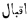
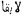

  
[Intangible Textual Heritage](../../index)  [Islam](../index.md) 
[Index](index)  [Previous](spa12)  [Next](spa14.md) 

------------------------------------------------------------------------

[Buy this Book on
Kindle](https://www.amazon.com/exec/obidos/ASIN/B002JTWQM0/internetsacredte.md)

------------------------------------------------------------------------

*Selections from the Poetry of the Afghans*, by H.G. Raverty,
\[1868\], at Intangible Textual Heritage

------------------------------------------------------------------------

p. 251

### THE POEMS

###### OF

## A<u>SH</u>RAF <u>KH</u>ĀN, <u>KH</u>A<u>TT</u>AK.

#### I.

The promise of the kiss, the beloved ever
putteth off for to-morrow;  
Then how can my heart place confidence in a pledge like this?

Whoso is vain enough to depend upon the affairs of the future,  
The wise and sagacious will laugh that foolish man to scorn.

My friend is not acquainted with the deceitfulness of the world;  
Yet still she deceiveth, having, in her heart, naught of truthfulness.

Do not presume to this degree, upon the loveliness of the face:  
Behold the autumn! doth it ever, to the rose, any bloom impart?

Thou, who through arrogance, attest thus falsely towards me;  
Time will pay back unto thee the requital of these deeds of thine.

In the land of association, the appliances of pleasure will be many;  
But the troops of bereavement, full speedily, lay it waste.

Never cast thou thine eyes upon the rose, O nightingale!  
For separation will make those fresh wounds of thine still worse.

But is the nightingale wont, through advice, the rose to forswear?  
No! ’tis the blast of autumn only that separateth them by force!

p. 252

Full many have departed in sorrow, with the hope of to-morrow;  
Then who will place any reliance on life's fidelity to-day?

Thou, who in the hope of existence therefrom, restest in tranquillity  
Doth the empyrean ever any opportunity for continuance allow?

To-day, I perceive the crisis of a contingency on the world impending;  
But the future may make apparent unto it some other event. [\*](#fn_305.md)

The Severed had never beheld Bijāpūr,
even in his dreams; [†](#fn_306.md)  
But, at last, that presenteth itself, which his destiny decreed!

#### II.

When, in the shape of a shield, the hair on the forehead is
plaited [‡](#fn_307.md)  
The roses wreathed therein, impart the intrinsic virtues of the sun.

The live-coal-like ruby in her nose jewel [§](#fn_308.md) is fire itself;  
And the red bulāḳ, [§§](#fn_309.md) like unto a
spark of fire, is placed by its side.

p. 253

The chamkala’ī [\*](#fn_310.md) on her forehead is
hence red with her lover's blood,  
That every jewel therein, for piercing, is like a lancet disposed.

Her eyebrows are a bent bow; her eyelashes, arrows adjusted:  
The ornaments of beauty are sometimes a sword; at others, a dagger made.

The devotee of a hundred years is, with one of her glances undone,  
When she decketh out her beauteous person, and goeth forth.

When she disposeth her flowing tresses in curls about her face,  
To the Ethiop army she accordeth permission, devastation to make.

Her dark eyes she maketh still more black, by the antimony;  
And every eyelash she will make moist in her lover's blood.

Soft and tender tales she telleth, but they are all dissimulation:  
She casteth her enchantments round the heart, by pretexts and pleas.

For her lover, Tartarus and Elysium are ready provided;  
Since the sweet Paradise of conjunction, separation turneth to Hell.

The shadow of love is, undoubtedly, the philosopher's stone;  
Since upon whomever it may be rubbed, his body is turned to gold.

The punishment is death, in the creed of passion's votaries,  
For him, who entereth love's path, and feareth its struggles and strife.

Never let him, at any time, gaze upon the face of the beloved,  
Who may be partial unto life, and for his head may fear.

p. 254

Like unto the inroads the heart-ravishers make my heart upon—  
When do the <u>Kh</u>aibarīs such upon the Mu<u>gh</u>als’ heads ever
make?

The Separated will not, thro’ injustice,
turn his back to the beloved;  
Though she should make his body red with blood all over!

#### III.

With the scar of sorrow, he will his own heart afflict,  
If, on the world's affairs, any one should reliance place.

Do not grow vain of its favour; for all is deception:  
Do not imagine, that, in reality, it benevolence showeth.

When it did not act faithfully with those that have gone,  
Whoever seeketh constancy from it to-day, erreth greatly.

The foundation of all its acts is on injustice based:  
From the age hope not for good faith; for it knoweth it not.

Do not pride thyself on the friendship of that friend,  
Who, in the same breath, in a thousand other places smileth.

I place not an hour's reliance on the permanence of life:  
He is a fool who nourisheth great hopes of immutability.

All those splendid edifices, that thou, in the world, beholdest,  
Cruel destiny, at last, will them to a naked desert turn.

The Separated, in the Dakhan, would not
have a moment stayed;  
But when doth fate ever fulfil our wishes and requests!

#### IV.

What shall I say unto any one regarding the anguish of separation?  
Since it hath not even left within me the power to complain!

p. 255

Since every injury she heapeth upon me is right and lawful;  
At least, let the proud one stand once with face towards me.

The gold bracelets upon her wrists make an amazing display:  
Fit Let them never become broken from the disasters of fate!

For my case, O physician! thou ever showest commiseration—  
Thou sayest, "by antidotes, thou wilt be from thy afflictions relieved."

The diseases of the body thou knowest, without doubt;  
But when is the agony of the heart laid bare unto thee?

<u>Kh</u>a<u>tt</u>ak that I am, with exile I am never content;  
But affection for my friend hath from my kin severed me.

The grief of The Separated shall be
changed into gladness,  
If any one, from the tavern, shall bring wine unto me.

#### V.

Like as absence from the beloved hath made day dark to me,  
Let there never be, unto any one, such a dark and lurid day!

Do not be overjoyed, O marplot! on account of my disjunction;  
For at last, dark and overcast like this, shall be thy day!

Though constancy may grant to no one the opportunity of association,  
The night of separation, at last, shall become the unclouded day!

The spring-time of youth was, than the flowers more pleasant;  
But, alas! it was not so very lasting, the constancy of that day!

Draw near, O friend, and honour me with a sight of thee!  
For the Almighty hath not in the world created an unchanging day!

p. 256

Thou that ever puttest off, for to-morrow, the promise of meeting,  
Consider what phase may be assumed by to-morrow's day!

The day of delight and pleasure hath passed, as the wind, away—  
For how long shall malice on me be vented by trouble's day!

TTruly, it will be, at last, like the wind that hath passed away,  
This, that I now behold—separation's long, dreary day!

The grief and joy of fortune's changes shall not last for aye:  
Verily, O Separated! it shall reach its
end, this oppression's day!

#### VI.

Account as wind or as dust, the world's pains and pleasures:  
The free man is not disquieted, by either its troubles or its cares.

Their coming, and their going, are more speedy than the dawn; [\*](#fn_311.md)  
For I have, myself, experienced the heat and the cold of time.

Show thou no hankering for the fare on the board of fortune;  
For there is not a morsel thereon, free from bitterness and woe.

In a moment it produceth forms and figures of manifold fashions—  
As a mere throw of the dice account the revolutions of fate.

Whoso may plume himself on a lucky turn of good fortune,  
It dealeth him a painful wound, at the moment of exulting thereon.

If, with the eye of understanding, its sorrows and joys be viewed,  
The permanence of their duration is, than that of the flower no more.

p. 257

Turn thy back, O Separated! unto evil;
thy face towards good,  
That, on the Great Day of Assembly, [\*](#fn_312.md) thou mayest not, with fear, be pale.

#### VII.

In love for thee, O never let my heart grow cold  
Like thine, that in perpetrating injustice, never groweth cold!

When will any one a true and sincere lover style me,  
If my heart, in grief for thee, unto constancy turn cold?

No! my heart shall never wax cold unto faithfulness;  
Nor, in this world, will thy nature, unto tyranny grow cold.

Nal, with all his wrongs, did not his back on Daman turn; [†](#fn_313.md)  
Then how can any one's heart now, unto thee turn cold?

What clamour did the unscathed raise on him always;  
Yet the love of Majnūn for his Laylā grew not cold.

Advisers would, unto him, good counsel ever give?  
But no admonitions made Wāmik, unto Æaẓrā cold!

Neither did the world show constancy unto the departed;  
Nor have the souls of the covetous, unto the world grown cold.

My burnt-up heart hath become as fresh at a sight of thee,  
As the seed of sweet basil maketh the heat-stricken cold.

The hope of my meeting hath cooled the fever of absence;  
And the perspiration of recovery always maketh the feverish cold.

p. 258

Even at thy death, The Separated will not
thy love renounce;  
And forsworn is he, if, in life, his heart unto thee turn cold!

#### VIII.

O thou, who pridest thyself on the plenitude of the world's wealth!  
How is it that the condition of thy forefathers restraineth thee not?

Their obvious existence, than that of the flowers hath been less;  
Place then no reliance upon the mere phantasies of the world.

What is it to thee, though the face of the earth be broad?  
But three yards, in its bosom, is all thy portion thereof.

Since, beneath the earth's surface, thy abode is appointed,  
Fruitlessly, upon it, thou buildest thy mansions and thy courts.

Gaiety and enjoyment are intended for the callous and unconscious;  
But sorrow and concern are, wholly, the portion of the enlightened.

The votaries of the world are all tyrants and oppressors;  
From any one of them, of faithfulness, I have never yet heard.

They evince not a particle of shame, even in humanity's name:  
They worry and rend each other, like unto ravenous beasts.

Outwardly, they may practise the appearance of friendship;  
But the heart of every man is filled with opposition and strife.

Those deceptions that the world's sons now-a-day practise,  
Even the fox would not be guilty of such wiles and deceits.

Weep not, though thou shouldst experience adversity's frowns!  
For the evils and afflictions of this transient world shall not endure.

With the true and sincere, O Separated!
love and affection are good;  
But with the deceitful, friendship advantageth not the least.

p. 259

#### IX.

Since I am ever hopeful of meeting thee, either to day or to-morrow,  
Uselessly, in this insane idea, passeth my sweet life away.

With cries and supplications, I seek it to-day, but find it not;  
For the soldiery of separation destroy the period of my joy.

The tree of prosperity yielded not to me the fruit of my desires:  
In wails and lamentations, unjustly, my body I wearied make.

In the beginning, when the tree of affection was created,  
Its innate properties brought forth absence's bitter fruit.

I was wont, unconsciously, to eat of the fruit of separation,  
When, in the garden, I planted affection's tender sprout.

In disjunction, O friends! I perceive no fault whatever:  
The heart, this misfortune permitteth, when acquainted therewith.

With the sword of separation, He cleaveth asunder, at last,  
The heart of him, whom He, of a lovely face, enamoured maketh.

The game of absence, He at that time made so absorbing,  
When, in the world, He thus the mart of affection thronged.

The Separated mentioned not, unto a soul,
the secret of love;  
But, in the alley of his beloved, the world humiliated him.

#### X.

When He, of His omnipotence, first the pen produced,  
The destiny of every one, He then with its tongue [\*](#fn_314.md) wrote down.

p. 260

To-day, at every respiration, that allotment arriveth—  
To the share of some, He joy assigned; to the lot of others, grief.

By strife and contention now, he cannot great become,  
Who, from all eternity, was entered in an inferior degree.

Thro’ the hatred of the envious, never can become crooked—  
The lot of him, which, in the beginning, He made straight.

When doth death seize the skirt of any one, out of season?  
Yet they will not tarry a moment, whose time is fulfilled.

The will of destiny ejected him from the abode of bliss;  
And then it charged unfortunate Adam with the sin.

At the wounds of fortune, O Separated! do
not sigh;  
For God hath, for the stricken, prepared a wondrous salve!

#### XI.

Whoever dwelleth in this abode of calamity and affliction,  
For every one, there is trouble, each according to his case.

I seek after a place of safety, but I am unable to find one;  
The world, to this degree, is so full of misery and woe:

Though fortune may, a thousand joys, on thee bestow,  
With one affliction, it trampleth them all in the dust.

Neither is its most propitious time worthy of rejoicing;  
Nor is its most portentous hour for lamentation befitting.

Be not cast down at its sorrows, for they do not continue;  
And with its pleasures also, do not thou grow overjoyed.

If fortune grant unto thee an interview with a pretty one,  
With the sting of separation, it speedily pierceth thy heart.

p. 261

Prosperity never entereth within the precincts of one's abode,  
Until misery and adversity its companions it maketh.

Good fortune, by its own words, saith, "I am not lasting,"  
If thou shouldst but reverse the letters of that word. [\*](#fn_315.md)

The pigeon of vitality, it bringeth quickly down from its flight,  
When the falcon of destiny spreadeth its pillions to the wind.

It draweth, without pretext, the dragon from the cave:  
From the river it extracteth the fish, weak and paralyzed.

There is no cause for arrogance in life's immutability;  
For it passeth by like the wind, both month and year.

Like a fool, O Separated! do not thou its
slave become;  
For the world's joys and sorrows are a phantom and a dream!

#### XII.

Whoever have fattened on the fleeting wealth of the world,  
The worms of the earth, at last, have become glutted with them!

The world's great ones too, whose history the books relate,  
One after the other have fallen, slaughtered by the knife of death!

Their wealth, lands, and mansions, they have transmitted to others:  
Body by body, they have fallen asleep in the house of the tomb!

Of the empty adulations of the world, they were amazingly vain;  
But they were overcome with regret, when the time of departure came.

p. 262

Seeing that the world showed no constancy to the departed,  
How are those who remain, so ardent, to-day, in its pursuit?

The world is a faithless bride, that destroyeth her husband;  
Hence the wise, for this reason, are to her friendship so cold.

The flowers, that every season bloomed in the garden so sweetly,  
Have likewise, in the autumn, thus been scattered to the winds.

O thou, of vain pleasures so proud! for thy departure prepare!  
Thy cotemporaries have grown weary in looking out for thee!

Behold these graves! say, what wilt thou with gardens do?  
Look upon thy dear friends! observe what they have become!

Bend thy looks upon them—comely youths, and youthful brides!  
Separate from each other, in their graves they have withered away!

By virtuous actions, O Separated! Heaven
is attainable;  
Then never follow in the way of those who have gone astray.

#### XIII.

For the soul's journey, the white steed became saddled in the heart,  
When upon my chin grew white the hair of youthful days.

When the spring-time of youth unto the body bade adieu,  
The black hair waxed silvery in the autumn of old age.

Since the miseries of absence have not reduced them to ashes;  
What! have these bones of my body, all, into iron turned?

Either my good fortune, fallen asleep, giveth me no aid,  
Or the rulers of the present age have stony-hearted grown.

Whereas the heads thereof make no impression on their bodies,  
On their armour must have broken the arrows of my sighs.

p. 263

Sorrow, to this degree, causeth the blood from mine eyes to flow,  
That the garments of my body have become tinged therefrom.

Behold the state of my eyeballs, by separation caused!  
They have assumed the appearance of red roses within the parterre!

Though in the heart it may not have fallen, woe's seed sprouteth,  
When, by the plough of disjunction, its ground-plot may be turned.

Would, O Separated! that absence were, in
the world, unknown;  
For from its inroads have become desolate the people thereof!

#### XIV.

Of the pangs of separation I became deserving that day,  
When, weeping and sobbing, from my love I was severed.

At that time, for my life, in tears of blood I mourned,  
When, turning my back upon A<u>tt</u>ak, I weeping began.

How shall I now pine after the rocks and shrubs of my country?  
For, having made my parting salutation, I bade them farewell.

Embedded in my heart, from Roh [\*](#fn_316.md) an
arrow I brought away—  
I failed to bid adieu to my bower, or its sacrifice to become. [†](#fn_317.md)

With much toil, in the world I had a garden laid out;  
And, as yet, I had not smelt a flower, when from it I was torn.

The blue heavens laughed from delight until they grew red,  
When facing Ho<u>dd</u>aey's mountain [‡](#fn_318.md) I turned from it away.

There is no magician in the Dakhan that can charm me;  
For I am a prisoner become, in a dragon's cavern profound.

p. 264

The assignment of union was hung on the horns of the deer, [\*](#fn_319.md)  
When I crossed to the other bank of Narbada's swift stream. [†](#fn_320.md)

The riches of association were a hoard that I gloated over;  
But in absence's wars, I have to a mere thread and fibre changed.

How shall I, to-day, complain of bereavement unto any one?  
I, myself, made a purchase of sorrow, when I a lover became.

The vast dust of separation hath hidden happiness from me—  
I am utterly weary grown at the noise of summoning it back.

I, <u>Kh</u>a<u>tt</u>ak, call unto my
beloved, but she is not forthcoming:  
Mortified and despairing thereat, I have become wedded unto woe!

#### XV.

Come, my love! let us, in one home, our abode take up;  
And from our minds dismiss all long and lingering hope!

Hand in hand we will saunter about; for such is fortunate:  
It is not advisable that to-day's inclinations we for to-morrow defer.

From all eternity, revolving fortune is cruel and unjust:  
It is a fallacy if we, to-day, nourish a hope of its constancy.

We were many friends, like unto a flock, gathered together,  
When the wolf of separation, by violence, tore us from each other away.

p. 265

Our dear, dear friends have from the world departed:  
How long then shall we exist in this sublunary sphere?

How can any one the hope of joy and happiness entertain?  
For He brought us into this abode, grief and misery to endure!

Living, O friend! The Separated would not
have left thee;  
But ’tis the king's tyranny that hath, by force, parted us! [\*](#fn_321.md)

#### XVI.

The wise, for this reason, unto the world's affairs will be cold;  
That all its griefs are like the blast, and like the dust its joys.

Do not, O Darwe<u>sh</u>! false account my sorrow and my sighs;  
For, at that time, the eyes will weep, when the heart may aching be.

The head of courage will not bow for the sake of throne and crown;  
When the man, of spirit free, may know what the world's gifts are.

That man, who may traffic in perfidiousness, and in iniquity,  
Will be pale and ghastly, when he entereth the assembly of the just.

In the estimation of the wise, even worse than the ox they are,  
Who may be constantly overwhelmed in gluttony's cares.

The revolving heavens are a mill, and man the grain therein:  
He is no sooner in the world, than he will into meal be ground.

It is out of the question altogether, that in Pu<u>s’h</u>to any other
bard,  
Shall, like The Separated, so unrivalled,
in the art poetic be.

p. 266

#### XVII.

Completely false and lying are they all, from first to last,  
Who are gathered around the table of the transient world!

The universe is like unto the shop of the sweetmeat-seller:  
Account its resorters nothing else but the flies that they are!

The degree of affection, that the flies in that quarter bestow,  
Is according to the quality of the sweets therein contained.

Place no reliance soever upon the mere display of their sincerity:  
Falsely, they deception practise: they are their own weal's friends!

In the day of prosperity, of constancy, they ever make boast;  
But when a slight disaster occurreth, they all take to flight.

The heart's eyes, for its own objects, show sycophancy to the tongue;  
Then do not pride thyself on their oaths; for all are knaves.

Should they become aware of a good friend's affliction,  
Their tongues cry, "Dear! dear!" but they exult in their hearts.

Hope not, in this world, to find a friend, sincere and true;  
For the sons of the present day are hypocrites and rogues.

There is neither love, nor affection, nor friendship in them:  
By some craft they acquire; for they are all the loaf's slaves.

The world's interests and profits are their object, and these they
pursue:  
They are neither stedfast on faith's path, nor infidels are they.

Like as they plot against the very heart's blood of one another,  
In hatching each other's ruin are wolves ever thus occupied?

p. 267

As yet, the day of doom hath not been viewed by human eye;  
But its operations [\*](#fn_322.md) I, to-day,
perceive; since all are for themselves.

Never yet have I found, in any one, either fidelity or truth;  
Whether it be in brethren or kinsmen, in relations or friends!

Since I, The Separated, became acquainted
with its secrets,  
I find the world hath countless women, and but few, few men!

------------------------------------------------------------------------

### Footnotes

[252:\*](spa13.htm#fr_305.md) The poet here
appears to refer to some chance of release from captivity.

[252:†](spa13.htm#fr_306.md) Bijāpūr, the name of
the fortress in which he was confined.

[252:‡](spa13.htm#fr_307.md) This refers to a
custom prevalent amongst all the Af<u>gh</u>ān tribes in the days of the
poet, and still observed by the <u>Gh</u>alzīs and other tribes of
Central Af<u>gh</u>ānistān, of plaiting the front hair of young girls,
from about eight years of age until the day of marriage, in a round
plait about the size of a small saucer, which is allowed to hang down in
front, and often reaches to the tip of the nose, but not covering the
eyes, thus acting the part of a mask. On the marriage-day it is opened
and plaited in the ordinary way. A picture containing a girl wearing the
hair in this manner will be found in Captain L.
W. Hart's work of "Sketches of Afghan
Costume," lithographed by Haghe.

[252:§](spa13.htm#fr_308.md) An ornament worn by
women in the left nostril.

[252:§§](spa13.htm#fr_309.md) A ring of gold worn
in the cartilage of the nose.

[253:\*](spa13.htm#fr_310.md) An ornament for the
forehead. These names are Indian, not Af<u>gh</u>ān; but Af<u>gh</u>āns
bordering on the Panjāb and India have borrowed these terms and
ornaments from the people of those parts.

[256:\*](spa13.htm#fr_311.md) The coming and
departure of day is very rapid in the East, there being but little
twilight.

[257:\*](spa13.htm#fr_312.md) The resurrection.

[257:†](spa13.htm#fr_313.md) The names Nal and
Daman, Wāmik and Æaẓrā, Majnūn and Laylā, are those of lovers,
celebrated in Eastern poetry.

[259:\*](spa13.htm#fr_314.md) The nib of the pen.

[261:\*](spa13.htm#fr_315.md) This very pretty
idea of the poet's is a play upon the Arabic word   *ik-bāl*, signifying, 'good
fortune,' which, if read backwards, becomes 
 *lā-bakā*, meaning, 'without stability or
permanence.'

[263:\*](spa13.htm#fr_316.md) Roh is the name
applied to the Af<u>gh</u>ān countries generally; hence the name of
Rohilahs, by which the Af<u>gh</u>āns are sometimes distinguished.

[263:†](spa13.htm#fr_317.md) See third note at
page [139](spa09.htm#page_139.md).

[263:‡](spa13.htm#fr_318.md) See third note at
page [247](spa11.htm#page_247.md).

[264:\*](spa13.htm#fr_319.md) Referring to the
custom of Eastern governments, of granting assignments on persons or
revenues of villages, for payment of money. An assignment on a deer's
horns is a proverb, with reference to any impracticable, or very
difficult matter next to impossible, it being first necessary to catch
your deer.

[264:†](spa13.htm#fr_320.md) A river of Central
India.

[265:\*](spa13.htm#fr_321.md) Referring to his
captivity in India.

[267:\*](spa13.htm#fr_322.md) All ties will then
be broken; for all will be so much occupied with their own affairs and
interests, that they will pay no attention to others, however dear they
may have been in this world.

------------------------------------------------------------------------

[Next: Introduction](spa14.md)
