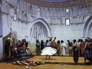

  
[Intangible Textual Heritage](../../index)  [Islam](../index) 
[Index](index)  [Previous](srg09)  [Next](srg11) 

------------------------------------------------------------------------

[Buy this Book on
Kindle](https://www.amazon.com/exec/obidos/ASIN/B002KKCSCQ/internetsacredte)

------------------------------------------------------------------------

  
*The Secret Rose Garden*, by Florence Lederer, \[1920\], at Intangible
Textual Heritage

------------------------------------------------------------------------

p. 50

# PART VI

## REFLECTIONS

### SUN-REFLECTIONS

SUN-REFLECTIONS from the unseen world  
Are all the objects of this mortal sphere,  
As curl, down, mole, and brow on a fair face.  
For Beauty absolute reigns over all.

. . . When the ears first hear these words  
They seem to denote sensual objects.  
But as there is no language for the Infinite,  
How can we express its mysteries  
In finite words?  
Or how can the visions of the ecstatic  
Be described in earthly formula?  
So mystics veil their meanings  
In these shadows of the unseen,  
The objects of the senses.

. . . As a nurse to an infant,  
So is the Infinite to the finite.

p. 51

. . . Once these words were used in their proper sense,  
But now are concealed lest the vulgar should profane.

Annihilation, intoxication, the fever of love  
Are the three states of the mystic,  
And those who abide in these states  
At once comprehend the meanings  
Veiled in the words.  
But if you know them not,  
Pretend not you understand like an ignorant infidel,  
For all cannot be mystics or grasp the mysteries.  
No mere illusions are the mystic's dreams,  
And a man of truth does not vainly talk.  
To comprehend requires revelations or great faith.

Briefly have I explained these words and their meanings  
So that you may apply them in their right intent,  
Remembering the attributes of each.  
Compare them in a right manner,  
And refrain from the wrong comparisons.

Now that these rules are understood  
I will show you more of their application.

p. 52

### THE MIRROR

YOUR eye has not strength enough  
To gaze at the burning sun,  
But you can see its brilliant light  
By watching its reflection  
Mirrored in the water.

So the reflection of Absolute Being  
Can be viewed in this mirror of Not-Being,  
For non-existence, being opposite Reality,  
Instantly catches its reflection.

Know the world from end to end is a mirror;  
In each atom a hundred suns are concealed.  
If you pierce the heart of a single drop of water,  
From it will flow a hundred clear oceans;  
If you look intently at each speck of dust,  
In it you will see a thousand beings,  
A gnat in its limbs is like an elephant;  
In name a drop of water resembles the Nile,  
In the heart of a barley-corn is stored an hundred harvests,  
Within a millet-seed a world exists,  
In an insect's wing is an ocean of life,

p. 53

A heaven is concealed in the pupil of an eye,  
The core in the centre of the heart is small,  
Yet the Lord of both worlds will enter there.

### EVIL

BLACKEN the back of a mirror  
And it will reflect your face,  
So the dust of the earth reflects  
The rays of the sun in the seventh heaven.

### THE REFLECTION IN THE MIRROR

HOLD up a mirror before you  
And gaze on that other person.

. . . Again look and consider;  
Your proper self is here, not there.  
What, then, can be this reflection,  
This shadow of your face?

In the same way as light and dark are not connected,  
Being is not joined to Not-Being.

------------------------------------------------------------------------

[Next: Part VII. Divine Inebriation](srg11)

