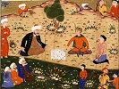

  
[Intangible Textual Heritage](../../index)  [Islam](../index.md)  [Wisdom
of the East](../../woe/index)  [Index](index)  [Previous](ssw15.md) 
[Next](ssw17.md) 

------------------------------------------------------------------------

  
*Sadi's Scroll of Wisdom*, by Arthur N. Wollaston, \[1906\], at
Intangible Textual Heritage

------------------------------------------------------------------------

### DESCRIPTION OF CONTENTMENT

O soul! if thou acquirest contentment,  
Thou wilt exercise sway in the kingdom of repose.  
If thou art pinched with the trials of poverty,  
Then, in the estimation of the wise, wealth is nought.  
The poor man is not disgraced by poverty,  
For mankind attain glory from penury. p. 44  
Gold and silver are the glory of the rich,  
But the poor have inward repose.  
Be not distressed if thou art not wealthy,  
Since a sovereign cannot extract taxes from the desolate.  
In all circumstances contentment is preferable.  
Whoever is born under a lucky star is happy.  
Enlighten thy soul with the radiance of contentment,  
If thou hast any token of good fortune.

------------------------------------------------------------------------

[Next: In Condemnation of Avarice](ssw17.md)

