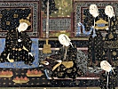

  
[Intangible Textual Heritage](../../index)  [Islam](../index) 
[Index](index)  [Previous](taa15)  [Next](taa17) 

------------------------------------------------------------------------

  
*The Tarjuman al-Ashwaq*, by Ibn al-Arabi, tr. Reynold A. Nicholson,
\[1911\], at Intangible Textual Heritage

------------------------------------------------------------------------

### XIII

1\. A ringdove wailed and a sad lover complained, and he was grieved by
her trilling note and complaint.

2\. Tears flowed from their eyes in distress for her complaint, and
’twas as tho’ they (the tears) were fountains.

3\. I responded to her in the bereavement caused by the loss of her only
child: one who loses an only child is bereaved indeed.

4\. I responded to her, while Grief walked between us; she was
invisible, but I was clearly seen.

5\. In me is a burning desire, from love of the sandy tract of ‘Álij,
where her tents are and the large-eyed maidens,

6\. With murderous glances, languishing: their eyelids are sheaths for
glances like swords.

7\. I did not cease to swallow the tears proceeding from my malady and
to conceal and guard my passion from those who blame me,

8\. Until, when the raven's croak announced their departure, separation
exposed the desire of a sorrow-stricken lover.

p. 73

9\. They journeyed continuously through the night, they cut the
nose-rings of their camels, so that they (the camels) moaned and cried
under the litters.

10\. I beheld the pangs of death at the time when they loosed the
camels’ reins and tied their saddle-girths.

11\. Oh! separation together with love's pain is mortal, but love's
sorest pain together with meeting is light.

12\. None blames me for desiring her, for she is beloved and beautiful
wherever she may be.

#### COMMENTARY

1\. 'A ringdove,' i.e. the Universal Spirit, born of God and breathed
into Man. She is described as having a collar (ring), in reference to
the covenant which He laid upon her.

'A sad lover,' i.e. the partial spirit which is in Man.

'Her trilling note,' i.e. the sweet melodies calling him to union with
her. This union is the first resurrection at death (\#\#\#).

2\. 'From their eyes': he refers to the partial spirits (\#\#\#). 'Her
complaint': the Universal Spirit, which is the father of the partial
spirits, longs for them even more than they long for her.

3\. 'Her only child,' i.e. the special quality which distinguishes her
from all things else, viz. her unity (\#\#\#), whereby she knows the
unity of Him who brought her into being. The loss of it consists in her
not knowing what it is and in its not being plainly discerned by her.

4\. 'She was invisible,' for she does not belong to the world of
expression and exposition.

5\. 'The sandy tract of ‘Álij,' i.e. the subtleties of the acquired or
analytic sciences. ‘Álij refers to the striving after good works
(\#\#\#).

'Her tents,' the veils which conceal these sciences.

'The large-eyed maidens,' i.e. the sciences which descend upon the
solitary recluse.

6\. 'With murderous glances,' i.e. they cause him to pass away from his
own personality.

p. 74

'Languishing,' i.e. they incline towards the solitary. The term
'glances' indicates that they are sciences of contemplation and
revelation, not of faith and mystery, and that they proceed from the
manifestation of forms.

7\. He refers to a state of concealment which is characteristic of the
Malámatís. [1](#fn_22)

9\. 'They journeyed continuously': since the object sought is infinite,
the return from it is also a journey towards it. There is no migration
except from one Divine Name to another.

'They cut the nose-rings of their camels,' on account of the violent
haste with which they travelled.

11\. 'Meeting,' a kind of presence (\#\#\#) in which there is no passing
away (\#\#\#).

12\. He says, 'The aspirations and desires of all seekers are attached
to Her, yet She is essentially unknown to them hence they all love Her,
yet none blames another for loving Her. Similarly, every individual soul
and the adherents of every religion seek salvation, but since they do
not know it they are also ignorant of the way that leads to it, though
everyone believes that he is on the right way. All strife between people
of different religions and sects is about the way that leads to
salvation, not about salvation itself. If anyone knew that he was taking
the wrong way, he would not persevere in his error.' Accordingly the
author says that She manifests Herself everywhere, like the sun, and
that every person who beholds Her deems that She is with him in Her
essence, so that envy and jealousy are removed from their hearts.

------------------------------------------------------------------------

### Footnotes

[74:1](taa16.htm#fr_22) A Ṣúfí sect or school
who emphasized the need of incurring blame (*malámat*) for God's sake
and of concealing spiritual merit, lest they should fall into
self-conceit. See my translation of the *Kashf al-Maḥjúb*, pp. 62-9.

------------------------------------------------------------------------

[Next: XIV](taa17)

