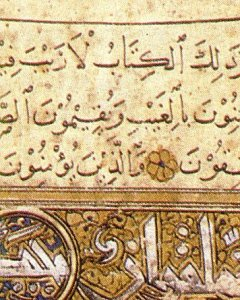

  
[Intangible Textual Heritage](../../index)  [Islam](../index)   
[Hypertext Quran](../htq/index)  [Pickthall](../pick/index)  [Palmer
Part I (SBE06)](../sbe06/index)  [Palmer Part II
(SBE09)](../sbe09/index)  [Yusuf Ali/Arabic](../quran/index)  [Yusuf Ali
English](../yaq/index)  [Rodwell](../qr/index)   

------------------------------------------------------------------------

<table width="75%">
<colgroup>
<col style="width: 50%" />
<col style="width: 50%" />
</colgroup>
<tbody>
<tr class="odd">
<td width="50%" data-valign="TOP"></td>
<td width="50%" data-valign="CENTER"><h1 id="unicode-quran" data-align="CENTER">Unicode Qur'an</h1></td>
</tr>
</tbody>
</table>

------------------------------------------------------------------------

This is the Qur'an in Arabic, presented using Unicode.

The Unicode Arabic is displayed in parallel with a transliteration into
modified International Phonetic Alphabet (IPA). The IPA transliteration
is *not* a [pronunciation guide](../quran/index). Rather, it is a
mechanical conversion of the Arabic, letter by letter, into equivalent
IPA characters. Alef is transliterated by a single quote; double letters
are indicated by a following colon (:), some Arabic letters do not have
any equivalent in the transliteration. The system used is documented in
the [Transliteration table](xlit). Note that since the transliteration
is not exactly one-to-one, the Arabic text should be treated as primary,
and the transliteration as a study aid. The file titles, which do not
have any vowels in them, are also transliterated automatically using the
same system.

If you have problems viewing the Unicode Arabic, please refer to the
Intangible Textual Heritage [Unicode page](../../unicode). Note that not
all Unicode fonts will display this text completely. We have found that
Code 2000 displays some of the Arabic characters as boxes: the Microsoft
Arial Unicode MS font, on the other hand, seems to be able to display
all of the characters used in this text. Since Unicode support for
Arabic is still evolving, we also have [a version of the Quran in Arabic
which uses GIF files](../quran/index) to display the Arabic text.

------------------------------------------------------------------------

[Transliteration Table](xlit)  
[1. ‏الفاتحة‎ 'lf'tḥt](001)  
[2. ‏البقرة‎ 'lbqrt](002)  
[3. ‏آل عمران‎ 'ʔl ʕmr'n](003)  
[4. ‏النساء‎ 'lns'ʔ](004)  
[5. ‏المائدة‎ 'lm'yʔdt](005)  
[6. ‏الأنعام‎ 'l'ʔnʕ'm](006)  
[7. ‏الأعراف‎ 'l'ʔʕr'f](007)  
[8. ‏الأنفال‎ 'l'ʔnf'l](008)  
[9. ‏التوبة‎ 'ltwbt](009)  
[10. ‏يونس‎ ywns](010)  
[11. ‏هود‎ hwd](011)  
[12. ‏يوسف‎ ywsf](012)  
[13. ‏الرعد‎ 'lrʕd](013)  
[14. ‏إبراهيم‎ 'ʔbr'hym](014)  
[15. ‏الحجر‎ 'lḥjr](015)  
[16. ‏النحل‎ 'lnḥl](016)  
[17. ‏الإسراء‎ 'l'ʔsr'ʔ](017)  
[18. ‏الكهف‎ 'lkhf](018)  
[19. ‏مريم‎ mrym](019)  
[20. ‏طه‎ ṭh](020)  
[21. ‏الأنبياء‎ 'l'ʔnby'ʔ](021)  
[22. ‏الحج‎ 'lḥj](022)  
[23. ‏المؤمنون‎ 'lmwʔmnwn](023)  
[24. ‏النور‎ 'lnwr](024)  
[25. ‏الفرقان‎ 'lfrq'n](025)  
[26. ‏الشعراء‎ 'lʃʕr'ʔ](026)  
[27. ‏النمل‎ 'lnml](027)  
[28. ‏القصص‎ 'lqṣṣ](028)  
[29. ‏العنكبوت‎ 'lʕnkbwt](029)  
[30. ‏الروم‎ 'lrwm](030)  
[31. ‏لقمان‎ lqm'n](031)  
[32. ‏السجدة‎ 'lsjdt](032)  
[33. ‏الأحزاب‎ 'l'ʔḥz'b](033)  
[34. ‏سبأ‎ sb'ʔ](034)  
[35. ‏فاطر‎ f'ṭr](035)  
[36. ‏يس‎ ys](036)  
[37. ‏الصافات‎ 'lṣ'f't](037)  
[38. ‏ص‎ ṣ](038)  
[39. ‏الزمر‎ 'lzmr](039)  
[40. ‏غافر‎ ɣ'fr](040)  
[41. ‏فصلت‎ fṣlt](041)  
[42. ‏الشورى‎ 'lʃwry](042)  
[43. ‏الزخرف‎ 'lzxrf](043)  
[44. ‏الدخان‎ 'ldx'n](044)  
[45. ‏الجاثية‎ 'lj'θyt](045)  
[46. ‏الأحقاف‎ 'l'ʔḥq'f](046)  
[47. ‏محمد‎ mḥmd](047)  
[48. ‏الفتح‎ 'lftḥ](048)  
[49. ‏الحجرات‎ 'lḥjr't](049)  
[50. ‏ق‎ q](050)  
[51. ‏الذاريات‎ 'lð'ry't](051)  
[52. ‏الطور‎ 'lṭwr](052)  
[53. ‏النجم‎ 'lnjm](053)  
[54. ‏القمر‎ 'lqmr](054)  
[55. ‏الرحمن‎ 'lrḥmn](055)  
[56. ‏الواقعة‎ 'lw'qʕt](056)  
[57. ‏الحديد‎ 'lḥdyd](057)  
[58. ‏المجادلة‎ 'lmj'dlt](058)  
[59. ‏الحشر‎ 'lḥʃr](059)  
[60. ‏الممتحنة‎ 'lmmtḥnt](060)  
[61. ‏الصف‎ 'lṣf](061)  
[62. ‏الجمعة‎ 'ljmʕt](062)  
[63. ‏المنافقون‎ 'lmn'fqwn](063)  
[64. ‏التغابن‎ 'ltɣ'bn](064)  
[65. ‏الطلاق‎ 'lṭl'q](065)  
[66. ‏التحريم‎ 'ltḥrym](066)  
[67. ‏الملك‎ 'lmlk](067)  
[68. ‏القلم‎ 'lqlm](068)  
[69. ‏الحاقة‎ 'lḥ'qt](069)  
[70. ‏المعارج‎ 'lmʕ'rj](070)  
[71. ‏نوح‎ nwḥ](071)  
[72. ‏الجن‎ 'ljn](072)  
[73. ‏المزمل‎ 'lmzml](073)  
[74. ‏المدثر‎ 'lmdθr](074)  
[75. ‏القيامة‎ 'lqy'mt](075)  
[76. ‏الإنسان‎ 'l'ʔns'n](076)  
[77. ‏المرسلات‎ 'lmrsl't](077)  
[78. ‏النبأ‎ 'lnb'ʔ](078)  
[79. ‏النازعات‎ 'ln'zʕ't](079)  
[80. ‏عبس‎ ʕbs](080)  
[81. ‏التكوير‎ 'ltkwyr](081)  
[82. ‏الإنفطار‎ 'l'ʔnfṭ'r](082)  
[83. ‏المطففين‎ 'lmṭffyn](083)  
[84. ‏الإنشقاق‎ 'l'ʔnʃq'q](084)  
[85. ‏البروج‎ 'lbrwj](085)  
[86. ‏الطارق‎ 'lṭ'rq](086)  
[87. ‏الأعلى‎ 'l'ʔʕly](087)  
[88. ‏الغاشية‎ 'lɣ'ʃyt](088)  
[89. ‏الفجر‎ 'lfjr](089)  
[90. ‏البلد‎ 'lbld](090)  
[91. ‏الشمس‎ 'lʃms](091)  
[92. ‏الليل‎ 'llyl](092)  
[93. ‏الضحى‎ 'lḍḥy](093)  
[94. ‏الشرح‎ 'lʃrḥ](094)  
[95. ‏التين‎ 'ltyn](095)  
[96. ‏العلق‎ 'lʕlq](096)  
[97. ‏القدر‎ 'lqdr](097)  
[98. ‏البينة‎ 'lbynt](098)  
[99. ‏الزلزلة‎ 'lzlzlt](099)  
[100. ‏العاديات‎ 'lʕ'dy't](100)  
[101. ‏القارعة‎ 'lq'rʕt](101)  
[102. ‏التكاثر‎ 'ltk'θr](102)  
[103. ‏العصر‎ 'lʕṣr](103)  
[104. ‏الهمزة‎ 'lhmzt](104)  
[105. ‏الفيل‎ 'lfyl](105)  
[106. ‏قريش‎ qryʃ](106)  
[107. ‏الماعون‎ 'lm'ʕwn](107)  
[108. ‏الكوثر‎ 'lkwθr](108)  
[109. ‏الكافرون‎ 'lk'frwn](109)  
[110. ‏النصر‎ 'lnṣr](110)  
[111. ‏المسد‎ 'lmsd](111)  
[112. ‏الإخلاص‎ 'l'ʔxl'ṣ](112)  
[113. ‏الفلق‎ 'lflq](113)  
[114. ‏الناس‎ 'ln's](114)  
