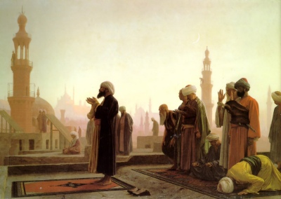

  
[Intangible Textual Heritage](../../index)  [Islam](../index.md)   
[Hypertext Quran](../htq/index)  [Unicode Quran](../uq/index.md) 
[Pickthall](../pick/index)  [Palmer Part I (SBE06)](../sbe06/index.md) 
[Palmer Part II (SBE09)](../sbe09/index.md)  [Yusuf
Ali/Arabic](../quran/index)  [Rodwell](../qr/index.md)   

------------------------------------------------------------------------

<table width="75%">
<colgroup>
<col style="width: 50%" />
<col style="width: 50%" />
</colgroup>
<tbody>
<tr class="odd">
<td width="50%" data-valign="TOP"></td>
<td width="50%" data-valign="CENTER"><h1 id="the-holy-quran" data-align="CENTER">The Holy Quran</h1>
<h2 id="tr.-by-yusuf-ali" data-align="CENTER">tr. by Yusuf Ali</h2>
<h4 id="section" data-align="CENTER">[1934]</h4></td>
</tr>
</tbody>
</table>

------------------------------------------------------------------------

[Contents](#contents)    [Start Reading](yaq000.md)    [Page
Index](pageidx)    [Text \[Zipped\]](yaq.txt.gz.md)

------------------------------------------------------------------------

This is the text of Yusuf Ali's English translation of the Quran. This
etext was produced in 2009-10 at Intangible Textual Heritage from a
reproduction of the 1934 edition. Omitted here are the Arabic text, the
extensive versified commentary, footnotes and other apparatus. A version
which includes Yusuf Ali's English translation, the Arabic text in gif
format and a pronunciation guide is available [here](../quran/index.md).
The etext is broken down into one file per Surah. Per our site policy,
no alterations were made to the source text; we welcome notice of
transliteration errors.--Jan. 29, 2010.

Production notes: Yusuf Ali used a slightly different verse numbering
for Surah 5 than most other editions. We have correlated the verse
numbers in Surah 5 with the traditional system, leaving the book's
original verse numbers in marginal notes. Verse numbering is not
considered a canonical feature of the text.

------------------------------------------------------------------------

 [Title Page](yaq000.md)  
[Sūra I. Fātiḥa, or the Opening Chapter](yaq001.md)  
[Sūra II. Baqara, or the Heifer](yaq002.md)  
[Sūra III. Āl-i-’Imrān, or The Family of ’Imrān](yaq003.md)  
[Sūra IV. Nisāa, or The Women](yaq004.md)  
[Sūra V. Māïda, or The Table Spread.](yaq005.md)  
[Sūra VI. An’ām, or Cattle](yaq006.md)  
[Sūra VII. A’rāf, or the Heights](yaq007.md)  
[Sūra VIII. Anfāl, or the Spoils of War](yaq008.md)  
[Sūra IX. Tauba (Repentance) or Barāat (Immunity)](yaq009.md)  
[Sūra X. Yūnus, or Jonah](yaq010.md)  
[Sūra XI. Hūd (The Prophet Hūd)](yaq011.md)  
[Sūra XII. Yūsuf, or Joseph](yaq012.md)  
[Sūra XIII. Ra’d or Thunder](yaq013.md)  
[Sūra XIV. Ibrāhīm, or Abraham](yaq014.md)  
[Sūra XV. Al-Hijr. or The Rocky Tract](yaq015.md)  
[Sūra XVI. Naḥl or The Bee](yaq016.md)  
[Sūra XVII. Banī Isrā-īl, or the Children of Israel.](yaq017.md)  
[Sūra XVIII. Kahf, or the Cave](yaq018.md)  
[Sūra XIX. Maryam, or Mary.](yaq019.md)  
[Sūra XX. Ṭā-Hā (Mystic Letters, Ṭ. H.)](yaq020.md)  
[Sūra XXI. Anbiyāa, or The Prophets](yaq021.md)  
[Sūra XXII. Ḥajj, or The Pilgrimage](yaq022.md)  
[Sūra XXIII. Mū-minūn](yaq023.md)  
[Sūra XXIV. Nūr, or Light](yaq024.md)  
[Sūra XXV. Furqān, or The Criterion](yaq025.md)  
[Sūra XXVI. Shu‘arāa, or The Poets](yaq026.md)  
[Sūra XXVII. Naml, or the Ants](yaq027.md)  
[Sūra XXVIII. Qaṣaṣ, or the Narration](yaq028.md)  
[Sūra XXIX. ‘Ankabūt, or the Spider](yaq029.md)  
[Sūra XXX. Rūm, or The Roman Empire.](yaq030.md)  
[Sūra XXXI. Luqmān (the Wise).](yaq031.md)  
[Sūra XXXII. Sajda, or Adoration](yaq032.md)  
[Sūra XXXIII. Aḥzāb, or The Confederates.](yaq033.md)  
[Sūra XXXIV. Sabā, or the City of Sabā](yaq034.md)  
[Sūra XXXV. Fāṭir, or The Originator of Creation; or Malāïka, or The
Angels](yaq035.md)  
[Sūra XXXVI. Yā-Sīn (being Abbreviated Letters).](yaq036.md)  
[Sūra XXXVII. Ṣāffāt, or Those Ranged in Ranks.](yaq037.md)  
[Sūra XXXVIII. Ṣād (being one of the Abbreviated Letters)](yaq038.md)  
[Sūra XXXIX.: Zumar, or the Crowds.](yaq039.md)  
[Sūra XL. Mū-min, or The Believer](yaq040.md)  
[Sūra XLI. Hā-mīm (Abbreviated Letters), or Ḥā-Mīm Sajda, or
Fuṣṣilat](yaq041.md)  
[Sūra XLII. Shūrā, or Consultation](yaq042.md)  
[Sūra XLIII.: Zu<u>kh</u>ruf, or Gold Adornments.](yaq043.md)  
[Sūra XLIV.: Du<u>kh</u>ān, or Smoke (or Mist).](yaq044.md)  
[Sūra XLV. Ja<u>th</u>iya, or Bowing the Knee.](yaq045.md)  
[Sūra XLVI.: Aḥqāf, or Winding Sand-tracts.](yaq046.md)  
[Sūra XLVII. Muḥammad (the Prophet).](yaq047.md)  
[Sūra XLVIII. Fat-ḥ or Victory.](yaq048.md)  
[Sūra XLIX. Ḥujurāt, or the Inner Apartments.](yaq049.md)  
[Sūra L. Qāf.](yaq050.md)  
[Sūra LI. Zāriyāt, or the Winds That Scatter.](yaq051.md)  
[Sūra LII. Ṭūr, or the Mount.](yaq052.md)  
[Sūra LIII. Najm, or the Star.](yaq053.md)  
[Sūra LIV. Qamar, or the Moon.](yaq054.md)  
[Sūra LV. Raḥmān, or (God) Most Gracious.](yaq055.md)  
[Sūra LVI. Wāqi‘a, or The Inevitable Event.](yaq056.md)  
[Sūra LVII. Ḥadīd, or Iron.](yaq057.md)  
[Sūra LVIII. Mujādila, or The Woman who Pleads.](yaq058.md)  
[Sūra LIX. Ḥa<u>sh</u>r, or the Gathering](yaq059.md)  
[Sūra LX. Mumtaḥana, or the Woman to be Examined.](yaq060.md)  
[Sūra LXI. Ṣaff, or Battle Array.](yaq061.md)  
[Sūra LXII. Jumu‘a, or the Assembly (Friday) Prayer](yaq062.md)  
[Sūra LXIII. Munāfiqūn, or the Hypocrites.](yaq063.md)  
[Sūra LXIV. Tagābun, or Mutual Loss and Gain.](yaq064.md)  
[Sūra LXV. Ṭalāq, or Divorce.](yaq065.md)  
[Sūra LXVI. Taḥrīm, or Holding (something) to be Forbidden.](yaq066.md)  
[Sūra LXVII. Mulk, or Dominion.](yaq067.md)  
[Sūra LXVIII. Qalam, or the Pen, or Nūn](yaq068.md)  
[Sūra LXIX. Ḥāqqa, or the Sure Reality.](yaq069.md)  
[Sūra LXX. Ma‘ārij, or the Ways of Ascent.](yaq070.md)  
[Sūra LXXI. Nūḥ, or Noah.](yaq071.md)  
[Sūra LXXII. Jinn, or the Spirits.](yaq072.md)  
[Sūra LXXIII. Muzzammil, or Folded in Garments.](yaq073.md)  
[Sūra LXXIV. Muddaththir, or One Wrapped Up.](yaq074.md)  
[Sūra LXXV. Qiyāmat, or the Resurrection.](yaq075.md)  
[Sūra LXXVI. Dahr, or Time, or Insān, or Man.](yaq076.md)  
[Sūra LXXVII. Mursalāt, or Those Sent Forth](yaq077.md)  
[Sūra LXXVIII. Nabaa, or The (Great) News](yaq078.md)  
[Sūra LXXIX. Nāzi’āt, or Those Who Tear Out.](yaq079.md)  
[Sūra LXXX. ’Abasa. or He Frowned.](yaq080.md)  
[Sūra LXXXI. Takwīr, or the Folding Up.](yaq081.md)  
[Sūra LXXXII. Infiṭār, or The Cleaving Asunder.](yaq082.md)  
[Sūra LXXXIII. Taṭfīf, or Dealing in Fraud.](yaq083.md)  
[Sūra LXXXIV. Inshiqāq, or The Rending Asunder.](yaq084.md)  
[Sūra LXXXV. Burūj, or The Zodiacal Signs](yaq085.md)  
[Sūra LXXXVI. Ṭāriq, or The Night-Visitant](yaq086.md)  
[Sūra LXXXVII. A’lā, or the Most High.](yaq087.md)  
[Sūra LXXXVIII. <u>G</u>āshiya, or the Overwhelming Event.](yaq088.md)  
[Sūra LXXXIX. Fajr, or the Break of Day.](yaq089.md)  
[Sūra XC. Balad, or The City](yaq090.md)  
[Sūra XCI. Shams, or The Sun.](yaq091.md)  
[Sūra XCII. Lail, or The Night.](yaq092.md)  
[Sūra XCIII. Dhuhā, or The Glorious morning Light.](yaq093.md)  
[Sūra XCIV. Inshirāḥ, or The Expansion.](yaq094.md)  
[Sūra XCV. Tīn, or The Fig](yaq095.md)  
[Sūra XCVI. Iqraa, or Read! or Proclaim! Or ’Alaq, or The Clot of
Congealed Blood](yaq096.md)  
[Sūra XCVII. Qadr, or The Night of Power (or Honour).](yaq097.md)  
[Sūra XCVIII. Baiyina, or The Clear Evidence.](yaq098.md)  
[Sūra XCIX. Zilzāl, or The Convulsion.](yaq099.md)  
[Sūra C. ’Adiyāt, or Those that run.](yaq100.md)  
[Sūra CI. Al-Qāri’a, or The Day of Noise and Clamour.](yaq101.md)  
[Sūra CII. Takathur or Piling Up.](yaq102.md)  
[Sūra CIII. ’Aṣr, or Time through the Ages.](yaq103.md)  
[Sūra CIV. Humaza, or the Scandal-monger.](yaq104.md)  
[Sūra CV. Fīl, or The Elephant.](yaq105.md)  
[Sūra CVI. The Quraish, (Custodians of the Ka’ba).](yaq106.md)  
[Sūra CVII. Mā’ūn, or Neighbourly Needs.](yaq107.md)  
[Sūra CVIII. Kauthar, or Abundance.](yaq108.md)  
[Sūra CIX. Kāfirūn, or Those who reject Faith.](yaq109.md)  
[Sūra CX. Naṣr, or Help.](yaq110.md)  
[Sūra CXI. Lahab, or (the Father of) Flame.](yaq111.md)  
[Sūra CXII. Ikhlāṣ, or Purity (of Faith).](yaq112.md)  
[Sūra CXIII. Falaq, or The Dawn.](yaq113.md)  
[Sūra CXIV. Nās, or Mankind.](yaq114.md)  
