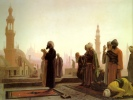

  
[Intangible Textual Heritage](../../index)  [Islam](../index) 
[Index](index)   
[Hypertext Quran](../htq/index)  [Unicode Quran](../uq/085) 
[Pickthall](../pick/085)  [Palmer Part II (SBE09)](../sbe09/085)  [Yusuf
Ali/Arabic](../quran/08501)  [Rodwell](../qr/085)   
[Previous](yaq084)  [Next](yaq086) 

------------------------------------------------------------------------

  
*The Holy Quran*, tr. by Yusuf Ali, \[1934\], at Intangible Textual
Heritage

------------------------------------------------------------------------

p. 1714

### Sūra LXXXV.

### *Burūj,* or The Zodiacal Signs.

*In the name of God, Most Gracious,  
Most Merciful.*

1\. By the Sky, (displaying)  
The Zodiacal Signs;

2\. By the promised Day  
(Of Judgment);

3\. By one that witnesses,  
And the subject of the witness;—

4\. Woe to the makers  
Of the pit (of fire),

p. 1715

5\. Fire supplied (abundantly)  
With Fuel:

6\. Behold! they sat  
Over against the (fire),

7\. And they witnessed  
(All) that they were doing  
Against the Believers.

8\. And they ill-treated them  
For no other reason than  
That they believed in God,  
Exalted in Power,  
Worthy of all Praise!—

9 Him to Whom belongs  
The dominion of the heavens  
And the earth!  
And God is Witness  
To all things.

10\. Those who persecute (or draw  
into temptation)  
The Believers, men and women,  
And do not turn  
In repentance, will have  
The Penalty of Hell:  
They will have the Penalty  
Of the Burning Fire.

11\. For those who believe  
And do righteous deeds,  
Will be Gardens,  
Beneath which Rivers flow:  
That is the great Salvation,  
(The fulfilment of all desires),

p. 1716

12\. Truly strong is the Grip  
(And Power) of thy Lord.

13\. It is He Who creates  
From the very beginning,  
And He can restore (life).

14\. And He is the Oft-Forgiving,  
Full of loving-kindness,

15\. Lord of the Throne of Glory,

16\. Doer (without let)  
Of all that He intends.

17\. Has the story  
Reached thee,  
Of the Forces—

18\. Of Pharaoh  
And the <u>Th</u>amūd?

19\. And yet the Unbelievers  
(Persist) in rejecting  
(The Truth)!

20\. But God doth  
Encompass them  
From behind!

p. 1717

21\. Nay, this is  
A Glorious Qur-ān,

22\. (Inscribed) in  
A Tablet Preserved!

p. 1718

------------------------------------------------------------------------

[Next: Sūra LXXXVI. Ṭāriq, or The Night-Visitant](yaq086)

