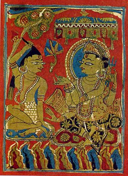

  
[Intangible Textual Heritage](../../index)  [Jainism](../index.md) 

------------------------------------------------------------------------

[Buy this Book at
Amazon.com](https://www.amazon.com/exec/obidos/ASIN/B002CQU47O/internetsacredte.md)

------------------------------------------------------------------------

<table width="75%">
<colgroup>
<col style="width: 50%" />
<col style="width: 50%" />
</colgroup>
<tbody>
<tr class="odd">
<td width="50%" data-valign="TOP"> 
The Consecration of Mahavira, [1404], from Gujerati manuscript of the Kalpa Sutra (Public Domain in the US per Bridgeman vs. Corel).</td>
<td width="50%" data-valign="CENTER"><h1 id="jaina-sutras-part-i" data-align="CENTER">Jaina Sutras, Part I</h1>
<h2 id="by-hermann-jacobi" data-align="CENTER">by Hermann Jacobi</h2>
<h6 id="sacred-books-of-the-east-vol.-22" data-align="CENTER">Sacred Books of the East, Vol. 22</h6>
<h4 id="section" data-align="CENTER">[1884]</h4></td>
</tr>
</tbody>
</table>

------------------------------------------------------------------------

[Contents](#contents)    [Start Reading](sbe2200.md)    [Page
Index](pageidx)    [Text \[Zipped\]](sbe22.txt.gz.md)

------------------------------------------------------------------------

**PART I**   \|    [PART II](../sbe45/index.md)

------------------------------------------------------------------------

|                                                                                                                           |
|---------------------------------------------------------------------------------------------------------------------------|
|  |

This is volume 22 of the Sacred Books of the East, Part One of the
Hermann Jacobi translation of the Jaina Sutras. This volume includes the
Akaranga and Kalpa Sutras, two of the most important Jain sacred texts.

The Akaranga Sutra outlines rules for Jain monks. Most notably it
describes steps which monks must take to avoid harming other living
beings, including the microscopic life forms which the ancient Jains
believed pervaded the universe. The Kalpa sutra contains a biography of
the founder of Jainism, Mahavira, as well as other founders of the
religion, and a list of the successive Jain leaders.

As is the practice at this site, the typography of the original has been
preserved as far as possible. This means that italics are used to
indicate distinctions between consonants in transliterated Sanskrit and
Prakrit. The system used is documented on the [charts attached to the
Sacred Books of the East page](../../sbe/index.htm#conventions.md). Most
notably in this system, 'j' (roughly, the initial sound of the English
word 'jam') is written *g*, hence the spelling *G*ain throughout, which
is pronounced 'Jain.' This book is normally cited as 'Jaina Sutras' in
modern publications and bibliographies.

------------------------------------------------------------------------

 [Title Page](sbe2200.md)  
[Contents](sbe2201.md)  
[Introduction](sbe2202.md)  

### Â*k*ârâṅga Sûtra

[Book I, Lecture 1, Lesson 1](sbe2203.md)  
[Book I, Lecture 1, Lesson 2](sbe2204.md)  
[Book I, Lecture 1, Lesson 3](sbe2205.md)  
[Book I, Lecture 1, Lesson 4](sbe2206.md)  
[Book I, Lecture 1, Lesson 5](sbe2207.md)  
[Book I, Lecture 1, Lesson 6](sbe2208.md)  
[Book I, Lecture 1, Lesson 7](sbe2209.md)  
[Book I, Lecture 2, Lesson 1](sbe2210.md)  
[Book I, Lecture 2, Lesson 2](sbe2211.md)  
[Book I, Lecture 2, Lesson 3](sbe2212.md)  
[Book I, Lecture 2, Lesson 4](sbe2213.md)  
[Book I, Lecture 2, Lesson 5](sbe2214.md)  
[Book I, Lecture 2, Lesson 6](sbe2215.md)  
[Book I, Lecture 3, Lesson 1](sbe2216.md)  
[Book I, Lecture 3, Lesson 2](sbe2217.md)  
[Book I, Lecture 3, Lesson 3](sbe2218.md)  
[Book I, Lecture 3, Lesson 4](sbe2219.md)  
[Book I, Lecture 4, Lesson 1](sbe2220.md)  
[Book I, Lecture 4, Lesson 2](sbe2221.md)  
[Book I, Lecture 4, Lesson 3](sbe2222.md)  
[Book I, Lecture 4, Lesson 4](sbe2223.md)  
[Book I, Lecture 5, Lesson 1](sbe2224.md)  
[Book I, Lecture 5, Lesson 2](sbe2225.md)  
[Book I, Lecture 5, Lesson 3](sbe2226.md)  
[Book I, Lecture 5, Lesson 4](sbe2227.md)  
[Book I, Lecture 5, Lesson 5](sbe2228.md)  
[Book I, Lecture 5, Lesson 6](sbe2229.md)  
[Book I. Lecture 6, Lesson 1](sbe2230.md)  
[Book I, Lecture 6, Lesson 2](sbe2231.md)  
[Book I, Lecture 6, Lesson 2](sbe2232.md)  
[Book I, Lecture 6, Lesson 4](sbe2233.md)  
[Book I, Lecture 6, Lesson 5](sbe2234.md)  
[Book I, Lecture 7, Lesson 1](sbe2235.md)  
[Book I, Lecture 7, Lesson 2](sbe2236.md)  
[Book I, Lecture 7, Lesson 3](sbe2237.md)  
[Book I, Lecture 7, Lesson 4](sbe2238.md)  
[Book I, Lecture 7, Lesson 5](sbe2239.md)  
[Book I, Lecture 7, Lesson 6](sbe2240.md)  
[Book I, Lecture 7, Lesson 7](sbe2241.md)  
[Book I, Lecture 7, Lesson 8](sbe2242.md)  
[Book I, Lecture 8, Lesson 1.](sbe2243.md)  
[Book I, Lecture 8, Lesson 2](sbe2244.md)  
[Book I, Lecture 8, Lesson 3](sbe2245.md)  
[Book I, Lecture 8, Lesson 4](sbe2246.md)  
[Book II, Lecture 1, Lesson 1](sbe2247.md)  
[Book II, Lecture 1, Lesson 2](sbe2248.md)  
[Book II, Lecture 1, Lesson 3](sbe2249.md)  
[Book II, Lecture 1, Lesson 4](sbe2250.md)  
[Book II, Lecture 1, Lesson 5](sbe2251.md)  
[Book II, Lecture 1, Lesson 6](sbe2252.md)  
[Book II, Lecture 1, Lesson 7](sbe2253.md)  
[Book II, Lecture 1, Lesson 8](sbe2254.md)  
[Book II, Lecture 1, Lesson 9](sbe2255.md)  
[Book II, Lecture 1, Lesson 10](sbe2256.md)  
[Book II, Lecture 1, Lesson 11](sbe2257.md)  
[Book II, Lecture 2, Lesson 1](sbe2258.md)  
[Book II, Lecture 2, Lesson 2](sbe2259.md)  
[Book II, Lecture 2, Lesson 3](sbe2260.md)  
[Book II, Lecture 3, Lesson 1](sbe2261.md)  
[Book II, Lecture 3, Lesson 2](sbe2262.md)  
[Book II, Lecture 3, Lesson 3](sbe2263.md)  
[Book II, Lecture 4, Lesson 1](sbe2264.md)  
[Book II, Lecture 4, Lesson 2](sbe2265.md)  
[Book II, Lecture 5, Lesson 1](sbe2266.md)  
[Book II, Lecture 5, Lesson 2](sbe2267.md)  
[Book II, Lecture 6, Lesson 1](sbe2268.md)  
[Book II, Lecture 5, Lesson 2](sbe2269.md)  
[Book II, Lecture 7, Lesson 1.](sbe2270.md)  
[Book II, Lecture 7, Lesson 2](sbe2271.md)  
[Book II, Lecture 8](sbe2272.md)  
[Book II, Lecture 9](sbe2273.md)  
[Book II, Lecture 10](sbe2274.md)  
[Book II, Lecture 11](sbe2275.md)  
[Book II, Lecture 12](sbe2276.md)  
[Book II, Lecture 13](sbe2277.md)  
[Book II, Lecture 14](sbe2278.md)  
[Book II, Lecture 15](sbe2279.md)  
[Book II, Lecture 16](sbe2280.md)  

### The Kalpa Sûtra

### Lives of the *G*inas

[Life of Mahâvîra, Lecture 1](sbe2281.md)  
[Life of Mahâvîra, Lecture 2](sbe2282.md)  
[Life of Mahâvîra, Lecture 3](sbe2283.md)  
[Life of Mahâvîra, Lecture 4](sbe2284.md)  
[Life of Mahâvîra, Lecture 5](sbe2285.md)  
[Life of Pâr*s*va](sbe2286.md)  
[Life of Arish*t*anemi](sbe2287.md)  
[Epochs of the Intermediate Tîrthakaras](sbe2288.md)  
[Life of *Ri*shabha](sbe2289.md)  
[List of the Sthaviras](sbe2290.md)  
[Rules for Yatis](sbe2291.md)  
[Index](sbe2292.md)  
