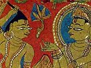

  
[Intangible Textual Heritage](../../index)  [Jainism](../index.md) 
[Index](index)  [Previous](sbe2209)  [Next](sbe2211.md) 

------------------------------------------------------------------------

[Buy this Book at
Amazon.com](https://www.amazon.com/exec/obidos/ASIN/B002CQU47O/internetsacredte.md)

------------------------------------------------------------------------

  
*Jaina Sutras, Part II (SBE22)*, tr. by Hermann Jacobi, \[1884\], at
Intangible Textual Heritage

------------------------------------------------------------------------

p. 15

### SECOND LECTURE,

###### CALLED

###### CONQUEST OF THE WORLD.

#### FIRST LESSON.

Quality is the seat of the root, and the seat of the root is
quality [1](#fn_109.md). He who longs for the
qualities, is overcome by great pain, and he is careless [2](#fn_110). (For he thinks.md) I have to provide for a
mother, for a father, for a sister, for a wife, for sons, for daughters,
for a daughter-in-law, for my friends, for near and remote relations,
for my acquaintances [3](#fn_111.md), for
different kinds of property, profit, meals, and clothes. Longing for
these objects, people are careless, suffer day and night, work in the
right and the wrong time, desire wealth and treasures, commit injuries
and violent acts, direct the mind, again and again, upon these injurious
doings (described in the preceding lecture). (1) (Doing so), the life of
some mortals (which by destiny would have been long) is shortened. For
when with the deterioration of the perceptions of the ear, eye, organs
of smelling, tasting, touching, a man becomes aware of the decline of
life, they [4](#fn_112.md) after a time

p. 16

produce dotage. Or his kinsmen with whom he lives together will, after a
time, first grumble at him, and he will afterwards grumble at them. They
cannot help thee or protect thee, nor canst thou help them or protect
them. (2) He is not fit for hilarity, playing, pleasure, show.
Therefore, ah! proceeding to pilgrimage, and thinking that the present
moment is favourable (for such intentions [1](#fn_113).md), he should be steadfast and not, even
for an hour, carelessly conduct himself. His youth, his age, his life
fade away.

A man who carelessly conducts himself; who killing, cutting, striking,
destroying, chasing away, frightening (living beings) resolves to do
what has not been done (by any one)--him his relations with whom he
lived together, will first cherish, and he will afterwards cherish them.
But they cannot help thee or protect thee, nor canst thou help them or
protect them. (3)

Or he heaps up treasures for the benefit of some spendthrifts, by
pinching himself. Then, after a time, he falls in sickness; those with
whom he lives together will first leave him, and he will afterwards
leave them. They cannot help thee or protect thee, nor canst thou help
them or protect them. (4)

Knowing pain and pleasure in all their variety [2](#fn_114.md), and seeing his life not yet decline, a
wise man should know that to be the proper moment (for entering a
religious life); while the perceptions of his ear, eye, organs of
smelling, tasting, touching are not

p. 17

yet deteriorated, while all these perceptions are not yet deteriorated,
man should prosecute [1](#fn_115.md) the real end
of his soul [2](#fn_116). Thus I say. (5.md)

------------------------------------------------------------------------

### Footnotes

[15:1](sbe2210.htm#fr_110.md) I.e. in the
qualities of the external things lies the primary cause of the
Sa*m*sâra, viz. sin; the qualities produce sin, and sinfulness makes us
apt to enjoy the qualities.

[15:2](sbe2210.htm#fr_111.md) I.e. gives way to
love, hate, &c.

[15:3](sbe2210.htm#fr_112.md) Sa*m*thuya. The
commentators explain this word acquaintance or one who is recommended to
me.

[15:4](sbe2210.htm#fr_113.md) I.e. these failing
perceptions.

[16:1](sbe2210.htm#fr_114.md) I.e. his present
life; for the birth in âryakshetra and in a noble family is difficult to
obtain in this Sa*m*sâra.

[16:2](sbe2210.htm#fr_115.md) Patteya*m*, singly,
with regard to the living beings.

[17:1](sbe2210.htm#fr_116.md) Sama*n*uvâse*gg*âsi
(tti bemi) is taken by the commentators for the second person, which
always occurs before tti bemi, but nowhere else. I think si belongs to
tti bemi, and stands for se = asau.

[17:2](sbe2210.htm#fr_117.md) Viz. control.

------------------------------------------------------------------------

[Next: Book I, Lecture 2, Lesson 2](sbe2211.md)
