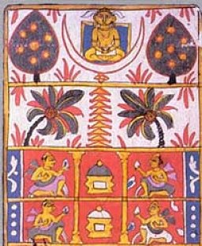

  
[Intangible Textual Heritage](../../index)  [Jainism](../index.md) 

------------------------------------------------------------------------

[Buy this Book at
Amazon.com](https://www.amazon.com/exec/obidos/ASIN/B002CQU4K6/internetsacredte.md)

------------------------------------------------------------------------

<table width="75%">
<colgroup>
<col style="width: 50%" />
<col style="width: 50%" />
</colgroup>
<tbody>
<tr class="odd">
<td width="50%" data-valign="TOP"> 
Medieval Jain decorative art [Public Domain Image]</td>
<td width="50%" data-valign="CENTER"><h1 id="jaina-sutras-part-ii" data-align="CENTER">Jaina Sutras, Part II</h1>
<h2 id="by-hermann-jacobi" data-align="CENTER">by Hermann Jacobi</h2>
<h6 id="sacred-books-of-the-east-vol.-45" data-align="CENTER">Sacred Books of the East, Vol. 45</h6>
<h4 id="section" data-align="CENTER">[1895]</h4></td>
</tr>
</tbody>
</table>

------------------------------------------------------------------------

[Contents](#contents)    [Start Reading](sbe4500.md)    [Page
Index](pageidx)    [Text \[Zipped\]](sbe45.txt.gz.md)

------------------------------------------------------------------------

[PART I](../sbe22/index.md)   \|    **PART II**

------------------------------------------------------------------------

|                                                                                                                           |
|---------------------------------------------------------------------------------------------------------------------------|
|  |

This is volume 45 of the Sacred Books of the East, Part Two of the
Hermann Jacobi translation of the Jaina Sutras.

As is the practice at this site, the typography of the original has been
preserved as far as possible. This means that italics are used to
indicate distinctions between consonants in transliterated Sanskrit and
Prakrit. The system used is documented on the [charts attached to the
Sacred Books of the East page](../../sbe/index.htm#conventions.md). Most
notably in this system, 'j' (roughly, the initial sound of the English
word 'jam') is written *g*, hence the spelling *G*ain throughout, which
is pronounced 'Jain.' This book is normally cited as 'Jaina Sutras' in
modern publications and bibliographies.

------------------------------------------------------------------------

 [Title Page](sbe4500.md)  
[Contents](sbe4501.md)  
[Introduction](sbe4502.md)  

### Uttarâdhyayana

[First Lecture. On Discipline](sbe4503.md)  
[Second Lecture. On Troubles](sbe4504.md)  
[Third Lecture. The Four Requisites](sbe4505.md)  
[Fourth Lecture. Impurity](sbe4506.md)  
[Fifth Lecture. Death Against One's Will](sbe4507.md)  
[Sixth Lecture. The False Ascetic](sbe4508.md)  
[Seventh Lecture. The Parable of the Ram, etc.](sbe4509.md)  
[Eighth Lecture. Kapila's Verses](sbe4510.md)  
[Ninth Lecture. The Pravra*g*yâ of King Nami](sbe4511.md)  
[Tenth Lecture. The Leaf of the Tree](sbe4512.md)  
[Eleventh Lecture. The Very Learned](sbe4513.md)  
[Twelfth. Lecture Harikê*s*a](sbe4514.md)  
[Thirteenth Lecture. Kitra and Sambhûta](sbe4515.md)  
[Fourteenth Lecture. Ishukâra](sbe4516.md)  
[Fifteenth Lecture. The True Monk](sbe4517.md)  
[Sixteenth Lecture. The Ten Conditions of Perfect Chastity](sbe4518.md)  
[Seventeenth Lecture. The Bad *S*rama*n*a](sbe4519.md)  
[Eighteenth Lecture Sa*ñg*aya](sbe4520.md)  
[Nineteenth Lecture. The Son of M*ri*gâ](sbe4521.md)  
[Twentieth Lecture. The Great Duty of the Nirgranthas](sbe4522.md)  
[Twenty-First Lecture. Samudrapâla](sbe4523.md)  
[Twenty-Second Lecture. Rathanêmi](sbe4524.md)  
[Twenty-Third Lecture. Kê*s*i and Gautama](sbe4525.md)  
[Twenty-Fourth Lecture. The Samitis](sbe4526.md)  
[Twenty-Fifth Lecture. The True Sacrifice](sbe4527.md)  
[Twenty-Sixth Lecture. The Correct Behaviour](sbe4528.md)  
[Twenty-Seventh Lecture. The Bad Bullocks](sbe4529.md)  
[Twenty-Eighth Lecture. The Road to Final Deliverance](sbe4530.md)  
[Twenty-Ninth Lecture. The Exertion in Righteousness](sbe4531.md)  
[Thirtieth Lecture. The Road of Penance](sbe4532.md)  
[Thirty-First Lecture. Mode of Life](sbe4533.md)  
[Thirty-Second Lecture. The Causes of Carelessness](sbe4534.md)  
[Thirty-Third Lecture. The Nature of Karman](sbe4535.md)  
[Thirty-Fourth Lecture. On Lê*s*yâ](sbe4536.md)  
[Thirty-Fifth Lecture. The Houseless Monk](sbe4537.md)  
[Thirty-Sixth Lecture. On Living Beings and Things Without
Life](sbe4538.md)  

### Sûtrak*ri*tâṅga

[Book 1, Lecture 1: The Doctrine, Chapter 1](sbe4539.md)  
[Book 1, Lecture 1, Chapter 2](sbe4540.md)  
[Book 1, Lecture 1, Chapter 3](sbe4541.md)  
[Book 1, Lecture 1, Chapter 4](sbe4542.md)  
[Book 1, Lecture 2: The Destruction of Karman, Chapter 1](sbe4543.md)  
[Book 1, Lecture 2, Chapter 2](sbe4544.md)  
[Book 1, Lecture 2, Chapter 3](sbe4545.md)  
[Book 1, Lecture 3: The Knowledge of Troubles, Chapter 1](sbe4546.md)  
[Book 1, Lecture 3, Chapter 2](sbe4547.md)  
[Book 1, Lecture 3, Chapter 3](sbe4548.md)  
[Book 1, Lecture 3, Chapter 4](sbe4549.md)  
[Book 1, Lecture 4: Knowledge of Women, Chapter 2](sbe4550.md)  
[Book 1, Lecture 4, Chapter 2](sbe4551.md)  
[Book 1, Lecture 5: Description of the Hells, Chapter 1](sbe4552.md)  
[Book 1, Lecture 5, Chapter 2](sbe4553.md)  
[Book 1, Lecture 6: Praise Of Mahâvîra](sbe4554.md)  
[Book 1, Lecture 7: Description of the Wicked](sbe4555.md)  
[Book 1, Lecture 8: On Exertion](sbe4556.md)  
[Book 1, Lecture 9: The Law](sbe4557.md)  
[Book 1, Lecture 10: Carefulness](sbe4558.md)  
[Book 1, Lecture 11: The Path](sbe4559.md)  
[Book 1, Lecture 12: The Creed](sbe4560.md)  
[Book 1, Lecture 13: The Real Truth](sbe4561.md)  
[Book 1, Lecture 14: The Nirgrantha](sbe4562.md)  
[Book 1, Lecture 15, The Yamakas](sbe4563.md)  
[Book 1, Lecture 16, The Song](sbe4564.md)  
[Book 2, Lecture 1, The Lotus](sbe4565.md)  
[Book 2, Lecture 2: On Activity](sbe4566.md)  
[Book 2, Lecture 3: Knowledge of Food](sbe4567.md)  
[Book 2, Lecture 4: Renunciation of Activity](sbe4568.md)  
[Book 2, Lecture 5: Freedom from Error](sbe4569.md)  
[Book 2, Lecture 6: Ârdraka](sbe4570.md)  
[Book 2, Lecture 7: Nâlandâ](sbe4571.md)  
[Index of Names and Subjects](sbe4572.md)  
[Index of Sanskrit and Prâk*ri*t Words Occurring in the Text and the
Notes](sbe4573.md)  
