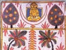

  
[Intangible Textual Heritage](../../index)  [Jainism](../index.md) 
[Index](index)  [Previous](sbe4555)  [Next](sbe4557.md) 

------------------------------------------------------------------------

[Buy this Book at
Amazon.com](https://www.amazon.com/exec/obidos/ASIN/B002CQU4K6/internetsacredte.md)

------------------------------------------------------------------------

  
*Jaina Sutras, Part II (SBE45)*, tr. by Hermann Jacobi, \[1895\], at
Intangible Textual Heritage

------------------------------------------------------------------------

## EIGHTH LECTURE,

###### CALLED

###### ON EXERTION [2](#fn_877.md).

It is said that two definitions of exertion are given; but in what does
the exertion of the virtuous consist, and how is it defined? (1)

Some say that it consists in works, and the pious (say that it consists)
in abstention from works. Men appear divided into two classes from this
point of view. (2)

Carelessness is called (the cause of) Karman, carefulness that of the
contrary (viz. absence of Karman); when the one or the other is
predicated

p. 298

(of a man, he is called) either a fool or a wise man. (3)

Some learn sciences [1](#fn_878.md) which teach
the destruction of living beings, others study spells for killing all
sorts of creatures. (4)

Deceivers practise deceit in order to procure themselves pleasures and
amusement; they kill, cut, and dismember (beings) for the sake of their
own comfort. (5)

The careless (commit sins) by thoughts, words, and acts, with regard to
this and the next world, both (by doing the act themselves and by making
others do it). (6)

A cruel [2](#fn_879.md) man does cruel acts and is
thereby involved in other cruelties; but sinful undertakings will in the
end bring about misery. (7)

Sinners, subject to love and hate and doing wrong, acquire Karman
arising from passions [3](#fn_880.md) and commit
many sins. (8)

Thus the 'exertion leading to works' of the sinners has been described;
now learn from me the wise men's 'exertion not leading to works.' (9)

A pious monk, who is free from bonds and has severed all fetters,
annihilates his bad Karman, and removes definitely the thorn (of sin).
(to)

Following the right doctrine he exerts himself; as one becomes more and
more the receptacle

p. 299

of misery, so his bad thoughts (or sinfulness) increase. (11)

Those who have good places (in heaven, &c.) must surely leave them (some
time). We live together with relations and friends but a limited time.
(12)

Considering this, a wise man should conquer his greed, and enter upon
the noble (path), which contains all virtues and is not blamed [1](#fn_881). (13.md)

Whether he know the pith of the Law by intuition or through instruction,
a houseless (monk) should exert himself and abstain from sins. (14)

When a wise man, in whatever way, comes to know that the apportioned
space of his life draws towards its end, he should in the meantime
quickly learn the method (of dying a religious death) [2](#fn_882). (15.md)

As a tortoise draws its limbs into its own body, so a wise man should
cover, as it were, his sins with his own meditation. (16)

He should draw in, as it were, his hands and feet, his mind and five
organs of sense, the effect of his bad Karman, and every bad use of
language. (17)

The virtuous exert themselves with regard to the distant end (viz.
Liberation [3](#fn_883).md). One should live

p. 300

indifferent to one's own happiness, calm, and without any attachment.
(18)

Do not kill living beings, do not take what is not freely given, do not
talk false, treacherous speech! This is the Law of him who is rich in
control. (19)

Do not desire by words or thoughts what is a transgression (of the Law);
guarding yourself in all ways, and subduing (the senses), practise
control. (20)

A man who guards his self and subdues his senses, abhors all sins, past,
present, and future ones. (21)

Benighted men of wrong faith, (though) they be renowned as heroes, exert
themselves in a bad way, which will have, in all respects, evil
consequences for them. (22)

Wise men of right faith, who are renowned heroes, exert themselves in a
good way which will have no (evil) consequences whatever for them. (23)

Penance is of no good if performed by noble men who have turned monks
(for the sake of fame); but that penance of which nobody else knows
anything (is meritorious). Do not spread your own fame [1](#fn_884)! (24.md)

A pious man should eat little, drink little, talk little; he should
always exert himself, being calm, indifferent, a subduer (of his
senses), and free from greed. (25)

Meditating and performing religious practices,

p. 301

abandoning his body, regarding forbearance as the paramount duty, a monk
should wander about till he obtains liberation. (26)

Thus I say.

------------------------------------------------------------------------

### Footnotes

[297:2](sbe4556.htm#fr_884.md) Vîrya; it is the
power or virtue of a thing.

[298:1](sbe4556.htm#fr_885.md) Sattha = *s*âstra
or *s*astra. On the latter alternative we must translate '(practice of)
arms.'

[298:2](sbe4556.htm#fr_886.md) Vêri = vairin,
*g*îvôpamardakârin.

[298:3](sbe4556.htm#fr_887.md) Karma is of two
kinds, airyapathika, arising from 'walking,' i.e. from those actions
which are indispensable to a virtuous life or the conduct of monks, and
sâmparâyika, arising from the passions.

[299:1](sbe4556.htm#fr_888.md)
Savvadhammamagôviya*m*. According to the commentator the meaning of this
phrase is: which is not blamed or shown to be wrong by all (heretical)
Laws.

[299:2](sbe4556.htm#fr_889.md) See Uttarâdhyayana,
Fifth Lecture.

[299:3](sbe4556.htm#fr_890.md) *S*îlâṅka quotes
and comments upon four different readings of the first line of this
verse, the last of which is rendered above as it is the textus receptus
of the Dîpikâ. (1) Abstaining from even small pride and from deceit,
one, &c. (2) 'Great' for 'even small.' (3) I have heard from some men:
This is the valour of the virtuous man, that, &c. After this verse
*S*îlâṅka quotes another which, he says, is not found in MSS. of the
text, but p. 300 is found in the *T*îkâ. It
is, however, the identical verse I, 3, 4, 20, see above, [p.
271](sbe4549.htm#page_271.md), which occurs again I, 11, 11.

[300:1](sbe4556.htm#fr_891.md) Compare Matthew vi.
i-6.

------------------------------------------------------------------------

[Next: Book 1, Lecture 9: The Law](sbe4557.md)
