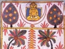

  
[Intangible Textual Heritage](../../index)  [Jainism](../index) 
[Index](index)  [Previous](sbe4563)  [Next](sbe4565) 

------------------------------------------------------------------------

[Buy this Book at
Amazon.com](https://www.amazon.com/exec/obidos/ASIN/B002CQU4K6/internetsacredte)

------------------------------------------------------------------------

  
*Jaina Sutras, Part II (SBE45)*, tr. by Hermann Jacobi, \[1895\], at
Intangible Textual Heritage

------------------------------------------------------------------------

p. 333

## SIXTEENTH LECTURE,

###### CALLED

###### THE SONG [1](#fn_972).

Now the Venerable One said: He who thus subdues his senses, who is well
qualified (for his task) [2](#fn_973) and
abandons his body, is to be called a Brâhma*n*a, a *S*rama*n*a, a
Bhikshu, a Nirgrantha. (The pupil) replied: Why is he who thus subdues
his senses, who is well qualified (for his task) and abandons his body,
to be called a Brâhma*n*a, a *S*rama*n*a, a Bhikshu, a Nirgrantha? Tell
this, O great sage! (1)

He is a Brâhma*n*a for this reason that he has ceased from all sinful
actions, viz. love, hate, quarrel, calumny, backbiting, reviling of
others, aversion to control, and love of pleasures, deceit, untruth, and
the sin of wrong belief; that he possesses the Samitis, always exerts
himself, is not angry, nor proud. (2)

He is a *S*rama*n*a for this reason that he is not hampered by any
obstacles, that he is free from desires, (abstaining from) property,
killing, telling lies, and sexual intercourse; (and from) wrath, pride,
deceit, greed, love, and hate: thus giving up every passion that
involves him in sin, (such as) killing of beings. (Such a man) deserves
the name of a *S*rama*n*a, who subdues (moreover) his senses, is well
qualified (for his task), and abandons his body. (3)

p. 334

He is a Bhikshu for this reason that he is not conceited, but modest,
and obedient (to his Guru), that he subdues his senses, is well
qualified (for his task), and abandons his body, that he sustains all
troubles and calamities, that he practises with a pure mind the
(prescribed) conduct, exerts himself well, is steadfast, and eats but a
moderate quantity [1](#fn_974) of food which is
given him by others. (Such a man) deserves the name of a Bhikshu. (4)

He is a Nirgrantha for this reason that he is single [2](#fn_975), knowing the absolute (âtman), awakened,
proof against sins, well disciplined; that he possesses the Samitis and
equanimity, knows the true nature of the Self, is wise, has renounced
the causes of sin both (objectively and subjectively [3](#fn_976)), does not desire honour, respect, and
hospitality, but searches and knows the Law, endeavours to gain
Liberation, and lives restrained. (Such a man) deserves the name of a
Nirgrantha, who subdues his senses, is well qualified (for his task),
and abandons his body. (5)

Know this to be thus as I have told you, because I am the Saviour. (6)

Thus I say.

------------------------------------------------------------------------

### Footnotes

[333:1](sbe4564.htm#fr_979) Gâhâ = gâthâ. In
this lecture, which is in prose as regards form and contents, there is
nothing that could justify the title given it.

[333:2](sbe4564.htm#fr_980) Daviê = dravya.

[334:1](sbe4564.htm#fr_981) Sa*m*khâya. The
commentator takes this word as a gerund and explains it: knowing (the
vanity of the world).

[334:2](sbe4564.htm#fr_982) Êka, i.e. free from
love and hate.

[334:3](sbe4564.htm#fr_983) Dravyatô bhâvata*s*
*k*a.

------------------------------------------------------------------------

[Next: Book 2, Lecture 1, The Lotus](sbe4565)
