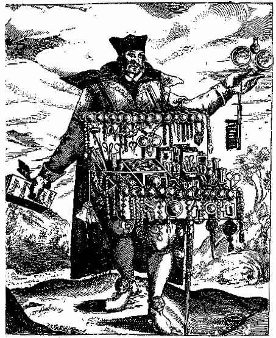

[Intangible Textual
Heritage](../../index) [Journals](../index.md) [Christian
Articles](../../chr/etc/index) [Angelus Silesius](../../chr/sil/index.md)

------------------------------------------------------------------------

 

# ANGELUS SILESIUS

### by Paul Carus

 

------------------------------------------------------------------------

# THE OPEN COURT

 

A MONTHLY MAGAZINE

 

### Devoted to the Science of Religion, the Religion of Science, and the Extension of the Religious Parliament Idea.

 

 

#### Volume XXII

 

#### CHICAGO

##### THE OPEN COURT PUBLISHING COMPANY

##### 1908

###### {Reduced to HTML by Christopher M. Weimer, August 2002}

------------------------------------------------------------------------

p. 291

## ANGELUS SILESIUS.

BY THE EDITOR.

   MYSTICISM is, as it were, a short cut of sentiment to reach a truth
otherwise inaccessible under given conditions, and since writing an
article on the subject for a recent number of *The Monist*, I have
devoted more time to a renewed perusal of one of the most prominent and
interesting mystics of Germany, Johannes Scheffler, or as he is better
known by his adopted name, Angelus Silesius, who was born in 1624 at
Breslau, and died in 1677. While mystics of the type of Jacob Boehme and
Swedenborg present their views in long essays of a philosophical nature
which read like the dreams (or if you prefer, the vagaries) of a
prophet, Angelus Silesius condenses his views in short apothegms,
written in a somewhat archaic style, mostly in simple verse, and often
with crude rhymes.

   For an explanation of my view of mysticism, I refer my readers to the
above-mentioned editorial article published in *The Monist* of January,
1908, pages 75-110. I have there attempted to translate of the lines of
Angelus Silesius (on pages 104-109). Since this mystical thinker is
little known in the countries of English speech, and since only a few of
his verses have been translated, we present here to our readers an
additional selection which will serve as instances of the peculiar
God-conception of the mystics, so much like Buddhistic Nirvana; also the
mystic ethics of quietism, the mystic psychology and mystic religion
which teach man to seek salvation through breaking down the limits of
the ego. By overcoming egoity it is promised that man shall attain
divinity. Peculiarly noteworthy is the mystic's sensual conception of
piety, and the representation of the soul's relation to God as a kind of
mystic marriage. All this is typical of a certain kind of mysticism
which exercised such a powerful influence at the end of the Middle Ages,
but has now entirely lost its influence on mankind.

p. 292

   Johannes Scheffler was born of Protestant parents at Breslau, the
capital of Silesia, in 1624, and was baptized in the same year on
Christmas day. Having passed through the usual course of education at a
gymnasium he went to the Universities of Strassburg, Leyden and Padua
where he studied medicine and philosophy. At the last mentioned place he
took his doctor's degree in 1647. For three years, 1649-1652, he served
as Court Physician to Duke Sylvius Nimrod of Oels, who was a pious but
decidedly onesided Protestant.

<table data-align="center">
<colgroup>
<col style="width: 100%" />
</colgroup>
<tbody>
<tr class="odd">
<td style="text-align: center;"></td>
</tr>
<tr class="even">
<td style="text-align: center;">DR. JOHANNES SCHEFFLER. 
From a caricature of 1664.</td>
</tr>
</tbody>
</table>

   Scheffler's mystic inclinations had long before alienated him from
the dogmatic and anti-artistic spirit of the religion of his birth which
during the middle of the seventeenth century was more severe and bigoted
than ever before or afterwards. At the same time there was a religious
revival in the Roman Catholic world which proved attractive to him, and
so it was but natural that finally in 1653 he severed his old
affiliations, and joined the Church p. 293
that by the mystical glamor of its historical traditions was most
sympathetic to him.

   The zeal with which Scheffler embraced Roman Catholicism made him
unjust toward the Protestant persuasion and implicated him in very
unpleasant controversies.

   Having become *persona grata* in the aristocratic circles of Austria,
Scheffler became Court Physician to the Emperor in 1654; ten years
later, in 1664, he was appointed chief Master of Ceremonies at the court
of the Prince Bishop of Breslau, with the title Counsellor.

   His devotion led him in 1661 to enter the order of St. Francis,
commonly called the Brotherhood of Minorites. Having fallen a prey to
consumption, he died July 9, 1677, in the institution of the Knights of
the Cross of St. Matthews in Breslau.

   Though by education a physician and a scientist, Johannes Scheffler
was a mystic and a poet. His most famous book is entitled "The
Cherubinean Wanderer," and it is from this that the present selection
has been made. It was followed by another pious effusion entitled
*Heilige Seelenlust oder geistliche Hirtenlust der in ihren Jesum
verliebten Psyche*. He is also the author of several church songs which
breathe fervor and piety.[\*](#page_293_note_*.md) Like Newman's "Lead,
p. 294 kindly Light!" these have become the
common property of Roman Catholic and Protestant churches. Some of his
songs been translated into English, notably, "Earth has nothing sweet
and fair."

   We have tried in vain to find a likeness of Johannes Scheffler. The
only portrait that we can discover is a caricature in an invective
lampoon entitled *Wohlverdientes Kapitel*. ("Well deserved Chapter")
published in 1664, in which our mystic is represented as a pedler of
spectacles, rosaries, cards, dice, and other similar wares. No attempt
has been made to disfigure the expression of his face, and we have
reason to believe that it bears a certain likeness to the man. In his
signature he calls himself "*Archiater et physicus Olsnensis*," which
means that he was court physician and surgeon of the small duchy of Oels
in Silesia.

   We will now let Angelus Silesius speak for himself:

What has been said of God  
Does not suffice, I claim.  
The Over-Godhead is  
My life, my light, my aim.

God is my final end;  
Does he from me evolve,  
Then he grows out of me,  
While I in Him dissolve.

God loves me more than Him;  
Than me I love God more.  
So He gives me as much  
As I to Him restore.

In Spirit senses are  
One and the same. 'T is true,  
Who seeth God he tastes,  
Feels, smells and hears Him too.

In God nought e'er is known,  
Forever one is He.  
What we in Him e'er know,  
Ourselves must grow and be.

God never did exist  
Nor ever will, yet aye  
He was ere worlds began, and  
When they're gone he'll stay.

God Father is a point,  
God Son the circuit line,  
And God the Ghost does both  
As area combine.

God is all virtue's end,  
Its mainspring He's likewise.  
He too is virtue's cause,  
He eke is virtue's prize.

Thou needst not cry to God,  
The spring wells up in thee.  
Don't stop its fountain head:  
It flows eternally.

Who without God as well  
As with Him e'er can be,  
He is at any rate  
A hero verily.

Abandon winneth God.  
But to abandon God  
Is an abandonment  
Which must seem very odd.

p. 295

Eternity is time  
And time eternity,  
Except when we ourselves.  
Would make them different be.

Things in eternity  
Are all at once in prime,  
No after nor before  
Is there, as here in time.

Who would expect it so?  
From darkness light is brought,  
Life rises out of Death, and  
Something comes from Naught.

Two eyes our souls possess:  
While one is turned on time,  
The other seeth things  
Eternal and sublime.

My heart below is strait,  
On top 't is wide and stout.  
It must have room for God.  
But earthly things keep out.

O Christian once thou must  
Down into Hell be led.  
If not while still in life,  
Thou must go down when dead.

Trust me, my friend, if God  
Should bid me not to dwell  
In heaven, I'd stay here  
Or go, as lief, to Hell.

When quitting time, I am  
Myself eternity.  
I shall be one with God,  
God one with me shall be.

What did eternal God  
Before time had begun?  
He loved Himself and thus  
Begot He God, the Son.

What you for others wish,  
You for yourself suggest.  
If you don't wish them well,  
Your own death you request.

A soul redeemed and blessed  
No more knows otherhood.  
It is with God one light  
And one beatitude.

In Heaven life is good:  
No-one has aught alone.  
What one possesses, there  
All others too will own.

Plurality God loathes,  
Therefore He has decreed  
That all men should in Christ  
Be only one indeed.

Beware man of thyself,  
Self's burden thou wilt rue.  
It will impair thee more,  
Than thousand devils do.

Three enemies has man:  
Himself, Satan, the world;  
The first will be the last  
That to the ground is hurled.

Were e'en in Christ himself,  
Some little will at all,  
However blessed he be,  
Surely from grace he'd fall.

The highest worship is  
Like unto God to grow,  
Christlike to be in life,  
In habit, and love's glow.

Like unto Christ is he  
Who truly loves his foe,  
For persecutors prays,  
And renders good for woe.

p. 296

What shame! The silkworm works  
And works till he can fly,  
While you a man remain  
And still on earth will lie.

Pure as the finest gold,  
As rock so rigid hard  
And clear as crystal, keep  
The soul within thy guard.

Had Christ a thousand times,  
Been born in Bethlehem,  
But not in thee, thy sin  
Would still thy soul condemn.

He who before the Lord  
With envy comes and hate  
Will hatred with his prayers  
And envy impetrate.

I say it speeds thee not  
That Christ rose from the grave,  
So long as thou art still  
To death and sin a slave.

Golgotha's cross from sin  
Can never ransom thee,  
Unless in thine own soul  
It should erected be.

Man, thou shalt be St. Paul!  
In thee must be fulfilled  
What Christ has left undone  
And where wrath shall be stilled.

The resurrection is  
In spirit done in thee,  
As soon as thou from all  
Thy sins hast set thee free.

Thou must above thee rise  
All else leave to God's grace:  
Then Christ's ascension will  
Within thy soul take place.

If neither love nor pain  
Will ever touch thy heart,  
Then only God's in thee,  
And then in God thou art.

Who not with others bides  
And always lives alone,  
If he's not God himself,  
Must into God have grown.

Man should not stay a man:  
His aim should higher be.  
For God will only gods  
Accept as company.

"Where is my residence?"'  
Where I nor you can stand.  
"Where is the final end  
Where I at last shall land?"  
'T is where no end is found.  
"And whither must I press.  
Above God I must pass.  
Into the wilderness.

Indeed, who of this world  
Has taken the right view  
Must be Democritus  
And Heraclitus too.

The saint is rising higher;  
He's changed to God in God;  
The sinner downward sinks,  
Is changed to dirt and clod.

To own much is not wealth,  
For he is rich alone  
Who losing all he hath  
Will not his loss bemoan.

Thy will 't is makes thee damned,  
Thy will that makes thee saved;  
Thy will that sets thee free,  
Thy will makes thee enslaved.

p. 297

The nearest way to God  
Leads through love's open door;  
The path of knowledge is  
Too slow for evermore.

Love maketh bold; and he  
Who God, the Lord, will kiss,  
With love alone should kneel  
Before His throne of Bliss.

Child, be the bride of God,  
And be thou His alone.  
Thou shalt His sweetheart be,  
As He's thy lover grown.

Will pregnant be of God:  
His spirit verily  
O'ershadow must my soul  
To quicken God in me.

The angels are in bliss,  
But better is man's life,  
For no one of their kind  
Can ever be God's wife.

You ask what manhood is?  
'T is plainly understood,  
For in a word it is  
The Over-angelhood.

God kisseth but himself.  
His spirit is His kiss;  
The Son 't is who is kissed,  
The Father who did this.

Thou wishest to behold,  
O Bride, the bridegroom's face;  
Pass by God and all else,  
And thou wilt him embrace.

The God-enraptured man—  
One only pain hath he;  
He can not soon enough  
With God his Lover be.

To bear a child is joy:  
God's sole bliss is that He  
Brings forth His only Son  
From all eternity.

God e'en Himself must die  
That you may live thereby.  
How can you gain His life  
Unless like Him you die?

Death is a blessed thing!  
The stronger death chastises,  
The much more glorious is  
The life that therefrom rises.

Oh ponder well on death!  
Too many things you try!  
Naught can more useful be,  
Than how one means to die.

Friend it is now enough.  
In case thou more wilt read:  
Thou must the Scriptures be,  
The essence eke, indeed.

------------------------------------------------------------------------

[Journals](../index) [Christian Articles](../../chr/etc/index.md) [Angelus
Silesius](../../chr/sil/index.md)

------------------------------------------------------------------------

### Footnotes

p. 293

[\*](#page_293_fr_*.md) The two best
known songs of his which are still used are:

<table data-align="center" data-cellpadding="10">
<colgroup>
<col style="width: 100%" />
</colgroup>
<tbody>
<tr class="odd">
<td>"Mir nach! spricht Christus, unser Held, 
Mir nach, ihr Christen alle,"</td>
</tr>
</tbody>
</table>

and

<table data-align="center" data-cellpadding="10">
<colgroup>
<col style="width: 100%" />
</colgroup>
<tbody>
<tr class="odd">
<td>"Liebe, die du mich zum Bilde 
Deiner Gottheit hast gemacht."</td>
</tr>
</tbody>
</table>

 

 

 

 

 

 

 

 

 

 

 

 

 

 

 
