[Intangible Textual
Heritage](../../index) [Journals](../index) [Christian
Articles](../../chr/etc/index)

------------------------------------------------------------------------

 

# THE BRIDE OF CHRIST

### by Paul Carus

 

------------------------------------------------------------------------

# THE OPEN COURT

 

A MONTHLY MAGAZINE

 

### Devoted to the Science of Religion, the Religion of Science, and the Extension of the Religious Parliament Idea.

 

 

#### Volume XXI

 

#### CHICAGO

##### THE OPEN COURT PUBLISHING COMPANY

##### 1907

###### {Reduced to HTML by Christopher M. Weimer, August 2002}

------------------------------------------------------------------------

<table data-align="center">
<colgroup>
<col style="width: 100%" />
</colgroup>
<tbody>
<tr class="odd">
<td style="text-align: center;">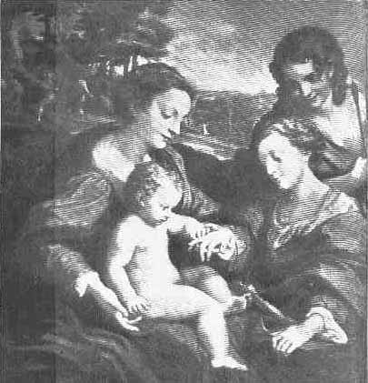</td>
</tr>
<tr class="even">
<td style="text-align: center;">THE MYSTICAL MARRIAGE. 
By Corregio, 1494-1534 (Louvre.)</td>
</tr>
</tbody>
</table>

*Frontespiece to the Open Court*

p. 449

## THE BRIDE OF CHRIST.

BY THE EDITOR.

   IF a distinction is made between Jesus and Christ, we mean by Jesus
the man, while Christ denotes the office and dignity claimed for Jesus.
Jesus lived about nineteen hundred years ago in Palestine,

<table data-align="center">
<colgroup>
<col style="width: 100%" />
</colgroup>
<tbody>
<tr class="odd">
<td style="text-align: center;">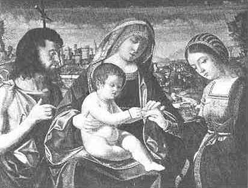</td>
</tr>
<tr class="even">
<td style="text-align: center;">THE MARRIAGE OF ST. CATHERINE. 
By Previtali (15th cent.). In the Church of San Giobbe at Venice.</td>
</tr>
</tbody>
</table>

and he was a Galilean of Jewish descent, while Christ is the God-man,
the realization of human perfection, the highest ideal of religion.

p. 450

   The basis of our Christ-conception is, first, the Gospel tradition of
the character of Jesus, and for certain reasons (into which we need not
enter here) we deem the nucleus of it, mainly represented by Mark,
historical. There have been incorporated into the Gospel stories,
however, certain traits of Christ-conceptions which are older than
Jesus. They are ancient reminiscences of saviours, of divine heroes, of
God-men, of mediators between God and mankind, of God-incarnations,
etc., and from the beginning these notions crystallized with great
exuberance around the figure of the Crucified.

|                                                                                                                                                                                                                                |
|:------------------------------------------------------------------------------------------------------------------------------------------------------------------------------------------------------------------------------:|
|                                                                                                        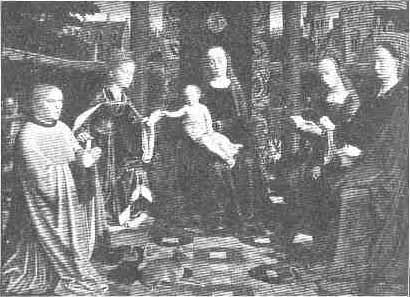                                                                                                        |
|    By David (Gheeraert), d. 1523. In the National Gallery at London. On the right are St. Barbara with a book and Mary Magdalene with ointment, and on the left the donor, Richard van der Capelle. |

   Now it is a characteristic feature of some pagan saviours that when
they have conquered the enemy they enter in triumphal procession and
celebrate their marriage feast. This is especially the case of Bel
Marduk,[1](#page_450_note_1) the main mediator god of
ancient Babylon, who in the faith of his worshipers bears, in many
respects, a close resemblance to the Christ of Christianity.

   Since Christianity was tinged with ascetic sentiments especially in
the beginning, the marriage idea of Christ has been considerably dimmed,
but it was not entirely lost sight of. Not only have we p. 451 references in the parables of Jesus which
state that the kingdom of Heaven is like unto a marriage ([Matt. xxii.
1](../../bib/kjv/mat.htm#22:1)-14) and men's expectancy of salvation is
compared to the wisdom or folly of virgins who wait for the bridegroom
([Matt. xxv. 1](../../bib/kjv/mat.htm#25:1)-13),[2](#page_451_note_2) but St. Paul calls the
Church definitely the "Bride of Christ" ([2 Cor. xi.
2](../../bib/kjv/co2.htm#11:2); [Eph. v.
24](../../bib/kjv/eph.htm#5:24)-32), and St. John the Divine repeatedly
speaks of the bride and the marriage of the Lamb. The bride is Jerusalem
representing the Church and the Lamb is Christ.

<table data-align="center">
<colgroup>
<col style="width: 100%" />
</colgroup>
<tbody>
<tr class="odd">
<td style="text-align: center;">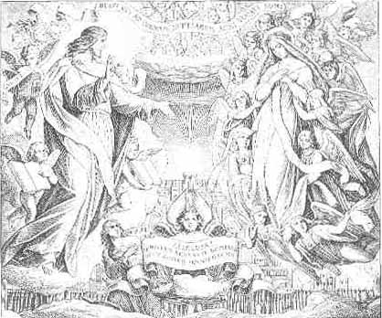</td>
</tr>
<tr class="even">
<td style="text-align: center;">THE MARRIAGE OF THE LAMB. 
By Schnorr von Karolsfeld.</td>
</tr>
</tbody>
</table>

   St. John the Baptist, when announcing Jesus, calls himself the friend
of the bridegroom, but he is not the Christ. John declares "he that hath
the bride is the bridegroom" ([John iii.
29](../../bib/kjv/joh.htm#3:29)), implying therewith that Jesus and not
he himself is the Messiah, and Christ does not request his disciples to
fast, as stated by Mark[3](#page_451_note_3) ([ii.
19](../../bib/kjv/mar.htm#2:19)):

   "And Jesus said unto them, Can the children of the bride-chamber

p. 452

<table data-align="center">
<colgroup>
<col style="width: 100%" />
</colgroup>
<tbody>
<tr class="odd">
<td style="text-align: center;">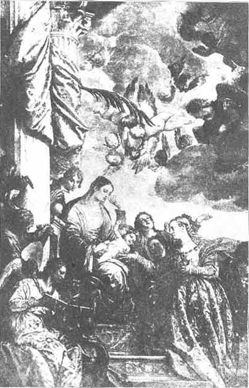</td>
</tr>
<tr class="even">
<td style="text-align: center;">THE MARRIAGE OF ST. CATHERINE 
by Paul Veronese, 1528-1588. In the Church of St. Catherine at Venice.</td>
</tr>
</tbody>
</table>

p. 453 fast, while the bridegroom is with
them? as long as they have he bridegroom with them, they cannot fast."

   These several scattered references to the Saviour as a bridegroom

|                                                                                     |
|:-----------------------------------------------------------------------------------:|
|                                  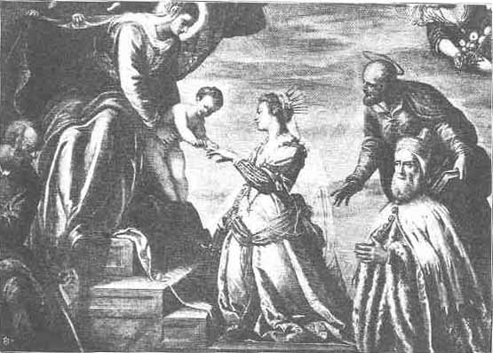                                   |
| By Tintoretto, 1518-1594. In the Ducal Palace at Venice. |

appear in a new light when compared to the bridal festivities of pagan
saviours which were celebrated in the ancient Orient and were also not
unknown in Egypt and in Greece. We can not doubt p.
454 that here, as in many other customs, Babylonian traditions
must have exercised avery powerful influence upon the formation of
religious ideas in Judea.

|                                                                                                   |
|:-------------------------------------------------------------------------------------------------:|
|                                         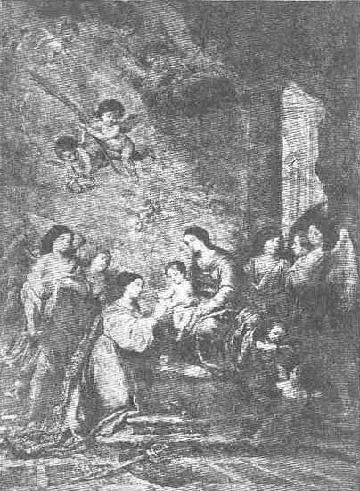                                          |
| By Murillo, 1618-1682. (Cadiz.) This was the artist's last production. |

   Marduk is in more than one respect comparable to Christ. He is the
beloved Son of Ea, the God of Heaven, by whom he is addressed in these
words: "My son, what is it that thou dost not p.
455 know! What then could I still teach thee! What I know thou
knowest also!"[4](#page_455_note_4)

   Marduk, the conquerer of Tiamat, the monster of the deep, is Ea's
vicegerent on earth; he is king of gods and men, and he is the

|                                                                                             |
|:-------------------------------------------------------------------------------------------:|
|                                      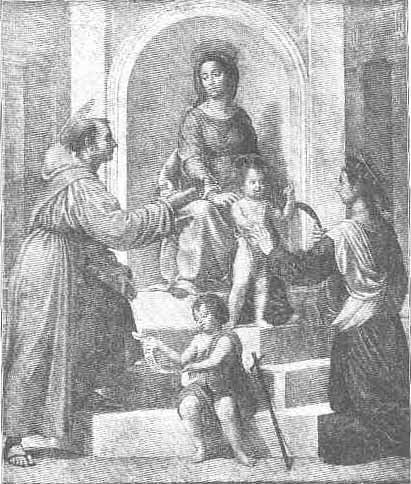                                       |
| By Giuliano Bugiardini, 1475-1554. In the Pinapothek at Bologna. |

incarnation of divine wisdom. He is the saviour god, and the saviour
king with whose arrival the Golden Age begins on earth. But the most
remarkable parallelism obtains between Marduk and Christ in that both
rise from the dead and the festival of resurrection p. 456 is celebrated for each in the beginning of
the natural year in the spring.

   Little is known of Marduk's death, but that he died and descended
into the nether world appears from the fact that he bears the name *Bel
nubatti*, "Lord of lamentation" (or as Schrader translates it, "*Herr
der* \[*Toten*-\]*Klage*"), suggesting the assumption that his death was
lamented in a similar way as the death of Adonis or other vegetation and
solar deities. We further know from Greek sources[5](#page_456_note_5) (Ctesias XXIX, 21 f.;
Ælianus, *Var. Hist.*) that Xerxes opened and plundered the tomb of Bel,
which can only mean the transference of the god's statue from Babylon to
some other place, and proves that the temple of Bel contained the tomb
of the god, thus implying that there was an annual day of lamentation
for his death.

   The Easter festival of Bel coincides with the New Year's day of
Babylon, the first of Nisan, and was celebrated under the name

<table data-align="center">
<colgroup>
<col style="width: 100%" />
</colgroup>
<tbody>
<tr class="odd">
<td style="text-align: center;">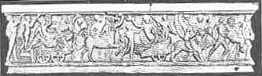</td>
</tr>
<tr class="even">
<td style="text-align: center;">WEDDING PROCESSION OF DIONYSUS AND ARIADNE. 
A Sarcophagus in the Glyptothek at Munich.</td>
</tr>
</tbody>
</table>

*tabû*, which Jensen translates by "resurrection" in the sense of the
Christian Epiphany. It was the main religious festival of Babylon and in
a description of it we read of Marduk: *ihis ana hadassutu*, "he hastens
to wedlock." (Schrader translates, "*er eilte zur Brautschaft*.") His
bride is called Tsarpanitu, which is commonly assumed to be a cognomen
of Istar.

   Similar festivals have been celebrated in other cults, e.g., the
wedding of Zeus with Hera, of Dionysus with Ariadne, of Eros with
Psyche, etc.

   Bel Marduk was replaced among the Persians by Mithras who succeeded
to all the honors of the Babylonian god, and in the days of Christianity
Christ replaced both.

   In Revelations which preserves a more primitive conception of Christ
than the Gospels, and contains more reminiscences of ancient p. 457 Babylon (as Gunkel has proved) than any
other book of the New Testamenent, we read of the marriage feast of the
Lamb ([xix. 7](../../bib/kjv/rev.htm#19:7)-9):

   "Let us be glad and rejoice, and give honor to him: for the marriage
of the Lamb is come, and his wife hath made herself ready. And to her
was granted that she should be arrayed in fine linen, clean and white:
for the fine linen is the righteousness of saints. And he saith unto me,
Write, Blessed are they which are called unto the marriage supper of the
Lamb. And he saith unto me, These are the true sayings of God."

   We must remember that the lamb is the New Testament emblem for Christ
corresponding to Bel Marduk whose symbol is the ram or male sheep,
corresponding also to the ram of Amen Ra. Alexander the Great had a coin
struck which pictured him with the horns of a wether announcing himself
as the son of the god Ammon in order to indicate that he was the
expected king with whose arrival the Golden Age would begin. The word
"lamb" in Revelations translates the Greek ἀρνίον which means a little
ram conveying the idea of a child, born to be the leader of his people.
Our modern idea of a lamb as the symbol of innocence and submission to
the butcher is absolutely missing in the original conception of the
young ram, and we dare say that the intention of the word is almost the
reverse.

   Further down the bride of the lamb is interpreted to be the new city
of Jerusalem, which in Christianity again symbolizes the Church. We
read[6](#page_457_note_6):

   "And I John saw the holy city, new Jerusalem, coming down from God
out of heaven, prepared as a bride adorned for her husband."

   That the interpretation is later than the original idea of a bride is
quite obvious in the Fourth Book of Esdras, where the prophet encounters
a woman and listens to the tale of her tribulation. The woman disappears
and in her place he beholds a city whereupon the angel Uriel explains
the vision saying (4 Esdras x. 44): "The woman which thou hast seen is
Sion, which thou now seest before thee as a builded city."

   A similar idea is found in the Wisdom of Solomon where wisdom is
personified as Sophia and is spoken of as having existed before the
world, taking the place of the Holy Ghost in Christianity. We read for
instance in chapters vii and viii:

   "For wisdom is more moving than any motion: she passeth and goeth
through all things by reason of her pureness. . . . And p. 458 being but one, she can do all things: and
remaining in herself, she maketh all things new: and in all ages
entering into holy souls, she maketh them friends of God, and prophets.
For God loveth none but him that dwelleth with wisdom. . . . Wisdom
reacheth from one end to another mightily: and sweetly doth she order
all things. . . . In that she is conversant with God, she magnifieth her
nobility: yea, the Lord of all things himself loved her. For she is
privy to the mysteries of the knowledge of God, and a lover of his
works."

   Sophia retains this place which she holds in the Old Testament
Apocrypha with the Gnostics, and as we know from a fragment of the
Gospel According to the Hebrews, the Holy Ghost is regarded as the wife
of God the Father, for there Jesus uses the expression "My Mother the
Holy Ghost," as quoted by Epiphanius (*Haeres* LXII, 2).

   The idea of a trinity as God,—father, mother and son—faded away
quickly during the early development of the Christian dogma and it seems
that the replacement of the word *logos* for *sophia* helped to
obliterate the idea that the second person of the deity was female. The
change was also favored by the fact that while *ruah*, the Hebrew term
for spirit, is feminine, the Greek term *pneuma* is neuter.

   The craving for a religious reverence of womanhood remained even in
the age of asceticism, and found its satisfaction in the worship of the
*Theotoktos*, the mother of God, which is a literal translation of
ancient pagan terms, especially the Egyptian *neter mut*, but in
addition the idea of the Saviour's bride though considerably neglected
was never entirely forgotten. In the imagination of the people, though
rarely ever of the clergy, it remained in a hazy atmosphere of mysticism
and finally took a definite shape toward the tenth century by imputing
to Jesus a mystical bride who was called Catharine, the "pure one," to
indicate that she was an ideal of virginity. The notion of any true
wedlock relation was necessarily excluded according to the prevalent
asceticism of Church doctrines and so in this fairytale atmosphere the
legend of a spiritual marriage of Christ assumed a more and more
definite shape.

   The idea of the mystic marriage of Catharine has never found friends
among Protestants, and after the rise of the Reformation it became
almost disregarded even in the Roman Catholic Church, but it has given
us a number of charming and most beautiful pictures which are and will
remain cherished by all lovers of art, not excepting Protestants. In the
Renaissance it was a favorite subject of the greatest artists such as
Murillo, Correggio, Veronese and p. 459 many
others. One old picture by Memling is preserved in St. John's Hospital
at Bruges, and a similar one (reproduced on the next page), painted from
the same models but in a different setting, may be seen the Louvre.

<table data-align="center">
<colgroup>
<col style="width: 100%" />
</colgroup>
<tbody>
<tr class="odd">
<td style="text-align: center;">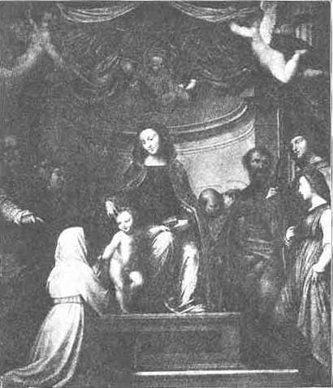</td>
</tr>
<tr class="even">
<td style="text-align: center;">THE MARRIAGE OF ST. CATHARINE. 
By Fra Bartolommeo, 1475-1517. (Louvre.) Because of the nun's habit this can only be Catharine of Siena.</td>
</tr>
</tbody>
</table>

   The more liberal we grow, the less shall we scorn such art
productions from the religious standpoint, for we have acquired breadth
enough to find in them the expression of a tender and

p. 460

|                                                                                                                                                                   |
|:-----------------------------------------------------------------------------------------------------------------------------------------------------------------:|
|                                                                         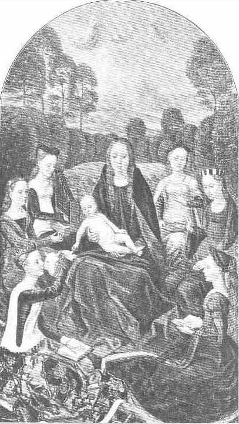                                                                          |
| By Hans Memling, d. 1494. (Louvre.) St. Barbara is represented with a book, and in the background are Cecilia, Agnes and other saints. |

p. 461 poetical sentiment that is frequently
absent in the cold and unimaginative rationalism of the Reformation.

   Unquestionably St. Catharine has been selected as the bride of Christ
on account of her name, for the idea of the bridal relation between the
Saviour and the saved soul is not so unusual as it might appear to a
later born generation, whose interest in fantastic

|                                                                                                                                                                                                                                                                           |
|:-------------------------------------------------------------------------------------------------------------------------------------------------------------------------------------------------------------------------------------------------------------------------:|
|                                                                                                                             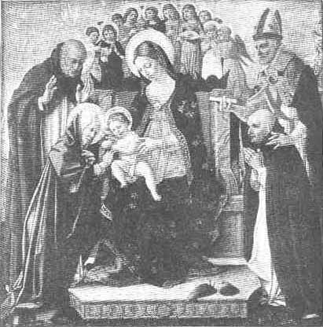                                                                                                                              |
|                                                                                                            ST. CATHARINE OF SIENA.                                                                                                             |
|    By Lorenzo da San Severino (latter half of the 15th cent.) On the nimbus around the head of the kneeling St. Catharine are the words "Santa Katrina de Sene." Other saints in the picture are Dominic, Augustine, and Demetrius of Spoleto. |

imagery has considerably waned. Not only is the Church regarded as the
bride of Christ, but every nun as well, and in the history of Israel the
relation of God to his people is conceived under the same allegory.

   The analogy between the nun's vow and the marriage of a p. 462 bride is obvious in many details of the
ritual, and the same interpretation was not absent in pagan antiquity
where, for instance, the vestal virgins were regarded as matrons and
wore six braids, the characteristic hair dress of brides and married
women.

|                                                                                                                                                                                                                                                             |
|:-----------------------------------------------------------------------------------------------------------------------------------------------------------------------------------------------------------------------------------------------------------:|
|                                                                                                                      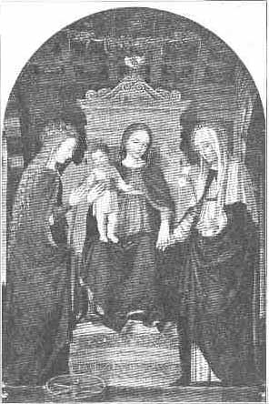                                                                                                                       |
|                                                                                                   MARRIAGE OF THE CATHARINES.                                                                                                    |
|    By Borgognone, d. c. 1524. (National Gallery, London.) The infant Christ holds a ring in each hand and while placing one on the finger of Catharine of Alexandria extends the other ring towards the nun, Catharine of Siena. |

   In the "Common Office for a Virgin and Martyr," the First Responsory
reads as follows in the English version of the Roman Catholic Breviary:

   "Come, Bride of Christ, and take the everlasting crown, which the
Lord hath prepared for thee, even for thee who for the love p. 463 of Him hast shed thy blood, and art entered
with angels into His Garden.

   "Come, O My chosen one, and I will establish My throne in thee, for
the King hath greatly desired thy beauty.

<table data-align="center">
<colgroup>
<col style="width: 100%" />
</colgroup>
<tbody>
<tr class="odd">
<td style="text-align: center;">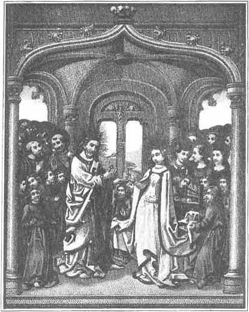</td>
</tr>
<tr class="even">
<td style="text-align: center;">THE MARRIAGE OF ST. CATHARINE. 
From the illumined text of Mielot's <em>Vie de Ste. Catherine</em>, as revised and modernized by M. Sepet.</td>
</tr>
</tbody>
</table>

   "And thou art entered with Angels into His garden."

   There are quite a number of saints that bear the name Catharine,
p. 464 but the bride of Christ was originally
St. Catharine of Alexandria. Among other saints of the same name the
best known is St. Catharine of Siena, and since the people of Siena did
not want to stay behind the Alexaridrians, they too claimed for their
saint the honor of a mystic marriage with Christ which has been duly
represented in the pictures of the saint's life.

   The popularity of St. Catharine is proved by the frequent occurrence
of the name and also by the belief that she belongs to the most powerful
intercessors with God. It will be remembered that Jeanne d'Arc believed
that she was especially supported by the Virgin Mary, the Archangel
Michael and the two saints Margaret and Catharine. Jeanne d'Arc is
reported as having obtained the miraculous sword which she used in
battle from St. Catharine's chapel at Fierbois, after receiving a divine
revelation that it was hidden there.

------------------------------------------------------------------------

[Journals](../index) [Christian Articles](../../chr/etc/index) [St.
Catharine of Alexandria](pc-sca1)

------------------------------------------------------------------------

### Footnotes

p. 450

[1](#page_450_fr_1) See Radau, "Bel,
the Christ of Ancient Times" in *The Monist*, Vol. XIV, pp. 67-119.

p. 451

[2](#page_451_fr_2) See also [Luke
xii. 35](../../bib/kjv/luk.htm#12:35), 36.

[3](#page_451_fr_3) The parallel
passages are [Matt. ix. 15](../../bib/kjv/mat.htm#9:15). and [Luke v.
34](../../bib/kjv/luk.htm#5:34).

p. 455

[4](#page_455_fr_4) *Die
Keilinschriften und das Alte Testament*, pp. 374.

p. 456

[5](#page_456_fr_5) Schrader, ibid.

p. 457

[6](#page_457_fr_6) Compare also
verses 9 and 17.

 

 

 

 

 

 

 

 

 

 

 

 

 

 

 
