[Intangible Textual
Heritage](../../index) [Journals](../index.md) [Christian
Articles](../../chr/etc/index.md)

------------------------------------------------------------------------

 

# ST. CATHARINE OF ALEXANDRIA

### part two

### by Paul Carus

 

------------------------------------------------------------------------

# THE OPEN COURT

 

A MONTHLY MAGAZINE

 

### Devoted to the Science of Religion, the Religion of Science, and the Extension of the Religious Parliament Idea.

 

 

#### Volume XXI

 

#### CHICAGO

##### THE OPEN COURT PUBLISHING COMPANY

##### 1907

###### {Reduced to HTML by Christopher M. Weimer, August 2002}

------------------------------------------------------------------------

<table data-align="center">
<colgroup>
<col style="width: 100%" />
</colgroup>
<tbody>
<tr class="odd">
<td style="text-align: center;">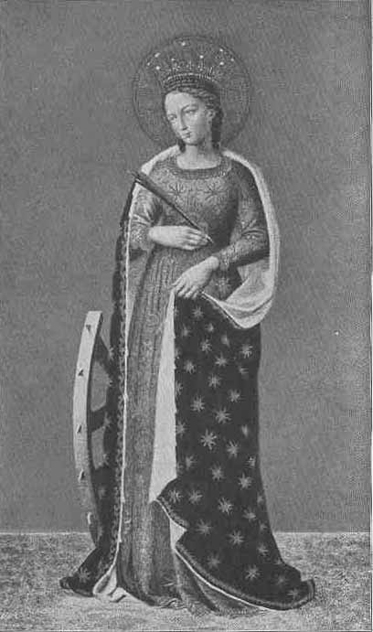</td>
</tr>
<tr class="even">
<td style="text-align: center;">ST. CATHARINE. 
By Fra Angelico, 1387-1455.</td>
</tr>
</tbody>
</table>

*Frontespiece to the Open Court*

p. 727

## ST. CATHARINE OF ALEXANDRIA.[\*](#page_727_note_*.md)

\[CONCLUDED.\]

   The notion that Christ as the Viceroy of God on earth had a bride
constantly remained as much in the minds of the people as the idea of
the anti-Christ. The world was regarded as divided into two camps, the
kingdom of God governed by Christ, identified with the Church under the
leadership of the Pope, and the empire of unbelief which composed the
entire pagan world and also the heretics of Christianity. In the mystic
literature these ideas turn up again and again, and during the Middle
Ages the bride of Christ is usually thought to be the Church, while
among Protestants it is generally the soul. As an instance we will quote
a passage from Hildegard of Bingen, an abbess and a prophetess who saw
visions quite similar to those of St. John the Divine in the
Revelations. She herself was almost illiterate, but her adviser,
presumably her father confessor, reduced her prophecies to an
approximately correct Latin and had them published.

   Pope Eugene IV happened to visit in 1147-48 the Abbot of Treves.
There he met Henry, Archbishop of Mentz who through Kuno, the Abbot of
Disibodenberg had become deeply impressed with the spiritual profundity
and genuineness of Hildegard's visions, and when a report of them was
submitted to the Council of Treves, the Pope, urged by the Abbot Bernard
of Clairvaux who happened to be present, readily acknowledged the divine
origin of Hildegard's revelations and encouraged her in a personal
letter to continue in her writings.[†](#page_727_note_dagger.md)

   We quote a passage from one of the prophecies recorded in the book
*Scivias* ascribed to Hildegard, the substance of which is repeatedly
p. 728 expressed in similar words, and which
makes reference to the Antichrist as well as the bride of Christ which
here symbolizes the Church:

   "I perceived a voice from heaven which spoke to me: Although
everything on earth tends toward the end, yet *the bride of my son* in
spite of the fact that she is hard pressed in her children as well as
she herself by the messengers of the Son of Perdition as well as by
himself, shall by no means be annihilated however much she may be hard
pressed. On the contrary she will rise at the end of time stronger and
more vigorous, and more beautiful, and glorious, so that she will meet
the embraces of her Loved One in a more graceful and lovely manner, and
it is this that the vision which thou seest indicates in a mystical
way."—(Quoted from Preger, *loc. cit.*, p. 34.)

   The sensualism of Hildegard's prophecy is quite in keeping with the
hyperspirituality in which hysterical minds of her type love to indulge.

   The idea that the Church was the bride of Christ has continued down
to modern times, and has been cultivated even among Protestants, who
have been most reluctant to accept the legend of St. Catharine, because
the very idea of attributing a personal bride to Christ seems to give
them a shudder, as if it were blasphemy, for it savors too much of
medireval legends, saintworship, and paganism. Yet the belief in a
symbolical bride is still retained as is evidenced by many chorals sung
even to-day which celebrate the marriage of the Lamb, or the marriage of
the King, the bride being mostly the soul, or the elect, represented by
the wise virgins. We quote the following lines:

<table data-align="center" data-cellpadding="10">
<colgroup>
<col style="width: 100%" />
</colgroup>
<tbody>
<tr class="odd">
<td>"The Bridegroom is advancing 
   Each hour he draws more nigh. 
Up! Watch and pray, nor slumber 
   At midnight comes the cry.</td>
</tr>
<tr class="even">
<td>"The watchers on the mountain 
   Proclaim the bridegroom near. 
Go, meet him as he cometh 
   With hallelujahs clear."</td>
</tr>
</tbody>
</table>

   In another choral we read:

<table data-align="center" data-cellpadding="10">
<colgroup>
<col style="width: 100%" />
</colgroup>
<tbody>
<tr class="odd">
<td>"Jerusalem the holy 
   To purity restored; 
Meek bride, all fair and lowly, 
   Go forth to meet thy Lord.</td>
</tr>
</tbody>
</table>

p. 729

<table data-align="center" data-cellpadding="10">
<colgroup>
<col style="width: 100%" />
</colgroup>
<tbody>
<tr class="odd">
<td>"With love and wonder smitten 
   And bowed in guileless shame, 
Upon thy heart be written 
   The new mysterious name."</td>
</tr>
</tbody>
</table>

   And a third churchsong of the same character begins with this stanza:

<table data-align="center" data-cellpadding="10">
<colgroup>
<col style="width: 100%" />
</colgroup>
<tbody>
<tr class="odd">
<td>"The marriage feast is ready, 
   The marriage of the lamb. 
He calls the faithful children 
   Of faithfuI Abraham.</td>
</tr>
<tr class="even">
<td>"Now from the golden portals 
   The sounds of triumph ring; 
The triumph of the Victor, 
   The marriage of the King."</td>
</tr>
</tbody>
</table>

   The church hymns here quoted are by no means all the songs of this
character. There are many more that belong to the same class, for
instance: "Behold the Bride-groom Cometh," beginning "Our lamps are
trimmed and burning"; and "The Lord is coming by and by," with the
refrain, "Will you be ready when the Bridegroom comes?" We mention
further, "Wake, awake, the night is flying," and there are several
others more.

   Protestantism has most assuredly gone to the extreme in rejecting
romantic similes and fantastic notions, yet the underlying idea is the
same as in pre-Christian festivals and, if we discovered in an ancient
cuneiform inscription the two lines:

<table data-align="center" data-cellpadding="10">
<colgroup>
<col style="width: 100%" />
</colgroup>
<tbody>
<tr class="odd">
<td>"The triumph of the Victor, 
The marriage of the King!"</td>
</tr>
</tbody>
</table>

our Assyriologists would hot hesitate to say that the words have
reference to Bel Marduk, who after his victory over the dragon Tiamat
enters in triumphal parade to celebrate his marriage with Istar
Tsarpanitu.[\*](#page_729_note_*.md)

   The legend which makes Catharine the bride of Christ has been much
neglected since the rise of Protestantism, which had more influence upon
the Roman Catholic Church than is commonly conceded. There are
innumerable pictures of the fifteenth and the beginning of the sixteenth
century representing the mystic marriage, but the Reformation seems to
have acted as a blight on the romanticism of the legend. Even Roman
Catholic artists had become too sober, we might say, too prosaic, and
perhaps too timid, to revert to this formerly so very popular subject.

p. 730

   The London National Gallery contains at least six St. Catharines, one
among them (No. 168) is the famous St. Catharine of Alexandria by
Raphael. Another (No. 249) is by Lorenzo da San

<table data-align="center">
<colgroup>
<col style="width: 100%" />
</colgroup>
<tbody>
<tr class="odd">
<td style="text-align: center;">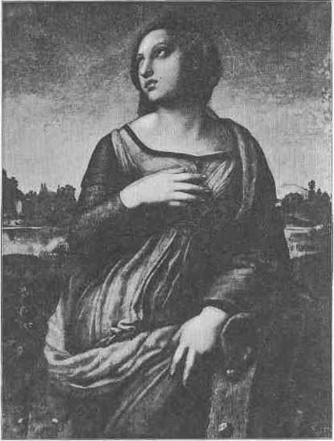</td>
</tr>
<tr class="even">
<td style="text-align: center;">ST. CATHARINE. 
By Raphael, 1483-1520. In the National Gallery at London.</td>
</tr>
</tbody>
</table>

Severino, a mystic marriage of St. Catharine of Siena, to whom (as we
have seen in our previous article on "The Bride of Christ"[\*](#page_730_note_*).md) p.
731 on account of the sameness of the name the same mystic
relation is attributed. The "Two Catharines" by Ambrogio Borgognone[†](#page_731_note_dagger.md) is also one of
the National Gallery collection (No. 298).

   St. Catharine of Siena was a most striking figure in the Middle Ages
and did not fail to impress the people with her extraordinary powers as
a saint. She lived 1347-1380, at the time when the idea of the mystic
marriage had already taken deep root in the hearts of the faithful.
Being the daughter of a poor dyer she rose from the humblest
surroundings. As early as in her thirteenth year she joined the
Dominican order in which solely because of her sanctity

<table data-align="center">
<colgroup>
<col style="width: 100%" />
</colgroup>
<tbody>
<tr class="odd">
<td style="text-align: center;">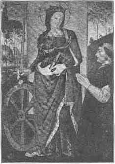</td>
</tr>
<tr class="even">
<td style="text-align: center;">By Pinturicchio, 1454-1513 
National Gallery, London.</td>
</tr>
</tbody>
</table>

and in spite of her lack of culture she took a leading position and
played a prominent part even in the historical events of the age.
Popular belief naturally fastened upon her all the honors of her
namesake of Alexandria, and her mystic marriage has been pictured in her
home, the Dominican convent at Siena, and by Umbrian painters.

   The *Pall Mall Magazine* in a series of articles entitled "Half
Holidays at the National Gallery," in an attempt to make the subject
p. 732 intelligible to the modern Protestant
spirit, makes the following comment upon San Severino's picture:

   "The mystic marriage which forms the subject of this picture, where
the infant Christ is placing the ring on her finger, suggests the secret
of her power. Once when she was fasting and praying, Christ himself
appeared to her, she said, and gave her his heart. For love was the
keynote of her religon, and the mainspring of her life. In no merely
figurative sense did she regard herself as the spouse of Christ, but
dwelt upon the bliss, beyond all mortal happiness, which she enjoyed in
communion with her Lord. The world has not lost its ladies of the race
of St. Catharine, beautiful and

   

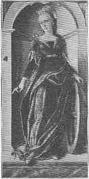

   By Carlo Crivelli,[\*](#page_732_note_*.md) 1430-1493. In the
National Gallery, London.

   By an unknown artist of the Umbrian School.
National Gallery, London.

pure and holy, who live lives of saintly mercy in the power of human and
heavenly love."

   It stands to reason that the rivalry of the two Catharines led to
acrimonious disputes which in those days were taken more seriously than
the later born generation of a scientific age can appreciate. St.
Catharine of Alexandria being the older one had a prior and a better
claim and could no longer be ousted from her p.
733 eminent position, so a compromise was made in which the two
Catharines were regarded as being both genuine brides of Christ, yet at
the same time it was understood that ecclesiastical authority would
henceforth tolerate no other saints to aspire for the same honor.

<table data-align="center">
<colgroup>
<col style="width: 100%" />
</colgroup>
<tbody>
<tr class="odd">
<td style="text-align: center;">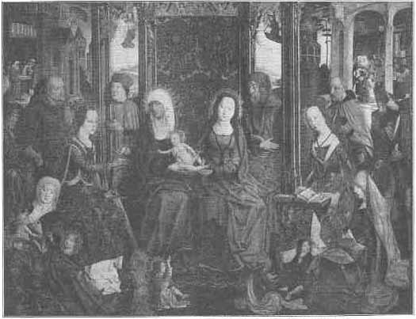</td>
</tr>
<tr class="even">
<td style="text-align: center;">THE HOLY FAMILY AND SAINTS CATHARINE AND BARBARA. 
Artist known as "Master of the Holy Family" (<em>Sippe</em>). In the Wallraf-Richartz Museum at Cologne.</td>
</tr>
</tbody>
</table>

   A painting by Pinturicchio (also in the National Gallery) shows the
donor kneeling with folded hands before our saint who listens to his
prayer with a truly royal grace.

   Two more pictures of St. Catharine in the National Gallery of p. 734 London are the one by Carlo Crivello, the
other by an unknown master of the Umbrian school.

<table data-align="center">
<colgroup>
<col style="width: 100%" />
</colgroup>
<tbody>
<tr class="odd">
<td style="text-align: center;">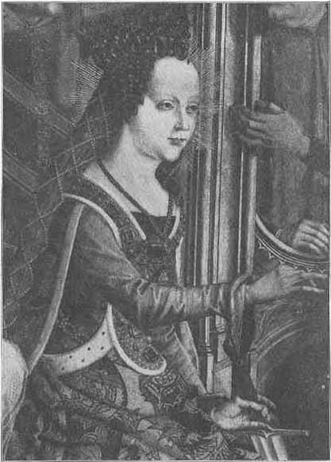</td>
</tr>
<tr class="even">
<td style="text-align: center;">ST. CATHARINE. 
Detail from the above.</td>
</tr>
</tbody>
</table>

   Considering the fact that in Northern Germany and in the Netherlands
the Reformation spread with great rapidity in the first p. 735 half of the sixteenth century, and that with
it every trace of a belief in a mystic marriage was thoroughly wiped out
together with all saint-veneration or reverence for legendary lore, we
are astonished to find a great number of Catharine pictures in these
very countries.

<table data-align="center">
<colgroup>
<col style="width: 100%" />
</colgroup>
<tbody>
<tr class="odd">
<td style="text-align: center;">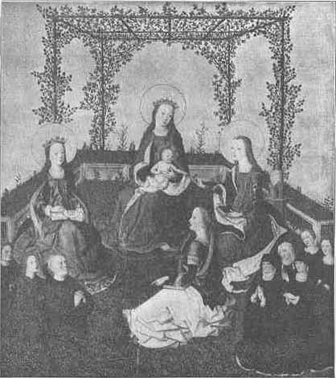</td>
</tr>
<tr class="even">
<td style="text-align: center;">MADONNA AND CHILD TOGETHER WITH FEMALE SAINTS AND DONOR'S FAMILY. 
Artist known as "Master of the Life of Mary."</td>
</tr>
</tbody>
</table>

   We call special attention to a picture painted by an artist called
*Meister der heiligen Sippe* (i.e., the master of the holy family) who
represents the mystic marriage like a German family scene in which the
bride is a typical German noblewoman of the time, well educated, p. 736 with an expression of simple-hearted
devotion, and dressed with painstaking elegance.

   Another artist, known as the Master of the Life of Mary, places the
scene of the mystic marriage into a gracefully blossoming arbor, the
foliage of which is so ideally sparse as to indicate very early
springtime. Here too the features of all the saints are genuinely
Teutonic, exhibiting the self-satisfied complacency of wealthy
patricians, while the modest donors with their austere faces are crowded
into the corners.

<table data-align="center">
<colgroup>
<col style="width: 100%" />
</colgroup>
<tbody>
<tr class="odd">
<td style="text-align: center;">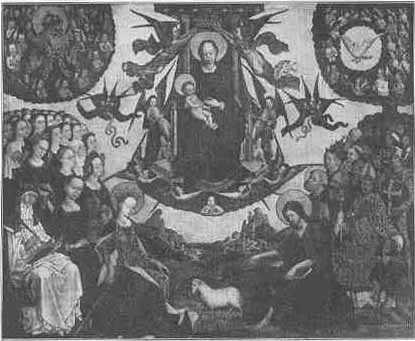</td>
</tr>
<tr class="even">
<td style="text-align: center;">THE GLORIFICATION OF THE VIRGIN. 
Artist unknown. In the hospital at Cues.</td>
</tr>
</tbody>
</table>

   In a painting called "The Glorification of the Virgin" an unknown
master of the German school presents us with a general view of the
Christian world-conception of his age. In the heavens appears the
Trinity. In the center God the Son is represented as the Christ-child in
the arms of his mother, while on her right is God the Father and on her
left the Holy Ghost. Below on earth the male saints are headed by John
the Baptist, while St. Catharine takes the leadership of the female
saints.

p. 737

   ln further evidence of the extraordinary popularity of St. Catharine
in Germany we reproduce two pictures of Master Wilhelm, who may have
used the same model for both, showing here once in profile and then full
face. Yet we shall find that all his saints possess a great family
likeness in that they possess extremely small

<table data-align="center">
<colgroup>
<col style="width: 100%" />
</colgroup>
<tbody>
<tr class="odd">
<td style="text-align: center;">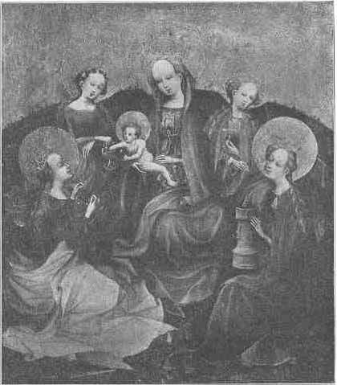</td>
</tr>
<tr class="even">
<td style="text-align: center;">MADONNA AND SAINTS. 
By "Master Wilhelm." In the Berlin Museum.</td>
</tr>
</tbody>
</table>

hands and unusually large foreheads. Of a similar type, though not quite
so pronounced, are the St. Catharines by Stephen Lochner and by the
Master of the Life of Mary, while an unknown artist of the Westphalian
school endows his St. Catharine with hands of normal size.

p. 738

   The life of the saint has beeen made the subject of careful study
especially in England, where Mrs. Jameson[\*](#page_738_note_*.md) and Dr. Einenkel have
treated the subject with great ability. Both have come to the conclusion
to look upon Hypatia as the prototype of St. Catharine's

|                                                                                                 |                                                                                         |
|:-----------------------------------------------------------------------------------------------:|:---------------------------------------------------------------------------------------:|
|                                        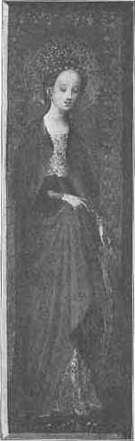                                        |                                    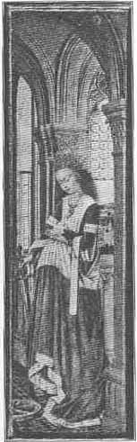                                    |
|                            ST. CATHARINE.                            |                                                                                         |
|    By "Master Wilhelm." Detail from the Madonna of the Bean Blossom. |    By Jan Van Eyck, 1386-1440. Kgl. Gemäldegalerie, Dresden. |

martyrdom. The latter deems the similarities of the life of the saint
and her pagan parallel exceedingly striking. He says (pp. xi-xii):

p. 739

   "Time, place and background exactly agree. Both ladies are of high
and noble origin; both deeply, and from their childhood, imbued in the
sciences of paganism; both reasoning with philosophers,

|                                                                                                                    |                                                                                                                        |
|:------------------------------------------------------------------------------------------------------------------:|:----------------------------------------------------------------------------------------------------------------------:|
|                                                 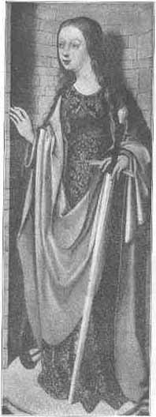                                                  |                                                   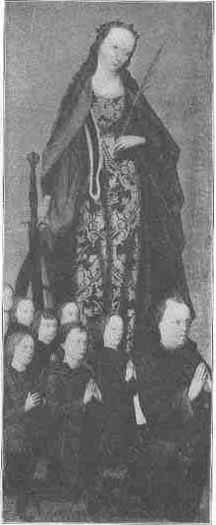                                                    |
|                                     ST. CATHARINE.                                      |                                                                                                                        |
|    By an artist of the "Westphalian School." In the Wallraf-Richartz Museum at Cologne. |    Artist known as "Master of the Life of Mary." in the Wallraf-Richartz Museum at Cologne. |

and, indeed, philosophers themselves; both suffering and dying for their
belief. Here, too, in the religious story as in Egyptian history, we
have a representative of the worldly power playing an

p. 740

<table data-align="center">
<colgroup>
<col style="width: 100%" />
</colgroup>
<tbody>
<tr class="odd">
<td style="text-align: center;">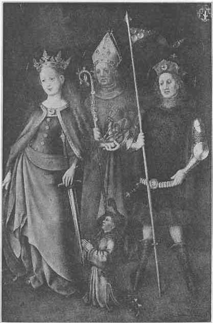</td>
</tr>
<tr class="even">
<td style="text-align: center;">SAINTS CATHARINE, HUBERT, AND QUIRINUS. 
By Stephen Lochner in the Munich Gallery.</td>
</tr>
</tbody>
</table>

p. 741 important part in the tragedy, he
being in reality the only slayer of the virgin. If we come to speak of
the alterations which the plain historical facts have undergone, there
is indeed not one of them which might not easily be accounted for either
by the change of religion or by the changes of times."

<table data-align="center">
<colgroup>
<col style="width: 100%" />
</colgroup>
<tbody>
<tr class="odd">
<td style="text-align: center;">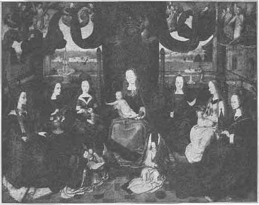</td>
</tr>
<tr class="even">
<td style="text-align: center;">MADONNA AND SAINTS. 
Artist known as the "Master of St. Severin."</td>
</tr>
</tbody>
</table>

   In the oldest report of the legends, the *Menologium Basilianum*, we
read that "seeing the slaughter of animals, she was so greatly moved
that she went to King Maximus." This is a trace left of a religious
movement against bloody sacrifices. Though the Christians had adopted
the argument and used it against the pagan mode p.
742 of worship, they did not make it as prominent as it appears
here. For the God of the Christians was also the God of the Jews, and as
such he had demanded bloody sacrifices as much as any of the

|                                                                                                                                                                                                            |
|:----------------------------------------------------------------------------------------------------------------------------------------------------------------------------------------------------------:|
|                                                                                             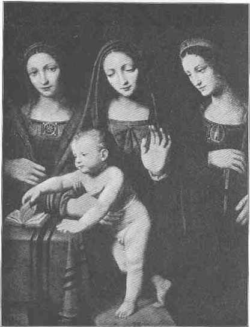                                                                                              |
|                                                              MADONNA AND CHILD, WITH SAINTS BARBARA AND CATHARINE.                                                              |
|    By Bernardino Luini, 1470-1535. St. Catharine may be recognized by the wheel which she wears as an ornament while the emblem of St. Barbara is the tower with three windows. |

pagan gods. In fact, if we can trust historical reports, the temple of
Jerusalem must have reeked with the blood of slaughtered bullocks p. 743 and other cattle which the pious Jews in
their zealous devotion offered in uncounted numbers.

   There were Oriental philosophers in Alexandria who had been under
Jaina and Buddhist influences and denied the righteousness of the
ceremonial shedding of blood. But we need not even go so far as distant
India to explain the feeling that revolted against bloody sacrifice. The
Neoplatonists had given frequent utterance to the same sentiment, and
the great religious leader, Apollonius of Tyana[\*](#page_743_note_*.md) left no opportunity
unimproved to preach against the impiety of bloody sacrifice.

<table data-align="center">
<colgroup>
<col style="width: 100%" />
</colgroup>
<tbody>
<tr class="odd">
<td style="text-align: center;"></td>
</tr>
<tr class="even">
<td style="text-align: center;">THE VIRGIN ENTHRONED. 
Sienese of late fifteenth century. The Virgin is attended by saints among whom is St. Catharine.</td>
</tr>
</tbody>
</table>

   We cannot doubt that whatever be the historical source of the St.
Catharine legend we have here tradition which is ultimately based upon a
myth of a solar bride. It is certainly not a mere accident that the
emblem of St. Catharine is the wheel which from time immemorial has been
the symbol of the sun, and we must remember that the ancient punishment
of an execution on the wheel was originally meant as a sacrifice to the
sun-god.

p. 744

   Does Fra Angelico perhaps follow an ancient tradition when he
represents St. Catharine clothed in a garment covered with the stars of
the heavens? The story of the bride of Christ certainly testifies to the
tenacity of religious ideas, and perhaps also to the truth that even in
different religions, pagan as well as Christian, the same ideas and the
same allegories turn up again and again, as if they were the permanent
element in all historical changes.

------------------------------------------------------------------------

[Journals](../index) [Christian Articles](../../chr/etc/index.md)

------------------------------------------------------------------------

### Footnotes

p. 727

[\*](#page_727_fr_*.md) This article was
begun in the November number and was preceded by another on the same
subject entitled "The Bride of Christ," which appeared in August.

[†](#page_727_fr_dagger.md) For
further details see Wilhelm Preger's *Geschichte der Mystik*, pp. 33 f.

p. 729

[\*](#page_729_fr_*.md) Schrader,
*Keilinschriften und das Alte Testament*, pp. 371 and 394.

p. 730

[\*](#page_730_fr_*.md) *The Open Court*,
Aug., 1907, [p. 461](pc-bc.htm#page_461.md).

p. 731

[†](#page_731_fr_dagger.md) *Ibid.*,
[p. 462](pc-bc.htm#page_462.md).

p. 732

[\*](#page_732_fr_*.md) A copy of this
picture in the church of St. Giobbe at Venice bears the name Previtali,
which, considering the fact that they are apparently made by the same
hand, is strong evidence that the artist worked under two names.

p. 738

[\*](#page_738_fr_*.md) *Sacred and
Legendary Art*, II, 87-88.

p. 743

[\*](#page_743_fr_*.md) See "Apollonius
of Tyana," by T. Whittaker, *Monist*, XIII, 161.

 

 

 

 

 

 

 

 

 

 

 

 

 

 

 
