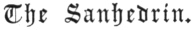

  
[Intangible Textual Heritage](../../index)  [Judaism](../index) 
[Index](index)  [Previous](bar072)  [Next](bar074) 

------------------------------------------------------------------------

[Buy this Book at
Amazon.com](https://www.amazon.com/exec/obidos/ASIN/B001W0Z4K8/internetsacredte)

------------------------------------------------------------------------

  
*The Talmud*, by Joseph Barclay, \[1878\], at Intangible Textual
Heritage

------------------------------------------------------------------------

p. 176

## TREATISE X.

 

Judges—Judgments—The Tribunal of Seventy-one—The
Great Sanhedrin—The Small Sanhedrin—High Priest—Funerals—King—Royal
Wives—Book of the Law—Objections to Judges—Relations—Examination of
Witnesses—Evidence—Judgments in Money and Judgments in Souls—Form of the
Sanhedrin—Appointment of Judges—Intimidation of
Witnesses—Investigations—Acquittal or
Condemnation—Stoning—Hanging—Burning—Beheading—Strangling
Blasphemy—Idolatry—Enticing—Sorcery—A Son Stubborn and
Rebellious—Burglary—Murder—Theft—Those who have no portion in the World
to come—The Rebellious Elder—The False Prophet—The False Witness.

### CHAPTER I.

1\. "Judgments for money (require) three
(judges). Robbery and beating (require) three. Damages or half damages,
double payments and payments four or five fold (require) three.
Constraint, and enticement, and slander (require) three." The words of
R. Meier. But the Sages say, "slander (requires) twenty-three judges,
because there exist in it judgments of souls."

2\. Stripes (require) three judges. In the name of Rabbi Ishmael, the
Sages say, "twenty-three." "The intercalary month [1](#fn_363) requires three. The intercalary year
requires three." The words of Rabbi Meier. Rabban Simon the son of

p. 177

\[paragraph continues\] Gamaliel said,
"with three judges they begin, and with five they discuss, and they
conclude with seven; and if they concluded with three it is
intercalated."

3\. "The appointment of elders, and striking off the heifer's neck [1](#fn_364) (require) three." The words of Rabbi
Simon; But Rabbi Judah said, "five." The loosing off the shoe, [2](#fn_365) and dissatisfaction in marriage
(require) three. The produce [3](#fn_366) of
the fourth year, [4](#fn_367) the second
tithes, of which the value is unknown (require) three. The valuation of
holy things (requires) three. The estimation of movable things requires
three. R. Judah said, "one of them must be a priest." Immovable things
require nine judges and a priest; and the valuation of a man (slave) is
similar.

4\. Judgments of souls (require) twenty-three judges. Bestiality
(requires) twenty-three, as is said, "and thou shalt slay the woman and
the beast," and it is also said, "the beast thou shalt slay." An ox to
be stoned (requires) twenty-three judges; as it is said, "The ox shall
be stoned, and his owner also shall be put to death," [5](#fn_368) as is the death of the owner, so is the
death of the ox. The wolf, and the lion, and the bear, and the leopard,
and the panther, and the serpent, are to be put to death with
twenty-three judges. R. Eliezer said, "every one who first killed them
has gained honour." R. Akiba said, "they are to be put to death after a
judgment with twenty-three (judges)."

5\. A tribe must not be judged, nor a false prophet, nor a high priest,
save before the tribunal of seventy-one. And soldiers must not go forth
to lawful warfare, save by a decree of the tribunal of seventy-one. Men
must not add to the city or to the temple courts, save by a decision of
the tribunal of seventy-one. They must not appoint judges to the tribes,
save by a decision of the tribunal of seventy-one; A city must not be
excluded, save by the tribunal of seventy-one. And the tribunal must not
exclude a city on the border, nor exclude three cities, but only one or
two.

6\. The Great Sanhedrin consisted of seventy-one members,

p. 178

and the small one of twenty-three. And whence know we that the great one
contained seventy-one? as is said, "Gather unto me seventy men of the
elders of Israel:" [1](#fn_369) and Moses over
them. There are seventy-one. R. Judah said "seventy." And whence know we
that the small one consisted of twenty-three? as is said, "Then the
congregation shall judge;" [2](#fn_370) "and
the congregation shall deliver." A congregation to judge, and a
congregation to deliver, there is twenty. And whence know we that a
congregation required ten? as is said, "How long shall I bear with this
evil congregation?" [3](#fn_371) Joshua and
Caleb were excepted. "And whence know we to produce the other three?"
From the meaning, as is said, "Thou shalt not follow a multitude to do
evil." [4](#fn_372) I am hearing that "I shall
be with them for good." If so, why is it said, "to decline after many to
wrest *judgment"?* [4](#fn_372) "Because thy
inclinations to good do not equal thy inclinations to evil. Thy
inclinations to good are by the report of one. Thy inclinations to evil
are by the report of two. And a tribunal must not be balanced. Another
must be added. There are twenty-three." "And how populous must be the
city suited for judges?" "One hundred and twenty." R. Nehemiah said,
"two hundred and thirty to represent twenty-three overseers of tens."

------------------------------------------------------------------------

### Footnotes

[176:1](bar073.htm#fr_368) The Jewish year is
composed of twelve lunar months. It is adapted to the solar year by the
use of an intercalary month called Veaddar—the additional Addar. Every
nineteen years there are seven occasions on which this embolismic month
must be introduced to prevent the various feasts revolving over the four
seasons of the year, like the Moslem fast of Ramadhan. Formerly the
Sanhedrin arranged this intercalary month to suit the harvest, so that
if it were late, the wave sheaf and other observances should still be
kept according to their proper dates. When, however, the Sanhedrin was
suppressed by the Emperor Constantine, Hillel the Second of Tiberias
ruled that an intercalary month of twenty-nine days should be added in
the 3d, 6th, 8th, 11th, 13th, 17th, and 19th years of the Metonic Cycle.
This decision has since remained the Jewish standard for reckoning time.

[177:1](bar073.htm#fr_369) Deut. xxi. 4.

[177:2](bar073.htm#fr_370) Deut. xx. 5, 9.

[177:3](bar073.htm#fr_371) Lev. xix. 24.

[177:4](bar073.htm#fr_372) Deut. xiv. 22-25.

[177:5](bar073.htm#fr_373) Exod. xxi. 29.

[178:1](bar073.htm#fr_374) Numb. xi. 17.

[178:2](bar073.htm#fr_375) Numb. xxxv. 24, 25.
A congregation or *minyan* must not be less than ten men. If there be
10,000 women they cannot form a minyan. The Lord Jesus more mercifully
promises His presence to "two or three gathered together." Matt. xviii.
20.

[178:3](bar073.htm#fr_376) Numb. xiv. 27.

[178:4](bar073.htm#fr_378) Exod. xxiii. 2.

------------------------------------------------------------------------

[Next: Chapter II](bar074)
