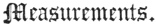

  
[Intangible Textual Heritage](../../index)  [Judaism](../index) 
[Index](index)  [Previous](bar101)  [Next](bar103) 

------------------------------------------------------------------------

[Buy this Book at
Amazon.com](https://www.amazon.com/exec/obidos/ASIN/B001W0Z4K8/internetsacredte)

------------------------------------------------------------------------

  
*The Talmud*, by Joseph Barclay, \[1878\], at Intangible Textual
Heritage

------------------------------------------------------------------------

p. 255

## TREATISE XIV.

 

Priests and Levites guarding the Temple—Officer of
the Watch—Gates—Chambers—Keys—Manner of entering the
House—Nicanor—Steps—Altar—Place of Slaughter—The Laver—The Porch—The
Sanctuary—Repairing the Holy of Holies—Measurements—Judging the
Priesthood.

### CHAPTER I.

1\. The priests guarded the sanctuary in
three places, in the House Abtinas, [1](#fn_563) in the House Nitzus, [2](#fn_564) and in the House Moked; [3](#fn_565) and the Levites in twenty-one places,
five at the five gates of the Mountain of the House, four at its four
corners inside, five at the five gates of the Court, four at its four
corners outside, and one in the chamber of the Offering, and one in the
chamber of the Veil, and one behind the House of Atonement.

2\. The Captain of the Mountain of the House went round to every Watch
in succession with torches flaming before him, and to every guard who
did not stand forth, the Captain said, "Peace be to thee." If it
appeared that he slept, he beat him with his staff; and he had
permission to set fire to his cushion. [4](#fn_566) And they said, "what is the voice in the
Court?" "It is the voice of the Levite being beaten, and his garments
burned, because he slept on his guard." [5](#fn_567)

p. 256

\[paragraph continues\] Rabbi Eliezer, the
son of Jacob, said, "once they found the brother of my mother asleep,
and they burned his cushion."

3\. There were five gates to the Mountain of the House, two Huldah gates
in the south which served for going in and out, Kipunus in the west
served for going in and out; Tadi [1](#fn_568)
in the north served for no (ordinary) purpose. Upon the east gate was
portrayed the city Shushan. Through it one could see the High Priest who
burned the heifer, and all his assistants going out to the Mount of
Olives.

4\. In the court were seven gates—three in the north, and three in the
south, and one in the east. That in the south was called the gate of
Flaming, the second after it, the gate of Offering; the third after it
the Water-gate. That in the east was called the gate Nicanor. And this
gate had two chambers, one on the right, and one on the left; one the
chamber of Phineas, the vestment keeper, and the other the chamber of
the pancake maker.

5\. And at the gate Nitzus on the north was a kind of cloister with a
room built over it, where the priests kept ward above, and the Levites
below; and it had a door into the Chel. [2](#fn_569) Second to it was the gate of the
offering. Third the House Moked.

6\. In the House Moked were four chambers opening as small apartments
into a saloon—two in the Holy place, and two in the Unconsecrated place;
and pointed rails separated between the Holy and the Unconsecrated. And
what was their use? The south-west chamber was the chamber for offering.
The south-east was the chamber for the show-bread. In the north-east
chamber the children of the Asmoneans deposited the stones of the altar
which the Greek Kings had defiled. [3](#fn_570)
In the north-west chamber they descended to the house of baptism.

7\. To the House Moked were two doors one open to the Chel, and one open
to the court. Said Rabbi Judah, "the one open to the court had a wicket,
through which they went in to sweep the court."

8\. The House Moked was arched, and spacious, and surrounded

p. 257

with stone divans, and the elders of the Courses slept there with the
keys of the court in their hands; and also the young priests each with
his pillow on the ground.

9\. And there was a place a cubit square with a tablet of marble, and to
it was fastened a ring, and a chain upon which the keys were suspended.
When the time approached for locking the gates, the priest lifted up the
tablet by the ring, and took the keys from the chain and locked inside,
and the Levites slept outside. When he had finished locking, he returned
the keys to the chain, and the tablet to its place, laid his pillow over
it, and fell asleep. If sudden defilement happened, he rose and went out
in the gallery that ran under the arch, and candles flamed on either
side, until he came to the house of baptism. Rabbi Eleazer the son of
Jacob, says, "in the gallery that went under the Chel, he passed out
through Tadi."

Our Beauty be upon Thee in Three Places.

------------------------------------------------------------------------

### Footnotes

[255:1](bar102.htm#fr_569) A famous maker of
incense.

[255:2](bar102.htm#fr_570) Sparkling.

[255:3](bar102.htm#fr_571) Burning. The watch
at certain gates seems to have been hereditary in certain families. Just
as at the present time the custody of Rachel's tomb is the privilege of
a certain family in Jerusalem. Each guard consisted of 10 men, so that
there were 210 Levites in the 21 stations. The three more important
places contained guards of both Levites and Priests; 30 of each. There
were therefore 240 Levites on guard each night.

[255:4](bar102.htm#fr_572) He rolled up his
overcoat and laid it down for a cushion.

[255:5](bar102.htm#fr_573) Rev. xvi. 15.

[256:1](bar102.htm#fr_574) Obscurity.

[256:2](bar102.htm#fr_575) Platform or rampart.

[256:3](bar102.htm#fr_576) 1 Mac. ii. 25.

------------------------------------------------------------------------

[Next: Chapter II](bar103)
