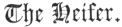

  
[Intangible Textual Heritage](../../index)  [Judaism](../index) 
[Index](index)  [Previous](bar120)  [Next](bar122) 

------------------------------------------------------------------------

[Buy this Book at
Amazon.com](https://www.amazon.com/exec/obidos/ASIN/B001W0Z4K8/internetsacredte)

------------------------------------------------------------------------

  
*The Talmud*, by Joseph Barclay, \[1878\], at Intangible Textual
Heritage

------------------------------------------------------------------------

p. 300

## TREATISE XVI.

 

 [1](#fn_618)

The Heifer's Age—Ages of other Offerings—Places from
which the Red Heifer may come—Blemishes—Black hairs—Separation of the
Priest for burning the Red Heifer—Sprinkling—Lads who drew water from
Siloam—Number of Red Heifers—Bridge to the Mount of Olives—Procession of
Heifer and Attendants—Pile for burning—Position of the Heifer—Position
of the Priest—Slaughter of the Heifer—Sprinkling the Blood—Kindling the
Pile—Gathering the Ashes—Doctrine of Intention—Vessels—Pumpkin Bottles—A
Hollow Reed—Purifications—Cases of Casuistry—Seas—Wells—Reptiles—A Clean
Place—Hyssop—Sprinkling.

### CHAPTER I.

1\. Rabbi Eliezer said, "the red heifer
must be a calf of a year old, or an heifer of two years." But the Sages
say, "a calf of two years, and an heifer of three years, or of four
years." Rabbi Meier said, "even of five years she is allowed, or older.
But they are not to wait (longer) for her, lest she turn black, and be
disallowed." Rabbi Joshua said, "I only heard, third." They said to him,
what is the meaning of "third?" He said to them, "thus I heard it
without explanation." The son of Azai said, “I will explain it, if you
say “third,” that is to others in counting; but if you say one of three,
that is, of three years.” As when they say, a fourth vineyard.” They
said to him, "what means fourth?" He said to them, "thus I heard it
without explanation." Said the son of Azai, "I will explain. If you say
'fourth,' that is, to others in counting. But as you say one of four,
that is, of four years. As when they

p. 301

say, he who eats in a leprous house an half loaf, [1](#fn_619) of three loaves to the cab of flour."
They say to him, "say eighteen loaves to the seah of flour." He said to
them, "Thus I heard it without explanation." Said the son of Azai, "I
will explain. If you say three to the cab, there is no dough-offering.
But if you say, eighteen to the seah, the dough-offering diminishes it."

2\. R. José the Galilean said, “the cleansing of the Levites required
bullocks of two years old, as is said, “And another young bullock shalt
thou take for a sin-offering. [2](#fn_620)” But
the Sages say, "even of three years." R. Meier said, "bullocks even of
four and five years are allowed, but old ones are not brought, for
honour's sake."

3\. Sacrifices required lambs of a year old, and rams of two years old,
and all (are reckoned) from day to day. [3](#fn_621) If they be thirteen months old, neither
ram nor lamb are allowed. R. Tarphon called it, "half and between." The
son of Azai called it, "pointed out" R. Ishmael called it, "recalled
coin." If the ram be brought for offering, and the libation of the ram
be brought with him, it does not pass for his offering, except he be
thirteen months and one day old. That is the law for the ram.

4\. The sin-offering of the congregation, and their burnt-offerings, the
sin-offering of an individual, and the trespass-offering of the
Nazarite, and the trespass- offering of the leper, are allowed for
thirty days and upwards, and even on the thirtieth day. And if they are
brought on the eighth day, they are allowed, vows, free-will-offerings,
the first-born, and the tithe, and the passover, are allowed from the
eighth day and upwards, and even on the eighth day.

------------------------------------------------------------------------

### Footnotes

[300:1](bar121.htm#fr_625) The Jews say that
Solomon, who understood all the commands of God, could not comprehend
the full meaning of the Red Heifer.

[301:1](bar121.htm#fr_626) The meaning is that
he who spends as much time in a leprous house, as is sufficient for
eating a loaf of such a size, becomes defiled in his garments. See
Leprosy, xiii. 10.

[301:2](bar121.htm#fr_627) Numb. viii. 8.

[301:3](bar121.htm#fr_628) The age of the lamb
was reckoned from its birthday in Elul of last year, till the first day
of Elul in the current year.

------------------------------------------------------------------------

[Next: Chapter II](bar122)
