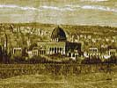

  
[Intangible Textual Heritage](../../index)  [Judaism](../index.md) 
[Index](index)  [Previous](bar126)  [Next](bar128.md) 

------------------------------------------------------------------------

[Buy this Book at
Amazon.com](https://www.amazon.com/exec/obidos/ASIN/B001W0Z4K8/internetsacredte.md)

------------------------------------------------------------------------

  
*The Talmud*, by Joseph Barclay, \[1878\], at Intangible Textual
Heritage

------------------------------------------------------------------------

### CHAPTER VII.

1\. "When five persons filled five barrels with water of purification,
to purify five persons requiring purification, and they changed their
mind for one purification, or they prepared for one purification, and
they changed their mind for five?" "They are all allowed." "One person
who filled five barrels to purify five persons requiring purification,
and changed his mind for one purification?" "None is allowed but the
last." "Or he made ready for one purification, and changed his mind for
five purifications?" "None is allowed

p. 311

but the first purification." "If he said to one, 'purify all those for
thee?'" "None is allowed but the first." "Purify all those for me?"
"They are all allowed."

2\. "He who fills (water of purification) with one hand, and does work
with the other hand, if he fill for himself or for another person, or if
he fill for both at once?" "Both are disallowed, since work disallows in
filling (water of purification) whether for himself or for another."

3\. "He who puts in ashes with one hand, and does work with the other
hand?" "If it be for himself, it is disallowed; but if it be for another
person, it is allowed." "He who while doing work puts in ashes for
himself and for another?" "His own is disallowed, and the other's is
allowed." "He who puts in ashes for two persons at once?" "Both are
allowed."

4\. "Put in ashes for me; and I will put in ashes for thee?" "The first
case is allowed." "Fill water for me; and I will fill water for thee?"
"The latter case is allowed." "Put in ashes for me, and I will fill
water for thee?" "Both cases are allowed." "Fill water for me; and I
will put in ashes for thee?" "Both cases are disallowed."

5\. "A person filled water for his own use, and (also) for
purification?" "He fills first for himself and binds it on the
shoulder-pole; and afterwards he fills that for purification." "And if
he fill that for purification first, and afterwards fill for himself?"
"It is disallowed." He must put his own water behind him, and the water
for purification before him. "And if he put that for purification behind
him?" "It is disallowed." "Both are water for purification, he put one
in front and one behind him?" "It is allowed, because it is not
otherwise possible."

6\. "If one carry a rope in his hand?" [1](#fn_637) "If he go in the (straight.md) way, it is
allowed." "If he go out of his way?" "It is disallowed." One went to
Jabneh [2](#fn_638.md) during

p. 312

three feasts, about this matter, and in the third feast it was allowed
to him as a decision for the time.

7\. "If one rolled the rope round his hand?" "It is allowed; but if he
rolled it after (drawing the water), it is disallowed." Said R. José,
"this act they allowed as a decision for the time."

8\. "If one put aside the barrel lest it be broken, or turned it on its
mouth for the purpose of drying it, intending to fill it with water?"
"It is allowed." "But if he did so to carry in it ashes?" "It is
disallowed." If one turned out potsherds from the trough, that it might
contain more water, it is allowed; but if they would be no hindrance to
him in the time of sprinkling, it is disallowed.

9\. "One who had water on his shoulder, and he taught a decision in the
law, or he showed the way to others, or he killed a serpent or a
scorpion, or he took food to put it aside?" "It is disallowed." "The
food was for eating?" "It is allowed." "The serpent or scorpion hindered
him?" "It is allowed." Said Rabbi Judah, "this is the rule—an act for
work, whether a man stood or did not stand, is disallowed. And an act
which is not for work, if he stood, is disallowed; but if he did not
stand, it is allowed."

10\. "He who handed over his water of purification to an unclean
(person)?" "It is disallowed." "But if he handed it to a legally clean
person?" "It is allowed." R. Eleazar said "even to a (person legally)
unclean it is allowed, if its owner did no work."

11\. "Two persons drew water for purification, and each helped the
other, or each took a thorn from the other?" "For one purification it is
allowed, for two purifications, it is disallowed." R. José said, "even
for two purifications it is allowed, if it were made a condition between
them."

12\. "He who has broken (something) during drawing water for
purification with the view of preparing it afterwards?" "The water is
allowed." "But if he prepared it?" "The water is disallowed." [1](#fn_639.md) "He ate with the view of drying

p. 313

the remainder of his food?" "The water is allowed." "But if he dried
it?" "The water is disallowed." "He ate and left some, and he threw away
what was left in his hand under a fig-tree, or into the place of drying,
that it might not be lost?" "The water is disallowed."

------------------------------------------------------------------------

### Footnotes

[311:1](bar127.htm#fr_644.md) The principle laid
down in this mishna is that if one merely carried the rope for drawing
the water, it was allowed to him to do so. But if he used the rope for
any work advantageous to himself it was disallowed.

[311:2](bar127.htm#fr_645.md) The modern Yebna
(Jamnia).

[312:1](bar127.htm#fr_646.md) The water is
disallowed, because the man gained something for himself during the act
of drawing it. His intention was not single-minded and pure.

------------------------------------------------------------------------

[Next: Chapter VIII](bar128.md)
