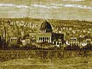

  
[Intangible Textual Heritage](../../index)  [Judaism](../index.md) 
[Index](index)  [Previous](bar127)  [Next](bar129.md) 

------------------------------------------------------------------------

[Buy this Book at
Amazon.com](https://www.amazon.com/exec/obidos/ASIN/B001W0Z4K8/internetsacredte.md)

------------------------------------------------------------------------

  
*The Talmud*, by Joseph Barclay, \[1878\], at Intangible Textual
Heritage

------------------------------------------------------------------------

### CHAPTER VIII.

1\. "Two persons watched a trough, containing water for purification,
one of them becomes legally unclean?" "It is allowed, because it was in
the safe keeping of the second." "He became clean and the second
unclean?" "It is allowed, because it was in the safe keeping of the
first." "Both became unclean at once?" "It is disallowed." "One of them
did work?" "It is allowed, because it was in the safe keeping of the
second." "He stood still, and the second did work?" "It is allowed,
because it was in the safe keeping of the first." "Both worked at once?"
"It is disallowed."

2\. If one put ashes in the water for purification, he must not put on
his sandal, for if the water fall on the sandal, it becomes legally
unclean, and renders him legally unclean. This is the proverb, "What
makes thee unclean, cannot make me unclean, but thou canst make me
unclean." "If water fall on his flesh?" "He is clean." "If it fall on
his garment?" "It becomes unclean, and renders him unclean." This is the
proverb, "What makes thee unclean, cannot make me unclean, but thou
canst make me unclean."

3\. He who burned the red heifer, and the bullocks; [1](#fn_640.md) and he who sent forth the scapegoat,
render garments unclean. The heifer, and the bullocks, and the scapegoat
which was sent forth, cannot of themselves render garments unclean. This
is the proverb—"What makes thee unclean, cannot make me unclean, but
thou canst make me unclean."

4\. If one eat from the carcase of a clean bird, as it is in his throat,
it renders garments unclean. The carcase itself does not render garments
unclean. This is the proverb,

p. 314

\[paragraph continues\] "What makes thee
unclean, cannot make me unclean, but thou canst make me unclean."

5\. Every [1](#fn_641.md) secondary uncleanness
does not render vessels unclean, but fluid does so. If fluid become
unclean, it renders vessels unclean. This is the proverb, "What makes
thee unclean, cannot make me unclean, but thou canst make me unclean."

6\. Earthen vessels cannot render each other unclean, but fluid does so.
If fluid becomes unclean, it renders vessels unclean. This is the
proverb, "What makes thee unclean, cannot make me unclean, but thou
canst make me unclean."

7\. Everything [2](#fn_642.md) which disallows the
heave-offering renders the fluid unclean so as to be a primary
uncleanness, for rendering a person unclean, and disallowing him, except
he was one who washed by day. [3](#fn_643.md) This
is the proverb, "What makes thee unclean, cannot make me unclean, but
thou canst make me unclean."

8\. All seas are reckoned for a pool of purification as is said, "And
the gathering together of the waters called [the](errata.htm#6.md)
seas" [4](#fn_644.md) The words of R. Meier. R.
Judah said, "the great sea is as a purifying pool, it is not said seas,
but there is in it many kinds of seas." R. José said, "all seas may
purify in flowing, but they are disallowed for issues, and leprosies,
and for purifying with them the water of the ashes of the red heifer."

9\. Waters with a nickname are disallowed. These are the nicknames—salt
and lukewarm. Deceitful [5](#fn_645.md) waters are
disallowed. These are deceitful waters,—they failed once in seven
years—they failed during war and during famine, yet they are allowed. R.
Judah "disallows them."

10\. The waters of Kirmion (Kishon?), and the waters of Pygah (Belus?)
are disallowed, because they are the waters of marshes. The waters of
the Jordan and the waters of

p. 315

\[paragraph continues\] Jarmuk [1](#fn_646.md) are disallowed, because they are mixed.
And these are mixed waters, one allowed and one disallowed are mixed.
Two which are allowed and mixed, are allowed. R. Judah "disallows them."

11\. “The well of Ahab [2](#fn_647.md) and the
cave of Panias [3](#fn_648.md) are allowed. Water
which changed, but changed of itself, is allowed. A well of water which
came from a distance is allowed, only it must be watched, that no man
check it. R. Judah said, "it is taken for granted and allowed." "A well
into which earth or clay fell?" "One must wait till it clear." The words
of R. Ishmael. R. Akiba said, "there is no need of waiting."

------------------------------------------------------------------------

### Footnotes

[313:1](bar128.htm#fr_647.md) Lev. iv. 12, 21.

[314:1](bar128.htm#fr_648.md) Primary uncleanness
arises from touching a dead body, leprosy, etc. Secondary uncleanness
arises front touching one who had primary uncleanness.

[314:2](bar128.htm#fr_649.md) A tertiary
uncleanness follows from contact with secondary uncleanness.

[314:3](bar128.htm#fr_650.md) That is one over
whom evening had not yet come, nor was his offering yet made. Lev. xxii.
6, 7.

[314:4](bar128.htm#fr_651.md) Gen. i. 10.

[314:5](bar128.htm#fr_652.md) Isaiah lviii. 11.

[315:1](bar128.htm#fr_653.md) The river Jarmuk is
the Hieromax of the Greeks. It falls into the Jordan about four miles
below the Lake of Tiberias. The Arabs now call it the Sheríat el
Mandhûr.

[315:2](bar128.htm#fr_654.md) The well of Ahab is
supposed by some to be the source of a river near Beirût. This
supposition is, however, very doubtful.

[315:3](bar128.htm#fr_655.md) The modern Banias,
one of the sources of the Jordan. It is situated under Mount Hermon,
close to the remains of the ancient Cæsarea Philippi.

------------------------------------------------------------------------

[Next: Chapter IX](bar129.md)
