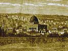

  
[Intangible Textual Heritage](../../index)  [Judaism](../index.md) 
[Index](index)  [Previous](bar145)  [Next](bar147.md) 

------------------------------------------------------------------------

[Buy this Book at
Amazon.com](https://www.amazon.com/exec/obidos/ASIN/B001W0Z4K8/internetsacredte.md)

------------------------------------------------------------------------

  
*The Talmud*, by Joseph Barclay, \[1878\], at Intangible Textual
Heritage

------------------------------------------------------------------------

### CHAPTER X.

"How did Bezaleel make the candlestick?" "He made it from an ingot of
gold, and it was like a beam. And above and below he made bowls, knops,
and flowers, and drew out from it two branches, one on either side, and
from it he drew out two other branches, one on either side, and again
drew out two branches, one on either side, as is said, 'And six branches
shall come out of the sides of it.'" [3](#fn_765.md) But we could not understand the
hammering of the bowls, until it be said, "And in the candlesticks shall
be four bowls made like unto almonds with their knops and their
flowers." [4](#fn_766.md) Aisi, the son of Judah,
said, “there are five expressions in the Law, and they have no fixed
meaning. These are they, “accepted,” [5](#fn_767.md) “cursed,” [6](#fn_768.md) “to-morrow,” [7](#fn_769.md) “made like unto almonds,” [8](#fn_770.md) “and will rise up.” [9](#fn_771.md) "If thou doest well, shalt thou not be
accepted?" or; "thou shalt be accepted even if thou doest not well."
"Cursed be their anger for it was fierce," or; "for in their anger they
slew a man, and in their selfwill they houghed cursed oxen." "To-morrow
I will stand" or "go out, fight with Amalek to-morrow." "Made like unto
almonds with their knops, and their flowers," or "four bowls made like
unto almonds." "And this people

p. 349

will rise up," or, "thou shalt sleep with thy fathers, and thou shalt
rise up." These are the five expressions in the Law which have no fixed
meaning. Aisa, the son of Akbia, said, "it happened once to be more
(than a talent by) a dinar of gold, and it was brought into the crucible
eighty times." The body of the candlestick was eighteen handbreadths,
the feet and the flowers were three handbreadths, and two handbreadths
were smooth, and one handbreadth was for the bowl, a knop and a flower,
and two handbreadths were smooth, and one handbreadth a knop, and two
branches proceeded from it, one on either side. And two handbreadths
were smooth, and one handbreadth a knop, and two branches proceeded from
it, one on either side, and two handbreadths were smooth, and one
handbreadth a knop, and two branches proceeded from it on either side.
There remained three handbreadths, in which were the bowls, the knops,
and the flowers, as is said "Three bowls made like unto almonds with a
knop and a flower in one branch." [1](#fn_772.md)
It follows that the bowls were twenty-two, and the knops eleven, and the
flowers nine. "The bowls, to what were they like?" "To cups of
Alexandria." "The knops, to what were they like?" "To the apples of
pine-trees." [2](#fn_773.md) "The flowers to what
were they like?" "To the flowers on the pillars of the temple." It is
found that you learn that there exists in the candlestick difficulty and
forgetfulness more than in all the other vessels. "And whence know we
that OMNIPRESENCE showed to Moses, the vessels ready, and the
candlestick ready?" As it is said, "see and make them according to their
patterns." [3](#fn_774.md) Although Solomon made
ten candlesticks and all of them were lawful for service, as is said,
"And he made ten candlesticks of gold according to heir form, and set
them in the temple, five on the right hand and five on the left." [4](#fn_775.md) If you say, five on the south and five
on the north, is not the candlestick on the north worthless? "And what
is meant by saying, five on the right hand and five on the left?" "Five
on the right side of the candlestick of Moses, and five on the left side
of the

p. 350

candlestick of Moses, even though they lighted the candlestick of Moses
only, as is said, 'And the candlestick of gold, with the lamps thereof,
to burn every evening,'" [1](#fn_776.md) Rabbi
José, the son of Rabbi Judah, said, "they were all lighted," as is said,
"Moreover the candlesticks with their lamps, that they should burn after
the manner, before the oracle of pure gold; and the flowers, and the
lamps, and the tongs made he of gold, and that perfect gold." [2](#fn_777.md) All these completed the golden one of
Moses. Those on the west and east flamed in front of the middle light,
as is said, "The seven lamps shall give light over against the
candlestick." [3](#fn_778.md) From thence Rabbi
Nathan said, "the middle one is the most honourable." The seven lamps
flamed alike, and their lamps were equal, and they resembled each other.
"How did they snuff it?" "They removed the snuff from the candlestick
and deposited it in the tent, and rubbed it with a sponge." "It follows
that many priests were busied on one lamp." The words of Rabbi José. But
the Sages say, "they did not remove the lamps from their places; they,
only removed the snuff from the candlestick, as is said, He shall order
the lamps upon the pure candlestick.'" [4](#fn_779.md)

------------------------------------------------------------------------

### Footnotes

[348:3](bar146.htm#fr_773.md) Exod. xxv. 32.

[348:4](bar146.htm#fr_774.md) xxv. 34.

[348:5](bar146.htm#fr_775.md) Gen. iv. 7.

[348:6](bar146.htm#fr_776.md) xlix. 7.

[348:7](bar146.htm#fr_777.md) Exod. xvii. 9.

[348:8](bar146.htm#fr_778.md) xxv. 34.

[348:9](bar146.htm#fr_779.md) Deut. xxxi. 16.

[349:1](bar146.htm#fr_780.md) Exod. xxv. 33.

[349:2](bar146.htm#fr_781.md) Or "egg shaped,
oval."

[349:3](bar146.htm#fr_782.md) Exod. xxv. 40.

[349:4](bar146.htm#fr_783.md) 2 Chron. iv. 7.

[350:1](bar146.htm#fr_784.md) 2 Chron. xiii. 11.

[350:2](bar146.htm#fr_785.md) iv. 20, 21.

[350:3](bar146.htm#fr_786.md) Numb. viii. 2.

[350:4](bar146.htm#fr_787.md) Lev. xxiv. 4.

------------------------------------------------------------------------

[Next: Chapter XI](bar147.md)
