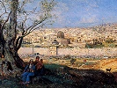

  
[Intangible Textual Heritage](../../index)  [Judaism](../index.md) 
[Index](index)  [Previous](bata06)  [Next](bata08.md) 

------------------------------------------------------------------------

[Buy this Book on
Kindle](https://www.amazon.com/exec/obidos/ASIN/B0031574IW/internetsacredte.md)

------------------------------------------------------------------------

  
*The Babylonian Talmud in Selection*, by Leo Auerbach, \[1944\], at
Intangible Textual Heritage

------------------------------------------------------------------------

p. 106 p. 107

### The Day of Atonement

### (Tractate Yoma)

EVEN days before the Day of Atonement the High Priest was moved from his
home into the Chamber of the officials. And a substitute was prepared,
lest something happen to him and disqualify him. Rabbi Yehuda said:
Another wife was also prepared for him, lest his wife die. For it was
said: (*Lev*. xvi, 6) *And make atonement for himself, and for his
house*. "His house"—this is his wife. Said they to him: If so, there is
no end to the thing.

They appointed for him Elders from the Elders of the Court, who read
before him of the order of the day, and they said to him: My Master,
High Priest, read with thine own mouth, you might have forgotten, or you
might have never learned. On the eve of the Day of Atonement, early in
the morning they put him at the Eastern Gate, and they passed before him
oxen, rams, and sheep, so that he might get acquainted with and used to
the service.

p. 108

For the whole seven days they did not withhold from him any food or
drink. But on the eve of the Day of Atonement, toward nightfall, they
did not let him eat much, because too much food brings on sleep.

The Elder of the Court delivered him to the Elders of the priesthood and
took him up to the House of Abtinas, and adjured and took leave from him
and left. They said to him: My Master, High Priest, we are the delegates
of the Court and thou art our delegate, and the delegate of the Court.
We adjure you by Him who made His name dwell in this House, that thou
change not aught of what we have told thee. He turns aside and weeps and
they turn aside and weep. If he was a scholar he would preach, but if
not, disciples of the Sages preached for him. If he was used to reading
he would read, if not, they read for him. And what do they read for him?
From *Job*, from *Ezra* and from *Chronicles*. Zecharaiah ben Kabutal
said: Many times I have read for him from *Daniel*.

(*Mishna*)

 

"HE TURNS aside and weeps and they turn aside and weep." He turned aside
and wept because he was suspected of being a Saduccee, and they turned
aside and wept, for as Rabbi Joshua ben Levi said,—When someone suspects
another who is guiltless, he will be punished bodily. What was all this
about?—so that he would not arrange the incense outside and then bring
it into the Holy of Holies, as the Saduccees were apt to do. The Rabbis
taught: There was once a Saduccee who arranged the incense outside and
then brought it in. As he was departing he was very joyous. His father
met him and said: Though we are Saduccees, we are afraid

p. 109

of the Pharisees. Answered the son: My whole life I was aggrieved over
this verse. (*Lev*. xvi, 2) *For I will appear in the cloud upon the
mercy seat*. I thought, when shall I have the opportunity to fulfill
this? Now that the opportunity has presented itself to me; should I not
have fulfilled it? It was related, that only a few days later he was
found dead, lying on a heap of refuse, and worms were coming out of his
nose. Some say he was smitten as he was coming out. Rabbi Hiya said: A
noise was heard in the Temple Court. An angel came and smote him in the
face. When his brethren, the priests, came upon him, they found imprints
of a calf's foot between his shoulders. For it was said: (*Ezekiel* i,
7) *And their feet were straight feet; and the sole of their feet was
like the sole of a calf's foot*.

The Rabbis taught: Three sounds are heard from one end of the world to
the other, and these are: The sound of the revolutions of the sun; the
sound of the noise of Rome, and the sound of the soul as it departs from
the body. Some say also the sound of birth. Some say also of Ridya, the
angel of rain. The Rabbis prayed for mercy on the soul as it leaves the
body, and so the sound has stopped.

In accordance with Rabbi Shila it was stated: If one starts on a journey
before the cock crows, his blood is upon his own head. Rabbi Josiah
said: Not until he has crowed a second time; and some say, till he has
crowed three times. What sort of a cock? They said, an average cock.

Rab Yehuda said in the name of Rab: When the Israelites gathered into
the temple for the festivals they stood tightly pressed, but when they
prostrated themselves

p. 110

they did it in comfort. They extended eleven ells beyond the Holy of
Holies—What does he mean by this?—He means as follows: Though they
extended eleven ells beyond the Holy of Holies, when they stood tightly
pressed, when they prostrated themselves they did it and there was
plenty of space. This was one of the ten miracles that were performed in
the Temple. . . .

(*Gemara*)  
FROM CHAPTER I

 

NO MAN enters the Temple Court to do service until he immerses himself,
even if he be clean. The High Priest immersed himself five times and
made ten sanctifications of his hands and his feet on that day.

Between the Priest and the public there was spread a linen sheet. He
took off his clothes, went down and immersed himself. He then came up
and dried himself. They brought him gold garments, and he put them on,
and sanctified his hands and his feet. They brought him the
Daily-Offering. He made the incision in the neck while another priest
finished the slaughtering. He received the blood and sprinkled it. He
went in to burn the morning incense and to arrange the candles, and then
to offer the head and the limbs, the pancakes, and the wine.

The morning incense was offered between the sprinkling of the blood and
the offering of the limbs; that of the evening between the offering of
the limbs and the Drink-Offering. If the High Priest was old or frail
they used to prepare for him hot water. They poured it into the cold so
as to take away the chill.

They brought him into the Parvah Chamber, which

p. 111

belonged to the Holy ground. They spread a linen sheet between him and
the public; he sanctified his hands and feet and took his garments off.
Rabbi Meir says: He took off, sanctified his hands and feet, went down,
immersed himself, came up and dried himself. They brought him white
garments, he put them on and sanctified his hands and his feet.

In the morning he put on garments made of Pellusin linen worth twelve
*minahs*. In the afternoon he wore clothes of India worth eight hundred
*zuz*. This according to Rabbi Meir. But the Sages say: At dawn he put
on garments worth eighteen *minahs* while in the afternoon his garments
were worth twelve *minahs*. Altogether, thirty *minahs*. These were
provided at the cost of the people, but if he wanted to spend more he
could do so out of his own pocket.

He then went to his bullock. The bullock stood between the Hall and the
Altar, its head was to the south and its face to the west. The Priest
stood in the east and his face was to the west. He put his hands on the
bullock and made his confession. And so he used to say: Oh, Lord, I have
sinned; 1 have transgressed; I have committed iniquity before Thee. I
and my house. O Lord, forgive the sins, the transgressions and the
iniquities that I have sinned, transgressed and committed before Thee—I
and my house, as it is written in the Laws of Moses, Thy servant:
(*Lev*. xvi, 30) *For on that day shall the priest make an atonement for
you, to cleanse you that ye may be clean from all your sins before the
Lord*. And they answered after him: Blessed be the name of His glorious
kingdom forever and ever.

He then came to the east, to the north of the Altar,

p. 112

the deputy priest at his right, and the chief of the house of the
Fathers of the Temple at his left. There were the two he-goats. There
was also an urn with two straws, for drawing lots. They were made of
boxwood, but ben Gamla later made them of gold, for which his name is
remembered with praise.

 

BEN Katin made twelve corks for the washbasin that originally had only
two. He also made a device for the basin, so that the water would not be
contaminated during the night. King Monabaz made all the handles of the
vessels of the day of Atonement out of gold. His mother, Helena, made a
golden candelabra over the entrance to the Temple. She also made a
tablet of gold, on which was written the paragraph of *Sotah*. A miracle
happened to the gates of Nicanor, and he was remembered in honor.

But these were remembered in dishonor: Those of the House of Garmu—they
would not teach how to make the Shew-bread; those of the house of
Abtinas—for they would not teach how to make the incense; Hygros ben
Levi, who knew how to sing, but would not teach it to anyone; Ben
Kamtzar, who would not teach the art of writing. Of the first they said:
(*Prov*. x, 7) *The memory of the just is blessed*. Of the latter it was
said: (Prov. x, 7) *The name of the wicked shall rot*.

(*Gemara*)

 

"IN THE morning he put on garments made of Pellusin linen worth eighteen
*minahs*, etc." Does the author wish to teach us anything by this? He
teaches us that the sum total must not be changed, but one may spend

p. 113

more on one and less on the other. But all are of the opinion that the
morning is more important than the afternoon. Whence is this? Said Rabbi
Huna ben Elai: We read (*Lev*. xvi, 4) *Linen, linen, linen, linen*.
This means the best linen. An objection: (*Ezek*. xliv, 19) *And they
shall put on other garments: and they shall not sanctify the people with
their garments*. "Others"; probably better than the ones?—No; "other"
means inferior ones.

 

WHEN the Public service is over, then a priest for whom a mother made a
garment may perform his personal offering in it, but after the service
he should donate it to the community. Is not this self-evident? One
could think that perhaps the priest may not donate it to the community.
Therefore he teaches us thus: They related about Rabbi Ishmael ben Phabi
that his mother made him a garment worth a hundred *minahs*. He put it
on and performed the personal offering and then donated it to the
community. They said of Rabbi Eleazar ben Harsom that his mother made
for him a garment worth two thousand *minahs*, but his brethren, the
priests, would not let him put it on for he looked in it as if he were
naked.—How could this be possible? Did not the master say that the
threads were six-ply?—Abaya answered: As transparent as the wine in a
glass.

The Rabbis taught: The poor, the rich, and the evil come before the
Court of Heaven. They ask of the poor, Why did you not occupy yourself
with the study of the law? If he says. I was poor and busy with my
livelihood, they answered him: Were you poorer, then, than Hillel? It
was related about Hillel, the elder, that every

p. 114

day he worked and earned a *tropaik*. Half of it he would give to the
gate-keeper at the house of learning, and half was for his food and that
of his household. One day he could not find his earnings, and the
gate-keeper would not let him in. He hoisted himself up and sat on the
window sill, so that he could hear the word of the living God from the
lips of Shemaya and Abtalion. They say it was Sabbath eve in the fall of
the year and snow came down upon him. When the dawn rose Shemaya said to
Abtalion: Every day it is light in the house, while today it is dark. Is
it a cloudy day? They looked up and saw the figure of a man in the
window. They went up and found him covered with three cubits of snow.
They brought him down, bathed him, rubbed him with oil and set him
before the hearth. They said: He is worthy to have the Sabbath
desecrated for his sake.

To a rich man they say: Why didn't you occupy yourself with the study of
the Torah? If he says, I was rich and was busy with my possessions, they
say to him: Were you richer than Rabbi Eleazar? They related of Rabbi
Eleazar ben Harsom that his father left him a thousand villages on the
mainland and a thousand ships on the oceans. But every day he would take
a sack of flour on his shoulder and wander from town to town and from
countryside to countryside in order to learn the *Torah*. One day his
servants found him and drafted him for public work. He said to them:
Please let me go, and let me study the law. Said they to him: By the
life of Rabbi Eleazar ben Harsom, we shall not let you go. He never saw
them again in his life, but all his life long he sat and studied the
*Torah*, day and night.

To the wicked they say: Why didn't you occupy

p. 115

yourself with the study of the Law? If he said: I was handsome and
because of my passion I had no time for it, They would say to him: Were
you, then, more handsome than Joseph? They said of Joseph, the
righteous, that every day the wife of Potiphar tried to lure him with
words. The clothes that she put on for his sake in the morning, she
would not wear in the evening. The clothes that she wore in the evening,
she would not wear in the morning. She entreated him: "Listen to me",
but he said: "No." She said to him: "I shall put you in prison." He
said: (*Psalms* cxlvi, 7) *The Lord looseth the prisoners*.—"I shall
bend thy stature."—He answered: (*Psalms* cxlvi, 8) *The Lord raiseth
them that are bowed down*.—"I shall blind your eyes."—(*Ibid*.) The Lord
openeth the eyes of the blind. She then gave him a thousand silver
pieces, so that he should hearken to her: (*Gen*. xxxix, 10) *to lie by
her, or to be with her*. But he would not submit to her, to lie with her
in this world, and to be with her in the world to come. In this way
Hillel condemns the poor, while Rabbi Eleazar ben Harson condemns the
rich, and Joseph condemns the wicked.

(*Mishna*)  
FROM CHAPTER III

 

HE SHOOK the urn and brought up two lots. On one was written: "For the
Lord," and on the other was written: "To Azazel." The deputy was to his
right, and the Chief of the Fathers to his left. If the lot "For the
Lord" was in his right hand, the deputy priest would say: My Master,
High Priest, lift thy right hand; if the lot "For the Lord" was in his
left hand, the Father of the House of the Temple would say: My Master,
High

p. 116

\[paragraph continues\] Priest, lift thy
left hand. He put them on the two he-goats, and said: "A Sin-offering
for the Lord." Rabbi Ishmael said: He does not have to say: "A
Sin-Offering", but only "For the Lord," and they answered after him:
"Blessed be the Name of His glorious Kingdom for ever and ever."

He bound a bright red wool ribbon on the head of the scape-goat and
turned it the way it would be sent out. And the goat that was to be
slaughtered he turned towards the place where it would be slaughtered.
Then he came again upon his bullocks, put his hands on them and made his
confession.

(*Mishna*)  
FROM CHAPTER IV

 

THE ladle and the pan were handed to him. He took two hands full of the
incense and put it into the ladle, which was large if his hand was
large, and it was small if his hand was small, for that was the measure.
He took the pan in his right hand and the ladle in his left hand. He
walked through the Temple till he came between the two curtains that
separate the Holies from the Holy of Holies. There was the space of an
ell between them. Rabbi Yosi says, there was only one curtain, for it
was said: (*Exodus* xxvi, 33) *And the veil shall divide unto you
between the holy place and the most holy*. The outer curtain was tied
back from the south side, while the inner was tied back on the north
side. He walked between them until he reached the north side; when he
[reached](errata.htm#3.md) the north he turned his face to the south, and
[walked](errata.htm#4.md) to the left of the curtain, till he reached the
Ark. When he reached the Ark, he put the pan between the two poles. He
heaped up the incense on the coals,

p. 117

and the whole house was filled with smoke. He went out the way he came
in, and said a short prayer in the corridor. He did not prolong his
prayer, so as not to terrify Israel.

When the Ark was taken away, there was a stone-left there from the days
of the early Prophets and it was called the "foundation stone"; it was
three finger-breadths high, and on this he put the pan.

He took the blood from the one who was stirring it. He entered the place
where he was supposed to enter, and he stood in the place where he was
supposed to stand, and sprinkled the blood once upwards and seven times
downwards, he did not do it as though he were bent on sprinkling it
upwards and downwards, but as though he were switching a whip, and he
would count thus: One, one and one, one and two, one and three, one and
four, one and five, one and six, and one and seven. Then he would go out
and put it on the golden stand in the Temple. The he-goat was then
brought to him. He slaughtered it, received the blood in a basin, and
entered the place where he was supposed to enter. . . . Then he would
come out and put it on the second golden stand. Rabbi Yehuda says: There
was only one stand. He then took the blood of the bullock and then the
blood of the he-goat and sprinkled it on the curtain outside, opposite
the Ark, once upwards and seven times downwards, etc. He then poured the
blood of the bullock into the blood of the he-goat and poured the full
basin into the empty.

*And he shall go out unto the Altar that is before the Lord* (*Lev*.
xvi, 18) This is the golden Altar. He began to sprinkle downwards. Where
does he begin? From the north-east corner to the north-west, then
south-west,

p. 118

then south-east, where he began the sin-offering on the outer Altar.
Then he completed the sprinkling of the inner Altar. . . .

He then sprinkled over the clean part of the Altar seven times, and
poured the rest of the blood at the western foundation of the outer
Altar, and the blood remaining from the outer Altar he poured over the
southern foundation. Both were mixed in the channel and then flowed out
into the *Kidron*, and were sold to gardeners as fertilizer.

 

THE whole service of the Day of Atonement must be performed according to
the order here related. If he perform one act before one that should
precede it, it is void. If he sprinkle the blood of the he-goat before
the blood of the bullock, he must go back and sprinkle the blood of the
bullock before he sprinkles the blood of the he-goat. If the blood was
poured out before he had finished the sprinkling in the inner Temple, he
must get other blood and start anew: sprinkling first in the inner
Temple, and so on, in the Temple, and on the golden Altar. For each of
them is a separate atonement. Rabbi Eleazar and Rabbi Simon say: In the
place where he stopped there he begins again.

(*Mishna*)

 

"AND said a short prayer." What did he pray for? Raba ben R. Ada and
Rabin ben R. Ada both related in the name of Rab: "May it be Thy will, O
Lord our God that the coming year be full of rains and hot"—Is then a
hot year beneficial?—Rather he said: If it is hot, let there be plenty
of rain. Rabbi Aha the son of Raba said the prayer according to Rabbi
Yehuda: "May

p. 119

there not depart a ruler from the house of Judah. And may the People of
Israel not require sustenance one of another. And hearken not to the
prayers of travellers." Rabbi Hanina ben Dosa was travelling once, when
a rain came down. He prayed: "Lord of the Universe, the whole world is
comfortable, while I am suffering." The rain stopped at once. When he
arrived home he said: "The whole world is suffering, while Hanina is
comfortable." Immediately it began to rain. Rabbi Joseph said: Of what
use is the prayer of the High Priest as against Rabbi Hanina ben Dosa?

The Rabbis said: There was once a High Priest who prolonged his prayer.
His brethren the priests decided to go in and fetch him. They were about
to enter when he came out. They said to him: Why have you prolonged your
prayer? He answered: Is it so uncomfortable for you, that I prayed for
you and for the Temple, that it may not be destroyed? Said they: You
must not do so again, for we have learnt: "He did not prolong his
prayer, so as not to terrify Israel."

(*Gemara*)  
FROM CHAPTER V

 

THE High Priest then came to read. If he wanted, he read wearing the
linen garments; but if he wished, he could wear his own white cloak. The
beadle of the synagogue would then take the scroll of the Torah and hand
it to the Chief of the synagogue, the Chief of the synagogue would hand
it to the deputy priest, and the deputy priest would hand it to the High
Priest. The High Priest received it standing and read: (*Lev*. 16)
*After the death* . . . and (*Lev*. xxiii, 27) *Also on the tenth day*.
. . . Then he rolled up the scroll of the Torah

p. 120

and put it in his bosom and spoke: More than I have read before you is
written here, *And on the tenth which is in the Book of Numbers*, he
recited by heart. And he pronounced upon it eight benedictions: For the
*Torah*, for the Service, for Thanksgiving, for the forgiveness of sin,
and for the Temple separately, and for the People of Israel separately,
and for Jerusalem separately, and for the priests separately, and for
all others he said a prayer.

Who so saw the High Priest read, saw not the bullock and the he-goat
being burnt. And he who saw the bullock and the he-goat burn, saw not
the High Priest when he read. Not because this was forbidden, but
because the distance was too great, and both acts were performed at the
same time.

If he read in the linen garments, he sanctified his hands and his feet,
took off his clothes, went down, immersed himself, came up and dried
himself. Then his golden garments were brought to him, he put them on,
sanctified his hands and his feet. Then he went out and performed his
Ram Offering, and the Ram Offering for the people, and the seven young
lambs. Thus according to Rabbi Eliezer. Rabbi Akiba says: These were
offered with the morning Daily-Offering. While the bullock for the
Whole-Offering, and the he-goat that are offered outside, were offered
with the Daily-Offering of the afternoon.

He then sanctified his hands and feet, went down, immersed himself, came
up and dried himself. The white linen garments were brought to him, he
put them on and again sanctified his hands and feet. He then went in to
get the ladle and the pan. He sanctified his

p. 121

hands and his feet, took off his garments, went down, immersed himself,
came up, dried himself. His golden garments were brought to him, he put
them on, sanctified his hands and his feet, and went in to burn the
afternoon incense and to fix the candles. Again he sanctified his hands
and his feet, and took the garments off. His own clothes were then
brought to him; he then dressed; and they accompanied him to his home.
And he was wont to prepare a feast for his friends, because he had
returned safely from the Temple.

The High Priest performs the service in eight vestments, while the
ordinary priest performs in four;—in a robe, trousers, a mitre and a
girdle. The High Priest adds a breast plate, an apron, a cloak, and a
frontlet; in these were the *Urim* and *Thummim* of which inquiries were
made. But they inquired only for the King, or for the Chief of the
Court, or for one who was indispensable to the community.

(*Mishna*)  
FROM CHAPTER VII

 

ON THE Day of Atonement it is forbidden to eat, drink, wash, anoint, put
on sandals, and to have marital relations. The King and the bride may
wash their faces and a woman who is just after childbirth may put on her
sandals. Thus according to Rabbi Eliezer, but the Sages forbid it.

(*Mishna*)

 

THE Rabbis taught: (*Lev*. vii, 23) *Ye shall afflict your souls*. One
may think that he must sit in the sun or in a cold place so that he
shall cause suffering to himself. Therefore we learned (*Lev*. xvi, 29)
*And ye shall do no manner of work*. Just as no work means: sit and

p. 122

do nothing, so does affliction mean: sit and do nothing—Perhaps this
means that if one is sitting in the sun, and is hot he must not change
his place and sit down in the shade, or if he is sitting in the shade
and is cold; he must not sit down in the sun?—Just as with work: Just as
we make no distinction between work and work, so there is no distinction
between affliction.

*Who fed in the wilderness with Manna . . . that he might humble thee*
(*Deut*. viii, 16). Rabbi Ammi and Rabbi Assi are discoursing. One says:
One that has a piece of bread in his basket cannot be likened to one who
has no bread in his basket. The other said: One that eats and sees what
he eats cannot be likened to one who eats and cannot see what he is
eating. Said Rabbi Joseph: This refers to the blind who eat and are
never fully satisfied. Said Abaya: If one possesses only one meal he
should eat during the daytime. Rabbi Zera said: Which verse refers to
this? (*Eccl*. vi, 9) *Better is the sight of the eyes than the
wandering of the desire*. Resh Lakish said: It is more pleasant to look
at a woman than the act itself, for it was said: Better is the sight of
the eyes than the wandering of the desire.

*When it giveth his colour in the cup, when it moveth itself aright*.
(Prov. xxiii, 31.) Rabbi Ammi and Rabbi Assi are discoursing. One says:
When a man fixes his eye on the cup, all incest laws are as smooth as a
plain to him. The other says: A man who fixes his eye on the cup, the
whole world appears to him like a plain.

*Heaviness in the heart of man maketh it stoop*. (*Prov*. xii, 25.)
Rabbi Ammi and Rabbi Assi. One says: One should take it off his mind.
The other says: One should tell it to another.

p. 123

*And dust shall be the serpent's meat*. (*Isaiah* lxv, 25.) Rabbi Ammi
and Rabbi Assi. One says: If the serpent would eat the finest delicacies
of the world, he would taste in them the taste of earth. The other says:
If he ate all the finest delicacies in the world, he would not be
satisfied until he had eaten earth.

Said Rabbi Yosi: Come and see, how different are the methods of the
Lord, blessed be He, from those of flesh and blood. If one of flesh and
blood becomes angry at his neighbour, he annoys him to death, but the
Holy One, blessed be He, is not like that. He cursed the serpent, but if
the serpent goes up to the roof it finds its food there; if it comes
down, its food is there, too. He cursed Canaan, but he eats what his
master is eating, and he drinks whatever his master is drinking. He
cursed the woman, but everyone is running after her. He cursed the
earth, but everyone is being nourished from it.

(*Gemara*)

 

SMALL children are not permitted to fast on the Day of Atonement. But
they should be initiated a year or two before they become of age, so
that they may become used to fulfilling the precepts.

If a pregnant woman smelled food, she should be given to eat till she is
satisfied. One that is sick should be given food at the advice of an
expert person. But if there is no expert, one gives him food if he
wishes it, until he says: "Enough".

If one is overcome because of hunger he may be given even unclean food
to eat, till his eyes lighten up. If a mad dog has bitten one, he may
not be given the lobe of its liver to eat, but Rabbi Matithiah ben
Heresh permits

p. 124

it. And furthermore Rabbi Matithiah ben Heresh said: If one has a sore
throat, they may drop medicine into his mouth, because this may be a
matter of life and death. And in a matter of life and death, Sabbath is
overridden.

(*Mishna*)

 

IF A pregnant woman smelt holy meat or the meat of a swine, one puts a
spindle in the broth and places it on her mouth. If this satisfies her
it is well; if not, one lets her eat the broth; if that satisfied her it
is well; if not, one gives her some fat meat because there is nothing
that may stand in the way of saving a life except idolatry, incest, or
bloodshed. Whereof do we know of idolatry? For it was taught: Rabbi
Eliezer said: It was written: (*Deut*. vi, 5) *With all thy soul*. Why
was it said: (*ibid*) *With all thy might?* And if it was said: With all
thy might, why was it said: With all thy soul? This was said for a
person to whom his life is dearer than his gold, therefore it was said:
*With all thy soul*. But in case there is a man to whom his gold is
dearer to him than his life, it was said: *With all thy might*.

Whereof do we know of incest and bloodshed?—We learned: Rabbi said:
(*Deut*. xxii, 26) *For when a man riseth against his neighbor, and
slayeth him, even so is this matter*. Why this comparison between
bloodshed and the rage of a betrothed maiden? This was meant to teach
us, and indeed it does teach: Just as we are obligated to save the
betrothed maiden even if we have to kill the man that is trying to rape
her, so is it also in the case of a murderer. And just as we should
rather be killed than murder another person, so also in the case of a
betrothed maiden, one should rather allow himself

p. 125

to be killed than commit rape. But wherefrom do we deduce that this
applies to murder?—This is simple. A man came once to Raba and said to
him: The Chief of my village instructed me to kill some one. He said, if
I do not kill the man, he will kill me. Raba answered: Let him kill you;
but you must not commit murder. Do you believe that your blood is redder
than his? The blood of that man may be redder than yours.

Once a pregnant woman smelt food. They inquired of Rabbi. He said: Go
and whisper into her ear that this is the Day of Atonement. They did it,
and she was quite satisfied. Whereupon Rabbi proclaimed this verse:
(*Jeremiah* i, 5) *Before I formed thee in the belly I knew thee*. Her
offspring was Rabbi Yohanan.

Then there was the case of another pregnant woman who smelt food; when
they inquired of Rabbi Hanina, he too said: Go and whisper into her ear
that this is the Day of Atonement. They did it, but she was not
satisfied. The Rabbi then pronounced the verse: (*Psalms* lviii, 3) *The
wicked are estranged from the womb*. Her offspring was Shabbatai, the
hoarder of provisions.

(*Gemara*)

 

IF SOMEONE is caught beneath a fallen structure, and there is doubt
whether he is there or not, whether he is alive or dead, whether he is a
Jew or a Gentile, they must clear away the debris. If the man is found
alive they may continue the clearing, but if he is dead, they must leave
him there.

(*Mishna*)

 

IF ONE is overcome with hunger he should be given honey and all sorts of
sweets, for honey and sweet food

p. 126

enlighten the eyes; though there is no proof of this, there is an
intimation of it, for it was said: (1 *Samuel* xiv, 29) *See, I pray you
how mine eyes have been enlightened, because I tasted a little of this
honey*. Why is this no proof?—Because here there are no words of being
overcome with hunger. Abaya said: This refers only to eating after the
meal; but before the meal such things stimulate the appetite, for it is
written: (1 *Samuel* xxxii, 12) *And they found an Egyptian in the field
and brought him to David, and gave him bread, and he did eat; and they
made him drink water. And they gave him a piece of a cake of figs, and
two clusters of raisins; and when he had eaten, his spirit came again to
him; for he had eaten no bread, nor drunk any water, three days and
three nights*.

Rab Nahman said in the name of Samuel: If one is overcome with hunger,
he should be given a piece of fat tail-meat with honey. Rab Huna ben
Rabbi Joshua said: Also pure flour with honey. Rab Papa said: Even
barley flour with honey. Rabbi Yohanan said: I was once overcome by
hunger. I ran to the eastern side of a fig tree, and thus have myself
fulfilled the verse: (*Eccl*. vii, 12) *Wisdom giveth life to them that
have it*. For Rab Joseph taught: If one wants to experience the real
taste of a fig, he should turn to the eastern side, for it was said:
(*Deut*. xxxiii, 14) *And for the precious fruits brought forth by the
sun*.

Rabbi Yehuda and Rabbi Yosi were walking once, when Rabbi Yehuda was
suddenly overcome by hunger. He overpowered a shepherd and ate his
bread. Rabbi Yosi said to him: You have robbed a shepherd. When they
arrived at the town, Rabbi Yosi was seized by a ravenous hunger. They
brought before him all kinds of

p. 127

foods and dishes. Then said Rabbi Yehuda to him: I robbed only one
shepherd but you have robbed a whole city.

 

RABBI Meir, Rabbi Yehuda and Rabbi Yosi were once on a journey. Rabbi
Meir was always particular about the names of people, but Rabbi Yehuda
and Rabbi Yosi never bothered about them. They once came to some place
and looked for lodgings, which they found. They asked the innkeeper what
was his name and he said: Kidor. Then said Rabbi Meir, I gather that he
is an evil man, for it was said: (*Deut*. xxxii, 20) *For they are a
very forward generation* (*Kidor*). Rabbi Yehuda and Rabbi Yosi
entrusted to him their money, but Rabbi Meir did not. He hid it in the
grave of that man's father. The innkeeper dreamed that some one said to
him: Go and take the purse that is lying under that man's head. The next
morning he told them about his dream. Said they to him: A dream of a
Sabbath night has no meaning. Thereupon Rabbi Meir waited the whole day
and took away his purse. The next morning they said to the innkeeper:
Give us our purses. He answered that he knew nothing about them. Then
Rabbi Meir said to them: Why didn't you pay any attention to the name?
They answered:—Why didn't you call our attention to it, Master? He
replied: I considered that one ought to be suspicious, but I did not
consider it a certainty. Thereupon they asked the innkeeper to go with
them to a shop where they noticed lentils in his beard. Whereupon they
went to his wife and gave her this as a sign that he had ordered them to
return the purses, and they received their purses. When he returned home
he killed his wife. This

p. 128

is whereby we learned about the washing of hands after the meal, the
second water, which causes one to commit murder. From then on they too
paid attention to names. Once they came to the house of a man named
Balah, they did not enter the house, for they said: He must be an evil
man, for it is written: (*Ezek*. xxiii, 43) *Then said I unto her that
was old in adulteries* (*Balah*).

 

THE Rabbis taught: A life must be saved on the Sabbath, and the faster
one goes about it the more praiseworthy he is; he does not need the
permission of the Court for it. If one saw a child fall into the water,
he should spread a net and pull it out; the faster the more
praiseworthy, and he needs no permission of the Court to do it, even
though he should catch fish while doing it. If a child fell into a pit
one may tear out a joint and pull it up; the quicker he does it the
better, and he needs no permission of the Court for it, even though by
doing it he builds a stair. If one sees a door closing upon a child he
may chop it down in order to get the child out quickly; and the faster
he does the more praiseworthy he is, and he needs no permission of the
Court for it, though by doing this he deliberately splits the wood. One
extinguishes and isolates a fire during a conflagration on the Sabbath;
and the faster one works the more praiseworthy he is, and he needs no
permission of the Court for it, though while performing this he
deliberately makes charcoal.—And all these cases are mentioned
advisedly, for if it were spoken only of the case of a child falling
into the water one would think it was only because the water may carry
away the child, but it does not apply to a child that falls into a pit.
For the child may remain in

p. 129

the pit till the man obtain permission from the court. Therefore this
case is mentioned too. But since one might say that in this case it is
permitted because the child may be terrified, therefore the case of the
door is mentioned, because one could sit on the other side of the door
and amuse the child by making a noise with nuts. But why is the instance
of the fire and isolation mentioned?—This is to indicate that it also
applies to a fire in the court of a neighbor.

(*Gemara*)

 

SIN-OFFERING and Guilt-Offering bring forgiveness for certain
transgressions. Death and the Day of Atonement bring forgiveness, if
there is repentance. Repentance brings forgiveness for sight
transgressions. Positive and negative commandments and severe
transgressions must wait till their forgiveness is brought about on the
Day of Atonement. If one says: I will sin and repent, sin and repent, he
is not given the opportunity to repent. If he says: I will sin and the
Day of Atonement will bring about my forgiveness—he is not forgiven on
the Day of Atonement. Sins that are committed against Heaven, the Day of
Atonement brings their forgiveness, but sins committed as between one
person and another, the Day of Atonement does not bring their
forgiveness until the person sinned against grants his forgiveness. This
was explained by Rabbi Eleazar ben Azariah: (*Lev*. xvi, 30) *That you
may be clean from all your sins before the Lord*.

Rabbi Akiba said: Fortunate are the people of Israel. Before whom do you
become clean, and who cleanses you? Your Father, Who is in Heaven, for
it was said: (*Ezek*. xxxvi, 25) *Then I will sprinkle clean water
upon* 

p. 130

*you and ye shall be clean*. And it also says: (*Jeremiah* xvii, 13) *O
Lord, the hope of Israel*. Just as the fountain of waters purifies the
unclean, so will the Holy One, blessed be His name, cleanse the House of
Israel.

(*Mishna*)  
FROM CHAPTER VIII

------------------------------------------------------------------------

[Next: Days of Fasting (Tractate Taanith)](bata08.md)

