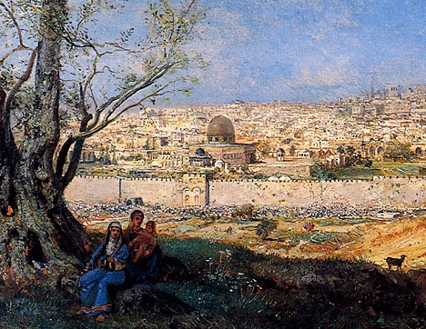

  
[Intangible Textual Heritage](../../index)  [Judaism](../index) 

------------------------------------------------------------------------

[Buy this Book on
Kindle](https://www.amazon.com/exec/obidos/ASIN/B0031574IW/internetsacredte)

------------------------------------------------------------------------

<table width="75%">
<colgroup>
<col style="width: 50%" />
<col style="width: 50%" />
</colgroup>
<tbody>
<tr class="odd">
<td width="50%" data-valign="TOP"></td>
<td width="50%" data-valign="CENTER"><h1 id="the-babylonian-talmud-in-selection" data-align="CENTER">The Babylonian Talmud in Selection</h1>
<h2 id="by-leo-auerbach" data-align="CENTER">by Leo Auerbach</h2>
<h4 id="section" data-align="CENTER">[1944]</h4></td>
</tr>
</tbody>
</table>

------------------------------------------------------------------------

[Contents](#contents)    [Start Reading](bata00)    [Page
Index](pageidx)    [Text \[Zipped\]](bata.txt.gz)

------------------------------------------------------------------------

|                                                                                                                           |
|---------------------------------------------------------------------------------------------------------------------------|
|  |

This is a mid-20th century translation of selections from the Babylonian
Talmud. Auerbach emphasizes in his introduction that the Talmud contains
diverse voices. Indeed, this is one of the strengths of the Talmud;
instead of a monolithic text, it allows for various viewpoints and
opinions; the role of the reader is active, allowing us to consider each
authority. Auerbach takes a longitudinal approach to this condensation
of the multi-volume Talmud; he includes at least one tractate from each
division of the text. Although this overlaps some of the other public
domain Talmud translations at this site, there are also some tractates
here that haven't appeared elsewhere at this site, particularly those
from Nashim (Women).

------------------------------------------------------------------------

 [Title Page](bata00)  
[Contents](bata01)  
[Introduction](bata02)  

### Tractate Aboth

[Fathers of the Mishna](bata03)  

### Zeraim (Agriculture)

[The Portion of the Poor (Tractate Peah)](bata04)  

### Moed (Holy Days)

[Sabbath (Tractate Sabbath)](bata05)  
[Passover (Tractate Pessahim)](bata06)  
[The Day of Atonement (Tractate Yoma)](bata07)  
[Days of Fasting (Tractate Taanith)](bata08)  

### Nashim (Women)

[Childless Widows (Tractate Yebamoth)](bata09)  
[The Marriage Contract (Tractate Kethuboth)](bata10)  
[Adultery (Tractate Sotah)](bata11)  
[Divorces (Tractate Gittin)](bata12)  
[Betrothals (Tractate Kiddushin)](bata13)  

### Nezikin (Law)

[Civil Law (Tractate Baba Kamma)](bata14)  
[Law of Procedure (Tractate Sanhedrin)](bata15)  
[Flogging (Tractate Macoth)](bata16)  
[Oaths (Tractate Shebuoth)](bata17)  

 

[Glossary](bata18)  
