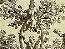
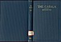
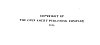

  
[Intangible Textual Heritage](../../index)  [Judaism](../index) 
[Index](index)  [Next](cab01) 

------------------------------------------------------------------------

[Buy this Book at
Amazon.com](https://www.amazon.com/exec/obidos/ASIN/0766135667/internetsacredte)

------------------------------------------------------------------------

  
*The Cabala*, by Bernhard Pick, \[1913\], at Intangible Textual Heritage

------------------------------------------------------------------------

# THE CABALA

### ITS INFLUENCE ON

### JUDAISM AND CHRISTIANITY

###### BY

## BERNHARD PICK, Ph.D. D.D.

#### CHICAGO LONDON

#### THE OPEN COURT PUBLISHING COMPANY

#### \[1913\]

NOTICE OF ATTRIBUTION  
Scanned at Intangible Textual Heritage, June 2006. Proofed and formatted
by John Bruno Hare. This text is in the public domain in the United
States because it was published prior to January 1st, 1923. These files
may be used for any non-commercial purpose, provided this notice of
attribution is left intact in all copies.

 
[  
Click to enlarge](img/cover.jpg)  
Cover  

  [  
Click to enlarge](img/title.jpg)  
Title Page  

 
[  
Click to enlarge](img/verso.jpg)  
Verso  

 

------------------------------------------------------------------------

[Next: Contents](cab01)
