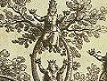

  
[Intangible Textual Heritage](../../index)  [Judaism](../index.md) 
[Index](index)  [Previous](cab01)  [Next](cab03.md) 

------------------------------------------------------------------------

[Buy this Book at
Amazon.com](https://www.amazon.com/exec/obidos/ASIN/0766135667/internetsacredte.md)

------------------------------------------------------------------------

  
*The Cabala*, by Bernhard Pick, \[1913\], at Intangible Textual Heritage

------------------------------------------------------------------------

p. 2 p. 3

# THE CABALA.

**Foreword**.--Although the Cabala belongs to the past, it nevertheless
demands our attention on account of the interest taken in it by men like
Raymond Lully, the "Doctor Illuminatus" as he was styled (died 1315):
John Picus di Mirandola (1463-1494); John Reuchlin (1455-1522);
Cornelius Henry Agrippa von Nettesheim (14861535); John, Baptist von
Helmont (1577-1644); the English scholars Robert Fludd (1574-1637) and
Henry More (1614-1687). How much Theophrastus Paracelsus (1493-1541) and
Jacob Boehme (1575-1624), called "Philosophus Teutonicus," were
influenced by cabalistic doctrines, is difficult to state. At any rate
the names mentioned before are sufficient to call attention to a
theosophical system which has engaged the minds of Jewish and Christian
scholars.

It is surprising how scanty the English literature is on the Cabala.
True that in the *History of the Jews* by Basnage, London, 1708, we have

p. 4

a lengthy account of this theosophy (pp. 184256); but this account is
originally given in the French work *Histoire des Juifs*, by the same
author. John Gill (died 1771) in his "*Dissertatio de genuina Punctorum
Vocalium Hebraicorum Antiquitate, contra Cappellum, Waltonum*," etc.,
prefixed to his *Clavis Pentateuchi*, Edinburgh, 1770, refers to the
Zohar to prove the antiquity of the Hebrew vowel-points, because it
states that "the vowel-points proceeded from the Holy Spirit who indited
the Sacred Scriptures," etc. (on Song of Songs 57*b*; ed. Amsterdam,
1701). Of course so long as the Cabala was believed to be a genuine
revelation from God, and Simon ben Jochai (of the second century) was
believed to be the author of the Zohar, to whom God communicated all the
mysteries, it was but a matter of course to believe in the antiquity and
divinity of the vowel-points.

John Allen (died 1839) in his *Modern Judaism*, London, 1816, (2d. ed.
1830) also gives an account of the Cabala, in which he premises the
antiquity of the Zohar, which he makes the primary source of the
[primitive](errata.htm#0) Cabala. Passing over Dean Milman's (died 1868.md)
*History of the Jews*, London, 1829, (often reprinted), in which we
naturally also find references to the Cabala, we mention J. W. Etheridge
(died 1866), author of *Jerusalem and Tiberias; Sora and Cordova, a* 

p. 5

\[paragraph continues\] *Survey of the
Religious and Scholastic Learning of the Jews, Designed as an
Introduction to Hebrew Literature*, London, 1856. This author seems to
have been acquainted with the researches of the Jewish scholars in
Germany, but he nevertheless stoutly adheres to the traditional view.
Thus he remarks on page 314:

"To the authenticity of the Zohar, as a work of the early Kabalistic
school, objections have indeed been made, but they are not of sufficient
gravity to merit an extended investigation. The opinion that ascribes it
as a pseudo-fabrication to Moses de Leon in the thirteenth century, has,
I imagine, but few believers among the learned in this subject in our
own day. The references to Shemun ben Yochaï and the Kabala in the
Talmud, and abundant internal evidence found in the book itself, exhibit
the strongest probability, not that Shemun himself was the author of it,
but that it is the fruit and result of his personal instructions, and of
the studies of his immediate disciples."

We may say that Etheridge's view is *mutatis mutandis* also that of Ad.
Franck, author of *Système de la Kabbale ou la philosophie religieuse
des Hebreux*, Paris, 1843 (2d. ed. 1892); translated into German by A.
Gelinek (Jellinek), *Die Kabbala oder die Religionsphilosophie der
Hebräer*, Leipsig, 1844, with which must be compared

p. 6

\[paragraph continues\] D. H. Joel, *Die
Religionsphilosophie des Sohar*, *ibid*., 1840, which is an exceedingly
good supplement to Franck's work. But an examination of the works
published by Zunz, *Die gottesdienstlichen Vorträge der Juden*, Berlin,
1831, p. 405; Geiger, *Melo Chofnayim*, *ibid*., 1840, introduction, p.
xvii; Sachs, *Die religiöse Poesie der Juden in Spanien*, *ibid*., 1845,
p. 327, Jellinek, *Moses Ben Schem Tob de Leon*, Leipsig, 1851, could
have convinced Etheridge that the Zohar, the text-book of the Cabala, is
the "pseudo-fabrication" of Moses de Leon in the thirteenth century.
That Landauer (died 1841) in his essays on the Cabala published in the
*Litteraturblatt des Orients*, 1845, p. 178 et seq., 1846, p. 12 et
seq., ascribes the authorship of the Zohar to Abraham ben Samuel
Abulafia towards the end of the second half of the thirteenth century,
is the more weighty and instructive because he originally started with
opinions of an exactly opposite character (Steinschneider, *Jewish
Literature*, p. 299). Nevertheless Etheridge's book was a good work; it
was the praiseworthy attempt of an English Christian to acquaint the
English-speaking people with the post-Biblical literature of the Jews.

Four years after the publication of the above work, Canon Westcott (died
1901) published his *Introduction to the Study of the Gospels*, London,

p. 7

\[paragraph continues\] 1860, in which he
incidentally refers to the Cabala, without adopting Etheridge's view as
to the authorship of the Zohar; oh the contrary he says (p. 159, Boston,
1867): "The Sepher ha-Zohar, or Book of Splendor, owes its existence to
R. Moses of Leon in the thirteenth century," and this, he says in a
note, "has been satisfactorily established by Jellinek in his tract,
*Moses ben Schemtob de Leon und sein Verhältniss zum Sohar*, Leipsig,
1851. The warm approval of Jost is sufficient to remove any lingering
doubt as to the correctness of Jellinek's conclusion: *A Jellinek und
die Kabala*, Leipsic, 1852."

The publication of Jellinek's *Beiträge zur Geschichte der Kabbala*, 2
parts, Leipsic, 1852; and his *Auswahl kabbalistischer Mystik*, part I,
*ibid*., 1853; Stern's "Versuch einer umständlichen Analyse des Sohar"
(in Ben Chananja, *Monatsschrift für jüdische Theologie*, Vols. I-IV,
Szegedin, 1858-1861); Jost's *Geschichte des Judenthums und seiner
Sekten*, Vol. III, pp. 66-81, Leipsic, 1859; more especially of Graetz's
*Geschichte der Juden*, [1](#fn_0.md) Vol. VII, pp.
73-87, 442459; 487-507, Leipsic, 1863, paved the way for Christian D.
Ginsburg's (now very scarce) essay

p. 8

\[paragraph continues\] *The Kabbalah*,
London, 1865. As a matter of course he adopts the results of modern
scholarship and rejects the authorship of Simon ben Jochai.

As far as we are aware, nothing has been published in English since
1865. *The Kabbalah Unveiled* by S. L. M. Mathers, London, 1887, gives
only a translation of some parts of the Zohar, which Knorr von Rosenroth
had rendered into Latin. Nevertheless this work is interesting, because
an English reader--provided he has enough patience--can get a taste of
the Zoharic wisdom and unwisdom.

------------------------------------------------------------------------

### Footnotes

[7:1](cab02.htm#fr_0.md) The English translation of
this work, published by the Jewish Publication Society of America, is of
no service to the student, because the scholarly notes, which are the
best part of the original, are entirely omitted.

------------------------------------------------------------------------

[Next: Chapter I. Name and Origin of the Cabala](cab03.md)
