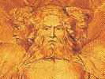

  
[Intangible Textual Heritage](../../index)  [Judaism](../index) 
[Index](index)  [Previous](gfp142)  [Next](gfp144) 

------------------------------------------------------------------------

[Buy this Book at
Amazon.com](https://www.amazon.com/exec/obidos/ASIN/B0029ZA4W8/internetsacredte)

------------------------------------------------------------------------

  
*Guide for the Perplexed*, by Moses Maimonides, Friedländer tr.
\[1904\], at Intangible Textual Heritage

------------------------------------------------------------------------

### CHAPTER VII

ONE Of the points that require investigation is the connexion between
the vision of the mercabah and the year, month, and day, and also the
place of the vision. A reason must be found for this connexion, and we
must not think that it is an indifferent element in the vision. We must
consider the words, "the heavens were opened" (Ezek. i. 1); they give
the key to the understanding of the whole. The figure of opening, also
that of opening the gates, occurs frequently in the books of the
prophets: e.g., "Open ye the gates that the righteous nation may enter
in" (Isa. xxvi. 2); "He opened the doors of heaven" (Ps. lxx-viii. 23);
"Lift them up, ye everlasting doors" (*ibid*. xxiv. 9); "Open to me the
gates of righteousness, I will go into them, and I will praise the Lord"
(*ibid*. cxviii. 19). There are many other instances of this kind. You
must further notice that the whole description refers undoubtedly to a
prophetic vision, as it is said, "And the hand of the Lord was there
upon him" (Ezek. i. 3); and yet there is a very great difference between
the various parts of the description, for in the account of the *Ḥayyot*
the prophet does not say four *Ḥayyot*, but "the likeness of the four
*Ḥayyot*" (*ibid*. ver. 5); similarly he says, "And the likeness of a
firmament was over the heads of the *Ḥayyot*" (ver. 22); "as the
appearance of a sapphire stone, the likeness of a throne," and "the
likeness of the appearance of man above it" (ver. 26). In all these
instances the word "likeness" is used, whilst in the account of the
*Ofannim* the phrases, "the likeness of *Ofannim*," the "likeness of an
*Ofan*," are not employed, but they are described in a positive manner
as beings in actual existence, with their real properties. The sentence
"they four had one likeness" must not mislead you, for here the word
"likeness" is not used in the same connexion or in the same sense as
indicated above. In the description of the last vision the prophet
confirms and explains this view. When he commences to describe the
firmament in detail, he says, "the firmament," without adding the words
"the likeness of," for he says, "And I looked, and behold, in the
firmament that was above the head of the cherubims there appeared over
them as it were a sapphire stone, as the appearance of the likeness of a
throne" (x. 1). Here the prophet speaks of "the firmament" and not of
"the likeness of the firmament," as he does when he connects the
firmament with the

p. 260

heads of the likeness of the *Hayyot* (i. 22). But, as regards the
throne, he says, "the likeness of a throne appeared over them," in order
to indicate that the firmament was first perceived and then the likeness
of the throne was seen over it. Consider this well.

You must further notice that in the description of the first vision the
*Hayyot* have wings and at the same time human hands, whilst in the
second vision, in which the term cherubim is substituted for *Ḥayyot*,
at first only wings were perceived, and later on human hands were seen.
Comp. "And there appeared in the cherubims the form of a man's hand
under their wings" (x. 8). Here "form" (*tabnit*) is used instead of
"likeness" (*demut*); and the hands are placed under the wings. Note
this.

Consider that in reference to the *ofannim*, the prophet says,
*le-‘ummatam*, "over against them," although he does not ascribe to them
any form.

He further says, "As the appearance of the bow that is in the cloud in
the day of rain, so was the appearance of the brightness round about.
This was the appearance of the likeness of the glory," etc. (i. 28). The
substance and true essence of the bow described here is well known. The
simile and comparison is in this case very extraordinary, and is
undoubtedly part of the prophecy; and note it well.

It is also noteworthy that the likeness of man above the throne is
divided, the upper part being like the colour of *ḥashmal*, the lower
part like the appearance of fire. As regards the word *ḥashmal*, it has
been explained to be a compound of two words *ḥash* and *mal*, including
two different notions, viz., *ḥash* signifying "swiftness, "and *mal*
denoting "pause." The two different notions are here joined in one word
in order to indicate figuratively the two different parts,--the upper
part and the lower. We have already given a second explanation, namely,
that *ḥashmal* includes the two notions of speech and silence: in
accordance with the saying of our Sages, "At times they are silent, at
times they speak," thus deriving *ḥash* of the same root as
*heheshethi*, "I have been silent" (Isa. xlii. 14); the word *ḥashmal*
thus includes two notions, and indicates "speech without sound." There
is no doubt that the words, "at times they are silent, at times they
speak," refer to a created object. Now consider how they clearly stated
that the divided likeness of man over the throne does not represent God,
who is above the whole chariot, but represents a part of the creation.
The prophet likewise says "that is the likeness of the glory of the
Lord"; but "the glory of the Lord" is different from "the Lord" Himself,
as has been shown by us several times. All the figures in this vision
refer to the glory of the Lord, to the chariot, and not to Him who rides
upon the chariot; for God cannot be compared to anything. Note this. I
have thus given you also in this chapter as much of the heads of the
sections as will be useful to you for the comprehension of this subject,
if you fill out \[the sections of\] these heads. If you consider all
that has been said in this part up to this chapter, the greater part of
this subject or the whole of it will be clear to you. except a few
points and some repetitions the meaning of which is unknown. Perhaps
further study will help to reveal even these things so that nothing will
remain unintelligible.

Do not expect or hope to hear from me after this chapter a word on this
subject, either explicitly or implicitly, for all that could be said on
it has been

p. 261

said, though with great difficulty and struggle. I will now begin to
treat of some of the other subjects which I hope to elucidate in this
treatise.

------------------------------------------------------------------------

[Next: Chapter VIII](gfp144)
