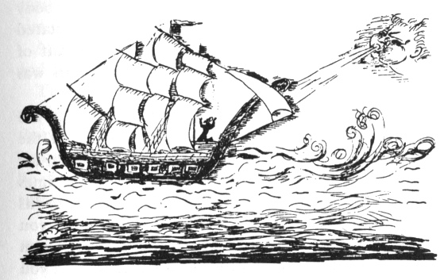

  
[Intangible Textual Heritage](../../index)  [Judaism](../index.md) 
[Index](index)  [Previous](gm03)  [Next](gm05.md) 

------------------------------------------------------------------------

  
*The Golden Mountain*, by Meyer Levin, \[1932\], at Intangible Textual
Heritage

------------------------------------------------------------------------

p. 1

# THE BAAL SHEM TOV

##### RABBI ISRAEL, MASTER OF THE HOLY NAME

p. 2

p. 3

### BEFORE HE WAS BORN

##### HERE IS THE STORY OF HOW ELIJAH CAME TO GOD, AND ASKED HIM TO MAKE RABBI ELEAZER THE FATHER OF RABBI ISRAEL; AND OF THE MARVELLOUS TRIALS OF RABBI ELEAZER

When God was about to create Adam, a
number of souls, knowing that all of the souls then living in heaven
would share in the sin of created Adam, fled to a far place outside the
boundaries of heaven, and hid themselves in a corner of chaos. There
they waited until after the first sin was done.

Only that band of hidden souls escaped the evil touch of Adam's sin. And
they are the Innocent souls.

When the Enemy becomes powerful on earth, and stretches mountains of
black clouds between man's earth and heaven, when men become knotted
with evil and lose their Godly form, then the Almighty goes up to the
highest of his regions, and seeks out one of his Innocent souls.

He says to the Innocent soul, "Go down and purify the earth."

Such were the souls of Abraham, of Isaac, and of Jacob; such was the
soul of Noah; such were the souls of the great prophets, of the great
scribes, and of the great rabbis. The soul of the Messiah is prince
among this band of Innocent souls; and when the time of Redemption
arrives, Messiah himself will come down from the highest of heavens.
Then the Enemy will disappear forever.

The soul of Rabbi Israel, the Baal Shem Tov, was one of that band of
innocents who escaped the sin

p. 4

of Eden. And this is how he came to be born on earth.

 

In a hamlet in the district of Moldau there lived the pious Rabbi
Eleazer. His wife was a virtuous woman; she was the daughter of a pious
Jew of the city of Okup.

Tartars attacked the valleys of Moldau, pillaged the villages,
slaughtered many Jews, and carried off others into slavery. Rabbi
Eleazer was one of those taken captive.

His wife said, "I will wait for his return until the end of my days, and
if he does not return to me in this world, I will meet him in the next
world."

 

In heaven, Elijah came to God and said, "See how the Jews suffer. It is
time to send an Innocent soul down to earth, to sweeten the lives of the
Jews."

God said, "Not yet."

 

For many weeks Eleazer voyaged with the barbarians. On land, he was
forced to carry heavy burdens. On sea, he was chained to an oar and made
to row as a galley slave.

At last, coming to a strange shore, the Tartars took the Jew into the
city and sold him in the marketplace as a slave.

He was purchased by the King's Grand Vizier, who soon perceived that the
slave, though of a race unknown to him, was a person of unusual
intelligence.

Rabbi Eleazer had kept count of the days. When Sabbath came, he begged
his master to permit him to

p. 5

rest on that day. This the Vizier granted, and Rabbi Eleazer did not
work on Sabbath.

The only duty of Rabbi Eleazer, when he was a slave, was to watch for
the time when his master the Vizier returned from his audience with the
King; then Rabbi Eleazer would wash the feet of the Grand Vizier.

Thus, the slave had a great deal of time to pass. Rabbi Eleazer knew by
heart the Psalms of David, and he passed his days singing the Psalms.

He was not happy, for he felt himself alone away from his people, and he
prayed God that he might be released to go home to his wife and to live
among other Jews.

At last he could bear his life in the court no longer, and he thought of
flight. One night he crept from his bed and made his way through the
halls of the palace, until he reached the gate. There he saw the guard
asleep. His naked sword, fallen from his hand, lay at his side. The keys
were bound to his girdle.

Rabbi Eleazer looked at the sword and said to himself, "To take the keys
I must lift the sword and slay the man."

Instead, he returned and remained in captivity.

 

One year, the King besieged a neighbouring city. The city was strong and
withstood his attack. Then the King did not know what to do; he asked of
his advisers whether his army should continue to stand in their boats on
the river before the walls of the city, becoming themselves weaker while
they waited for the enemy to weaken, or whether he should risk all of
his men in a charge upon the walls.

p. 6

The Vizier did not know what advice to give, and fell therefore into
disfavour with the King. When the Vizier came home, Eleazer saw that he
was troubled. He began, as every day, to wash his master's feet. The
Vizier sighed and said, "Would that my own task were so simple."

And then, out of the heaviness of his heart, he talked to his slave and
told him of the problem that was before the King.

Rabbi Eleazer said, "Perhaps God will show me a way to help the King.
Take me to the King tomorrow."

That night the Rabbi Eleazer prayed to God. And he had a dream.

In the dream he saw the walls of the neighbouring city, and the river
that flowed before them. At the edge of the river he saw a great stone,
round as the earth. The stone moved, and rolled into the water. Where
the stone had been, there was a hole.

In the morning Eleazer said, "Let the King take me aboard his ship, and
I will show him what he must do."

The Vizier told the King of the request of his slave. "He comes from a
far land, and is a wise man among his own people," said the Vizier.

"Is he a sorcerer?" said the King.

"He prays constantly to his God."

"Let him be brought before me," said the King.

When he was brought before the King, Eleazer said, "It is natural that
you should doubt my wisdom, for I am only an unknown slave. I say to you
that the enemy army is strong, and will destroy your army if you attack
the walls of the city. If you would test

p. 7

my words, take from your galleys men who are already condemned to death,
and put them in the first boat, and send them to attack the walls of the
city."

The King did as Rabbi Eleazer advised. Convicts were chosen, and sent
against the enemy. No sooner had they neared the wall than their boat
was overwhelmed with a storm of arrows, spears, and darts of fire. Every
man of them was instantly killed.

The King despaired, and cried, "What is there for me to do?"

"Wait until night," said Eleazer.

In the night, he guided the ship of the King through darkness across the
water to a spot at the edge of the river where they found a great rock.
This rock they rolled away, and the mouth of a tunnel was revealed.
Rabbi Eleazer took a candle in his hand, and crept into the tunnel, and
after him, one by one, came soldiers. Silently and slowly they went
along the narrow, tortuous passage that was hewn through stone and
digged through earth. At last they came up within the walls of the city.
Thus a great army came up into the city, and attacked the enemies, and
overthrew them.

When the King had captured the city he said to Rabbi Eleazer, "I will
give you my daughter as your wife, and I will make you the highest man
in the kingdom, after the King."

He placed Eleazer in a palace, and sent him slaves and riches. The
princess who was given to him was beautiful and young.

But the Rabbi remembered that he was already married.

One morning when he sat at table with the princess

p. 8

she asked of him, "Why is it that you are not with me as a husband is
with his wife?"

Then Eleazer said, "If you will promise not to reveal my secret, I will
tell you."

She promised not to betray him, and then he told her that he was a Jew,
and he told her of all the things that had befallen him.

Because the princess loved Rabbi Eleazer she took all of her jewels, and
all of the gold that she possessed, and loaded a ship with her
treasures. Then she said to Rabbi Eleazer, "Go on this ship, and find
your way home."

He was joyous; day and night he sang his praises to the heavens.

 

But on the sea the King's ships overtook him.

Rabbi Eleazer cried, "Take the treasures from me, all the jewels and the
gold. Leave me only with my God; he will guide me home."

 

Just then, God looked over all the earth, saying, "Where shall a man and
woman be found who are worthy of bringing into the world an
uncontaminated soul, the soul of Rabbi Israel?"

Elijah said to God, "There is Rabbi Eleazer, alone on the sea. He is
worthy of being the father of such a son. In a village in Moldau, his
wife has waited for him for seventeen years."

God called to the soul of Rabbi Israel, and showed him his father.

 

Rabbi Eleazer wandered homeward. He was naked and hungry.

p. 9

On a path in a forest Elijah met him and said, "A son will be born to
you who will be a light to all Israel."

 

In the little city of Okup, beneath the mountains, Rabbi Eleazer found
his wife. Nine months after his return, she bore him a son, and they
named the child Israel.

When the child had been circumcised, the mother died.

 

------------------------------------------------------------------------

[Next: Israel and the Enemy](gm05.md)
