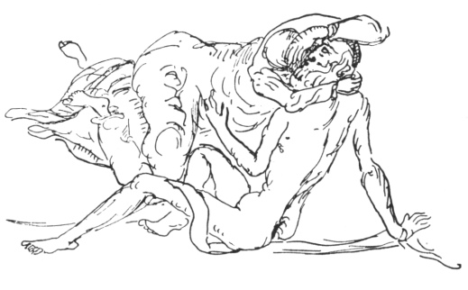

  
[Intangible Textual Heritage](../../index)  [Judaism](../index) 
[Index](index)  [Previous](gm06)  [Next](gm08) 

------------------------------------------------------------------------

  
*The Golden Mountain*, by Meyer Levin, \[1932\], at Intangible Textual
Heritage

------------------------------------------------------------------------

p. 27

### THE SECRET MARRIAGE

##### HERE ARE TOLD THE MARVELLOUS DEEDS OF RABBI ISRAEL WHILE HE WAS STILL A SAINT IN SECRET

After the death of his companion, the
Master forsook the house where they had lived and studied together.
Israel returned into the forest. There, for the length of a day, he sat
by a stream and watched the flowing water.

And he said to himself, "Shall I go among men, or shall I remain in the
forest?"

He thought, "For what purpose shall I go among men? I am the master of
all knowledge. There is nothing that I can learn among men." He built
himself a cottage, and he lived in the forest.

Yet he knew that he must go among men and help them; for what else might
be done with the power that had been given him! "Mankind will
contaminate the truth," he said. "Let me remain a while longer where I
am." And he waited for a sign.

Near the forest was a field where a shepherd came every day to pasture
his flock of sheep. The shepherd was an aged Jew.

He came to know the young man who lived in the woods. One day he said to
him, "Why do you live by yourself? I have a daughter, I will give her to
you for a wife."

Then Rabbi Israel was married to the shepherd's daughter. For a year's
time he lived in the forest with her together, and in that time Rabbi
Israel was

p. 28

happy on earth. He thought, "Perhaps I shall not ever have to return
among men."

But when the year was over his young wife died.

 

Rabbi Israel got up and went out of the forest. In the city of Brody was
a Yeshiva where many scholars sat learning.

He went to a hamlet near Brody, and he took work as a school-teacher,
and he lived in the house of Rabbi Chayim. He did not let it be seen
that he was a tsadik.

But Rabbi Chayim's wife, the rebetsen, was the sister of the great Gaon
Maharim. And she saw that there was a strangeness in the face of the
schoolteacher who lived in her house. Then a thing happened that made
her suspect he was a saint in hiding.

There was no place for Israel to sleep in that house except a small room
in the garret. For many years the garret had been troubled by restless
spirits who came during the night and ran over the walls, hammering, and
hurling themselves against the floor, and making weird sounds of
moaning. Rabbi Chayim and all the people in his house were afraid to go
up into that room.

But Israel went there to sleep.

The rebetsen awoke during the night. She heard the weird moaning of the
spirits. And all at once she heard the young man cry out, "Be still!"

From then on, there were no more sounds in the garret. This, the
rebetsen remembered.

 

It happened that while Israel lived in that house, Rabbi Chayim and
Rabbi Hirsch had to decide the

p. 29

judgment of the Torah in a very difficult case. Rabbi Hirsch was the
father of Rabbi Gershon of Kuth.

A man in the city of Kuth had gone through Rabbi Chayim's hamlet, and
had bought a horse. "When I reach home, I will send you the money, and
you will send me the horse," he said.

And so he did. But when the horse came to him, it was lame.

The seller said, "The horse was well when it started to Kuth."

The buyer said, "It was lame when it came."

Then who was to bear the loss of the horse's lameness?

The two rabbis talked for many hours, but could come to no
understanding. At last Israel, who sat listening in the room, said, "Did
the horse draw a wagon on his way to Kuth?"

The man who had sold the horse said, "He drew a wagon."

"What was on the wagon?"

"It was loaded with logs."

"Then the logs belong to the lameness, give the logs also to the buyer
of the horse."

Rabbi Hirsch was so pleased with the wisdom of this decision that he
said to the young man, "Who are you?"

"I am a school-teacher in this village."

"You are the man whom God intended as the husband of my daughter. I will
give her to you in marriage."

And he sat down at once to write the marriage contract.

But when Rabbi Hirsch asked of the Master,

p. 30

\[paragraph continues\] "What is your
name, rabbi?" the Master said, "Do not write down that I am a rabbi.
Write only: Israel, son of Eleazer."

 

On his way home, Rabbi Hirsch died.

Afterwards Rabbi Gershon looked among the papers of his dead father. And
there he found a marriage contract.

"Who is this Israel, son of Eleazer, to whom my sister is given in
marriage?" he asked. But no one knew who that might be.

However, his sister said, "My father made the contract, and I will wait
until my groom comes to claim me."

 

And still Israel did not go to claim the daughter of Rabbi Hirsch, but
remained living in the house of Rabbi Chayim.

Once the rebetsen had to make a journey to the lord of the district. The
way to the house of the paritz led through a forest that was infested
with robbers. The rebetsen thought, "Whom shall I take with me to
protect me from the robbers?" And she decided that no one would be
better than the young man Israel, so she asked him to go with her in her
wagon.

When they had come deep into the forest, Israel touched the rebetsen's
arm and said to her, "Soon we will be stopped by a robber. Do not be
frightened."

The woman felt that there was great power in the boy, but she did not
know how truly great was his power. She said, "I have no money to give
the robber, and he will kill us."

"The robber who will stop our wagon is one who

p. 31

has murdered many people," said Israel. "But his measure is full, he
will murder no more."

They rode on. The trees about them rose high, and the narrow road was a
dark path under overhanging cliffs. It was dark as the inside of a cave.

The rebetsen said, "You are only a young boy. Could you kill a robber
with your hands?"

Israel said, "I have the power of the Word."

 

All at once the horse stopped. The robber stood in front of them. He
slapped the flat side of his sword against their legs. "Jews!" he
shouted, "get out of the wagon! Part with your money or your souls!"

"We have no money," said Israel, "and you have no need of our souls."

At this reply the robber became black with anger. He seized the wheel as
if he would wrench it from the wagon and break it over their heads. He
began to mount the wagon. But before the robber could swing his foot
upward, the Baal Shem Tov looked into his face and uttered a word.

The bandit stood petrified. He could not move his limbs. But he still
could move his mouth, and he filled the air with his vile curses,
flinging his oaths like thunderbolts upon them. He cursed them, and
their fathers, and the fathers of their fathers, he cursed their
children, and all the generations of the Jews, and he cursed their
rabbis, with the blackest and most terrible of curses.

"Cease your blasphemy!" said Rabbi Israel. And he looked into the face
of the robber, and once more he uttered a word.

At once the ground opened beneath the bandit,

p. 32

and he sank into the earth up to his knees. Then a wild shout of terror
and of rage hurled itself out of his throat. It was like the scream of
iron grinding on iron. His arm, with the sword raised in the air,
trembled like a beam that is strained to budge a heavy rock; the blood
swelled in the veins of his face and of his arm; but with all his force
he could not move his arm to hurl the sword at their heads.

Then he burst out more loudly than ever with curses that were more foul
than the stench of hell.

Upon all the ancestors of the Jews he heaped his curses, and on Abraham,
and on Isaac, and on Jacob, and upon the God of the Jews.

"Then it is time you were under the earth!" said Israel.

Once more he uttered a Word, and the robber sank slowly into the earth,
his thighs were covered, and his belly, and his chest, and his shoulders
were below the ground, then the earth closed over his throat and reached
his chin, his cursing mouth was filled with earth, and the earth was in
his eyes, his head was below the ground, and his outstretched arm, and
his sword.

 

The rebetsen and the boy rode on their way.

When the wagon had passed out of the wood, Israel said to the rebetsen,
"Now there is no more danger. I command you, do not tell any living soul
what happened in the forest. You must not tell your husband, or your
brother the Gaon Maharim. It is not yet time for my power to be known."

"What will be my reward for keeping silence?" asked the rebetsen.

p. 33

"You will have peace in your grave."

For this, she agreed to keep silence.

Rabbi Israel said, "If ever you are disturbed in your grave, utter my
name."

 

Many years later, when the rebetsen had long been dead, and Rabbi Israel
was no longer a saint in secret, but was known among all Jewry as the
holy man of Medzibuz, a plague came over that hamlet near Brody where
the rebetsen had lived and died. Almost half of the people of the
village died, and still the plague continued, and every day the peasants
died like fleas.

Then the Christians looked toward the Jews and said, "It is their
doing!" The peasants went to the priests and cried, "Only Jewish blood
will save us!"

But the priests held them back, saying, "The Jews are not to blame. The
Jews are also dying of the plague."

And for a time the peasants were satisfied.

But as the plague continued, and grew even worse, the peasants again
rose against the Jews. They cried, "The Jews are an unclean people! They
have strange ways: They have strange ways of burial. Even their dead are
unclean. Their dead lie festering in the ground, and bring the plague
upon us!"

An old man among the peasants, known for his wizardry, stirred them up,
saying, "I know a cure for the plague. Come with me at night, to the
graveyard of the Jews. All who come, bring spades!"

That night the peasants lighted torches. In the market place that was in
the centre of their town they

p. 34

built a great pile of wood, and made it ready for burning.

Then they chose ten men amongst them, and sent them with the wizard to
the cemetery of the Jews.

"Where is the holiest of their graves?" said the wizard.

No one knew.

Then they went and seized the keeper of the cemetery, and they dragged
him into the graveyard. "Where is the holiest of your graves?" they
cried. "Tell, or you yourself will be used to light the pyre!"

They brandished their torches over his head. The Jew was frightened, he
ran in terror and threw himself down on the grave of the rebetsen. "Save
me, holy rebetsen!" he cried.

The peasants threw him aside. And they placed themselves around the
grave of the rebetsen, and began to dig.

At first, she became restless at the sound of their digging. She stirred
in her coffin. But she thought, "Perhaps they are digging another grave
near by."

But as the digging came closer to her coffin, and she felt the tight
earth above her loosen, she became frightened, and wondered what was
happening.

Suddenly a spade struck upon her coffin.

Then she remembered, and cried out loud: "Rabbi Israel!"

In the morning, the wizard and all his followers were found lying dead
upon her grave.

 

After the Master of the Holy Name had revealed his power to the
rebetsen, he did not remain long in her house. He decided that he would
go and claim his wife. Then, changing his rabbinical garments for

p. 35

the short jacket and heavy boots of a peasant, Israel started out on
foot for Kuth. He came to the city, and went directly to the house of
Rabbi Gershon.

Rabbi Gershon was deep in study over a difficult problem in the Torah,
and he did not notice that a man had come into the room. But when he had
finished reading he looked up and saw that a peasant was standing there.
He was not pleased with the man. He cried out, "What do you want?"

Rabbi Israel, speaking gruffly like a peasant, said: "I have come to
take my wife."

"Who is your wife? Who are you?"

"Your sister is my wife. I am Israel, son of Eleazer."

"How can it be that my father pledged my sister to a peasant?" thought
Rabbi Gershon. "She could marry into the richest of families, or she
could be wedded to the most celebrated of rabbis!" Yet he did not wish
to distrust the wisdom of his dead father. He looked upon Israel, and
asked him:

"What is your profession?"

"I am a lime-burner. I work in the hills."

"No!" cried Rabbi Gershon. "It cannot be that you are the man!"

Rabbi Israel showed him the contract.

Then Rabbi Gershon called his sister. "Here is the man to whom your
father betrothed you," he said. "You see that he is a peasant, an
ignorant lime-burner. It cannot be that your holy father betrothed you
to an ignorant boor. Let us send him out of the house."

But the girl said, "My father made a marriage contract for me, and I
will keep it."

"I cannot have a peasant in this house," said Rabbi

p. 36

\[paragraph continues\] Gershon. "Break
the contract! I will pay him money, and he will go away."

Israel said, "I have come for my wife, not for money."

"Break the contract," said Rabbi Gershon, "or marry him and go out of
the house!"

"I will marry him and go away with him," said the woman.

 

Israel took his wife with him high into the Carpathians. Near the
village of Zabie he built a cabin for them to live in. He worked as a
lime-burner, and his wife helped him. Thus they earned a scant
livelihood. But sometimes Israel would take dry bread in a sack, and go
away into the hills. He would remain by himself all week long; before
the Sabbath he would return home. He would remain at home during the
Sabbath, and during the following week again take bread and wander among
the high hills, contemplating God.

 

In those mountains, too, there were many robbers. They had their forts
in the forests, and they sallied out in bands to attack wealthy
travellers on the roads.

Once, hidden among the trees, a number of these bandits saw the form of
a man who walked on the ledge of a mountain-peak. A chasm lay between
the cliff he walked upon and the next mountain.

The man seemed absorbed in thought. He did not look where he walked.

"He will surely walk off the cliff! He will fall into the chasm!" the
bandits cried to one another.

They could not move, but watched him.

p. 37

  [  
Click to enlarge](img/03700.jpg)  
THE PEASANT'S BRIDE  

p. 38

Then they saw the two mountains move together, and close the chasm
between them.

The Master stepped safely from one peak to the other peak. And when he
had passed, the mountains separated behind him, and were as they had
been, with the chasm lying between them.

When the robbers saw this happen they said one to another, "He must be a
holy man!"

Then they ran toward him and said, "Be our judge!"

Rabbi Israel answered, "If you will promise never to injure a Jew, I
will be your judge."

They agreed.

"I live in the cabin near Zabie," he said. "When you need a judge to
decide your quarrels, come to me."

 

Once two of the thieves quarrelled over the division of their spoils.
They came to Rabbi Israel in his cabin and asked him to say which of
them was in the right. Together, they had stopped a carriage. One of
them had held the horses. The other had beaten a fat merchant and robbed
him of his coffers. "I nearly killed the merchant!" he bragged. "The
better share of the money belongs to me!" But his companion declared
that the spoils should be evenly divided.

The Baal Shem Tov said, "The second man is right. The spoils should be
evenly divided."

The robbers accepted his decision, and returned to their fort.

But the killer was not content. After he had given his companion half of
the money and jewels, he felt

p. 39

even more angry. When night came, he decided to revenge himself upon the
Baal Shem Tov.

He took his knife, and went out on to the mountain. He went through the
forest, and came to the Baal Shem's cabin. He opened the door, and went
into the room. He saw Rabbi Israel sleeping.

The robber stood over the bed, and raised his knife to strike the
sleeping Rabbi.

Suddenly the bandit was assaulted from behind. His arm was seized. He
felt blows descend upon his shoulders. He was beaten with fists and with
cudgels, he was beaten as by ten strong men, until he lay groaning on
the ground. His head was covered with blood, and his body was blue with
bruises. And still he saw no adversary. He thrust his arms wildly into
the air, to catch at the bodies of those who were beating him, he tried
to seize their sticks, he swung his arms all around him, but encountered
only emptiness. And yet blows continued to descend upon him. Then he
roared out loud with pain. The Baal Shem Tov awoke.

"What is it?" he asked. "Who is shouting here?"

He looked, and saw the beaten highwayman, with his knife in his hand,
lying on the ground. Then he knew what had happened.

Rabbi Israel got out of his bed, and went and fetched water, and washed
the robber's wounds.

 

After having lived seven years in the Carpathians, Rabbi Israel and his
wife returned to Rabbi Gershon in Kuth. Rabbi Gershon still believed
that his brother-in-law was an ignorant peasant, and of no

p. 40

use in the world. He did not know what to do with him.

At last he thought of a plan. "Can you drive a carriage?" he asked of
Rabbi Israel.

The Baal Shem said that he could drive.

"Often I have to go to the neighbouring villages to render judgements of
Torah. You will drive my wagon."

So the Baal Shem Tov became a coachman for his brother-in-law. Once they
went on a journey. When they had been riding for several hours, Rabbi
Gershon fell asleep. Rabbi Israel was absorbed in contemplation, and
forgot to guide the horse. The reins were slack in his hands.

A bull came charging along the road.

The horse was frightened. He jumped sidewise, and pulled the wagon into
a ditch.

Rabbi Gershon lay bruised in the mud. "God has cursed me," he cried,
"with a brother-in-law who is good for nothing! He can't even drive a
horse!"

Then Rabbi Gershon decided that he could not abide to have his
brother-in-law living in the same village. "What can I do with him?" he
thought. "My sister will go with him wherever he goes. I cannot let them
starve."

At last he decided, "I will set him up as a tavern-keeper."

So Rabbi Gershon enquired, and found that in a place named Itrup, near
Kossow, there was an inn that could be bought very cheaply. It was a
poor sort of place, as few travellers passed on that road; even an
experienced tavern-keeper could barely earn his bread there.

p. 41

Rabbi Gershon rented the tavern, and gave it to his sister and his
brother-in-law.

 

There was very little to do in the tavern.

But the spot was a beautiful spot, lonely and wild, covered with trees
and crossed with running streams. Behind the house the Master found a
spring of water amongst a copse of trees. He set to work and carried
stones, and built a mikweh around the spring; that purifying bath is
there until this day. Near the mikweh he built a hut; when there were no
people to serve in the tavern, he would retire to this hut, and remain
there days long in meditation. When travellers came to the tavern, his
wife would call his name, and he would come back to the house and serve
his guests, make their beds for them, and bring them food and drink.

And still no one knew who he was, for he kept his power hidden.

Once Rabbi David of Klama, who was a friend of Rabbi Gershon, went
through the country to gather gifts for the Chanuka feast. When Rabbi
David came to Kuth, Rabbi Gershon said to him, "If you pass near Kossow,
go to my brother-in-law's tavern at Itrup, and stay with him. And on
your return, tell me the news of my sister."

"Is your brother-in-law a learned man?" asked Rabbi David.

"He is an ignorant peasant," said Rabbi Gershon bitterly.

 

Rabbi David came to the Baal Shem's tavern. Israel was not in the house,
but was alone in his hut in the

p. 42

woods. His wife called to him, crying, "Israel, we have a rabbi for a
guest!"

At once Israel ran into the house. He took a chicken, and killed it, and
cooked it for Rabbi David. While Rabbi David ate supper, Israel went and
made his bed.

And all through the evening, while the visitor spoke to the woman of the
wisdom and fame of her father and her brother, Rabbi Israel sat quietly
behind the oven.

At last Rabbi David went to sleep.

Then Rabbi Israel took the Torah, and began to read.

The Baal Shem Tov never slept more than two hours a night. Many nights
he did not sleep at all, remaining awake over the Torah.

Now, as he pierced deeper and deeper into the pure realm of Wonder, the
darkness that was about him gave way, for light seemed to stream from
Rabbi Israel. He did not have a lamp for his reading, he read by the
illumination that hovered about him where he sat.

And still the light grew, and glowed, and became bright as a bright
flame. And Rabbi Israel sat in the midst of it; his soul was warmly
bathed in the divine fire, his soul was filled with ecstasy.

 

Suddenly Reb David awakened. He saw the flame in the corner of the room.
He leaped from his bed. He ran to call the tavern-keepers. But only
Rabbi Israel's wife was in their bed. Rabbi David wakened her, shouting,
"Quick, the house is on fire!"

p. 43

But the Baal Shem's wife looked where there was light, and smiled and
said, "If you believe there is a fire, put it out."

Reb David ran and got a pail of water and carried it to the oven. But as
he was about to pour out the water, he saw Israel sitting there in the
midst of the shining light, and he saw his ecstatic face.

Rabbi David did not understand everything. But he knew that this was a
holy man. He was silent. He set the pail down noiselessly. He crept back
to his bed, and closed his eyes. But all night long he could not sleep.
He saw before him the ecstatic face of the Baal Shem Tov, as he sat
bathed in the light of heaven.

 

When Rabbi David returned to Kuth, he went to Rabbi Gershon and said, "I
stayed in the tavern of your brother-in-law."

"How is my sister?" asked Rabbi Gershon.

"She is well."

"And my brother-in-law, does he help her about the tavern?"

Rabbi David said, "Your brother-in-law is holier than you."

Rabbi Gershon laughed. "He can't even drive a horse," he said.

 

Rabbi Israel and his wife could not earn a living at the tavern. Rabbi
Gershon did not help them any more.

"I will learn a simple way to earn a living," said Rabbi Israel. He went
to Tluste, and worked for a

p. 44

butcher there, and learned to be a shochet. After that he returned with
his wife to Brody, and became a shochet in Brody.

 

When Rabbi Israel was thirty-six years old, the voice of God came to him
and said, "The time has come for you to reveal yourself."

Then the Master of the Name began to perform works of wonder.

 

------------------------------------------------------------------------

[Next: The Bride in her Grave](gm08)
