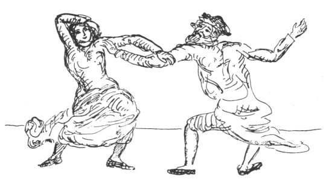

  
[Intangible Textual Heritage](../../index)  [Judaism](../index.md) 
[Index](index)  [Previous](gm11)  [Next](gm13.md) 

------------------------------------------------------------------------

  
*The Golden Mountain*, by Meyer Levin, \[1932\], at Intangible Textual
Heritage

------------------------------------------------------------------------

p. 86

### THE MAD DANCERS

Already the voices of opponents were
raised against the Baal Shem's teaching, for many rabbis could not
understand his ways. Some said of him that he dishonoured the Sabbath
with singing and freedom, some said that his ways and the ways of those
who followed him and called themselves Chassidim were truly the ways of
madmen.

One of the scholars asked of the Baal Shem, "What of the learned rabbis
who call this teaching false?"

The Baal Shem Tov replied, "Once, in a house, there was a wedding
festival. The musicians sat in a corner and played upon their
instruments, the guests danced to the music, and were merry, and the
house was filled with joy. But a deaf man passed outside the house; he
looked in through the window and saw the people whirling about the room,
leaping, and throwing about their arms. 'See how they fling themselves
about!' he cried, 'it is a house filled with madmen!' For he could not
hear the music to which they danced."

 

------------------------------------------------------------------------

[Next: Rabbi Israel and the Horse](gm13.md)
