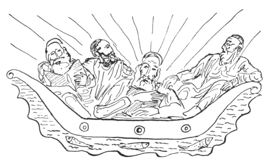

  
[Intangible Textual Heritage](../../index)  [Judaism](../index.md) 
[Index](index)  [Previous](gm16)  [Next](gm18.md) 

------------------------------------------------------------------------

  
*The Golden Mountain*, by Meyer Levin, \[1932\], at Intangible Textual
Heritage

------------------------------------------------------------------------

p. 109

### THE TRIAL OF RABBI GERSHON

Rabbi Gershon of Kuth would not believe
in the power of his brother-in-law. He said, "Rabbi Israel is nothing
but a lime-burner come out of the mountains. He couldn't even earn a
living as a tavern-keeper."

Once he went to Medzibuz to visit his sister. And he thought, "Let me
see the wonder-working of this brother-in-law of mine." So he remained
over the Sabbath.

On Friday afternoon, he saw Rabbi Israel prepare for the mincha prayer.
"But it is still very early," said Rabbi Gershon. Nevertheless, the
Master began to pray. And when Rabbi Israel came to say the
benedictions, he remained standing motionless on his feet for four whole
hours. Perspiration was upon his forehead, and his face was in an agony
of labour. But at last he made an end to his prayer.

"Why did you take four hours to say the benedictions?" asked Rabbi
Gershon.

"Stay until next Sabbath," said Rabbi Israel, "and I shall teach you how
to say the benedictions as I say them."

Now, the truth was that when the Master said the benedictions on the eve
of Sabbath, he first uttered the Word of the Will, that sundered the
bonds of all dead and living souls. Then myriads of dead souls came
rushing toward him out of their eternal wandering in nothingness, and
begged him to put them in his prayers, so that his prayers might at last
carry them into heaven.

When he uttered the words "Quicken the dead!" he was always surrounded
by these innumerable exiled

p. 110

souls, and it was the labour of carrying these souls into heaven that
occupied him for so many hours. But at this labour he worked
unceasingly, lifting the dead souls onto the wings of his powerful
prayers, and sending them into heaven, until he heard the Daughter of
the Voice call "Holy! Holy!" Then he knew that no more souls could be
admitted into heaven on that day, and he made an end to his prayer.

On the following Friday afternoon, the Baal Shem Tov said to his
brother-in-law Rabbi Gershon, "I will tell you a word to utter before
you begin the mincha prayer. Then you will understand why I remain so
many hours over the benedictions." And he whispered the secret Word of
the Will to Rabbi Gershon.

Rabbi Gershon repeated the Word, and began to say mincha.

But Rabbi Israel himself did not begin to pray. He stood and toyed with
his tobacco pouch, and fingered the alms-box, and waited. He waited
until Rabbi Gershon came to the words "Quicken the dead!"

And in that instant there came a terrible rush of souls, thousands upon
thousands of dead souls came flying, to crowd weeping and shrieking and
begging around the praying Rabbi Gershon. And Rabbi Gershon fainted with
fright.

When the Baal Shem Tov had taken care of his brother-in-law, he set
himself to say the benedictions, and helped those thousands of souls
into heaven.

Rabbi Gershon wanted to become greater than his brother-in-law.

p. 111

In Eretz Israel, at that time, there lived the celebrated Rabbi Chayim
ben Atar, who was known as Ohr Ha-Chayim, which means the Living Light.

There is a power that is even beyond the power of the Word. And that
furthest power consists of Two that are One. It is the power of chaos
and creation, it is the power of eternity within the instant.

And half of that power was in the Ohr Ha-Chayim, while the other half of
that power was in the Baal Shem Tov. The soul of Rabbi Chayim ben Atar
was the complement of the soul of Rabbi Israel ben Eleazer. The soul of
Rabbi Israel was affirmation, and the soul of Rabbi Chayim was negation.
If these two souls would be united, the beginning and the end would
become One.

 

Rabbi Gershon went to Eretz Yisroael, to become the disciple of the Ohr
Ha-Chayim.

Rabbi Gershon spoke to the Ohr Ha-Chayim of his brother-in-law. He said,
"My brother-in-law Rabbi Israel believes he walks in heaven."

The Ohr Ha-Chayim knew of the power of Rabbi Israel. For in their goings
up to heaven, both of them had sat in the highest regions where Rabbi
Hillel propounds the Torah to the elect of all souls. And the Ohr
Ha-Chayim, who was the end, knew of the fate of Rabbi Israel.

The Ohr Ha-Chayim said to Rabbi Gershon, "Ask of your brother-in-law
whether he can see every part of himself when he walks in heaven."

Rabbi Gershon thought: "See how the Ohr Ha-Chayim makes fun of my
brother-in-law!" And he

p. 112

wrote in a letter to Rabbi Israel: "The Ohr Ha-Chayim asks whether you
can see yourself from head to foot when you walk in heaven."

But this letter was long in reaching the Baal Shem Tov.

 

------------------------------------------------------------------------

[Next: Rabbi Israel's Daughter](gm18.md)
