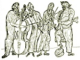

  
[Intangible Textual Heritage](../../index)  [Judaism](../index.md) 
[Index](index)  [Previous](gm35)  [Next](gm37.md) 

------------------------------------------------------------------------

  
*The Golden Mountain*, by Meyer Levin, \[1932\], at Intangible Textual
Heritage

------------------------------------------------------------------------

p. 248

### THE SPIDER AND THE FLY

##### AND THE GREAT MOUNTAIN THAT SPOKE IN A DREAM

Perhaps you think I will tell you
everything, so that you may be able to understand my story. I will begin
to tell the story.

There was a king who fought a great battle against many nations, and won
the battle, and took thousands of prisoners from among all the nations.
Every year, on the day of his victory, he caused a great feast to be
made; and to the conqueror's festival there came princes and emperors
from all the kingdoms of the world. He would have clowns at his
festival, to entertain him and his guests with imitations of the
different peoples of the world. The comedians would dress themselves in
long cloaks, with scarves over their heads, as Arabs of the desert; and
then they would appear as Turks, and as Spaniards, and they would make
themselves fat as Germans, and they would make fun of whomever they
pleased; and naturally they did not forget to put on long beards and to
scratch themselves like Jews.

The king sat and watched the clowns, and tried to guess when they were
Arabs, or Germans, or Spaniards, or Jews. Then he ordered that the Book
of Nations be brought to him, and he looked in the Book of Nations to
see how well the clowns had portrayed the different peoples. For the
comedians, too, had looked in that book.

But while the king sat over the open volume, he noticed a spider that
crept along the edge of the page; then he saw that a fly stood upon the
open page. With its thin hair-like legs the spider pulled itself up the

p. 249

side of the book, then it reached its legs slowly over the side of the
book, trying to crawl onto the page where the fly stood.

Just then a wind came and blew on the page so that it stood erect, and
the spider could not reach the fly. Then the spider turned away, and for
a while it crept along the table, as if it had forgotten the fly. Slowly
and carefully it put out its feet, and then it stood still for a moment,
as if it were waiting to hear a sound.

When the wind was gone, the page fell back to its place; then the spider
turned and crept in a circle, coming nearer and nearer again to the edge
of the book, until it clambered up the sides of the pages, and its
little specks of eyes peered over the cliff-like top of the book onto
the wide plain where the fly remained standing. And the spider lifted
its claw onto the page.

Once more the wind came, and blew the page upward, and the spider fell
away from the edge, and could not reach the fly. This happened several
times, but at last the wind was quiet for a long while, and the spider
returned to the book, and crept up the side, and placed its feet upon
the open page, and drew its body up onto the page. In that instant, the
wind blew hard, and turned the page over entirely upon the spider, so
that he lay on his back between the pages of the book.

He tried to crawl out, but he could only crawl a little way, and he
could not turn himself aright, and though he moved with all his strength
he could only go a little further into the darkness that pressed upon
him between the pages of the book; and there he remained, until nothing
remained of him.

p. 250

As for the fly, I will not tell you what he did.

But the king saw all that had happened, and he knew that what he saw was
not a simple thing, but that there was a meaning intended for him in
what he had seen; and it was as though he heard a message vaguely
through thick walls. Then he fell into deep thought, trying to
understand what had happened before his eyes; the guests at the festival
saw the king was lost in thought, and did not disturb him.

For a long while the king leaned over the book, wondering, but he could
not find a meaning to what he had seen; at last he became very tired,
and his head leaned further over the page until it lay upon his spread
arms, and he slept. Then he dreamed.

He dreamed that he sat upon his throne in his palace, and over him hung
his portrait, and according to the custom in the palaces of kings, his
crown hung over his portrait. He sat there, holding a precious image in
his hands. Suddenly, hosts of people began to pour out of the image. He
threw the thing away from him.

Then the sleeping king saw how the people that rushed out of the image
turned, and climbed above him, and cut his head from his portrait. They
seized his crown and hurled it into the mud. Then they ran toward him
with their knives drawn, to kill him.

In that instant, a page out of the book upon which. he slept stood erect
and shielded him, so that the oncoming horde could do him no harm; when
they had turned away, the page fell back into its place in the book.

Once more the angry people rushed to kill him, and the page stood before
him and shielded him so that

p. 251

they had to turn back. Seven times they rushed upon him, and seven times
they were prevented from harming him.

Then the king in his sleep was eager to see what was written on the leaf
that had so well protected him, and what nation out of the Book of
Nations might be represented there. But as he was about to look at the
page, he was overcome by a terrible fear; the edges of his hair felt
like ice. He began to scream.

The princes and the emperors who were his guests heard the king
screaming in his sleep, and wanted to shake him that he might awake out
of his frightful dream, but it was forbidden to touch the king while he
slept. Then they began to shout, and to beat upon drums, and to make
wild noises that might awaken the king, but he did not hear them, and
only trembled, and cried out, and shouted with fear as he slept over the
Book of Nations.

Then a high mountain came to him and said, "Why are you screaming so? I
was asleep for many ages, and nothing could awaken me, but your screams
have broken my sleep!"

"How can I keep from screaming?" cried the king. "See how all the people
are assembled, how they come against me with their drawn knives! They
will kill me! And I have nothing to protect me but this little sheet of
paper!"

"As long as it stands before you, you have nothing to fear," said the
mountain. "I too have many enemies, but that same leaf has protected me,
and I am not afraid. Come, and I'll show you my enemies."

They went, and the king saw myriad upon myriad of warriors assembled at
the foot of the mountain;

p. 252

they were shouting and dancing and loudly blowing their trumpets.

"Why do they sing so gayly, and why do they dance so triumphantly?" the
king asked of the mountain.

"Each time one of them thinks of a plan by which they may come up on me,
they become wild with joy, and hold a feast, and they dance and sing in
triumph," said the mountain." But the same page protects me by what is
written upon it, just as you are protected."

Then the king saw that a tablet stood on the top of the mountain, but
because the mountain was very high, he could not read what was written
on the tablet.

Behind them, however, was another stone on which this was written: "He
that has all his teeth may come up to the top of the mountain."

The king thought, "Surely there are many people who can easily go up
this way." But he looked on the ground and saw that they were not
pebbles, but teeth of men and beasts upon which he trod, and all over
the side of the mountain there were little mounds of teeth.

For the Power of the Name had caused a grass to grow on the sides of
that mountain, and this grass was such that it drew out the teeth of all
those who passed over it. The enemies from below tried to ride over it
on the backs of swift horses, or in wagons, thinking that thus they
would not touch the grass, nevertheless their teeth fell from them, and
they could go no further up against the mountain.

When the king had seen this, he returned to the place of his own dream,
and saw that now his own enemies, who were the people that had rushed
out

p. 253

of the image, took up the head of his portrait and placed it back upon
the shoulders; then they took the crown out of the mud, and washed it,
and hung it in its accustomed place.

And then the king awoke.

At once he looked into the book, to see what was written on the page
that had protected him. And he found that that page in the Book of
Nations was the page of the Jews. He read carefully what was written
there, and he began to understand the truth, and he said, "I will become
a Jew."

But when he had become a Jew he was not yet satisfied, and cried, "The
whole world must know the truth, and I will make all the peoples in the
world into Jews."

But he could not think of a way by which he could show the truth to the
whole world, and cause all men to become Jews, so he decided, "I will go
and seek a sage who can tell me the meaning of everything in my dream,
and then I shall know how to do what I want to do."

The king disguised himself as a simple traveller, and took two
companions, and went out to seek a wise man.

Wherever he went he asked, "Is there anyone here who can explain a
dream?" Though he travelled all over the earth, he could find no one who
understood the meaning of his dream. But at last he was told of a sage
who lived in a place that had no name.

When the king had been to every place that had a name, he continued to
seek, and at last he reached a place where there were no hills or trees
or rivers, no houses, and no beasts; and there was a man.

p. 254

"What is the name of this place?" the king asked.

And the man answered him, "This place has no name." Then the king knew
that he had come to the end of his journey, and that this man was the
sage who could tell him the meaning of his dream. So he told the wise
man the truth about himself. "I am no simple traveller," he said, "but a
king who has won many battles and conquered many nations; and now I
would like to know the true meaning of my dream."

The sage answered that he could not give him the meaning of his dream,
but that if the king would wait until a day that was not in a month, he
might himself learn what he wanted to know. "For on that day," the wise
man said, "I gather the seeds of all things and make them into a
perfume. And when the perfume is spread all about you, you will have the
power to see for yourself all that you desire to know."

The king said, "I will wait."

He waited. And there came a time when he no longer knew the day and the
month. Then the wizard brought him a perfume, and burned the perfume
until it rose all about the king. And in the cloud the king began to
see.

He saw himself as he had been even before he had become himself; he saw
his soul as it waited in readiness before coming down to this world, and
he saw his soul being led through all the worlds above and below, while
a voice cried, "If there is anyone who has evil to say of this soul, let
him speak!" But the soul passed through all the regions, and not one
voice was raised against it. Then the king saw his soul in readiness to
go down and live upon earth. But at that instant someone came hurrying,
running, crying,

p. 255

\[paragraph continues\] "Hear me, God! If
this soul goes down on earth, what will there remain for me to do? Why
was I created!"

The king looked, to see who it was that cried out so against his soul's
going down to earth, and he saw that it was the Evil One himself!

And the Evil One was answered: "This soul must go down on earth. As for
you, you must think of something to do." Upon this, the Evil One went
away.

Then the king saw his soul being led through the high regions, from one
heaven to another, until at last it stood before the Court of highest
heaven, ready to take its oath to go down and live on earth. And still
the Evil One had not returned. Before the soul was given oath, a
messenger was sent to bring the Evil One before the Throne. The Evil One
came, and brought with him a wizen old man whom he had known for a very
long time. And as he came up with the bent old man, he was laughing, and
chuckling, and smiling to himself, and he said, "I've thought of a way
out of it all! You can let this soul go down on earth!"

Then the king saw his soul go down on earth, and he saw himself born,
and he saw everything that had happened to him on earth, he saw how he
had become king, and how he had gone out in battles, and slaughtered
peoples, and won victories, and taken prisoners.

He saw that among the myriads of prisoners he had taken there was a
beautiful maiden. The maiden possessed every loveliness that was to be
found on earth, the beauty of form that was felt as sweet water under
the fingers, the beauty of the eyes that was as

p. 256

a caress of the hands, and the beauty that is heard like the sound of
bells touched by the wind. But when the king looked upon her, he saw
that her beauty was not her own, but that it came forth like a perfume
out of the tiny image that she wore upon herself. And it was this image
that contained all forms of beauty, and because it was upon her, it
seemed that all those forms of beauty were her own.

And only the very good and the very wise can go higher upon this
mountain, for no more may be told.

------------------------------------------------------------------------

[Next: The Rabbi's Son](gm37.md)
