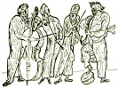
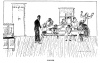

  
[Intangible Textual Heritage](../../index)  [Judaism](../index.md) 
[Index](index)  [Previous](gm36)  [Next](gm38.md) 

------------------------------------------------------------------------

  
*The Golden Mountain*, by Meyer Levin, \[1932\], at Intangible Textual
Heritage

------------------------------------------------------------------------

p. 257

### THE RABBI'S SON

##### AND THE TSADIK WHO LIVED ONE DAY AWAY

Not long ago there lived a rabbi who in
all his life had scarcely lifted his head from the study of the holy
books, and who was so strict in his observance of every last dot in the
ritual that he would scarcely raise his eyes to heaven without first
seeking a law that might tell him whether it was permitted at that
moment and hour to raise one's eyes to heaven. And in all the world
there was nothing that angered him so much as the practices of those who
were called Chassidim, for in their wild prayer, in their miracles of
healing, and in their carelessness of the strictures of the law, he saw
the hand of the evil one. And when he found men in his own village going
over to the ways of the Chassidim, the rabbi became bitter against them,
and he fought with all his strength to prevent another soul from being
lost to the erring ones, and he thought, "After I am dead, there will be
none to prevent them, and they will all go and become followers of the
mad, howling tsadikim, who disgrace the Sabbath with their loud singing
and lusty dancing, and who scarcely know how to read in the holy books."
The rabbi longed for a son who would continue after him to keep the
people to the observance of the holy law.

When a son was born to him in his old age, he took it joyfully as a sign
from above that his way was the only path to heaven, and that the way
would not be left without a guide. The rabbi thought, "My son will be a
great light against the chassidim; he will destroy them entirely, with
their ignorant tsadikim,

p. 258

their mad chanting in the woods, and their magic tricks of healing." He
was watchful over the boy every instant of day and night, that the child
might not touch even the shadow of an impurity.

The youth that grew was remarkable in learning. He sat on a high stool
near the table, and studied the books that were before him. But as the
young boy sat on the stool, he would sometimes lift his eyes from the
pages of the holy books, and his gaze would reach through the window out
into the fields, into the distance that was yellow and green with
leaves; then his soul would glide forth upon the path of his gaze, and
his soul would hover like a bird in the free air.

At those moments the boy felt himself drawn as toward a singing voice,
and he was very happy. But then he would remember his books, and force
his eyes back upon the page, and hold his head down with both his hands,
that he might not err.

More often the longing came upon him, and his soul went out to the call
of a song, as a bird answering the song of its mate. And in that time
the boy was alight with a holiness that made bright the entire room, and
joy was all about him. But when he returned to his books he felt himself
dragged down to listen to the mouths of the dead, and there was a
yearning and a longing in him for he knew not what.

The flame and the yearning consumed him, his body became weak, and he
was as a trembling candle-flame that may die with every puff of the
wind. Still he did not know what he desired, but his yearning was as
that of the unborn souls that await their embodiment on earth.

The rabbi saw that his son was becoming weak, and

p. 259

 
[  
Click to enlarge](img/25900.jpg.md)  
CHEDER  

p. 260

he spoke with him of all the wonders of the law's myriad commands, and
of his life that was needed to combat the Chassidim on earth. But in all
the things that the rabbi said, there was no help for the boy; only when
his father spoke of the evil of the Chassidim, only then he felt a
trembling within him, and a sudden warmth.

Among the young scholars with whom he sometimes studied, there were two
who went secretly among the Chassidim; and when they saw the rabbi's son
become so pale, and losing his heart for learning, they said, "What is
it that is ill with you?"

He told them, "I feel a longing for something, and I cannot tell what it
is."

Then they said to him, "Only one man can help you, and he is the great
Tsadik who lives one day's journey from here. You must go to him, for he
has the power to release your soul to its destiny."

"Is he pure?" asked the rabbi's son.

"We do not know whether he is pure," they told him, "for he does not
keep himself from contact with the sinful. But we do know that he never
leaves any one until he has taken his burden from him."

"Is he learned?" asked the rabbi's son.

"We do not know whether he is learned," they answered, "for he lives in
a hut in the forest, and works as a wood-cutter. But he knows the song
that the sparrow sings to heaven."

Then the boy went to his father the rabbi and said, "Let me go to see a
Tsadik who lives in a little town a day away."

The rabbi was deeply pained at his son's words, for he knew that the
Tsadik was but a simple man, a

p. 261

leader of the Chassidim. "What help can he be to you, my son," the rabbi
asked, "when you yourself have more learning than he?"

The boy returned to his studies, but again he felt the terrible longing
come over his soul and his eyes lifted, and he looked into the distance.
Then he went to his father and begged him, "Let me go."

The rabbi saw his son become more frail and wan each day, until when the
boy asked him a third time, the rabbi said, "You may not go alone to
him, for it may be the evil one who is drawing you on this way. But I
will go with you to this ignorant man, that you may see him and forget
him."

When they had put the horses to the cart, the rabbi said, "Let us see
whether there will be a sign from heaven upon this journey. If nothing
happens to delay the journey, it is a sign that this is a true
pilgrimage; but if we should be stopped on our way, it is a sign that we
must turn back, and we will return."

So they rode forth, and all went well until they came to a shallow
brook, but as the cart was crossing the brook, one of the horses slipped
and fell and overturned the cart, so that the rabbi and his son were
thrown into the water.

When they had come out of the water, and righted the cart, the rabbi
said: "You see, my son, heaven has sent us a sign to turn back, for this
is an evil journey." So they returned home, and the boy sat again over
his books. But soon the heaviness returned to his heart, and he felt the
call of the distance. He feared to speak to his father, for he
remembered the omen on their journey. Days passed, and each day the boy
became weaker, until he was as a dying man

p. 262

who no longer fears what may be said on earth. "Father," he cried, "I
must go and speak with the Tsadik!"

Once more the rabbi consented, and they rode on their way. But when they
had ridden two-thirds of a day, the cart went over a great stone, and
both axles of the cart were broken.

"This Tsadik must surely be an impostor," the rabbi declared, "for we
have had another omen, and our journey to him is barred." They mended
the wagon, and returned home.

But the boy's soul was more than ever unquiet, until he prevailed upon
the rabbi to set out for, a third time upon the journey. "But father,"
he begged, "let us not take what may befall by chance as an omen from
heaven. If the horse slips, or the wagon breaks, have we proof that the
Tsadik is sinful?"

The rabbi said, "But if there is a sign of sin against him alone, will
you obey?"

"I will obey, and return home, and never ask to go to him again."

They set out on their third journey. All went well; at night they came
to an inn not far from the village of the Tsadik. As they sat over their
evening meal, the boy dreamy and lost in awaited happiness, the rabbi
began to speak with a merchant who sat at a near-by table.

"Where does a rabbi travel?" the merchant enquired.

"On his way," said the rabbi, for he was ashamed to say that he was
going to consult a man of no learning. "And you?" he asked.

p. 263

"I am a merchant; I have just been to a village," said the stranger. And
he spoke the name of the Tsadik's place.

Then, as one who remembers the sounds of a name, the rabbi said: "I have
heard that many people come to consult with a wonder-worker who lives in
that same village."

At this, the merchant laughed out loud. "Don't speak of him!" he
shouted. "I have just come from that very man's house!"

The boy raised his head, as one who listens in a dream, and his wide
eyes pierced the stranger.

"Is it indeed true," the rabbi asked, "that he is a holy man?"

"A holy man!" the stranger laughed. "He is an impostor and an agent of
the evil one! I myself saw him defile the Sabbath!"

Then the rabbi turned to his son and said, "You have heard what the
stranger has told us, in all innocence, not knowing where we were
bound."

"I have heard," the boy replied, and his voice was as the voice of the
dead.

They returned home.

Soon after, the boy died.

One night, as the grieving rabbi slept, his son appeared to him in a
dream; the youth was wrapped in anger, and as the rabbi asked him, "My
son, why are you angry?" the boy cried, "Go to that Tsadik to whom I
longed to go!" The rabbi awoke, and remembered his dream, and said to
himself, "Perhaps it was a chance dream," and did not go.

But again his son appeared to him as he slept, and the boy wore the form
of the Angel of Wrath. And

p. 264

he cried, "Go to the Tsadik! Go!" This time the rabbi thought, "The
dream is the work of the evil one." But when his son appeared to him a
third time, the rabbi knew that he must go.

And as he came to that same inn where he had stopped with his son, he
entered, to pass the night. He sat alone in the room, and did not touch
the food that was placed before him; his heart was heavy. Then a voice
spoke, a voice of laughter, saying, "Ah, the rabbi is here again."

The rabbi looked up, and saw the same merchant whom he had met that
other night when he had stopped at the inn.

"The rabbi is here again," the merchant said, "and this time he is
alone!"

"Are you not that merchant whom I met here once before?" the rabbi
asked.

"Indeed I am!" said the stranger, and laughing he opened wide his mouth
and cried, "If you like, I'll swallow you alive."

The rabbi started with fright. "Who are you!" he murmured, trembling.

"Do you remember," the stranger said, "how you and your son once rode to
see the Tsadik, and on the way your horse tripped and fell in the brook?
Yet your son made you go again on the way to that holy man, but the
second time the axles of your wagon were broken? And the third time you
met me here, and I told you that the man was not holy, but an impostor
who sinned on Sabbath? Then you turned back once more, and so your son
died of loneliness and grief? Go, rabbi! now that I have got rid of your
son you may go on your way to the Chassid; for know

p. 265

that in your son there lived the power of the lesser flame, and the
power of the greater flame was in the Tsadik, and if they two had come
together on this earth, Messiah would have descended! But I placed
obstacles in your way, until your son was dead; and now, rabbi, you can
go to see the Tsadik!"

With these words, the stranger vanished.

And the rabbi continued on his journey, and came to the hut of the
Chassid. And there he wept, "Alas, for him who is lost unto us, and
cannot be found again!"

------------------------------------------------------------------------

[Next: The Sage and the Simpleton](gm38.md)
