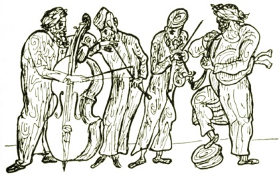

  
[Intangible Textual Heritage](../../index)  [Judaism](../index) 

------------------------------------------------------------------------

<table width="75%">
<colgroup>
<col style="width: 50%" />
<col style="width: 50%" />
</colgroup>
<tbody>
<tr class="odd">
<td width="50%" data-valign="TOP"></td>
<td width="50%" data-valign="CENTER"><h1 id="the-golden-mountain" data-align="CENTER">The Golden Mountain</h1>
<h2 id="by-meyer-levin" data-align="CENTER">by Meyer Levin</h2>
<h4 id="section" data-align="CENTER">[1932]</h4></td>
</tr>
</tbody>
</table>

------------------------------------------------------------------------

[Contents](#contents)    [Start Reading](gm00)    [Page
Index](pageidx)    [Text \[Zipped\]](gm.txt.gz)

------------------------------------------------------------------------

This is a collection of tales of the Eastern European Hassidic Jews,
centering on the holy men Baal Shem Tov and Rabbi Nachman of Bratzlaw.
The territory and narrative elements belong to the familiar world of
folk tales. However, these magical realist stories of the Hassidic
rabbis are encoded with deeper levels of meaning similar to Buddhist,
Sufi, Celtic, and other spiritual traditions. Lovingly recounted by
master story-teller Meyer Levin, this glimpse of a now long-gone world
is a wonderful anthology which can be enjoyed by all.

------------------------------------------------------------------------

 [Title Page](gm00)  
[Contents](gm01)  
[Illustrations](gm02)  
[Foreword](gm03)  

### Baal Shem Tov

[Before He Was Born](gm04)  
[Israel and the Enemy](gm05)  
[The Book of Mysteries](gm06)  
[The Secret Marriage](gm07)  
[The Bride in her Grave](gm08)  
[Rabbi Israel and the Sorcerer](gm09)  
[Two Souls](gm10)  
[The Standing Sheep](gm11)  
[The Mad Dancers](gm12)  
[Rabbi Israel and the Horse](gm13)  
[The Burning Tree](gm14)  
[The Water-Spirit](gm15)  
[The Rich Man](gm16)  
[The Trial of Rabbi Gershon](gm17)  
[Rabbi Israel's Daughter](gm18)  
[Prayer](gm19)  
[Thrice He Laughed](gm20)  
[The Burning of the Torah](gm21)  
[The Boy's Song](gm22)  
[The Wandering in Heaven](gm23)  
[The Prophecy of the New Year](gm24)  
[The False Messiah](gm25)  
[The Holy Land](gm26)  
[His Torah](gm27)  
[After the Death](gm28)  
[The Book of Mysteries](gm29)  

### Rabbi Nachman of Bratzlaw

[The Dynasty](gm30)  
[The Lost Princess](gm31)  
[The Broken Betrothal](gm32)  
[The Cripple](gm33)  
[The Bull and the Ram](gm34)  
[The Prince](gm35)  
[The Spider and the Fly](gm36)  
[The Rabbi's Son](gm37)  
[The Sage and the Simpleton](gm38)  
[The King's Son and the Servant's Son](gm39)  
[The Wind that Overturned the World](gm40)  
[The Seven Beggars](gm41)  
