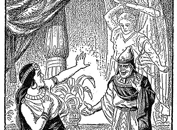

  
[Intangible Textual Heritage](../../index)  [Judaism](../index.md) 

------------------------------------------------------------------------

<table width="75%">
<colgroup>
<col style="width: 50%" />
<col style="width: 50%" />
</colgroup>
<tbody>
<tr class="odd">
<td width="50%" data-valign="TOP"></td>
<td width="50%" data-valign="CENTER"><h1 id="jewish-fairy-tales-and-legends" data-align="CENTER">Jewish Fairy Tales and Legends</h1>
<h2 id="by-aunt-naomi-gertrude-landa" data-align="CENTER">by "Aunt Naomi" (Gertrude Landa)</h2>
<h4 id="section" data-align="CENTER">[1919]</h4></td>
</tr>
</tbody>
</table>

------------------------------------------------------------------------

[Contents](#contents)    [Start Reading](jftl00.md)    [Page
Index](pageidx)    [Text \[Zipped\]](jftltxt.zip.md)

------------------------------------------------------------------------

Jewish folklore is full of vivid stories that both entertain and teach.
This book is based on tales from the [Talmud](../talmud.md) and
[Midrash](../index.htm#midrash.md). While some of the themes are familiar
from fairy-tales and folklore from other traditions, the stories in this
collection are infused with the perennial Jewish struggle for survival
and dignity, as well as a large helping of gentle humor.

------------------------------------------------------------------------

 [Title Page](jftl00.md)  
[Preface](jftl01.md)  
[Contents](jftl02.md)  
[Illustrations](jftl03.md)  
[The Palace of the Eagles](jftl04.md)  
[The Giant of the Flood](jftl05.md)  
[The Fairy Princess of Ergetz](jftl06.md)  
[The Higgledy-Piggledy Palace](jftl07.md)  
[The Red Slipper](jftl08.md)  
[The Star-Child](jftl09.md)  
[Abi Fressah's Feast](jftl10.md)  
[The Beggar King](jftl11.md)  
[The Quarrel of the Cat and Dog](jftl12.md)  
[The Water-Babe](jftl13.md)  
[Sinbad of the Talmud](jftl14.md)  
[The Outcast Prince](jftl15.md)  
[The Story of Bostanai](jftl16.md)  
[From Shepherd-Boy to King](jftl17.md)  
[The Magic Palace](jftl18.md)  
[The Sleep of One Hundred Years](jftl19.md)  
[King for Three Days](jftl20.md)  
[The Palace in the Clouds](jftl21.md)  
[The Pope's Game of Chess](jftl22.md)  
[The Slave's Fortune](jftl23.md)  
[The Paradise in the Sea](jftl24.md)  
[The Rabbi's Bogey-Man](jftl25.md)  
[The Fairy Frog](jftl26.md)  
[The Princess of the Tower](jftl27.md)  

### King Alexander's Adventures

[I. The Vision of Victory](jftl28.md)  
[II. The Land of Darkness and the Gate of Paradise](jftl29.md)  
[III. The Wonders of the World](jftl30.md)  
