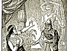

  
[Intangible Textual Heritage](../../index)  [Judaism](../index.md) 
[Index](index)  [Next](jftl01.md) 

------------------------------------------------------------------------

  
*Jewish Fairy Tales and Legends*, by Aunt Naomi (pseud. Gertrude Landa),
\[1919\], at Intangible Textual Heritage

------------------------------------------------------------------------

p. 9

# Jewish Fairy Tales And Legends

###### by

### "Aunt Naomi"

###### (Gertrude Landa)

###### When Childhood's toys have passed away, May Books become another play. Then may each book a blessing give And bring you pleasure while you live.                              --*Ruth Landa*.

#### New York

#### BLOCH PUBLISHING CO., Inc.

#### "The Jewish Book Concern"

#### \[1919\]

NOTICE OF ATTRIBUTION  
Scanned at Intangible Textual Heritage, March 2005. Proofed and
formatted by John Bruno Hare. This text is in the public domain in the
US because it was published prior to 1922. These files may be used for
any non-commercial purpose, provided this notice of attribution is left
intact in all copies.

  [  
Click to enlarge](img/cover.jpg.md)  
Front Cover and Spine  

  [  
Click to enlarge](img/front.jpg.md)  
''Where is the door?'' (Page 21).  

  [  
Click to enlarge](img/title.jpg.md)  
Title Page (1934 reprint)  

p. 10

Copyright, 1919,

BLOCH PUBLISHING COMPANY.

 
[  
Click to enlarge](img/verso.jpg.md)  
Verso  

------------------------------------------------------------------------

[Next: Preface](jftl01.md)
