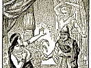

  
[Intangible Textual Heritage](../../index)  [Judaism](../index) 
[Index](index)  [Previous](jftl19)  [Next](jftl21) 

------------------------------------------------------------------------

  
*Jewish Fairy Tales and Legends*, by Aunt Naomi (pseud. Gertrude Landa),
\[1919\], at Intangible Textual Heritage

------------------------------------------------------------------------

p. 194

 

  [  
Click to enlarge](img/19400.jpg)  
He heard a cry of alarm and saw a huge stone fall on the soldier riding
behind him. (*Page 201*).  

 

p. 195

# King for Three Days

Godfrey de Bouillon was a famous warrior, a daring general and bold
leader of men, who gained victories in several countries. And so, in the
year 1095, when the first Crusade came to be arranged, he was entrusted
with the command of one of the armies and led it across Europe in the
historic march to the Holy Land.

Like many a great soldier of his period, Godfrey was a cruel man, and,
above all, he hated the Jews.

"In this, our Holy War," he said to his men, "we shall slay all the
children of Israel wherever we shall fall in with them. I shall not rest
content until I have exterminated the Jews."

True to his inhuman oath, Godfrey and his soldiers massacred large
numbers of Jews. They did this without pity or mercy, saying: "We are
performing a sacred duty, for we have the blessings of the priests on
our enterprise."

Godfrey felt sure he would be victorious, but

p. 196

he also wanted to obtain the blessing of a rabbi. It was a curious
desire, but in those days such things were not considered at all
strange, and so Godfrey de Bouillon sent for the learned Rabbi Solomon
ben Isaac, better known by his world-famed name of Rashi.

Rashi, one of the wisest sages of the Jews, came to Godfrey, and the two
men stood facing each other.

"Thou halt heard of my undertaking to capture Jerusalem," said Godfrey,
haughtily. "I demand thy blessing on my venture."

"Blessings are not in the gift of man; they are bestowed by Heaven--on
worthy objects," answered Rashi.

"Trifle not with words," retorted the warrior, or they may cost thee
dear. A holy man can invoke a blessing."

But Rashi was not afraid. He was becoming an old man then, but he was as
brave as the swaggering soldier, and he faced Godfrey unflinchingly.

"I can make no claim on the God of Israel on behalf of one who has sworn
to destroy all the descendants of His chosen people," he said.

"So, ho!" exclaimed Godfrey, "you defy me.'

But he stopped his angry words abruptly,

p. 197

\[paragraph continues\] He had no wish to
quarrel with any holy man, for that might make him nervous. And
nervousness, then, was misunderstood as superstition. Besides, the rabbi
might curse him.

"If you will not bless," he said, "perhaps you will deign to raise the
veil of the future for me. You wise men of the Jews are seers and can
foretell events--so they say. A hundred thousand chariots filled with
soldiers brave, determined and strong, are at my command. Tell me, shall
I succeed, or fail?"

"Thou wilt do both." Rashi replied.

"What mean you?" demanded Godfrey, angrily.

"This. Jerusalem will fall to thee. So it is ordained, and thou wilt
become its king."

"Ha, ha! So you deem it wisest to pronounce a blessing after all,"
interrupted Godfrey. "I am content."

"I have not spoken all," said the rabbi, gravely. "Three days wilt thou
rule and no more."

Godfrey turned pale.

"Shall I return?" he asked, slowly.

"Not with thy multitude of chariots. Thy vast army will have dwindled to
three horses and three men when thou reachest this city."

p. 198

"Enough," cried Godfrey. "If you think to affright me with these ominous
words, you fail in your intent. And hearken, Rabbi of the Jews, your
words shall be remembered. Should they prove incorrect in the minutest
detail--if I am King of Jerusalem for four days, or return with four
horsemen--you shall pay the penalty of a false prophet and shall be
consigned to the flames. Do you understand? You shall be put to death."

"I understand well," returned Rashi, quite unmoved, "it is a sentence
which you and your kind love to pronounce with or without the sanction
of those whom you call your holy men. It is not I who fear, Godfrey de
Bouillon. I seek not to peer into the future to assure my own safety."

With these words they parted, the rabbi returning to his prayers and to
his studies which have enriched the learning of the Jews, while Godfrey
proceeded to lay a trail of innocent Jewish blood along the banks of the
Rhine in his march to Palestine.

History has set on record the events of the Crusade. Godfrey, after many
battles, laid siege to the Holy City, captured it, and drove the Jews
into one of the synagogues and burned

p. 199

them alive. Eight days afterward, his soldiers raised him on their
shields and proclaimed him king.

Godfrey was delighted, but two days later he thought the matter over
carefully and decided that he could not live in Jerusalem always. So
next day he called together his captains and said:

"You have done me great honor. But I must return to Europe, and it would
be more befitting that I should be styled Duke of Jerusalem and Guardian
of the Holy City than its sovereign."

That night, however, he suddenly remembered the prediction of Rashi.

"For three days I have been King of Jerusalem," he muttered. "The rabbi
of the Jews spoke truth."

He could not help wondering whether the rest of the prophecy would be
fulfilled, and he became moody. He was joyful when he gained a victory,
but there came also disasters, and he was plunged into despondency. The
reverses affected the buoyancy of his troops, disease decimated their
ranks, and desertions further depleted their numbers. Slowly but surely
his mighty army dwindled away to a mere handful of dissatisfied men and
decrepit horses.

p. 200

It was a ragged and wretched procession that he led back across Europe,
and daily his retinue grew smaller. Men and horses dropped from sheer
fatigue helpless by the wayside, and were left there to die, with the
hungry vultures perched on trees, patiently waiting for the last flicker
of life to depart before they set to work to pick the bones of all
flesh.

Godfrey de Bouillon had gained his victory, but at what cost? Thousands
of men, women and children had been murdered, thousands of his soldiers
had fallen in battle, and now hundreds of others had dropped out of the
ranks to end their last hours on the ghastly road that led from
Jerusalem back to western Europe. Do you wonder that Godfrey was
unhappy, and that he thought every moment of the words of Rashi?

At length he reached the city of Worms where Rashi dwelt. With him were
four men, mounted on horses.

"It is well," he said, with as much cheerfulness as he could muster, as
he surveyed the remnants of his once proud army. "The rabbi has failed."

Godfrey bade his men fall into line behind him and he proudly rode
through the gate of

p. 201

the city. As he did so, he heard a cry of alarm. He turned hastily and
saw a huge stone falling from the city's gate. It dropped on the soldier
riding just behind him, killing both man and horse.

"You have spoken truth; would that I had taken heed of your words," he
said to the rabbi. "I am a broken man. You will assuredly achieve great
fame in Israel."

And so it has come to pass. Should you, by chance, ever visit the city
of Brussels, the capital of Belgium, fail not to look upon the statue of
Godfrey de Bouillon, with his sword proudly raised. It stands in the
Place Royale but a few minutes' walk from the synagogue. Should you ever
be in the ancient city of Worms that stands on the Rhine, do as other
visitors, Jews and Gentiles--enter the synagogue that was built many
centuries ago, and you will see the room where Rashi studied and the
stone seat on which he sat. And not far from the synagogue you will see
the ancient gate of the city, named in honor of Rabbi Solomon ben Isaac,
the Rashi Gate. Perhaps it is the very one under which Godfrey de
Bouillon passed into the city with his three mounted companions, as the
legend tells.

------------------------------------------------------------------------

[Next: The Palace in the Clouds](jftl21)
