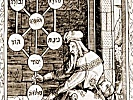

  
[Intangible Textual Heritage](../../index)  [Judaism](../index.md) 
[Index](index)  [Previous](jms14)  [Next](jms16.md) 

------------------------------------------------------------------------

[Buy this Book at
Amazon.com](https://www.amazon.com/exec/obidos/ASIN/0812218620/internetsacredte.md)

------------------------------------------------------------------------

  
*Jewish Magic and Superstition*, by Joshua Trachtenberg, \[1939\], at
Intangible Textual Heritage

------------------------------------------------------------------------

p. 193

### 13

### MEDICINE

#### MAGIC AND THE DOCTOR

MEDIEVAL medicine was a curiously indiscriminate com pound of science
and such superstition as we have been describing. The Greek-Arab-Jewish
tradition, itself well freighted with a large residuum of early magic,
provided none the less a fairly "scientific" foundation upon which the
European peoples superimposed their own ancient folk notions and
nostrums until the whole made a most imposing and fearsome structure.
The medieval "theriac," a mélange of a thousand and one weird and exotic
medicaments, is probably at once its aptest example and metaphor. So
darkly obscured was his science that the physician was often a powerful
exponent of magic and superstition. A fourteenth-century Frenchman, Jean
Gerson, made the penetrating observation that "when one censures the
pestiferous superstitions of magicians and the follies of old wives and
sorceresses who promise to cure the sick by their accursed rites, people
object that similar practices of ligatures, characters, figures and
employment of outlandish words may be found on the part of grave and
learned doctors of medicine and are inserted in their books. Therefore
they must be efficacious, although no natural explanation is offered of
them." One can sympathize with Sebastian Brant's (fifteenth century)
pungent comment:

*Des abergloub ist yetz so vil  
Do mitt man gsuntheyt suchen will  
Wann ich das als zu samen such  
Ich maht wol drusz eyn ketzerbuch*.

\[paragraph continues\] "Eyn ketzerbuch"
is a pat characterization of the contents of this chapter.

p. 194

Northern Europe, walled off from the enlightenment that radiated from
the Arab lands, produced not a single Jewish physician of note. Jewish
practitioners of medicine there were aplenty, but their science was
little more than a faint reflection of the learning of their southern
co-religionists. The sole original medical work from that region written
by a Jew, who lived toward the end of the thirteenth century, probably
in the Rhineland (he was in personal contact with the great doctor
Heinrich of Erfurt, court physician to the Bishop of Cologne; and
himself claimed to have cured the secretary of Pope Martin IV),
discloses a considerable acquaintance with the more reputable phases of
medieval medicine, but it displays too the contemporary addiction to
magical and folk remedies, impossible of "natural explanation." "I have
seen illnesses, upon which the greatest medicines had no effect, cured
by spells and charms," he wrote. As may be expected these were the
remedies that proved especially popular among the masses. It is unfair
to suggest, as some have, that Jewish medical superstition is to be
regarded mainly as an imitation of the Christian. The Talmud had
established a discipline broad enough to serve as an adequate basis for
any later accretions, and while many popular remedies were directly
borrowed from non-Jews, the rationale of superstition and magic in
medicine was part and parcel of the Jewish cultural
heritage.[1](jms34.htm#an_13_1.md)

We find, of course, among the popular prescriptions a goodly number of
items that have no basis other than tradition and a naïve
associationism, such as that washing is harmful to aching teeth, or that
cutting the beard is a cure for sore eyes, or that lioness's milk is a
specific for certain ailments. There are dozens upon dozens of receipts
that belong in this category—the so-called folk medicine, those old
wives' cures that have been handed down from grandmother to
granddaughter through the ages. Often enough they make no sense at all,
and when some dim glimmering of reason shines through, the explanation
seems as little rational as the prescription. Consider the following: to
remove warts, smear them with horse's blood; for a toothache, mix salt,
oil, pepper and a little garlic, bind the mixture *on the pulse*, and
leave it there overnight; as a remedy for insomnia, induce a louse
captured on the patient's head to crawl into a hollow bone, seal the
bone, and hang about the patient's neck.[2](jms34.htm#an_13_2.md)

The German belief that water (called *heilawac* or *heilwag*) drawn at
certain holy seasons possesses curative powers (a belief

p. 195

which can be traced back to early Teutonic and Christian ideas), is
paralleled by the Jewish notion that at the termination of the Sabbath
Miriam's well, to which a Midrashic legend ascribes miraculous medicinal
virtues, moves about from river to river and from well to well. It was
therefore recommended that water be drawn at this time, "and everyone
who is ill, and is fortunate enough to get some of that healing water
and drink it, even though his body be wholly broken out with sores, will
be immediately cured." The admonition that one must be silent while
fetching this water is found in both the Jewish and German
sources.[3](jms34.htm#an_13_3.md)

According to a statement in the Talmud, "a heavy step detracts one
five-hundredth from the light of the eyes," so that if no preventive
measure were adopted one should go blind in time. The Talmudic
suggestion was that the recital of the *Kiddush* in the synagogue on
Friday evenings serves such a purpose, but in Geonic times this was
taken to mean either drinking the *Kiddush* wine (the opinion of Hai
Gaon) or bathing the eyelids with this wine (Natronai Gaon's view).
Medieval Jews accepted either or both interpretations, and the *Kiddush*
wine came to be used in these ways as a remedy for weak eyes. It is
interesting to compare with this practice the injunction found as early
as the fourth century in the 23rd *Catechesis* of Cyrillus of Jerusalem:
"If a drop (of the Communion wine) remains on your lips, smear your eyes
and forehead with it."

Staring intently at the Sabbath lights was also considered by some
medieval Jews to be a strengthener of weak eyes. A custom which probably
had a similar purpose, though it was explained as an expression of "love
of the commandments," was to dilute the wine remaining after the
*Habdalah* ceremony, at the expiration of the Sabbath, and to bathe the
eyes and face with the mixture. (A further medicinal use of sanctified
wine is to be discerned in the custom of feeding some of the wine over
which the blessing had been recited at a circumcision to the mother and
the infant; while the usual explanation was that the people in whose
behalf the benediction was said ought to taste the wine, it was also
admitted that "both mother and child require medication, and the
blessings promote health.") Still another remedy for weak eyes was to
gaze fixedly into a mirror for a while; "some scribes set a mirror in
front of them when they are writing, and occasionally stare into it, so
that their sight may not be dimmed."[4](jms34.htm#an_13_4.md)

A most popular medieval panacea, almost universally employed,

p. 196

was the abstraction of blood, to permit the bad to flow away while the
good remains in the body. Even healthy people were advised to undergo
this operation periodically, for as a twelfth-century German enumerated
its advantages, "It contains the beginning of health, it makes the mind
sincere, it aids the memory, it purges the brain, it reforms the
bladder, it warms the marrow, it opens the hearing, it checks tears, it
removes nausea, it benefits the stomach, it invites digestion, it evokes
the voice, it builds up the sense, it moves the bowels, it enriches
sleep, it removes anxiety. . . ." Cupping was also often prescribed,
especially for abdominal ailments, for it "restores the bowels to their
place."[5](jms34.htm#an_13_5.md)

Psychic treatment was not unknown. "Music hath charms to soothe a savage
breast"; well, medieval Jews applied this cure quite literally to heal
people who had gone out of their minds, and it was believed that the
*Alpdrücken*, who were especially susceptible to the charms of music,
could be seduced by its sweet strains to vacate the body of a demoniac.
Frightening a patient was another sovereign remedy. An invalid afflicted
with chills was startled out of his ailment with the news that his
friend had died suddenly, and in an even more wonderful cure, a man who
had been eviscerated by a sword-thrust groaned so lustily when he beheld
what purported to be the slaughter of his children, that his bowels were
drawn back into his body, and it was possible to sew up the wound and
save his life. In fact, magical cures and incantations were occasionally
permitted by the rabbis not because of their direct effect upon the
disease, but in order to set a superstitious patient's mind at
ease.[6](jms34.htm#an_13_6.md)

One of the most widespread medical superstitions is the homeopathic
doctrine, *similia similibus curantur*. The English "hair of the dog
that bit you" is matched by the Mishnaic "lobe of its liver" as a remedy
for a bite. Maharil is credited with the view that "we may not employ
any of the cures and charms given in the Talmud, for we no longer know
how to apply them correctly . . . except the one found in *Shab*. 67a:
'When a bone sticks in one's throat he should place a similar bone on
his head and say, One, one, gone down, swallowed, swallowed, gone down,
one, one.' This cure is tested and proven, and is therefore the only one
that may be used." Medieval Jewish literature contains many instances of
the application of this principle, of which only one or two need be
cited here. To stop bleeding, "take some of the blood which has been
shed, parch it in a pan over the fire until it becomes dry and powdery,
and place

p. 197

it on the wound." A poultice to halt excessive bleeding after a
circumcision was made of flax that had been smeared with egg-yolk, the
mother's pubic hairs, and the ashes of a feather and a bit of cloth that
had been steeped in the blood. In the same category were the cures
effected by abstaining from "likes." A man afflicted with a headache
would eat no head of bird or animal; if his heart pained, or his
stomach, hearts or entrails were excluded from his diet. And just as
likes cure, so do contraries. "Every cure is the natural contrary of the
ailment," we read; therefore cold cures fevers, and heat cures
chills.[7](jms34.htm#an_13_7.md)

#### THE CAUSES OF DISEASE

These, however, are the incidentals of the popular practice of medicine
as it was known in the Middle Ages, and was and still is understood by
primitive people. By far the larger part of this medicine fits into a
definite ideological scheme. No matter how irrational many of the
prescriptions may seem to us, we must recognize that "these modes of
treatment follow directly from their ideas concerning etiology and
pathology. From our modern standpoint we are able to see that these
ideas are wrong. But the important point is that, however wrong may be
their beliefs concerning the causation of disease, their practices are
the logical consequences of those beliefs." W. H. R. Rivers, when he
wrote these words, had in mind the natives of Melanesia, but they are
equally applicable to the natives of medieval Europe. He grouped the
causes of disease, as generally conceived by mankind, in three chief
classes: "human agency, in which it is believed that disease is directly
due to action on the part of some human being; the action of some
spiritual or supernatural being, or, more exactly, the action of some
agent who is not human, but is yet more or less definitely personified;
and what we ordinarily call natural causes." All of these causes are
clearly indicated in Jewish sources.[8](jms34.htm#an_13_8.md)

The first cause, human agency, is to be met with in the machinations of
the sorcerer. By his evil art he can visit all sorts of infirmities upon
his enemies, or the enemies of his clients. An anecdote in *Sefer
Ḥasidim*[9](jms34.htm#an_13_9.md) reveals the presence of this belief among
medieval Jews. The mother of a child who had been bewitched came to a
sage and said to him, "My baby cries incessantly because a certain woman
has cast a spell over him. I know a way to cure him, and at

p. 198

the same time to transfer the illness to this woman's own child." The
sage reproved her, "If the mother has sinned, her child certainly has
not!" His humaneness was as rare in those days as the belief in the
magical causation of disease was common. We have seen, too, that some
people are possessed of the power of the evil eye, by which, sometimes
unwittingly, they can inflict disease upon one.

Supernatural agency is the most commonly designated cause of disease.
The demons, in particular, are singled out as responsible agents, and
medieval medical lore in this respect followed closely the teaching of
the ancients. Egyptian and Greek magical papyri, the Talmud and the New
Testament, all abound with such diagnoses, and often identify the
ailment with the demon, indicating the belief that disease is caused by
an actual penetration of the invalid's body by the evil spirit. Jesus
gave his disciples power "over unclean spirits to cast them out and heal
all manner of sickness and all manner of disease" (Mt. 10:1) . There is
a demon known to Jews as the "neck-twister," who attacks children;
moonstruck youngsters suffer alternately from chills and fevers because
the morbific demons who pervade the moon-shadows are constituted of fire
and hail. The coma called *Hirnbrüte* is induced by demons. Even when a
human being is the ultimate cause, the spirits are the direct sources of
illness. for magic and the evil eye operate through them. It is
interesting to note, in view of our modern ideas on hygiene, that these
disease-breeding demons haunt marshy places, damp and deserted houses,
latrines, squalid alleys, fetid atmospheres. This demon etiology is even
susceptible of a theory of contagion: "One should not drink an-other's
leavings," we are warned, "because if the first man has a disease a
spirit goes out of his mouth into the liquid; it is mortal danger to
drink it." It was thus possible to establish the general rule that "all
maladies that come upon one suddenly are caused by the
spirits."[10](jms34.htm#an_13_10.md)

Sometimes the angels, as well as the demons, bear a share of the
responsibility. The idea that sickness is a heaven-sent punishment for
one's sins, frequently encountered, necessitates angelic intermediacy in
executing the decree. Besides, certain epidemic diseases, such as
measles, may be transmitted by angels who are especially appointed to
this function.[11](jms34.htm#an_13_11.md)

Apparently the most virulent type of malady is that produced by the
spirits of deceased evil-doers, which join the demonic ranks. "When
these spirits injure a man, there is no human remedy capable

p. 199

of healing him; it is more painful than any other ailment, and only his
Creator can relieve his pain."[12](jms34.htm#an_13_12.md)

As to the "natural" sources of illness, etiological diagnoses did not
limit themselves to the more credible causes (according to our view)
inherent in diet, or age, or accidents, or "atmospheric conditions" (a
favorite), but went afield to hunt up some rather bizarre physiological
phenomena, such as the *spiritus* that fills the body cavities, or the
deterioration of the blood. There is an interesting account of an
operation performed on Solomon b. Ḥananel of Mainz by the noted
physician R. Sheshet, in Barcelona, which involved the removal of a
tribe of worms that had caused the patient to suffer from a severely
debilitating ailment.[13](jms34.htm#an_13_13.md)

#### TREATMENT

This last category of disease responded to more or less "natural"
treatment, which does not concern us here, except as it falls within the
group of folk remedies already briefly mentioned. But no "natural"
remedy, however we may strain the sense of that term, could possibly
reach and destroy the supernatural causes of disease. Only a powerful
counter-magic could root out the effects of magic and deflect the
demonic onslaughts. However determined their formal resistance to the
practice of magic may have been, the rabbis were obliged to recognize
the logic of such a medicine. Two of the leading authorities of the
*Gemara*, Abaye and Raba, who were so often in heated opposition,
concurred in the rule that "nothing done for purposes of healing is to
be forbidden as superstitious." During the Middle Ages the issue was
placed squarely before at least one rabbi, Israel Isserlein, who wrote
to his correspondent, "Regarding your question as to whether an invalid
may consult a magician, know that we have found no explicit prohibition
of such a course, for the Biblical strictures against sorcerers do not
apply in this case." On the basis of this decision Solomon Luria
vouchsafed a still broader license: "If a serious illness is caused by
magic or evil spirits one may even resort to a non-Jewish magician for a
cure." But it was not really necessary to obtain the magician's aid; the
ordinary remedies applied by the doctor or the layman utilized the
entire range of magical devices.[14](jms34.htm#an_13_14.md)

The Talmudic literature contains scores of references to the use of
charms in healing wounds and diseases, so that medieval Jews

p. 200

accepted their efficacy as a matter of course. Even religious leaders
did not hesitate to employ them. "Once when R. Simḥah had a pain in his
eyes, a woman taught R. Abigdor Cohen a certain spell which he recited
twice daily, even on the Sabbath, to relieve R. Simḥah's suffering."
Another report tells of a man who used to recite charms to heal the
sick; if they were successful the cure was effected within nine days, if
not, the patient died in that period. Here at least, was one honest
physician, unafraid to disclose the alternatives inherent in his
treatment. Many Christians had no scruples about using Jewish doctors;
neither was there any Jewish prejudice against being cured by non-Jews,
provided they did not insert the formulas of their own religion in their
incantations. Yet even this minor restriction was not taken too
seriously, for according to R. Menaḥem of Speyer, "The sounds effect the
cure, and not the words of the incantation; therefore a Christian may be
permitted to heal a Jew even if he invokes the aid of Jesus and the
saints in his spell." The reputed medicinal virtue of Christian relics
was a medieval dogma which Jews allegedly recognized in at least one
instance, when they testified to a miraculous cure which they had
witnessed in Aix-la-Chapelle, according to the report of Charlemagne's
historian, Einhard, but to use them themselves was more than they could
countenance. We have an account of a Jewish woman who, though she was
seriously ill, refused to be healed by a stone which came from the grave
of Jesus, which her Christian friend had offered to
her.[15](jms34.htm#an_13_15.md)

Medieval remedies, whatever their therapeutic value, were often
accompanied by incantations, which were regarded as the effective agent
in the cure. The operation of blood-letting, for example, or the
concoction and administration of magic potions to heal disease, or to
induce abortions, are cases in point. Frequently, as with R. Simḥah's
affliction, the spell in itself sufficed. The variety of such charms is
infinite, and follows the type of the magical incantation, with the
specific request that the demon or the disease, or both under a common
name, be expelled from the patient's body. Several ancient German
magical cures of this order have been preserved in Hebrew manuscripts.
One which has aroused considerable interest is the fourteenth-century
rhymed *Bärmutter* charm against colic and labor pains, in which the
bowels and the womb are directly apostrophized: "*Bärmutter* (womb), lie
down, you are as old as I am. If you bring me to the grave, you will be
buried with me. There is a book called the Bible; *Bärmutter*, lie down!
Lie down in

p. 201

your proper place, in compliance with the will of God's holy power. . .
." Another Jewish version of this spell invokes angels, patriarchs,
matriarchs, altars, heavens, *shofars*, etc. (seven of each), the sun,
the moon, the name of God; still another calls upon nine angels and nine
scrolls of the *Torah* to enforce its command; while a contemporaneous
Christian version conjures the *bermuoter* by "the sacred blood, the
sacred day, the very sacred grave, the five holy wounds, and the three
holy nails which were driven through the hands and feet of our lord
Jesus Christ." The details of invocation are adjusted to suit the
religious sensibilities of the patient, but the purport and even a good
part of the phraseology is the same in all. Another such spell runs: "I
conjure you, wound, by our dear Lord, that you neither bleed nor swell,
as the wound which our dear Lord produced when He extracted a rib from
Adam's side to make him a wife did not bleed nor swell. . . ." Numbers
played an important rôle in medical practice, as in magical, and the
remedial measure often included this element, as above, or else was to
be repeated a given number of times, or on several succeeding days, 3,
7, 9, as the case might be. *Sefer Ḥasidim* cites the German usage, "To
cure a person who has been harmed by a demon, the charm must be repeated
nine times, as they do in Germany."[16](jms34.htm#an_13_16.md)

Sometimes the mere repetition of a magic name is sufficient to effect
the cure, or the name is inscribed directly upon the person of the
invalid, or is brought into action by means of a specially prepared
amulet. Of three such magic names, which were to be written on the
forehead to stop bleeding, our informant writes, "I myself have tried
the last two, they have been repeatedly proven, and are unequalled in
the whole world." To ease labor pains the prescription is to incise a
name upon virgin clay and to fasten this on the navel of the parturient
woman, "but remove it as soon as the child is delivered, or her viscera
will also be extruded!" Or, "inscribe this name on the woman's wedding
ring, and place it under her tongue, and say ten times, 'Go out, you and
all the company of your followers, and then I will go out.' And then the
child will be delivered." Still another device is to inject the name
into the body, where its presence will assuredly dislodge the plaguing
spirit. Thus, a name written on an apple and consumed on three
consecutive days is guaranteed to heal fevers, and the inscription
*satur arepo tenet opera rutas*, which possesses the highly potent
magical virtue of reading the same backward as forward, eaten on an
apple, or an

p. 202

egg, or cheese, is warranted to induce an abortion; or the name may be
inscribed on a leaf and dissolved in water, which is to be drunk, or may
simply be whispered over the liquid and thus
imbibed.[17](jms34.htm#an_13_17.md)

The importance of Scripture in magic made it a prominent adjunct of
medicine also. The Talmudic prohibition against using "the words of
Torah for healing" is sufficient evidence of the popularity of such a
therapeutic at an early time. The Torah scroll was itself laid upon the
body of a sufferer or brought into the sick-chamber, for its curative
virtues, and many Biblical selections were singled out as specifics for
various ailments, to be recited, or inscribed on amulets, or consumed.
For example, to ease a confinement, "recite Ps. 20 nine times and each
time concentrate on this name. . . . If this doesn't help repeat it
another nine times. The lying-in woman must be able to hear the recital
of these verses. If this still doesn't help her, say, 'I conjure you,
Armisael, angel who governs the womb, that you help this woman and the
child in her body to life and peace. Amen, Amen,
Amen.'"[18](jms34.htm#an_13_18.md)

#### SOME SOVEREIGN REMEDIES

These magical devices, intended to expel the demonic cause of disease,
by no means exhausted medical ingenuity. Many of us have good reason to
recall the old notion that the viler a medicine tasted the better it
was. This idea is not altogether irrational—if nauseous drugs disgust
humans, they are likely to have the same effect on demons; therefore the
more obnoxious the dose the more likely it is to weary the demon of his
human habitat. What is bad for the demon must be good for the patient.
Some of the heroic remedies excused by this theory can have had little
worse effect upon the invalid than upon the demon. The most disgusting
filth has found a place in medical prescriptions. In 1699 there appeared
in Frankfort a volume entitled, "Curieuse, Neue Hauss-Apothec, Wie man
durch seine eigne bey sich habende Mittel, als dem Blut, dem Urin,
Hinter- and Ohren-Dreck, Speichel and andren natürlichen geringen
Mitteln seine Gesundheit erhalten, fast alle selbst vor incurabel
gehaltene Kranckheiten . . . heilen . . . möge and könne," which,
besides the items included in the title, describes the medicinal value
of the bones, marrow, skull, flesh, fat, hair, brain, heart, nails,
sweat, after-birth, semen, menses, etc. From earliest times such

p. 203

medicines have been favored by physicians. The Talmud knows of the use
of human and animal urine and excrement as a medicament to be taken
internally as well as applied externally, and in the Middle Ages fine
distinctions were made regarding the specific medical utility of a
child's urine, or a horse's, or a donkey's, of the excrement of men and
women, or of she-asses, or of swine. Concerning Israel Isserlein it is
reported that "the only remedy he used for his gout was occasionally to
rub some warm urine over the aching area." Human spittle, especially
from a person who had gone without food for some time, was considered a
prime cure for ailments of the eye.

It must be said, however, that although all those bodily parts and
products mentioned in the *Curieuse Hauss-Apothec* were very frequently
prescribed in non-Jewish medicine, Jewish medicine religiously refrained
from recommending their use, for the same reasons that precluded their
magical employment. The consumption of blood, in particular, was
abhorrent to Jews; there is not a single instance in all of Jewish
literature of the prescription of blood for internal medicine, and the
very rarity of the suggestions that horse's blood, or the menses, may be
applied externally serves only to bring out in bold relief the sharp
prejudice against these usages. Reptiles and vermin of all sorts were
also highly regarded for medical purposes, and were often taken
internally in the form of powders, or bound upon a wound, alive, to
close the gash and to knit fractured bones, and poultices for open
wounds were made of spiders’ webs.[19](jms34.htm#an_13_19.md)

A favorite antidote, usually practiced by old women, was to encircle the
diseased part, an abscess or rash or a painful spot, such as the eye or
the head, with the finger or with some object, such as a ring, while
reciting a charm. Where the object was of metal its anti-demonic virtues
were relied upon to dispel the pain, though the commentators
rationalized a Talmudic reference to such a cure with the explanation
that it was intended to cool a fevered area, or to prevent it from
spreading; but the primary utility of the circle lay in its magical
significance, to ban the evil spirits within its periphery. Eye
ailments, particularly the carbuncle (anthrax), euphemistically called
*bon malant*, were thus treated.

A popular medieval remedy of a similar nature, known to the Germans as
*messen*, was applied by Jews even on the Sabbath, when all mensuration
was forbidden. The Hebrew accounts of the procedure are not very
clear—it was evidently so well known that it required little
description—"one measures three times three ells

p. 204

with the patient's belt and recites the charm formula." From German
sources we learn that it was used both as a cure and to prognosticate
the future course of the ailment. According to these accounts, to cure a
severe headache a thread was wound three times around the head and hung
in a tree; when a bird flew through the loop it carried the pain off
with it. Or, the invalid's belt was stretched three times over the
length and breadth of his naked body, and then hung on a nail with an
appropriate incantation; after a while the belt was measured, and if it
was longer or shorter than before, this was interpreted as a portent of
the progress of his illness. It is to such procedures that the Hebrew
sources refer.[20](jms34.htm#an_13_20.md)

The purpose of many remedies, such as the one just cited, was to
transfer the disease to an animal, or to an inanimate object, or to
another person. The Talmud describes various measures to shake off a
fever by passing it on to an ant or to water and the like, measures
which were duplicated in the Middle Ages. Or the ailment might exchange
victims through a commercial transaction. "Once a man was mortally ill,
and another jokingly said to him, 'I'll buy your illness from you for
such and such a sum'; the invalid promptly responded, 'It's a bargain.'
Immediately, he arose cured, and the purchaser sickened and
died."[21](jms34.htm#an_13_21.md) Jesting is a dangerous business when
spirits have no sense of humor.

A quite extraordinary healing device was predicated on the belief that
illness and death are often visited upon man for his sins, by the
angels, at God's command. Jews visualized the celestial administration
as conducted in much the same bureaucratic manner as a mundane
government. The decrees issued from the seat of the Supreme Ruler were
distributed among the various secretariats and in time assigned to
angelic attendants for execution. Not unlike their earthly counterparts,
the angels tended to go about their tasks methodically, but not
over-intelligently, carrying out the letter of their orders without any
great concern with or comprehension of the wider import of their
errands.

The human analogy suggested the possibility of outwitting them by a
crafty dodge. The Talmud knew of four courses that might be pursued to
counteract an adverse decree from above, namely, almsgiving, prayer,
change of conduct, and *change of name*. Lest there be any doubt of the
intent of this last method, Moses of Coucy plainly explained that the
one who changes his name as much as declares to the angel looking for
him, "I am not the person you are

p. 205

seeking, I am not the one who committed the sins you charge me with."
And, of course, the angel takes him at his word. During the Middle Ages
the belief that changing the name of a sick person can save his life and
effect his cure by hoodwinking the angel charged with bringing his
ailment to a fatal conclusion was very pronounced and much more
generally accepted than in earlier periods. It seems to have been acted
upon almost universally among German Jews when an illness was prolonged
and severe. Interestingly enough, the very same course is followed on
the opposite side of the earth, in Borneo and the Kingsmill Islands. In
modern times, when Jews effected such a change of name, they usually
selected one which in itself suggests a long life, to make doubly sure
that the angel of death will avoid the invalid, such as *Ḥayim*
("life"), *Alter* ("old man"), *Zeide* ("grandfather"), etc. During the
Middle Ages the customary procedure was to find a new name "by lot,"
opening the Bible at random and choosing the first one that appeared.
Israel Bruna, in his responsa, protested against the adoption of the
name of a wicked person when such was the first found, and ordered it to
be passed over for the first righteous one, citing "the memory of the
just is blessed, but the name of the wicked shall perish" (Prov. 10:7)
in extenuation. Israel Isserlein went further, and demanded that the new
name contain not a single letter of the old and that it have a greater
numerical value, although when he changed his own son's name during an
illness he adhered to neither of his requirements.

This change of name was and still is solemnly effected before an
assembly of ten persons by an expert reader who holds a scroll of the
*Torah* in his hands while he repeats a prescribed formula whose
institution is attributed to the Geonim. After announcing the new name,
the ritual formally notifies the heavenly authorities of the change, and
requests them to take cognizance of it and to consider this person as
not identical with the one who bore his former name, "for he is another
man, like unto a newborn creature, an infant who has just been born unto
a long and good life." The new name then becomes the true name, even
though the old remains in use, and in legal documents the individual is
identified by it with the notation that he bears his former name as an
alias.

However, since Jews were known by their parents’ names as well as by
their own, as Isaac son of Abraham and Sarah, there still remained some
room for apprehension lest the angel's order identify the child by its
parents (which is especially likely to happen when

p. 206

the child is being punished for its parents’ sins); a change simply of
its own name would then be ineffective to save its life. The way out was
not hard to find—change his parents as well! Which is just what was
done. The real parents would sell their invalid child to another couple
who, because their children were alive and well, appeared to be in high
favor with the heavenly powers. Thus the child acquired new parents, and
the angel of death was twice confounded. If he tried to locate the child
through the parents he could not trace it, and if he hunted up the
parents to punish them by killing their child he found they had
none.[22](jms34.htm#an_13_22.md)

#### HERBS

Herbs are the prime constituents of most folk remedies, and medical
science has been able to show in more than one instance that they
possess true healing properties which take them out of the class of
old-wives’ simples. Undoubtedly such herbs were prescribed because they
were known to be successful in treating various ailments, but their
merit was usually ascribed not to any natural qualities inherent in the
plant, but rather to the occult virtues they were believed to possess,
or even to the magical spells and techniques with which they were
applied. Only thus can we understand the common use of plants and
grasses among Jews and Christians, as amulets against disease, to be
worn on the person.

An interesting reference to the magical apparatus that accompanied the
preparation of a herbal remedy, which has given rise to considerable
confusion, is to be found in *Sefer Ḥasidim*. In the course of a
paragraph on improper magical practices, such as the invocation of
angels and demons, whispering charms, and divining by dreams, there is
included "the *bukaiẓa*, called in German *biguraich* (and in French
*plantaina*), which it is forbidden to invoke." The difficulty of
deciphering these transliterations led Güdemann and Perles to suggest
some ingenious etymologies; the first read the German word as
*becherweihe*, which he interpreted as "divining with goblets," while
the second, relying upon a misspelling of one word and an emendation of
another, took this to refer to divination by the call of the cuckoo,
both well known in medieval Germany. Alas for the scholarly toil and
ingenuity that went into these efforts! The solution of the puzzle is
much simpler and more obvious. A fourteenth-century writer, in *Sefer
Asufot*, divulged its key in these words: "I have heard that the juice
of the plant called *wagruch*, and

p. 207

in French, *plantain*, is equally good when there is no olive oil," in
preparing an ointment to stop the flow of blood. The first word,
*bukaiẓa*, is the French *boucage*, a medieval term for a medicinal
plant related to the plantain. German sources indicate that this herb
(*plantago*), variously called *wegarih*, *wegarich*, *wegawarte*, etc.,
was a very important item in medieval folk medicine, and that its potent
virtues were accounted for on the basis of several legends. In
conjunction with the German material *Sefer Ḥasidim* proves the
essential rôle of the magical invocation in preparing this and other
plants for medicinal use.[23](jms34.htm#an_13_23.md)

For a pain in the neck it is recommended that one wind elder leaves
(*Sambucus*) about the neck, and at the same time recite a given spell.
Herbs gathered in a cemetery, and even soil from a grave, or earth or
water gathered at a crossroads, were considered of high medicinal value,
because of their association with the spirits and their consequent
occult potency.[24](jms34.htm#an_13_24.md)

It should be noted that most of the herbs are referred to by their
German or French names; medieval Jewry, in other words, borrowed its
herb-lore and the accompanying medico-magical techniques from its
neighbors. *Fenouil* (fennel), whose healing properties were highly
regarded by French and Germans, was recommended by a Jewish writer for
abdominal disorders and apprehended miscarriage; *akeleia* seed
(columbine, *Aquilegia vulgaris*), prescribed for many ailments in
German sources, makes its appearance in a Hebrew work as a cure for bad
eyes when taken internally—a use that may have been suggested by the
shiny black appearance of the seed. The sap of a plant "which is called
*Schelwurz* (celandine, *Chelidonium*) in Germany" is recommended for
spots in the eye and cataracts. A decoction of "*salvia* or *sauge* in
French" (sage) is suggested as a cure for paralysis, and to aid the
digestion "take saltpeter and sage and bay and cinnamon, beat them
thoroughly in honey, and pour the mixture often into your mouth;
whatever has disturbed you will flee; drink some wine
afterwards."[25](jms34.htm#an_13_25.md) It is usually impossible to divorce
the purely therapeutic from the superstitious and magical in such
prescriptions; the three are as thoroughly intermingled as the
ingredients of the above recipe should be. Which is, it must be
confessed, quite unexceptionable. Ailments that are brought about by
magic, or by demons, or by superstitious "natural" causes, are not to be
cured with mere drugs and herbs, but only with the occult powers that
are inherent in or conjured into these medicaments.

------------------------------------------------------------------------

[Next: 14. Divination](jms16.md)
