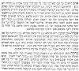
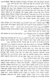
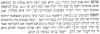

  
[Intangible Textual Heritage](../../index)  [Judaism](../index.md) 
[Index](index)  [Previous](jms19)  [Next](jms21.md) 

------------------------------------------------------------------------

[Buy this Book at
Amazon.com](https://www.amazon.com/exec/obidos/ASIN/0812218620/internetsacredte.md)

------------------------------------------------------------------------

  
*Jewish Magic and Superstition*, by Joshua Trachtenberg, \[1939\], at
Intangible Textual Heritage

------------------------------------------------------------------------

p. 265

### APPENDIX II

### MS. SEFER GEMATRIAOT, pp. 43a-44b, ON GEMS

(Notes on pp. 267-268)

This passage closely parallels Baḥya b. Asher's comment on Ex. 28:17,
both apparently being derived from a common source. They were composed
at about the same time, so that one could hardly have drawn from the
other; each lacks passages present in the other; the language of the two
is very similar, but Baḥya's text is longer and more wordy, while the
present text contains several additional details about the use of the
gems; and there are some interesting differences which illustrate the
different environments (Spain and Germany) in which they were composed.

  [  
Click to enlarge](img/26500.jpg.md)

p. 266

  [  
Click to enlarge](img/26600.jpg.md)

p. 267

  [  
Click to enlarge](img/26700.jpg.md)

#### NOTES TO APPENDIX II

1\. Cf. *Gen. R.* ch. 98, 7; Rashi on Gen. 35:22.

2\. *Rubino*, ruby; Baḥya continues with a long description of this gem
which is lacking here.

3\. Gen. 30:14.

4\. See [p. 182](jms14.htm#page_182.md) above. From here to the end of the
paragraph not in Baḥya.

5\. *Fels*, mhd. *vels*, *velsch;* cf. Grimm, Deutsches Wörterbuch, s.
v. Fels.

6\. Gen. 37:21.

7\. Gen. 42:22.

8\. Gen. 41:42.

9\. Perhaps this is the prasinum, a species of smaragd (cf. Ducange, s.
v.); Baḥya: ‏ונקרא פראש״מא והיא מין נופך שהוא מרק״די שהוא גם כן ירו׳
ככרתי‎.

10\. Then this should read ‏סמרלדא‎, *smiraldus*, *smeraldus*, another
species of smaragd. This word does not appear in Baḥya.

11\. Nu. 25:14.

12\. Job 28:19.

13\. Gen. 29:33.

14\. Carbuncle.

15\. Gen. 6:16.

16\. Is. 54:12.

17\. Deut. 33:50.

18\. Ecc. 8:1.

19\. Cf. *Sotah* 12a; *Pirke de R. Eliezer*, ch. 48.

20\. Ex. 34:35.

21\. From here to end of paragraph not in Baḥya.

22\. Deut. 34:7.

23\. Smaragd. Baḥya has here a discussion of the Arabic etymology of
this word, and comments ‏והוא ממין פראש״מא‎.

24\. Cf. Gen. 38.

25\. Gen. 37:33.

26\. Gen. 49:9.

27\. Preceding six words not in Baḥya.

28\. Gen. 49:8.

29\. I Chr. 12:32; Baḥya's name for this stone is ‏שפי״לו‎.

30\. Prov. 3:8; this paragraph is much longer in Baḥya.

35\. Perla, pearl; the suggested reading is confirmed in Baḥya.

32\. Gen. 30:20.

33\. *Topazia*, topaz; Baḥya: ‏אשטכסי׳‎.

34\. Cf. Jud. 18.

p. 268

35\. *Turkiska*, turquoise; Baḥya: ‏טורקיזא‎.

36\. Gen. 30:8.

37\. *Cristalo*, crystal; Baḥya: ‏קריסטא״ל‎.

38\. Deut. 33:20.

39\. *Diamanti*, diamond; Baḥya: ‏ליאמן‎.

40\. Job 39:4.

41\. Is. 38: 16.

42\. From here to end of paragraph not in Baḥya.

43\. I have not succeeded in tracing this word.

44\. *Yakint*, jacinth; Baḥya: ‏קריאוליק׳‎.

45\. Gen. 49:20; from here to end of paragraph not in Baḥya.

46\. I Chr. 7:31.

47\. *Nichilus*, *nichilinus lapis*, *achetae species* (Ducange, s. v.);
Baḥya: ‏אוניקלי‎.

48\. Gen. 39:2.

49\. Ibid.

50\. Jasper; Baḥya: ‏ישפיז‎.

------------------------------------------------------------------------

[Next: Abbreviations and Hebrew Titles](jms21.md)
