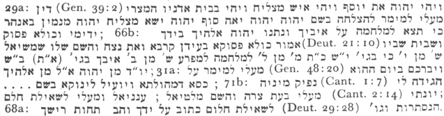

  
[Intangible Textual Heritage](../../index)  [Judaism](../index) 
[Index](index)  [Previous](jms28)  [Next](jms30) 

------------------------------------------------------------------------

[Buy this Book at
Amazon.com](https://www.amazon.com/exec/obidos/ASIN/0812218620/internetsacredte)

------------------------------------------------------------------------

  
*Jewish Magic and Superstition*, by Joshua Trachtenberg, \[1939\], at
Intangible Textual Heritage

------------------------------------------------------------------------

#### CHAPTER VIII

#### THE BIBLE IN MAGIC

1. *Joseph Omeẓ*, pp. 277-8; *Yore Deah*, 179:9
and the commentaries; *S. Ḥas.* 818; *‘Amude Shlomo* on *Semag*, I, §51;
Landshuth, p. xx; Perles, *Graetz Jubelschrift*, p. 28. Wuttke, 144,
writes of the Germans: "Gesang und Gebetbücher werden viel als
Zauberschutz gebraucht, Wöchnerinnen und Säuglingen ins Bett gesteckt."

2. *S. Ḥas. B* 1140; Singer, *Proc. of Brit.
Acad.*, 1919-20, 343; *Tashbeẓ*, 256 (which attributes the statement
concerning the manna chapter to the Jer. Talmud); *Yesh Noḥalin*, 10b,
n. 9; *Or Ḥadash*, p. ix; *Yesh Noḥalin*, 13b, 14a.

3. *Maḥ. Vit.*, p. 510.

4. *Ber.* 56b; *Pes.* 112a, 111a; *JE*, III,
202; *HaḤayim*, IV, 10. Mention is also made of a verse which begins and
ends with "lo" (the reverse of "el"), presumably Nu. 23:19. *Tos.*
*Pes.* 111a refers this passage to a prayer by R. Ḥananel, beginning
with "el" and ending with "lo," but Blau (70-71) considers that both
statements refer to the same verses, Nu. 23:22-23, which begin and end
with both "el" and "lo" when read forward and backward, respectively.

5. M. *San.* XI, r; *San.* 101a and Rashi;
*Sheb.*, 5b; *S. Ḥas.* 818; *Toledot Adam veḤavah*, 17:5, p. 127b; *Yore
Deah*, 179:10.

6. See, *e.g.*, n. 8 below; *Shimmush
Tehillim*, passim.

7. Ibid.; cf. Grunwald, *MGJV*, X (1902), 91
ff. for several ms. versions of this work; *JE*, III, 203 f.; *REJ*,
XII, 315; *Kiẓur Shelah*, 111, 203. Schudt (II, 31:7, p. 191), in the
18th century, testifies to the popularity among German Jews of "das
aberglaubische Büchlein Schimmusch Tillim, darin der gantze Psalter
Davids zu lauter aberglaubischen Dingen verdreht wird." The use of hymns
and psalms in incantations goes back to the ancient Babylonians, and was
practiced by Christians as well as Jews. See Daiches, 41; C. Kayser,
"Gebrauch von Psalmen zur Zauberei," *ZDMG*, XLII (1888), 456 ff.;
Montgomery, 62 f.

p. 293

8. See Bibliography C for a description of this
ms. These quotations chosen at random will illustrate its style:

29a: ... (Gen. 39:2) ... (Deut. 21:10) ... (Gen. 48:20) ... (Cant. 1: 7)
... (Cant. 2:14) ... (Deut. 29:28) ...

 

9. Cf. *Shimmush Tehillim*, passim; Ms. *S.
Gematriaot*, loc. cit.; pp. [122](jms11.htm#page_122) f. above.

10. Cf. *Sheb.* 15b and Rashi; Blau, 95, n. 4;
*Rabiah*, Aptowitzer's note, I, 4, n. 3; *Mordecai*, *Ber.* §19, p. 2a;
*Kol Bo*, §29; *Joseph Omeẓ*, §647, p. 143.

11. *Tashbeẓ* 257; *HaManhig*, *Hil. Shab.*,
65; *Iggeret HaTiyul*, I, 3a, s. v. *zayin;* *Mateh Moshe*, §370; *‘Emek
Beracha*, II, 61, p. 77a; Perles, *Graetz Jubelschrift*, 28; Grunwald,
*MJV*, XIX (1906), 114; *Testament of Shabbetai Horowitz*, §13.

------------------------------------------------------------------------

[Next: Chapter IX](jms30)
