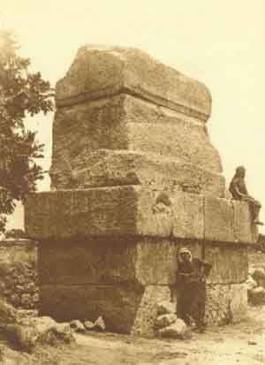

[Intangible Textual Heritage](../../index)  [Judaism](../index.md) 
[Index](index)  [Next](mhl01.md) 

------------------------------------------------------------------------

##### THE SACRED BOOKS AND EARLY LITERATURE OF THE EAST

#### VOLUME IV

# MEDIEVAL HEBREW

### THE MIDRASH

### THE KABBALAH

In Translations by

DR. W. WYNN WESTCOTT, D.P.H., Magus of the Rosicrucian Society; S. L.
MATHERS, M.A.; VERY REV. HERMAN ADLER, LL.D., President of Jews'
College; ADOLF NEUBAUER, Ph.D., Reader of Rabbinical Literature, Oxford
University; REV. SAMUEL RAPAPORT, Rabbi of Cape Colony; DR. MICHAEL
FRIEDLANDER, Ph.D.; and other authorities on Hebraic and Kabbalistic
lore.

With a Brief Bibliography by

ADOLPH S. OKO, Librarian of Hebrew Union College.

With an Historical Survey and Descriptions by

##### PROF. CHARLES F. HORNE, PH.D.

PARKE, AUSTIN, AND LIPSCOMB, INC.

NEW YORK LONDON

\[1917\]

###### Scanned at Intangible Textual Heritage, December 2002. J.B. Hare, redactor. This book is in the public domain. This file may be redistributed for any non-commercial purpose, provided this attribution is left intact.

###### REDACTORS NOTE: This etext does not include the extracts from *The Kabbalah Unveiled*; a comprehensive etext of which can be found at [https://ith.oarc.science/jud/tku/index.htm](https://ith.oarc.science/jud/tku/index.md).

   
*The ancient tomb near the Phœnician coast, which tradition says
contains the remains of Hiram, King of Tyre, the friend of Solomon*.

 

p. iv

"*Let there be light*."--GENESIS I, 3.

"*There never was a false god, nor was there ever really a false
religion, unless you call a child a false man*."--MAX MÜLLER.

------------------------------------------------------------------------

[Next: Contents](mhl01.md)
