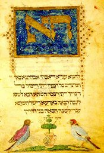

  
[Intangible Textual Heritage](../../index)  [Judaism](../index) 

------------------------------------------------------------------------

<table width="75%">
<colgroup>
<col style="width: 50%" />
<col style="width: 50%" />
</colgroup>
<tbody>
<tr class="odd">
<td width="50%" data-valign="TOP"></td>
<td width="50%" data-valign="CENTER"><h1 id="original-hebrew-of-a-portion-of-ecclesiasticus" data-align="CENTER">Original Hebrew of a Portion of Ecclesiasticus</h1>
<h2 id="by-a.-e.-cowley-and-ad.-neubauer" data-align="CENTER">by A. E. Cowley and Ad. Neubauer</h2>
<h4 id="section" data-align="CENTER">[1897]</h4></td>
</tr>
</tbody>
</table>

------------------------------------------------------------------------

[Contents](#contents)    [Start Reading](ohpe00)

------------------------------------------------------------------------

> *Every bird dwelleth according to his kind,  
> and (so doth) man according to his like.*  
>    -- Ben Sira's Proverbs, XXIV, [p. xxii](ohpe04.htm#page_xxii).

This is a scholarly monograph from the late 19th century on one of the
Jewish non-canonical Biblical books, [Sirach](../../bib/apo/sir), also
known as 'Ecclesiasticus,' not to be confused with the canonical book
Ecclesiastes. This particular paper has been cited because it has a
section on the 'Alphabet of Ben Sira,' a set of Talmudic Jewish
proverbs, each of which begins with successive letters of the Hebrew
alphabet. The Hebrew text and English translation of each of these
proverbs is included [here](ohpe05).

What the general interest reader will find at the core of this otherwise
very dry dissertation is an exquisite example of Rabbinical era Jewish
wisdom literature. What won't be found here is the *Midrash* of the
Alphabet of Ben Sira, which is in some demand because of a passage about
the early Hebrew goddess-figure Lilith. The Midrash of Ben Sira is
commentary built on the Alphabet of Ben Sira, and it reputedly includes
a number of notoriously transgressive stories. This Midrash has
apparently not yet been fully translated into English, and when it is,
that translation won't be public domain.

Production notes: there is much in this document which would be very
difficult to convert to text format, due to the limitations of current
OCR technology. I have omitted several portions, particularly: the
Hebrew and Greek text in the proverbs section, a Latin text of Sirach, a
vocabulary, and the Hebrew, Greek and Syriac text from the Sirach
section. However, as previously noted, I did transcribe the complete
Hebrew text of the Alphabet of Ben Sira.

------------------------------------------------------------------------

 [Title Page](ohpe00)  
[Contents](ohpe01)  
[Preface](ohpe02)  
[A List of Works Used](ohpe03)  
[Ben Sira's Proverbs Preserved In Talmudic And Rabbinic
Literature](ohpe04)  
[The Alphabet of Ben Sira](ohpe05)  
[Ecclesiasticus XXXIX 15 to XLIX 11](ohpe06)  
