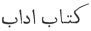

  
[Intangible Textual Heritage](../../index)  [Judaism](../index.md) 
[Index](index)  [Previous](ohpe01)  [Next](ohpe03.md) 

------------------------------------------------------------------------

*Original Hebrew of a Portion of Ecclesiasticus*, by A.E. Cowley and A.
Neubauer, \[1897\], at Intangible Textual Heritage

------------------------------------------------------------------------

p. ix

### PREFACE.

IN editing the recently discovered Hebrew fragments of the book of Ben
Sira, we have limited our aim to presenting the original text with as
little delay as possible, and at the same time giving in a convenient
form the materials for further study. A full commentary, as well as a
detailed comparison of the versions, must be left for the future. We
shall therefore not discuss the author's full name, or the date of his
composition or of the Greek and Syriac translations [1](#fn_0.md). For the literature on these points the
reader is referred to Schürer's admirable work on 'The History of the
Jewish People in the time of Jesus Christ [2](#fn_1.md).' In what follows we shall confine ourselves
to some remarks on what is known, from Jewish sources, of Ben Sira and
his writings.

It is now generally admitted that Jesus, son of Sirach (Σειράχ,
‏סירא‎ [3](#fn_2).md) of Jerusalem, wrote his
ethical work (usually quoted as 'the book of Ben Sira [4](#fn_3)'.md), in Hebrew, between 200 and 170 B. C. in
Jerusalem. It was translated into Greek by his grandson, as stated in
the prologue, from which we also gather that the version was made from
the Hebrew, in the year 132 B. C. [5](#fn_4.md) The
Hebrew of the present fragment is (with the exceptions referred to
below, p. xiii) *classical*, not Rabbinical: still less is it an Aramaic
dialect, such as that of several of the passages quoted in both Talmuds
(the Palestinian [6](#fn_5.md) as well as the
Babylonian), in the Midrashim, and in later Hebrew writings.

p. x

In early times the book seems to have hovered on the verge of the canon,
or to have been included among the ‏כתובים‎ (Hagiographa, see p. xxii
below), since quotations from it are introduced by ‏שנאמר‎ (*as it is
said*), a phrase applied only to the sacred writings. Although
afterwards excluded from the canon by the Rabbis, it continued to live
and to be appreciated both in the Palestinian and the Babylonian
schools, as is proved by the fact that the text was constantly quoted
either in the original or in a Rabbinical or Aramaic form. The Rabbis
who lived before the destruction of the Temple used it without
acknowledgement in the 'Sentences of the Fathers' (‏פרקי אבות‎, the
earliest production of Rabbinical literature), while others quote from
it either expressly under the name of Ben Sira, or anonymously, or else
base their maxims upon it [1](#fn_6.md). Rabbi Akiba
and Ben Azai borrowed from it *verbatim* [2](#fn_7.md), and there is reason to believe that some
apocryphal books were influenced by it [3](#fn_8.md). Thus the official exclusion from the canon
did not involve destruction, as in the case of some Christian
uncanonical Gospels and Acts: the book of Sirach was allowed to be
freely read, but it was regarded merely as literature and not as
sacred [4](#fn_9.md). Passing on to the later
history of the book, we find that S. Jerome [5](#fn_10) (fourth century A. D..md) possessed a Hebrew
copy, although he did not translate it. That the book continued to be
known, to individuals at least if not generally, is proved by the
passages quoted from it (in a language already debased), by the Rabbis
of the fifth and sixth centuries, in the later Midrashim of the seventh
and eighth centuries (as the Tanḥuma), and in the sayings collected by
R. Nathan in the ninth century [6](#fn_11.md). Zunz
(op. cit., p. 108, end of note e) believes that the early liturgist, R.
Eleazar haq-Qalir, borrowed from Sirach (l. 5-8) in his liturgy for the
day of Atonement, in praise of the High Priest. Simultaneously some of
the sayings of Sirach are quoted by the Babylonian doctors in an Aramaic
form [7](#fn_12.md).

For the tenth century we are on even firmer ground as to the existence
of the book in its original language. R. Seadyah (‏סעדיה‎)
Gaon, of Bagdad (920 A. D.), and of the Fayyum in Egypt, was blamed by
the Qaraites [8](#fn_13.md) for sending out

p. xi

missives written in Hebrew provided with vowel-points and accents. They
reproached him with endeavouring to give to his correspondence an
appearance of holiness equal to that of the Biblical text, since the
vowel-points and accents were supposed, according to tradition, to have
been given with the Law on Mount Sinai. In answer to this accusation
Seadyah [1](#fn_14.md) states that these
additions to the text are found also in copies of Ben Sira, in the book
of the Wisdom of Eleazar ben Irai (Iri [2](#fn_15).md), and in the scroll of the
Hasmoneans [3](#fn_16.md). In the course of his
defence he quotes seven (or rather eight, see note 2 below) genuine
sayings of Sirach [4](#fn_17.md) in classical
Hebrew, so that it may be concluded that the book was at his disposal in
the tenth century. The mentions of Ben Sira after this date are scanty
and uncertain. R. Nissim ben Jacob (eleventh century) of Kairowân, in
Tunisia, makes a quotation, which however he may have derived from
Seadyah. In the eleventh century, according to Reifmann [5](#fn_18.md), signs of Sirach's influence appear in the
collection of sayings entitled ‏מבחר הפנינים‎ (Choice of Pearls),
attributed to the famous poet and philosopher Solomon ben Gabirol [6](#fn_19) (Avicebron.md). The same scholar [7](#fn_20.md) also finds traces of the influence of
Sirach (ii. 18) in the Jewish daily prayer [8](#fn_21), and (xlix. 10 and 11.md) in the hymn [9](#fn_22.md) for the outgoing of the Sabbath. He
contends further that Sirach has an allusion (i. 2) to Aristotle and the
doctrine of the eternity of matter, and that even Spinoza was perhaps
influenced by Sirach (xliv. 34). These suggestions, as well as the
inference (from the Aramaic form of the proverb, No. LIV below), that he
was an Essene, are, to say the least, not convincing. There is no direct
trace of the existence of the Hebrew Sirach in Spain, Provence, or among
the Rabbis of France, the Rhine-land, and Germany. Rashi [10](#fn_23.md), the authors of the glosses on the Talmud
(‏תוספות‎), and even Maimonides [11](#fn_24.md),
did not possess the book; and later Rabbis, who mention sentences from
it, most probably quoted second-hand from

p. xii

older authorities [1](#fn_25.md). No doubt it might
be said, though the supposition is not very probable, that all the
quotations from Sirach were made from memory, and that they were derived
from oral tradition. Recent discoveries however have removed all
uncertainty on this point.

Mrs. Lewis, who brought to light the now famous codex of the Syriac
Gospels in the convent on Mount Sinai, some time ago acquired some
manuscript fragments in the East [2](#fn_26.md),
among which Mr. S. Schechter, Reader in Talmudic in the University of
Cambridge, recognized one leaf as containing a fragment of Sirach
(xxxix. 15 to xl. 7) in Hebrew, which he published with English
translation, introduction, and notes in the *Expositor* for July 1896,
(p. i seqq.). Through the kindness of the owner we have since been
allowed to make a fresh examination of the leaf, and have found reason
to alter some of the readings accepted by Mr. Schechter (see the Hebrew
text, pp. 2 and 4). Although the leaf is mutilated in places, the parts
which are still intact are abundantly sufficient to show the character
and style of the composition, and to convince critics that the text is
original and not a translation. After pointing this out, Mr. Schechter
rightly adds: 'Its correspondence with the versions changes almost in
every line, agreeing in some places with the Greek, in others with the
Syriac. In other places, again, it agrees with *neither* of these
versions, omitting whole clauses which are to be found both in the Greek
and in the Syriac, or offering new readings which have been either
misunderstood or misread by the translators. Certain clauses, again, are
to be found in our MS. which are wanting in *both* versions, or are only
reproduced by a very short paraphrase. There cannot, therefore, be even
the shadow of a doubt that our text represents nothing else but the
original. Even the marginal glosses testify to this fact. Such
differences of *plena* and *defectiva* as ‏צורך‎ and ‏צרך‎, or such fine
variants as ‏פיו‎ and ‏פיהו‎, cannot possibly have been suggested by any
translation, and could only have been made from some other copy of the
original.'

Almost simultaneously the Bodleian Library acquired, through Professor
Sayce, a box of Hebrew and Arabic fragments, among which we recognized
another portion of the same text of Sirach, consisting of nine leaves,
and forming the continuation of Mrs. Lewis’ leaf, from chapter xl. 9 to
xlix. 11. These fragments cannot be part of the copy mentioned by
Seadyah, since they are not provided with vowel-points or
accents, and also because the writing is not of the tenth century, but
of the end of the eleventh [3](#fn_27.md) at the
earliest, as may be seen from the facsimiles. The MS. does not seem to
us to have been written by a Qaraite. There are in both fragments
marginal notes [4](#fn_28.md) giving the variants
of another copy of Sirach, or more probably of two other copies. These
copies were however

p. xiii

incomplete, the marginal notes giving their variants only as far as
chapter xlv. 8 (see note in loco), and on xlvii. 8 and 9. In the
Bodleian fragment there are also at least two Persian glosses (ff. 1 and
5b), which point to its having been written in Bagdad or
Persia, possibly transcribed from Seadyah's copy. The MS. is
written on oriental paper, and is arranged in lines, eighteen to the
page (in Mrs. Lewis' leaf one line is cut off), and the lines are
divided into hemistichs. There is no indication of chapters, but a line
is left blank occasionally, as shown in our printed text. The MS. is
unfortunately damaged in many places, which we have marked by clots,
showing approximately the number of letters missing, and by \[ \] when
letters are supplied. Our object being however to give the text of
Sirach as we found it, we have carefully restricted conjecture to its
narrowest limits. In some cases we have preferred to leave a lacuna,
where either the space in the MS. did not allow of what seemed the
obvious word, or some letter such as ‏ל‎, ‏ז‎, or ‏ק‎ was excluded; see
e. g. xlv. 13b. In every case a letter about which we felt
there could be any reasonable doubt, has been marked with a horizontal
stroke, thus ‏א‎̅. On some orthographical peculiarities of the MS. see
the note appended to the glossary, p. xxxvi. As regards the translation
again, we have deemed it our duty as editors of a unique manuscript, to
express the text faithfully, and not to adopt conjectural readings,
except where the text yielded absolutely no sense. Usually, indeed, the
meaning is clear; but passages occur which, from whatever cause, are
obscure, and we cannot feel confident that we have seized the sense of
all of them. A (?) in the translation indicates doubt either as to the
reading or the rendering. There are sufficient indications that the text
is not. everywhere in its original purity, and we do not doubt that (as
in many parts of the O. T.) cases will be found in which a purer reading
has been preserved by one or other of the early versions; but a detailed
comparison of the Hebrew text and the versions, and a discussion of
their comparative merits, must, we think, be left to a commentary, as
well as to a time when, we may hope, more of the original shall have
been recovered. We have noted, lastly, the more important places in
which the language is coloured by reminiscences of the Old Testament.

The language, as already observed, is classical Hebrew, the syntax
displaying no traces of the peculiar New-Hebrew constructions, such as
occur, for instance, so frequently in Ecclesiastes [1](#fn_29.md), though the vocabulary has an admixture of
late or Aramaic words or expressions, such as might be expected from the
date at which the author wrote. The latter, together with other words
not occurring in Biblical Hebrew, will be found collected in the
glossary (p. xxxi). The style is occasionally a little heavy, but this
may sometimes be due to corruption of the text. Otherwise (especially
chap. xliv. ff.) it is remarkably easy and flowing. It stands throughout
on an altogether higher level than that, for instance, of Chronicles,
Ecclesiastes, or the Hebrew

p. xiv

parts of Daniel. We know from Ecclesiastes that the New-Hebrew idiom was
in process of formation at this time, and it is evident that both
New-Hebrew and Aramaic [1](#fn_30.md) words were
current in the Hebrew with which the author was familiar; but the
predominant character of his style is nevertheless pure and classical.
The marginal readings are often interesting: the variations which they
indicate are frequently considerably greater than those noted by the
Massorites in the O. T., and resemble rather the various readings often
presupposed by the LXX, while at other times they are noticeable as
giving an Aramaic equivalent for a Hebrew word in the text. Sirach's
position with regard to the New-Hebrew would no doubt be made clearer by
the discovery of the originals of other apocryphal books, such as
Judith, Maccabees i, Enoch, and the Psalms of Solomon. Finally the
theory that he wrote his proverbs in metre is not supported by the
newly-recovered text: the lines are very variable in length, and there
is no indication that the author sought to adapt them to a uniform
metrical scheme.

In the present edition we give:--(*a*) The Hebrew text, with the
marginal notes and glosses arranged as in the MS. (*b*) The English
translation of the Hebrew, adopting as far as possible the diction of
the revised version of the O. T. (*c*) The Syriac version (which was
made from the Hebrew), according to Lagarde's edition, a blank space
indicating that the translator, or copyist, omitted a passage. (*d*) The
Greek translation, according to Dr. Swete's edition, the blanks again
indicating such omissions. The uncertain condition of the Greek text is
well illustrated by Hatch [2](#fn_31.md), and will
strike the reader on even a slight examination. Its value for
comparative purposes is further lessened by the translator's tendency to
paraphrase, as is the case also with the Syriac. (*e*) At the end, the
Old Latin, according to Lagarde's edition of the Codex Amiatinus. For
more convenient reference we have in all five texts numbered the
chapters and verses as in Dr. Swete's edition, and indicated the
hemistichs by letters of the alphabet in order. The Syriac, Greek, and
Latin texts are reproduced exactly as in the editions followed. It did
not fall within our plan to give the variants of these versions. (*f*) A
glossary of noticeable words and expressions. (*g*) A list of proverbs
attributed to Sirach in Talmudic and Rabbinical literature, with a
translation, arranged in the order of the Greek version. Here again we
resolved not to add the various readings, since the Talmudic dialect is
not the original language of Sirach, and moreover, all the new Talmudic
fragments found within the last two years have not yet been collated.
For completeness sake we have added the so-called 'Alphabets' of Ben
Sira, a late composition--probably of the eleventh century or perhaps
even later, but containing some genuine proverbs of Sirach, both in the
first and second parts [3](#fn_32.md). The stories
given after each proverb in part i. are mostly indecent, and

p. xv

written in mockery of Jewish literature. We reproduce the first ‏אֹבֹ‎
(MS. second), with a translation: for the second (MS. first), we only
refer to the numbers in our list of proverbs with which it agrees,
ignoring the rest as alien to Sirach. The Alphabets [1](#fn_33.md), though a late and unedifying
compilation [2](#fn_34.md), survived, whilst
Ecclesiasticus was completely neglected. A Persian text of them was
lately acquired by the British Museum (MS. Or. 4731), and another copy
has just been brought by Mr. E. N. Adler from Persia, probably
translated from the Constantinople edition (see below, p. xxix). (*h*)
Some specimens of attempted restorations of the original Hebrew by
modern scholars confronted with our text. The comparison will, we think,
justify the caution and reservation which must be observed in attempting
to restore lost works on the basis of ancient translations [3](#fn_35.md). In the present instance, for example,
both versions prove to be much freer than was assumed to be the case by
those who so used them.

In conclusion, we have great pleasure in acknowledging the help of
friends who have enabled us to carry through the work in a short time in
spite of difficulties. Mr. J. F. Stenning, of Wadham College, rendered
valuable aid in deciphering the difficult parts of the MS., including
the Cambridge leaf, and in all doubtful places he concurs in the
readings which we have adopted in our text. He also revised the Syriac.
Mr. E. N. Bennett, of Hertford College, read the Greek: Rev. F. E.
Brightman, Librarian of the Pusey House, read the Latin. Professor D. S.
Margoliouth has also shown an interest in the work in various ways. We
feel, however, specially grateful to the Regius Professor of Hebrew, Dr.
Driver. He revised the translation throughout, besides being entirely
responsible for the glossary, with the note appended, and almost every
page of the book owes something to the judgement and accuracy which he
has been always ready to expend upon it.

------------------------------------------------------------------------

### Footnotes

[ix:1](ohpe02.htm#fr_0.md) On this subject, see E.
Hatch, *Essays in Biblical Greek*, vii. p. 254 seq.

[ix:2](ohpe02.htm#fr_1.md) English translation, 2nd
division, vol. iii. p. 23 seqq. (Clark, Edinburgh, 1886); and later, his
article on 'Apocryphen des Alten Testaments' in the *Realencyclopädie
für protestantische Theologie and Kirche*, vol. i. p. 650 seqq. (3rd
ed., Leipzig, 1896).

[ix:3](ohpe02.htm#fr_2.md) Schürer, op. cit., p. 25,
explains the name to mean 'coat of mail.' In the Hebrew Josippon
(Pseudo-Josephus) the form ‏שירך‎ is a transliteration from the Latin;
v. Zunz, *Die gottesdienstlichen Vorträge der Juden*, 2nd ed., 3892, p.
107, note *h*. He was not, as sometimes stated, a priest; Zunz, ibid.,
p. 106.

[ix:4](ohpe02.htm#fr_3.md) So most frequently in
early Rabbinic literature. S. Jerome (see p. x, note 5) says that it was
called *Parabolae* (‏משלים‎) in Hebrew; cf. Ecclus. l. 27, and the use
of ‏משל‎ (p. xxvi) and ‏מתלא‎ (p. xx) in the quotations. According to
Seadyah (‏ספר הגלוי‎, ed. Harkavy, p. 151, lines 11 and 32)
Ben Sira wrote a book of instruction (
, ‏ספר מוסר‎? see our text, p. 10, l. 8) similar in
character to the book of Proverbs.

[ix:5](ohpe02.htm#fr_4.md) The many passages in
which the translator has misunderstood his original, written only some
sixty years before his own time, may perhaps serve as a warning to those
scholars who are inclined to overrate the authority of the LXX version
of the Old Testament.

[ix:6](ohpe02.htm#fr_5.md) It is remarkable that
only five quotations are found in the Palestinian Talmud; see below, p.
xix seqq. (Nos. I. b, XVII, XXVI, XXXII, LIV).

[x:1](ohpe02.htm#fr_6.md) The quotations were first
collected by Asaria de Rossi. For a list of them, see below, pp. xix to
xxviii, and, for the literature dealing with them, Zunz, op. cit., pp.
108, 109, and notes.

[x:2](ohpe02.htm#fr_7.md) Bacher, *Die Agada der
Tannaiten*, i. p. 277, note 2; p. 417, notes 1 and 2.

[x:3](ohpe02.htm#fr_8.md) See e. g. the list of
parallel passages cited by Mr. Charles in *The Book of the Secrets of
Enoch* (Oxford, 1896), p. 96, Index I; and Ryle and James, *The Psalms
of Solomon* (Cambridge, 1891), p. lxiii seq.

[x:4](ohpe02.htm#fr_9.md) ‏הקורא בהן כקורא באיגרת‎,
J. T. Synhedrin x. 5.

[x:5](ohpe02.htm#fr_10.md) The well-known passage
in his preface to the translation of the books of Solomon is as follows:
'Fertur et πανάρετος Jesu filii Sirach liber et alius ψευδεπίγραφος, qui
Sapientia Salomonis inscribitur. Quorum priorem Hebraicum repperi, non
Ecclesiasticum ut apud Latinos, sed Parabolas praenotatum, cui juncti
erant Ecclesiastes et Canticum Canticorum, ut similitudinem Salomonis
non solum librorum numero, sed etiam materiarum genere coaequaret.' S.
Jerome simply adopted the old Latin version of the book; see pp. xxxvii
to xlvii.

[x:6](ohpe02.htm#fr_11.md) Critically re-edited by
S. Schechter, Vindobonae, 1887.

[x:7](ohpe02.htm#fr_12.md) Dalman, *Grammatik*, p.
29.

[x:8](ohpe02.htm#fr_13.md) A Jewish sect which
sprang up in the eighth century under Anan (‏ענן‎), and denied the
authority of oral tradition. See Harkavy in *Grätz Geschichte d. Juden*,
3rd ed., vol. v. p. 413 (note 17).

[xi:1](ohpe02.htm#fr_14.md) ‏ספר הגלוי‎, p. 162.

[xi:2](ohpe02.htm#fr_15.md) ‏עיראי‎ or ‏עירי‎. It
is curious to note that the saying . . . ‏במופלא ממך‎ (p. xix), ascribed
in the Talmud to Ben Sira and found in the Greek version, is quoted by
Seadyah (op. cit., p. 178, l. 18) as belonging to the Wisdom
of Ben Irai. Of this Eleazar b. Irai, Seadyah also quotes two
other sentences in classical Hebrew, but not in so easy a style as roost
of Sirach. He says Ben Irai's book of Wisdom is analogous to
Ecclesiastes, while Ben Sira resembles the book of Proverbs. Of this
enigmatical Eleazar ben Irai nothing further is known. Perhaps he is
identical with the R. Eleazar who often reports sayings ‏בשם בן סירא‎
(see p. xix). Bacher (*Die Agada d. Palästinischen Amoräer*, ii. 1896,
p. II, note 5) identifies him, not very plausibly, with Eleazar ben
Pedath.

[xi:3](ohpe02.htm#fr_16.md) Edited by Dr. M.
Gaster; see Notice in *Jewish Quarterly Review*, vi. p. 570.

[xi:4](ohpe02.htm#fr_17.md) See pp. xix to xxiii.

[xi:5](ohpe02.htm#fr_18.md) In the Hebrew
periodical ‏האסיף‎, iii. p. 250.

[xi:6](ohpe02.htm#fr_19.md) See Steinschneider,
*Die Hebräischen Uebersetzungen*, p. 382 seqq. (§S 225).

[xi:7](ohpe02.htm#fr_20.md) In the essay on Ben
Sira in his ‏ארבעה חרשים‎ (Prag, 1860), p. 3 seqq.

[xi:8](ohpe02.htm#fr_21.md) See the Authorised
Daily Prayer Book, with a new translation by the Rev. S. Singer, p. 62,
‏נפלה נא ביד יהוה כי רבים רחמיו וגוֹ‎.

[xi:9](ohpe02.htm#fr_22.md) Beginning ‏אליהו
הנביא‎. It is not included in the English Authorised Daily Prayer Book.

[xi:10](ohpe02.htm#fr_23) See p. xx (No. XI.md).

[xi:11](ohpe02.htm#fr_24.md) The Sira he quotes in
his Commentary on the Mishna (Sanh. xi. I) must he, to judge from his
low opinion of him, the compiler of the Alphabet; cf. Reifmann, ‏האסיף‎,
iii. p. 251.

[xii:1](ohpe02.htm#fr_25.md) As e. g. Joseph ben
Nahmias, *Jewish Quarterly Review*, iv. p. 164.

[xii:2](ohpe02.htm#fr_26.md) See *Jewish Quarterly
Review*, ix. p. 115 seqq.

[xii:3](ohpe02.htm#fr_27.md) Mr. Schechter (ibid.,
p. 4) considers it 'certainly not later than the beginning of the
twelfth century.'

[xii:4](ohpe02.htm#fr_28.md) These are indicated in
the MS. by a small circle ° over the word in the text, which we
reproduce.

[xiii:1](ohpe02.htm#fr_29.md) The relative ‏שׁ‎
never occurs; the imperfect with ‏ו‎ consecutive occurs frequently; the
perfect with ‏ו‎ consecutive in 42, 1c. 8c.
11c; the perfect with simple ‏ו‎ only in 39, 32. 44, 2. 16.
20b. 48, n. 12d.

[xiv:1](ohpe02.htm#fr_30.md) The strong Syriasms
which sometimes occur, deserve notice, as ‏ממריו‎ (42, 5c)
and ‏תסתויד‎ (42) 12b).

[xiv:2](ohpe02.htm#fr_31.md) Op. cit., p. 258 seqq.

[xiv:3](ohpe02.htm#fr_32.md) In the Bodleian MS.
No. 1466 the order is reversed.

[xv:1](ohpe02.htm#fr_33.md) The *Editio princep*s
is that of Constantinople, 1519. (The Bodleian copy is defective.) For
the other editions, see Steinschneider's *Catalogus Librorum Hebraeorum
in Bibliotheca Bodleiana*, Berolini, 1852-1860; and Zedner's *Catalogue
of Hebrew Books in the British Museum* (London, 1867), with Van
Straalen's *Supplement* (1894).

[xv:2](ohpe02.htm#fr_34.md) See Reifmann, Hakarmel
ii. p. 124 seq.

[xv:3](ohpe02.htm#fr_35.md) Cf. Driver in *The
Oxford Magazine*, vol. viii (1890), no. 11, p. 182, and no. 12, p. 190
seq.

------------------------------------------------------------------------

[Next: A List of Works Used](ohpe03.md)
