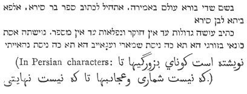

  
[Intangible Textual Heritage](../../index)  [Judaism](../index.md) 
[Index](index)  [Previous](ohpe04)  [Next](ohpe06.md) 

------------------------------------------------------------------------

*Original Hebrew of a Portion of Ecclesiasticus*, by A.E. Cowley and A.
Neubauer, \[1897\], at Intangible Textual Heritage

------------------------------------------------------------------------

LXXII\.

*The Alphabet of Ben Sira* (*see above*, [p. xiv](ohpe02.htm#page_xiv).md).

‏אוקיר לאסיא עד דלא תצטריך ליה‎

Honour the physician before thou hast need of him.

Cf. above, No. LIV.

‏בר רלא בר שבקיה על אפי מיא וישט‎

The son who is not clear-witted, leave him upon the surface of the water
and let him swim (trade).

‏גרמא רנפיל בתולקר בין טב או ביש גרדיה‎

The bone that has fallen to thy lot, whether it be good or evil, gnaw
it.

‏דהבא צריך לקמצאה ועולימא להלקאה‎

Gold must be hammered, and a child must be beaten.

‏הוי טב וחולקיך מן טבתא לא תמנע‎

Be good, and thy portion of goodness do not refuse.

p. xxix

‏ווי ליה לבישא ווי להון לדבוקיהו‎

Woe to the wicked, and woe to them that consort with him.

‏זרוק לחמך על אפי מיא ואת משכח ליה בסוף יומיא‎

Cast thy bread upon the waters, for thou shalt find it at the end of the
days.

Eccles. 11, 1.

‏חזית חמר אוכם לא אוכם ולא חיור‎

Hast thou seen white (l. ‏חיור‎) and black (combined)? It (the result)
is neither black nor white.

The readings are uncertain.

‏טב לביש לא תעביד ובישא לא ימטי לך‎

Do not good to the evil, and evil shall not befall thee.

Cf. above, No. X.

‏ידך מן טיבותא לא תמנע‎

Restrain not thy hand from doing good.

The Bodleian MS. (New Hebrew Catalogue, No. 1466) has ‏ידך מן נגדא
לעולמא לעלמא לא תמנע‎ never restrain thy hand from chastising a child.

‏כלתא עלת לגנונא ולא ידעת מה מטי לה‎

The bride goes into the canopy, and knows not what is coming upon her.

(MS. ‏חוטרא‎) ‏לחכימא ברמיזא לשטיא בכורמיזא‎

For a wise man with a sign, for a fool with the fist.

‏מוקיר מבסרוהי דמה לחמרא‎

He who honours a man that despises him, is like an ass.

‏נור דליק מוקיד גדישין סגיאין‎

A fire when it is kindled (? l. ‏קליל‎ a little fire) burns many
sheaves.

Cf. Ep. of S. James 3, 5.

‏סבא בביתא סימנא טבא בביתא‎

An old man in a house is a good sign in the house.

‏ערבא טבא מאה צפרין ובישא אלף אלפין‎

A good surety is for a hundred days, but an evil surety is for a
thousand thousand.

‏פתור פתורה פריש מחלוקת‎

Make clear the explanation, and remove differences.

‏צריך את למיסב ולמיתן יהא חולקך עם בר טבין‎

If thou must trade, let thy lot be with the lucky.

‏קריבא סחורתא אכלתיה מריה ורחיקא אכלא למרוה‎

Stock that is near at hand its owner consumes, but that which is far off
consumes its owner.

‏רחימא קדמאה לית את כפר ביה‎

An old friend do not thou repudiate.

MS. Bodl. ‏רחימך קדמאה לא תתכפר ביה ובעיקבא לית את נטר׃‎

‏שיתין מליכין יהוון לך ומליכות נפשך לא תשבוק‎

Take sixty counsellors, but the counsel of thy heart do not abandon.

Cf. above, No. VII.

‏תתיהב לן ידא כי הות שביעא ולא דהות כפינא‎

Let the hand be given to thee when it is satisfied, but not when it is
hungry.

MS. Bodl. ‏תתן לך ידא דהוה שביעא ולא דהוה בפיו ושבוע׃‎

LXXIII\.

With regard to the second Alphabet, see the Preface, [p.
xiv](ohpe02.htm#page_xiv.md).

The first line (letter ‏א‎) is similar to No. XLIII in our list of
proverbs. Lines 2 (‏ב‎), 5 (‏ה‎), 16 (‏ע‎), 17 (‏פ‎) are from No. XVI in
our list. Line 3 (‏ג‎) is from No. VII. Line 7 (‏?{ו‎) is from No.
LXVII. Lines 9 (‏ט‎), 10 (‏י‎), and 11 (‏כ‎) from No. LXI.

The rest is not worth reprinting.

The Persian translation mentioned above (p. xv) (British Museum MS. Or.
4731) begins as follows:

 

p. xxx

*The following sayings found in the work* ‏הפנינים‎*, ascribed to
Solomon ibn Gabirol* (*see above,* p. xi)*, are cited by Reifmann*
(Haasyf, iii. p. 250) *as showing the influence of Sirach. The
translation, which is from Ascher's edition, is rather free*.

LXXIV\.

Sir. 19, 10.

The sage was asked the surest means of keeping a secret. Said he, I make
my heart its tomb.

LXXV\.

Sir. 20, 18.  
Ibid. 357.

He was wont to say, A slip of the tongue is more dangerous than the slip
of the foot, for the slip of the tongue may cost thy head, whilst the
slip of the foot may easily be cured.

LXXVI\.

Sir. 20, 30 (and 41, 14).  
Ibid. 58.

Wisdom lying dormant is like an unproductive treasure.

LXXVII\.

Sir. 26, 28.  
Ibid. 66, 67.

The sage observed, Pity the noble-hearted who has fallen; the rich that
has become reduced; and the wise whose lot is cast amongst the fools.
None deserves our pity more than the wise who has become subjected to
the judgement of fools.

LXXVIII\.

Sir. 30, 16.  
Ibid. 457

There is no greater riches than health, no greater pleasure than a
cheerful heart.

LXXIX\.

Sir. 40, 28.  
Ibid. 564.

Better the grave than a fall to poverty.

------------------------------------------------------------------------

[Next: Ecclesiasticus XXXIX 15 to XLIX 11](ohpe06.md)
