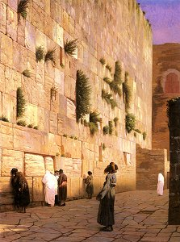

  
[Intangible Textual Heritage](../../index)  [Judaism](../index) 

------------------------------------------------------------------------

[Buy this Book at
Amazon.com](https://www.amazon.com/exec/obidos/ASIN/B002F9NQVE/internetsacredte)

------------------------------------------------------------------------

<table width="75%">
<colgroup>
<col style="width: 50%" />
<col style="width: 50%" />
</colgroup>
<tbody>
<tr class="odd">
<td width="50%" data-valign="TOP"> 
Solomon's Wall, Jerusalem (The Wailing Wall), by Jean Leon Gérôme, 19th century (Public Domain Image)</td>
<td width="50%" data-valign="CENTER"><h1 id="the-talmud-selections" data-align="CENTER">The Talmud: Selections</h1>
<h2 id="by-h.-polano" data-align="CENTER">by H. Polano</h2>
<h4 id="section" data-align="CENTER">[1876]</h4></td>
</tr>
</tbody>
</table>

------------------------------------------------------------------------

[Contents](#contents)    [Start Reading](pol00)    [Page
Index](pageidx)    [Text \[Zipped\]](pol.txt.gz)

------------------------------------------------------------------------

|                                                                                                                           |
|---------------------------------------------------------------------------------------------------------------------------|
|  |

If you have browsed the Rodkinson 10 volume abridged translation of the
Talmud ([the full text of which is also available at Intangible Textual
Heritage](../talmud)), you probably know that the work is a vast expanse
of wisdom literature, with huge stretches of incredibly dry legal
debates and minutiae interposed with rich oases of fascinating lore. It
is difficult to find these islands without a map. Polano's Talmud:
Selections, is just such a guide. This was one of the first English
anthologies of Talmudic literature. The early Biblical lore is organized
as a continuous narrative, which makes an interesting supplement to a
reading of the [Bible](../../bib/index). Polano includes a selection of
the best stories of the Rabbis, some reminiscent of tales of the Zen
monks. The humor of the Talmud is also well represented (particularly
the tale of [the Emperor and the Aged Man](pol39), with its archetypal
Jewish punchline). And there is a wonderful list of Talmudic
[Proverbs](pol37). If you are impatient to get to the interesting parts
of the Talmud, this is the book for you.

--J.B. Hare

------------------------------------------------------------------------

 [Title Page](pol00)  
[Preface](pol01)  
[Contents](pol02)  
[Introduction](pol03)  

### Part First: Biblical History

[Chapter I. From Cain and Abel to the Destruction of Babel's
Tower](pol04)  
[Chapter II. From the Birth of Abram to the Destruction of Sodom and
Gomorrah](pol05)  
[Chapter III. From the Birth of Isaac to the Wars of Shechem](pol06)  
[Chapter IV. From Joseph's Youth to His Elevation Over Egypt](pol07)  
[Chapter V. Joseph's Greatness and Jacob's Entry Into Egypt](pol08)  
[Chapter VI. Death of Jacob and His Sons--Moses--The Deliverance From
Egypt](pol09)  

### Part Second: Biblical Commentaries

[I. The Deliverance From Egypt](pol10)  
[Chapter II. The Ten Plagues](pol11)  
[III. The Death of Moses](pol12)  
[IV. The Book of Esther](pol13)  
[V. King Solomon, the Wise](pol14)  

### Part Third: The Rabbis, their Teachings and Lives

[Rabbi Judah, the ''Chief''](pol15)  
[Simon, the Righteous](pol16)  
[Rabbi Ishmael, the High Priest](pol17)  
[Rabbi Meir](pol18)  
[Hillel Hannasi.](pol19)  
[Rashi](pol20)  
[Maimonides](pol21)  
[Rabbi Ammon, of Metz](pol22)  

### II. Teachings of the Rabbis

[Benevolence](pol23)  
[Meekness](pol24)  
[The Fear of God](pol25)  
[Honour thy Parents](pol26)  
[The Law and its Study](pol27)  
[Prayer](pol28)  
[The Sabbath](pol29)  
[Rewards and Punishments](pol30)  
[Trades](pol31)  
[Death](pol32)  
[Funeral Sermon over a dead Rabbi](pol33)  

### III. Incidents in The Lives of the Rabbis

[Rabbi Akiba](pol34)  
[Elishah ben Abuyah](pol35)  
[Rabbi Simon](pol36)  

### Part Fourth: Proverbs and Sayings of the Rabbis

[Sayings of the Rabbis](pol37)  
[The Desert Island](pol38)  
[The Emperor and the Aged Man](pol39)  
[Proving a Claim](pol40)  
[A Payment with Interest](pol41)  
[The Weasel and the Well](pol42)  
[The Lawful Heir](pol43)  
[Nothing in the World without its Use](pol44)  
[The Reward of Faith](pol45)  
[Abtinoss and Garmah](pol46)  
[Trust in God](pol47)  
[The Bride and Bridegroom](pol48)  
[Truth](pol49)  
[The Destruction of Bithar](pol50)  
[The Destruction of Jerusalem](pol51)  
[Second Destruction of Jerusalem](pol52)  
[Hannah and her Seven Sons](pol53)  

### Part Fifth: Civil and Criminal Law--The Holy Days

[Sketch of Civil and Criminal Codes](pol54)  
[Passover](pol55)  
[Pentecost](pol56)  
[New Year, or the Day of Memorial](pol57)  
[The Day of Atonement](pol58)  
[Feast of Tabernacles](pol59)  
[''Hannuckah,'' The Feast of Dedication](pol60)  
[Purim](pol61)  
