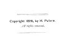

  
[Intangible Textual Heritage](../../index)  [Judaism](../index.md) 
[Index](index)  [Next](pol01.md) 

------------------------------------------------------------------------

[Buy this Book at
Amazon.com](https://www.amazon.com/exec/obidos/ASIN/B002F9NQVE/internetsacredte.md)

------------------------------------------------------------------------

  
*The Talmud: Selections*, by H. Polano, \[1876\], at Intangible Textual
Heritage

------------------------------------------------------------------------

# THE TALMUD

### SELECTIONS

###### FROM

###### THE CONTENTS OF THAT ANCIENT BOOK, ITS COMMENTARIES, TEACHINGS, POETRY, AND LEGENDS.

###### ALSO,

##### Brief Sketches of the Men who made and commented upon it.

###### TRANSLATED FROM THE ORIGINAL

###### BY

## H. POLANO,

###### PROFESSOR OF THE HEBREW LANGUAGE, AND AUTHOR OF "THE HEBREW SPELLER."

#### PHILADELPHIA:

#### LEARY'S BOOK STORE,

#### NINTH STREET, BELOW MARKET.

#### \[1876\]

Scanned, proofed and formatted at Intangible Textual Heritage,
September, 2005, by John Bruno Hare. This text is in the public domain
in the United States because it was published prior to 1923.

  [  
Click to enlarge](img/title.jpg.md)  
Title Page  

 
[  
Click to enlarge](img/verso.jpg.md)  
Verso  

------------------------------------------------------------------------

[Next: Preface](pol01.md)
