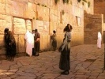

  
[Intangible Textual Heritage](../../index)  [Judaism](../index) 
[Index](index)  [Previous](pol07)  [Next](pol09) 

------------------------------------------------------------------------

[Buy this Book at
Amazon.com](https://www.amazon.com/exec/obidos/ASIN/B002F9NQVE/internetsacredte)

------------------------------------------------------------------------

  
*The Talmud: Selections*, by H. Polano, \[1876\], at Intangible Textual
Heritage

------------------------------------------------------------------------

p. 92

### CHAPTER V.

#### JOSEPH'S GREATNESS AND JACOB'S ENTRY INTO EGYPT.

AND it came to pass after this, that Joseph saw Osnath, the daughter of
Potipharah, a pearl among the beauties of the land, and he loved her and
she became his wife. And Joseph was but thirty years old when he was
elevated to his honourable and trustworthy position. He built for
himself a palace, elegant and complete in its details and surroundings,
so elaborate that three years' time was required for its completion. And
the Lord was with Joseph, and increased his wisdom and understanding,
and blessed him with manners so affable and deserving that he quickly
won the love and favour of all the inhabitants of the country.

And during seven years, as Joseph had foretold, the Lord increased the
produce of Egypt sevenfold. And Joseph appointed officers to gather up
the plenty. They built huge storehouses and heaped up corn during the
seven years of plenty, till the amount stored grew so great that no man
could number it. And Joseph and his officers were watchful and diligent
that their stores of grain should not suffer from moth or mould. The
people of the land, too, stored up their surplus crop, but they were not
as careful and watchful as was Joseph and his assistants.

And the wife of Joseph bore him two sons, Manassah and Ephraim, and
their father taught them diligently the way of truth; they listened to
his words and departed not from the paths of pleasantness either to the
right hand or to the left.

p. 93

\[paragraph continues\] They grew up
bright and intelligent lads, and, were honoured among the people as were
the children of the king.

But the seven years of plenty drew to an end, and the fields became
barren and the trees gave forth no fruit, and the famine which Joseph
had predicted threw its gloomy shadow and threatening presence over the
once fruitful land.

And when the people opened their storehouses, they found to their sorrow
that the moth and mould had taken advantage of their neglect. And they
cried aloud to Pharaoh, "Give us food;--let us not die of hunger before
thee, we and our children; give to us, we pray thee, from the plenty of
thy storehouses."

And Pharaoh answered, "Why cry ye unto me, oh careless people? did
Joseph not tell ye of the famine which has come upon us? Why did ye not
hearken to his voice, and obey his commands to be frugal and
painstaking?"

"By thy life, our lord," replied the people, "as Joseph spoke, so did
we, and gathered in our corn during the years of plenty, but lo, when
the pangs of hunger and the barrenness of the land bid us open our
granaries, the moth had destroyed the provisions which we had garnered."

The king became alarmed lest all their precaution should prove
unavailing against the famine's blight, and he bade the people to go to
Joseph. "Obey his commands and rebel not against his words."

And the people repeated to Joseph the cry for food they had addressed to
Pharaoh.

When Joseph heard the words of the people and learned the result of
their want of care, he opened the storehouses of the king and sold food
unto the hungry people.

And the famine grew sore in the land of Egypt and spread through Canaan
and the land of the Philistines, and to the other side of the Jordan.
And when the inhabitants

p. 94

of these countries heard that corn could be obtained in Egypt, they came
all of them into that country to buy, so that Joseph was obliged to
appoint many officers to sell corn to the large multitude of people.

And Joseph's thoughts reverted to his father's home, and he knew that
his brothers would be obliged to come to Egypt to purchase food, for the
famine was very grievous in their neighbourhood. Therefore he gave
orders that no man desiring corn should send his servant to purchase it,
but the head of each family should personally appear as a purchaser;
either the father of a family or his sons. He proclaimed also as the
order of the king and his viceroy, that no man should be allowed to
purchase corn in Egypt to sell it again in other countries, but only
such as he required for the support of his immediate family; neither
should any purchaser be allowed to buy more corn than one animal could
carry.

And he put guards at all the gates of Egypt, and every man who passed
through the gates was obliged to record his name and the name of his
father in a book, which was brought by the guards every night for
Joseph's inspection.

Thus did Joseph design to ascertain when his brothers came to buy food;
and all the commands which he had given were faithfully executed.

Now, when the patriarch Jacob learned that food could be purchased in
Egypt, he bade his sons proceed thither and obtain a stock of
provisions, for the famine was growing very severe, and he feared that
his family would suffer from its pangs. Jacob instructed his sons to
enter the city by different gates, so that no objection should be made
to the amount of their purchases, and as he commanded so they did.

Thus did the sons of Jacob go down to Egypt, and while

p. 95

upon the way they thought of their brother Joseph, and their hearts chid
them for their cruelty towards him, and they said one to the other:

"Behold, we know that Joseph was carried down to Egypt; now when we come
to the city let us seek for him, perchance we may discover his
whereabouts, and then we will redeem him from his master."

And so did Jacob's ten sons travel to Egypt. Benjamin was not with them,
for his father feared that mischief might befall him as it did the other
son of Rachel, and he kept him at home by his side.

By ten different gates did the ten sons of the patriarch enter into the
land of Egypt, and the guards at the gates took down their names, which
were sent with the other names to Joseph at the close of the day. When
Joseph read the names he commanded that all the storehouses save one
should be closed, and he ordered further, that every purchaser at this
storehouse should be required to give his name; and mentioning the names
of his brethren, he said, "If these men come before ye, see that ye
seize them, every one."

When the sons of Jacob had entered the city they met together, and
before buying their corn they resolved to make a thorough search for
their brother. They visited all places of public resort, and the houses
of divination, but though they continued their search for three days, it
proved unavailing.

Now when three days had passed, and his brothers had not put in an
appearance at the storehouse, Joseph wondered at their delay, and he
sent sixteen of his servants to search for them quietly through the
city. They were found among the Egyptian players, and brought
straightway before the viceroy.

p. 96

Joseph was seated upon his throne dressed in his royal apparel, with his
officers around him, when his brothers bowed to the ground before him.
They wondered exceedingly at the magnificence, the handsome appearance
and the majestic presence of the powerful man before them, but they did
not recognise in him their brother.

And Joseph spoke to them, saying, "Whence came ye?"

"From the land of Canaan," they answered, "and to buy food, for to! the
famine is sore in the land; and thy servants learning that corn might be
purchased in Egypt, have journeyed hither to provide for their support
and the support of their families."

But Joseph said, "Nay, ye are spies, else why did ye enter the city by
ten different gates?"

They answered, "We are true men; thy servants have never been spies. Thy
servants are brothers, the sons of one father, and by his command did we
enter the city separately, for coming together he feared our appearance
might attract unfavourable attention."

But Joseph repeated, "Ye are spies; to spy out the nakedness of our land
have ye come. Behold, every man who comer to buy corn, makes his
purchase and departs; but ye, lo, three days have ye been in the city,
in public places and among the players; it is as I have spoken, ye are
spies."

"God forbid!" they exclaimed; "our lord misjudges us. We are altogether
twelve brothers, the sons of Jacob, in the land of Canaan; Jacob, the
son of Isaac, and grandson of Abraham the Hebrew. Behold, our youngest
brother is with his father, we ten are here, and the other brother,
alas, he is not with us, we know not where he is. We thought perchance
he might be in your land, therefore have we searched all public places
these three days."

p. 97

"And what should the son of Jacob be doing in the public places?" asked
Joseph.

"We heard," they answered, "that the Ishmaelites had sold him in Egypt,
and being of very handsome appearance we thought it likely he might have
been sold in one of the play-houses, therefore we went there hoping to
find and to redeem him."

"Suppose you had found him," said Joseph, "and his master had asked for
him an enormous amount of money; were you prepared to comply with
extraordinary demands?"

The brothers answered in the affirmative, and Joseph continued:

"Suppose again that you should find him and his master should refuse to
sell or deliver him to you under any circumstances, what would you do in
such a case?"

"In such a case," they answered, "if neither prayers nor money should
prove of avail, we would rescue our brother by violence: aye, even the
death of his master, and flee with him to our father's house."

"It is as I have said," retorted Joseph; "ye are spies; lo, with evil
designs upon the inhabitants of our city ye have come. We have heard and
know indeed how ye killed all the males of Shechem in the land of Canaan
on your sister's account, and now ye would treat the men of Egypt in the
same way for the sake of a brother. But yet we will give ye an
opportunity to prove yourselves true men. Send one of your number to
your father's house to bring hither the youngest brother of whom you
have spoken. If ye will do this, I shall know that you have spoken
truly. Take three days to consider."

And in obedience to Joseph's commands his brothers were held in ward for
three days.

After this time the brothers concluded to leave one of

p. 98

their number as a hostage, while the others returned to Canaan to bring
Benjamin down to Egypt. So Menasseh, the son of Joseph, chose Simeon as
the hostage, and he was kept in ward.

Ere his brothers departed, Joseph spoke to them once more.

"Take heed," said he, "that ye forget not my commands. If ye bring this
brother to me, I shall consider ye true men, and ye shall be free to
traffic in the land; neither will I do harm to your brother; he shall be
at liberty to return with ye to your father's house, in peace."

And they bowed down to the ground and departed from Egypt. As they
proceeded upon their homeward journey, they stopped at an inn to feed
their asses, and Levi opened his sack to provide the corn for the meal.
And lo, when he opened the sack, his money which he had paid for the
corn was lying on the top. And he was exceedingly afraid, and he told
the thing to his brethren, and they, too, were filled with alarm. And
when every man found his money returned they cried aloud:

"What is this that God has done to us? Has the Lord withdrawn from us
the mercy which He showed to our ancestors, to Abraham, to Isaac, and to
Jacob, that He has given us into the hands of Egypt's prince to mock us
and make merry with us?"

But Judah said, "It is just! Are we not guilty and sinful before the
Lord? We sold our brother, our flesh. Why should we now complain that
the favour God has lavished on our ancestors is denied to us?"

"Did I not warn ye, 'sin not against the child?'" said Reuben, "and ye
would not hearken to my words. His blood is upon us,--why do ye say,
therefore, 'Where is the kindness which the Lord promised unto our
fathers?' Verily we have forfeited His protection."

p. 99

When Jacob's sons approached their home, and the patriarch came forth to
meet them, he quickly missed the face of Simeon, and he asked, "Where is
Simeon, your brother?"

Then the brothers told their father all that had happened to them in
Egypt, and Jacob said to them:

"What is this that ye have done to me? Your brother Joseph I sent to ye
to inquire of your welfare, and his face I looked upon no more,--his
bloody garments ye brought me, saying, 'Lo, the wild beasts of the
forest have destroyed thy son.' Simeon I sent with ye to purchase food,
and ye tell me that he is imprisoned in a cruel land; and now Benjamin
ye wish to take also,--for Joseph and for Benjamin ye would bring my
grey hairs in sorrow to the grave. No, my son shall not go with ye."

And Reuben said, "The lives of my two sons I place in your hands; if we
do not bring back Benjamin safely to thee, their lives shall prove the
forfeit."

But Jacob said, "Neither shall ye return again to Egypt; stay here, for
my son shall not go with ye, to die as did his brother."

And Judah said to his brothers, "Urge him no more at present. Let us
wait until these provisions have been consumed, and when cruel want and
hunger press us he will consent to what we ask."

And it came to pass when the provisions were gone, that the sons of his
children gathered around Jacob and cried to him, "Oh, give us bread."

And the heart of Jacob was torn with anguish at the cry, and summoning
his sons, he said to them, "Hear ye not the voices of your children
crying for food? 'Give us bread,' they cried to me, and I--I have none
to give them. Get ye down to Egypt, I pray ye, and buy us a little
food."

p. 100

Then Judah answered, and said to his father, "If thou wilt send Benjamin
with us, we will go,--otherwise we cannot. The king of Egypt is a mighty
potentate; we dare not trifle with him. Should we return to Egypt, and
our youngest brother be not with us, lo, he would destroy us all. Our
father, we cannot disobey this king; greater even is he than Abimelech,
the Philistine. Thou hast not seen, as we have, his throne, his palace,
his myriads of officers; thou hast not witnessed, as have we, his
wisdom, knowledge, and understanding. God has blessed him with
unequalled gifts; greater is he than all on earth beside. Our names he
told us; what had happened to us in our youth; he inquired of thee,
saying, 'Is your father yet alive? Are all things well with him?' Thou
hast not heard, as we have, of his power; over his people he is supreme;
upon his word they go out, and upon his word they come in; his word
governs, and the voice of his master, Pharaoh, is not required. Oh, my
father, send the lad,--we cannot go without him if thou refusest, we
must see our children die with hunger."

And Jacob said, in his sorrow:

"Why did ye tell the man ye had a brother? Oh, evil, evil is this thing
which ye have done!"

"Give the boy into my hands," said Judah, "and let us go down to Egypt
and buy the corn. If I do not return him safely to thee, a sinner
against my father shall I be considered all my days. Our children weep
before thee, and we have naught to stay their cries; have mercy on them,
send our brother with us. Hast thou not often told us of the mercy which
our God has promised to thee? Lo, He will protect thy son and return him
to thee safely. Pray unto the Lord for our sakes, entreat Him to give us
grace and favour in the eyes of Egypt's Prince. Lo, had we not

p. 101

tarried thus long, we should have now been back with food; yea, back
twice to thee, and with thy son in safety." And Jacob answered:

"The Lord God give you grace in the eyes of the king and officers of
Egypt. In Him will I put my trust. Arise, go unto the man, take with ye
gifts, the best the land affords; the Lord will be with ye, and ye shall
bring back to me your brothers, Benjamin and Simeon."

Then the sons of Jacob went down again to Egypt. And they took Benjamin
with them, and they took, also, presents and twofold money.

"Take heed of the lad," were Jacob's parting words; "separate not from
him either in Egypt or upon the road;" and when they had gone, he sought
the presence of the Almighty in prayer:

"Oh, Lord, God of heaven and of earth, remember, I beseech Thee, the
covenant which Thou didst make with our father Abraham; remember, I
beseech Thee, the merit of Isaac, my father, and for their sakes show
kindness unto my sons. Do not deliver them into the hands of Egypt's
king for evil; redeem them, I pray Thee, and bring them back safely with
their two brothers."

And the wives of Jacob's sons, and his grandchildren, they, too, lifted
their eyes and hearts to Heaven, and cried:

"Deliver, oh Lord, our fathers from the hands of Egypt's king."

Jacob also addressed the following letter, to be delivered by his sons
into the hands of Joseph:

"From thy servant, Jacob, the son of Isaac, the son o! Abraham the
Hebrew.

"The prince of God unto the mighty and wise kin; Zaphenath-Päaneah, the
king of Egypt, peace.

p. 102

"My lord, the king, knows well that the famine is sore in the land of
Canaan; therefore I sent my sons to thee to buy food for our sustenance.
I charged them not to enter the city by the same gate, lest coming
together they might attract the attention of the inhabitants. And, lo,
their obedience to my orders has caused them to he accused by thee as
spies. Oh, my lord, could not an intelligent man, such as thou art, read
truth upon the faces of my sons? Much have I heard of thy wisdom and the
understanding which thou didst display in the interpretation of
Pharaoh's dreams, in foretelling this grievous famine,--how, then, was
it possible that thou shouldst suspect my sons?

"Behold, I am surrounded with children; I am very old, and my eyes wax
dim; tearful have they been for twenty years in lamenting the loss of my
son Joseph, and now I have sent to thee his brother Benjamin as thou
didst command; I pray thee, oh, my lord, to be good to him, and return
him to me with his brothers. The strength of God has ever been with us;
He has listened to our prayers, and He has never forsaken us; protect
thou my son who is coming unto thee, and God will look favourably upon
thee and upon thy kingdom. Send him home again with his brothers, and
Simeon also send with them in peace."

This letter was entrusted into Judah's hands.

Thus the sons of Jacob went down again to Egypt with Benjamin and with
the presents, and they stood before Joseph. And Joseph released Simeon
from prison, and restored him to his brethren. And Simeon told them of
the kind treatment which he had received since their departure.

"I was not bound," said he, "or treated as a prisoner, but I was taken
to the governor's own house, and received there as a guest."

p. 103

Then Judah took Benjamin and brought him before Joseph, and they
prostrated themselves to the ground.

And the brothers gave Joseph the presents which their father had sent to
him. And Joseph asked them whether all went well with their children and
with their old father, and they answered, "It is well with all of us."

Then Judah delivered his father's letter to Joseph, and the latter
recognised his father's hand, and his feelings grew too strong for him;
the recollections of his youth overpowered him, and retiring into a side
apartment he wept bitterly.

Returning to the presence of his brother, Joseph's eyes rested upon
Benjamin, his mother's son, and he asked, "Is this your youngest brother
of whom ye told me?" And when Benjamin drew near, Joseph laid his hand
upon his brother's head, and said, "God be gracious unto thee, my son."

Then restraining his feelings, he ordered his officers to prepare the
dining-tables.

Then when the meal was ready Joseph took into his hand a cup,--a cup of
solid silver, set with precious stones, and holding it in his hand in
the presence of his brothers, Joseph said, "I know by this cup that
Reuben is the first born of your father, therefore shall he sit first,
and Simeon, Levi, Judah, Issachar, and Zebulun shall follow him in this
order, according to their ages; the rest shall follow these according to
their ages." And he said further, "I know that your youngest brother has
no mother, neither have I a mother, therefore will we two sit together."

And the men marvelled much at the words of Joseph, as they ate and drank
with Joseph upon that day.

Joseph placed two portions of food before his brother Benjamin, and when
his sons, Ephraim and Menasseh, saw this they too gave their portions to
Benjamin, and Osnath,

p. 104

\[paragraph continues\] Joseph's wife,
gave also hers. Thus Benjamin had five portions.

And Joseph brought wine to the board, and bade his brethren drink and be
glad, but they refused, saying, "We have not partaken of wine since we
lost our brother." Joseph pressed them, however, and forced them to
drink and be merry with him. And he said to Benjamin, "Hast thou
children?" And Benjamin answered, "Thy servant has ten sons, and I call
them by names reminding me of the brother whom I have never seen."

In the morning Joseph dismissed his brethren, and bade them return to
their father in peace. But when they had departed he called his
servants, and ordered them to pursue after, overtake them, and bring
them back.

And when the servants of Joseph overtook them, and said to them:

"Why have ye done this thing to steal our master's cup?" the brothers of
Joseph were indignant, and they answered, "If ye find the cup in the
possession of any one of us, lo, he shall die, and we, his brethren,
shall be your master's slaves;" but when the cup was found where Joseph
had ordered it to be put, in Benjamin's sack, they returned, grieving
and crestfallen, to the presence of Joseph.

The viceroy was seated upon his throne, and his officers of state were
gathered about him when his brethren entered, and speaking roughly to
them, he said:

"What evil deed is this which ye have wrought? Why did ye take my silver
cup? Is it because you could not find that brother you spoke of in the
country that you stole the cup instead? Answer and tell me why have ye
done this thing?"

And Judah spoke, saying, "What shall we say unto my lord? What shall we
speak, for how shall we justify ourselves?

p. 105

\[paragraph continues\] God hath found out
the iniquity of thy servants, and sent this calamity upon us."

Then Joseph arose, and grasping hold of Benjamin he led him to another
room, and pushing him therein closed the door upon him. He then told the
others to return to their homes in peace, saying, "I will keep the one
in whose possession the cup was found; return ye in peace."

Then Judah approached Joseph, and said:

"Let not thy anger, I pray thee, burn against thy servant, but let thy
servant speak before thee;" and Joseph answered, "Speak."

Then Judah continued:

"From the commencement, from the moment we set foot in Egypt, thou hast
mocked us. We have been accused as spies; we have been forced to bring
our brother Benjamin hither with us; and now, still at this moment, thou
art using us for thy sport. Let the king now hearken to my words, and
heed them, and allow our brother to return to his father with us, lest
we destroy thee, aye, and all thy officers who are stationed about thee.
Thou knowest what two brothers of us did to the city of Shechem for a
sister's sake; take heed that they work not the same revenge for their
brother Benjamin. Lo, I am stronger and more powerful than both of them;
give over thy idle trifling with us, lest I strike thee with thy guard.
Knowest thou not the punishment which God ordained upon Pharaoh when he
acted wickedly towards Sarai, our great grandmother? Even to this day
the people of thy land do tell about it! Beware, therefore, lest He
punish thee too for thy wickedness in taking our brother Benjamin from
his father. God will not forget the covenant which He made with Abraham,
to protect his seed and chastise their enemies; therefore listen, oh, my
lord, to the words which I am speaking. Let our brother

p. 106

return to his father, lest I carry my words into effect; beware, you
cannot prevail over me."

Then Joseph answered and said:

"Why indulge in this vain self-glorying? Art proud of thy strength? Lo!
one word to my officers, and they would destroy thee in a moment with
thy brethren."

"By God's life," exclaimed Judah, "if I draw I will commence with thee
and end with Pharaoh."

"Thy strength is not equal to thy boast," returned Joseph; "I myself am
stronger than thou art; if thou shouldst draw thy sword I would sheathe
it in thine own body; aye, with thine own sword would I put thy brothers
and thyself to death."

And Judah replied:

"Oh, my lord, God is a witness between us that I seek not to fight; give
us our brother and let us go in peace."

"By the life of Pharaoh," answered Joseph, "if all the kings of Canaan
should come and second your demand, I would not surrender your brother.
Go your way, the rest of ye unto your father, but Benjamin shall be my
servant. He stole my cup and his liberty is forfeit to me."

"What profit is the name of king to such as thou?" retorted Judah. "A
king's household contains much gold and silver in vessels and utensils,
and lo, thou speakest much about a poor silver cup, which thou thyself
hast placed in our brother's sack. God forbid that a descendant of
Abraham should steal from thee, or from any other king, prince, or
whatever he may be. Be silent now about this for thine own sake, lest it
become known abroad and people say, 'Lo, for a trifling silver cup the
great viceroy of Egypt fought with men and took one of them for a
servant;' for thine own sake, say no more."

But Joseph merely repeated what he had said:

p. 107

"Go ye, and leave your brother with me; the law makes him my servant;
get ye gone, and take the cup with ye."

"Never," exclaimed Judah; "we would not forsake our brother for a
thousand cups, or for any sum of money which thou couldst name."

Then Joseph replied quickly:

"But you did forsake and abandon your brother; aye, and sold him for
twenty silver pieces."

"Give us our brother," reiterated Judah. "God is my witness I desire no
quarrel with thee; let us depart without a brawl. What, oh, what can we
say to our father if we return without the lad? his grief would kill
him; and we, what could we say?"

"Say to him," said Joseph, that the rope followeth the bucket." [1](#fn_0)

"Woe, woe unto the king who speaks a false judgment," cried Judah.

"Say naught of false judgments," replied Joseph, "did ye not speak
untruths unto your father, saying, 'A wild beast has devoured Joseph?'
Did ye not sell him to the Midianites for twenty pieces? Say naught; be
dumb in shame."

"Now does the fire of Shechem burn within me," thundered Judah; "thyself
and thy country shall perish in the fierce flame of my wrath."

In the meantime, during this scene, Joseph had despatched Menasseh, his
son, to order troops to his palace, and now they came at full speed,
armed and equipped at short notice. Five hundred mounted soldiers, two
thousand on foot, and four hundred reserve guard of veterans. With

p. 108

cries and shouts they surrounded the sons of Jacob, who were exceedingly
terrified and trembled for their lives. Then Joseph said to Judah:

"Tell me, I pray, why thou alone of all thy company didst fight so
zealously for the lad?"

And Judah answered:

"Know that I became a surety with our father for the lad's safe return.
'If he comes not back with us,' I said, 'Lo, I shall be considered as
sinning before thee all my days.' Oh, my lord, let me find grace in thy
eyes; let me but take the lad home to his father, and I will return to
take his place as thy servant. See, I am stronger and older than he is,
let me be thy servant instead of Benjamin."

"Upon one condition," replied Joseph, "the lad may go with you. Bring
before me his brother, his mother's son of whom you have spoken, and I
will take him in place of Benjamin. You did not become a surety for him
to your father, therefore let me have him, and the brother for whom you
did become a surety shall return home with you."

Then Simeon drew near and answered:

"Did we not tell my lord, when first we came before him, that this lost
brother we could not find? Wherefore will my lord speak such idle words?
We know not, alas, whether this brother be alive or dead."

"Suppose, then," said Joseph, "that I should call him before me, will ye
then give him to me in place of Benjamin?" And raising his voice he
called aloud, "Joseph! Joseph! Appear Joseph, and sit before thy
brethren."

The sons of Jacob wondered much at these words, and their blood grew
chill as they looked around in fear and amazement to see from whence
their brother was to appear.

And Joseph said to them:

p. 109

"Why do ye look around? Your brother is before you. I am Joseph whom ye
sold to Egypt. But nay, be not alarmed, ye were but instruments, and to
save life did God send me hither."

And the men were much frightened, and Judah especially was terrified at
the startling words. Benjamin, who was in the inner court, heard them,
and hurrying before Joseph, he threw himself upon the latter's breast,
and kissing him, they wept together. The other brothers too were much
affected, and the people about wondered, and the report of the
occurrence reached Pharaoh's palace.

Pharaoh was pleased with the news, and sent a deputation of his officers
to welcome Joseph's brethren, and to bid them, in his name, to bring
their families and their household goods and make their homes in Egypt.

And Joseph clad his brethren in new and elegant garments, and made them
many generous presents, and gave to each of them three hundred pieces of
silver; and then he took them before Pharaoh and introduced them to the
king.

And when Pharaoh saw what goodly men the sons of Jacob were he was much
pleased and very gracious towards them.

And when it became time for them to return to Canaan, Joseph procured
eleven of Pharaoh's chariots and added to them his own, for their
accommodation. And he sent rich presents to his father, and garments and
presents to the children of his brothers and sister, and to his
brothers' wives. And he accompanied his brethren upon their journey to
the boundaries of Egypt, and parting with them, he said:

"Do not, my brethren, quarrel on the way. This thing was wrought through
God's wisdom; ye were but the instruments

p. 110

to save from famine and hunger a vast multitude." He also commanded them
to be careful in imparting the great news they carried to their father,
lest speaking suddenly it might have a bad effect upon so old a man. And
the sons of Jacob returned unto the land of Canaan in gladness with
happy hearts.

And it came to pass when they drew near to Canaan that they said one to
the other, "How shall we break this news unto our father? We cannot tell
him suddenly that Joseph is still alive."

But it chanced when they reached Beer-Shebah that Serach, the daughter
of Asher, came to meet her father and her uncles. And Serach was a sweet
singer, and she played upon the harp.

So they said unto her, "Take thy harp, and go and sit before our father
and play to him, and as thou playest, sing; sing of his son Joseph, and
let him know in this manner that Joseph lives."

And the maiden did as she was bid, and sitting before her grandfather,
she sang to him a song, wherein she repeated seven times these words:

"Lo, Joseph is not dead; he lives,  
My uncle rules o’er Egypt's land."

And Jacob was pleased with her singing and playing; happiness seemed to
find birth in his heart at her sweet voice, and he smiled upon the
maiden and blessed her. And while he was talking to her his sons arrived
with their horses and chariots, and Jacob arose and met them at the
door, and they said to him, "We have joyful tidings for our father.
Joseph, our brother, is still alive, and he is ruler over all the land
of Egypt."

But Jacob remained cool and unaffected, for he did not believe their
words, until he saw the presents which Joseph

p. 111

had sent, and all the signs of his greatness; then his eyes brightened
and gladness sparkled in their depths, and he said:

"Enough, my son lives; I will go and see him before I die."

And the inhabitants of Beer-Shebah and the surrounding countries heard
the news, and came and congratulated Jacob, and he made a great feast
for them. And he said, "I will go down to Egypt and see my son, and then
will I return to Canaan, as the Lord has spoken to Abraham, giving this
land unto his seed."

And the word of the Lord came to Jacob, saying, "Go down to Egypt; be
not afraid, for I am with thee, and will make of thee a great nation."

And Jacob commanded his sons and their families to prepare to go down
with him to Egypt, as the Lord had spoken, and they arose and started
upon the way. And Jacob sent Judah in advance, to announce his coming
and to select a place for his residence.

And when Joseph learned that his father was upon the way he gathered
together his friends and officers, and soldiers of the realm, and they
attired themselves in rich garments and gold and silver ornaments, and
the troops were armed with all the implements of war, and they gathered
together and formed a great company to meet Jacob upon the way and
escort him to Egypt. Music and gladness filled the land, and all the
people, the women and the children, assembled upon the house-tops to
view the magnificent display.

Joseph was dressed in royal robes, with the crown of state upon his
head; and when he came within fifty cubits of his father's company, he
descended from his chariot and walked to meet his father. And when the
nobles and

p. 112

princes saw this they, too, descended from their steeds and chariots and
walked with him.

And when Jacob saw all this great procession he wondered exceedingly,
and he was much pleased thereat, and turning to Judah he asked, "Who is
the man who marcheth at the head of this great array in royal robes?"
and Judah answered, "That is thy son." And when Joseph drew nigh to his
father he bowed down before him, and his officers also bowed low to
Jacob.

And Jacob ran towards his son and fell upon his neck and kissed him, and
they wept. And Joseph greeted his brethren with affection.

And Jacob said to Joseph, "Now let me die. I have seen thy face; my eyes
have beheld thee living and in great honour."

And the great company escorted Jacob and his family to Egypt, and there
Joseph gave to his relatives the best of the land, even Goshen.

And Joseph lived in the land and governed it wisely. And the two sons of
Joseph were great favourites with their grandfather, and were ever in
his house. And Jacob taught them the ways of the Lord, and pointed out
to them the path of happiness and peace in His service.

And Jacob and his family lived in Goshen, and had possession of the land
and multiplied therein exceedingly.

------------------------------------------------------------------------

### Footnotes

[107:1](pol08.htm#fr_0) Meaning that Joseph was
the rope and Benjamin the bucket.

------------------------------------------------------------------------

[Next: Chapter VI. Death of Jacob and His Sons--Moses--The Deliverance
From Egypt](pol09)
